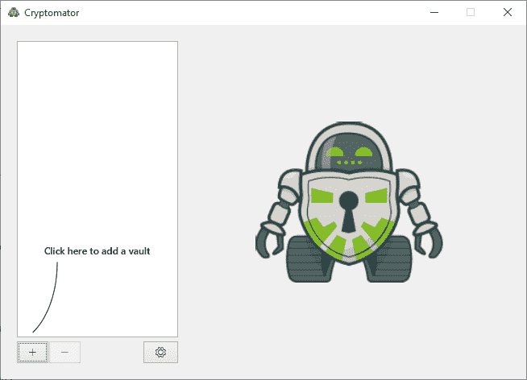
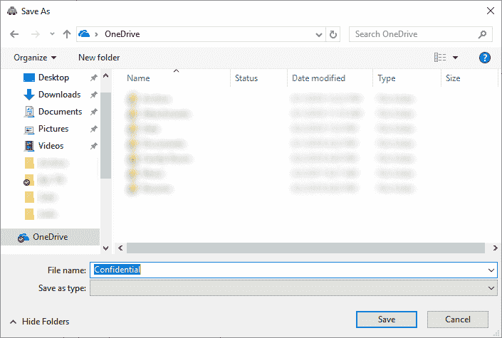
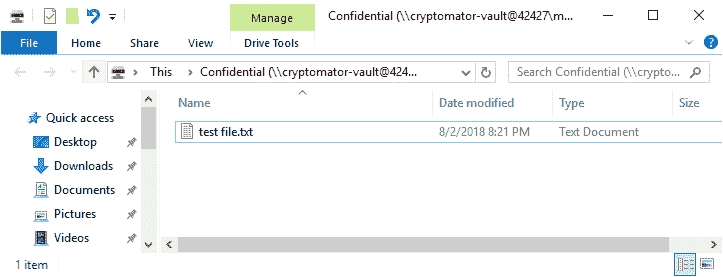
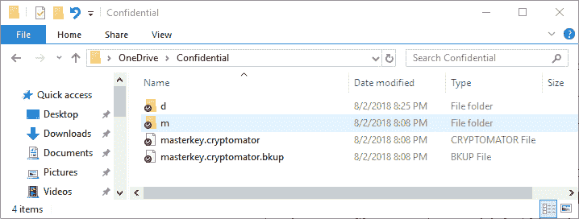
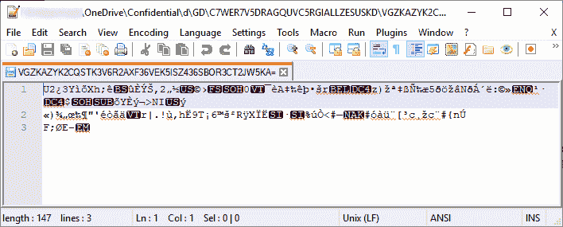

# 使用 Cryptomator 在云中安全地存储机密数据

> 原文：<https://dev.to/ivan/storing-confidential-data-in-the-cloud-securely-with-cryptomator-5ai>

> TL；DR:如果你有一些数据需要安全地存储在你的云文件夹(OneDrive、Google Drive、Dropbox 等)中。)直接跳至[隐写仪设置](#setting-up-cryptomator)。

尽管我是一名软件工程师，知道备份和工作恢复过程的重要性，并且一直在工作相关的东西(源、数据库等)上做备份，但我在个人物品的备份上懈怠了很长一段时间。).十年前，我在 CD 和 DVD 上做了一些备份，然后将“重要”的东西转移到了云上(先是 Dropbox，然后是 OneDrive 和 Google Drive)，但一直不一致，也没有条理。不过，很多东西只是在更换电脑时从旧硬盘转移到新硬盘，根本没有任何备份。

最近，我终于决定清理一下，去掉所有不必要的乱七八糟的东西，把剩下的归档到云存储中。然而，我已经有了一些需要保留的文档和合同，但是我并不满足于将它们放在云文件夹中，无论提供商看起来多么值得信任和安全。我并不害怕他们受到攻击，而是害怕有人通过更普通的手段，比如社会工程，获得我的账户。我正在寻找一种方法，在我不需要访问数据时对其进行密码保护。

### 端到端加密(E2EE)

简单地说，这意味着您的所有数据在离开您的设备(无论是台式机、笔记本电脑还是智能手机)之前都使用某种密码/密钥进行了加密，并以加密方式进行传输和存储，只有在您使用相同的密码/密钥将数据下载回您的设备后才进行解密。因此，只有拥有密码/密钥的人才能读取这些数据，即使他们能够访问云中的加密版本。当然，这并不能保护你免受能够访问你的设备的人的攻击，但这是一个完全不同的话题。

参见 E2EE 上的 [wiki 或谷歌一下，获得更完整和正确的解释。我考虑了一些如何在云中存储我的机密文件的选项:](https://en.wikipedia.org/wiki/End-to-end_encryption)

#### VeraCrypt

基于 TrueCrypt， [VeraCrypt](https://www.veracrypt.fr/en/Home.html) 允许你创建一个加密的容器/分区，然后你可以把它连接成一个本地驱动器，并在其中存储数据，就像它只是另一个磁盘一样。虽然这很好并且在本地非常快，但问题是容器是单个文件(例如 1 GB ),其中的任何更改都会导致完全同步事件——显然，每次更新容器中的单个文件时都要上传整个容器是非常低效的。

#### E2EE 云存储提供商

有些提供商似乎通过提供 E2EE 作为其存储产品的一部分来解决我的担忧，例如 [Tresorit](https://tresorit.com) 或 [MEGA](https://mega.nz) 。然而，如果有其他更便宜(免费)的选择，我可以与我现有的云提供商一起使用，我真的不需要这么多存储来证明支付它的合理性。

#### Boxcryptor

[Boxcryptor](https://www.boxcryptor.com/en/) 似乎很有趣，在你的设备上进行加密，并将加密的文件存储在你已经使用的云存储(Dropbox、OneDrive 等)的本地同步文件夹中。).然而，有几件事让我感到不快:

*   在安装过程中，您需要接受德语版的数据隐私*许可/合同*。我并不是说我完全阅读了我们在软件安装过程中接受的所有许可，但我至少希望能够这样做，而不用说德语或依赖机器翻译。我知道不是每个人都懂英语，但他们不会读这篇文章:)
*   尽管有一个免费层，你需要注册和登录。我不知道为什么这是必要的，老实说，我不愿意尝试找出答案。

#### 隐码器

与 Boxcryptor 类似， [Cryptomator](https://cryptomator.org/) 将你的加密文件存储在你的本地云文件夹中(或者任何文件夹，如果你还喜欢软盘的话),在一个所谓的*保险库里。*它符合我一直在寻找的东西:

*   这些文件是分开存储的，所以只需要同步更改/添加/删除的文件，而不是整个 vault，
*   客户端:没有账户，没有与任何在线服务共享的数据，
*   256 位密钥长度的 AES 加密，
*   文件名变得加密&文件夹结构变得混乱，
*   无限数量的保险库，每个都有单独的密码，
*   保险库的大小是灵活的(与 VeraCrypt 不同，VeraCrypt 可以增长，但不能收缩)，仅受底层存储大小的限制，开销可以忽略不计。

坦率地说，我遇到了一个问题，取决于你的工作方式，它可能会对你产生相当大的影响。对于某些程序来说，使用它所连接的驱动器并不是真正透明的——它们似乎很难直接从驱动器中打开文件。例如，我可以在 Acrobat Reader 中打开 PDF 文件，但不能在 Edge 中打开。或者视频无法在 PotPlayer 中播放。我没有看到一个明确的模式，但我认为它与该程序如何实现文件操作有关。我只需要在项目的 GitHub 上提交一个问题，但是就目前而言，对于我的用例，我对这个限制没有意见。

#### 设置密码器

设置非常简单，但目前该应用程序的 UX 不是很好，尤其是对于第一次使用的用户来说，所以你可以这样做:

1.  从[cryptomator.org](https://cryptomator.org/)下载并安装
2.  启动应用程序，你会看到以下窗口:

[T2】](https://res.cloudinary.com/practicaldev/image/fetch/s--J6dGg4uF--/c_limit%2Cf_auto%2Cfl_progressive%2Cq_auto%2Cw_880/https://cdn-images-1.medium.com/max/654/1%2ADgcJn6LTWL06YphPRxdrrw.png)

1.  单击加号按钮并选择“创建新的保险库”

2.  浏览至您想要创建保险库的文件夹(例如 OneDrive 文件夹)并写入保险库的名称(例如 _ Confidential)—_ 这将是 Cryptomator 在当前目录中为您创建的文件夹的名称。

[T2】](https://res.cloudinary.com/practicaldev/image/fetch/s--ENSCPA9J--/c_limit%2Cf_auto%2Cfl_progressive%2Cq_auto%2Cw_880/https://cdn-images-1.medium.com/max/705/1%2AKgUDlSj47tx4WNPdIKj4Ag.png)

1.  单击“保存”后，系统会提示您为保管库创建密码。这应该是相当强大的(漫长而复杂)，因为如果有人得到了你的加密数据，他们有很多时间来尝试暴力解密(使用字典攻击和其他技术)。互联网上到处都有关于如何创建这样一个密码的指南。顺便说一下，如果你喜欢的话，也许你可以使用密码管理器。

2.  创建保管库后，您可以选择想要如何使用保管库，最重要的是，是在本地保存密码并自动解锁(仅当您信任设备的安全性时才这样做)，还是想要手动解锁，每次都输入密码。后者可能更安全，这取决于您的情况，取决于您是否信任所有能够访问您计算机的人。

3.  现在你只需打开密码驱动器，复制文件，为了确保安全，你可以看看你在保险库里的加密数据。

<figure> 

<figcaption>解锁的保险库由密码机自动映射为网络驱动器</figcaption>

</figure>

<figure> 

<figcaption>目标文件夹中可见的加密保管库(本例中为 OneDrive)，已经同步到云端</figcaption>

</figure>

<figure> 

<figcaption>文件路径、名称和内容在存储时全部加密</figcaption>

</figure>

> 不要忘记，你不能直接将文件复制到保险库中(例如 OneDrive 上)，它们不会神奇地被加密。你总是需要使用一个未锁定的保险箱，即 Cryptomator 为你附加的网络文件夹。

就是这样，从现在开始，你的机密文件更安全了，只需要一点前期工作和最少的持续努力。Cryptomator 支持所有主要平台— Windows、Linux、macOS、Android、iOS，因此您甚至可以访问其他设备上的文件，并通过您的云提供商自动同步。我个人也将研究如何在一个供应商出于某种原因丢失数据的情况下，将数据自动备份到另一个云存储中。

所有提到的方法都有一些问题，如性能、易用性、价格等。最终你选择哪一个是你的选择，如果有的话，但是帮你自己一个忙，至少采取一些预防措施；安全总比后悔好。记住:

> "仅仅因为你是偏执狂，并不意味着他们没有追你。"
> 
> ——约瑟夫·海勒，第二十二条军规