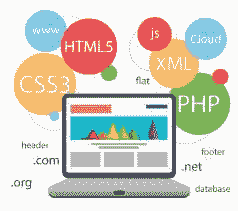

# 一个 17 岁网络开发者的故事

> 原文：<https://dev.to/devhammed/story-of-a-17-years-old-web-developer-3584>

嗨，我的名字是[欧耶德乐·哈迈德](http://devhammed.github.io)。一个 17 岁的尼日利亚网络开发者。我在这里分享我的故事和我是如何学习 web 开发的。**这是我第一次写文章，所以如果不是技术性的，请原谅。**

*   **2015 年(好奇号)**

<figcaption>[https://en.wikipedia.org/wiki/Mobile_BASIC](https://en.wikipedia.org/wiki/Mobile_BASIC)</figcaption>

我在使用我的 J2ME 功能手机浏览时，在谷歌上偶然发现了移动基本编程语言(大卫·费斯)，我对这个术语很好奇，并点击了链接( [mbteam.ru](http://www.mbteam.ru) )，从那里我开始通过我下载的能够构建的 J2ME 应用程序学习该语言。jar 文件从基本的源代码，可以安装在 J2ME 功能手机。我用它创建了一些应用程序和游戏，安装在我和我朋友的手机上。

*   **2016 年(网页开发)**

<figcaption>[https://www.1training.org/wp-content/uploads/2017/10/6.png](https://www.1training.org/wp-content/uploads/2017/10/6.png)</figcaption>

在我激动人心的 Mobile BASIC 之旅后，我在[W3Schools.com](http://w3schools.com)上遇到了 HTML、CSS 和 JavaScript。我开始学习，后来被一个叔叔推荐了一些高级在线课程(【learn.shayhowe.com】[【MDN】](http://developer.mozilla.org)[code academy](http://codecademy.com))。

我加入了一些在线编码论坛，如 Stackoverflow.com 的[、nct.com.ng 的](http://stackoverflow.com)、[等，以提高我的编码技能。在做这些事情的时候，我还在使用 J2ME 的功能手机，我决心有一天成为世界级的网络开发者。](http://nct.com.ng)

*   **2017 年(沉迷网络)**

<figcaption></figcaption>

2017 年是我开始网络开发的一年，因为这一年我学到了所有困扰我的关于网络和互联网的知识。我开了一个 Github 账户( [**Oyedele Hammed**](http://github.com/devhammed) )，开始推送和提交大量的 JavaScript 项目，并为[塞贡·奥卢米德](https://medium.com/u/53d5acc6d585)的 CSS 项目做了贡献。连接并开始在 Twitter、脸书、Medium 和其他社交平台上关注许多经验丰富的 Web 开发人员和设计人员，并开始接受黑客级别的编码挑战。一路上都很开心。我也在 Upwork.com和 OLX[做一些自由职业项目。](http://olx.com.ng)

*   **2018 年(第一份工作)**

<figcaption></figcaption>

2 月 12 日是我在 Epower 得到一份初级网页开发员工作的日子，我很高兴能与 T2 的拉希德·里万和 T4 的奥古博瓦勒·奥卢本加一起工作。

*   资源

如果你对学习 Web 开发感兴趣，下面是一些免费的在线课程。

*   通过免费的在线课程、编程项目和开发人员工作的面试准备来学习编码。
*   [MDN 网络文档](http://developer.mozilla.org)
*   课程:高品质，为您量身打造。- Sabe.io
*   [SoloLearn:学习编码](http://www.sololearn.com)
*   [学习编码 HTML & CSS -初级&高级](http://learn.shayhowe.com)
*   [Codecademy -免费学习交互式编码](http://codecademy.com)
*   [现代 Javascript 教程](http://www.javascript.info)
*   [雄辩的 JavaScript](http://eloquentjavascript.net)

感谢阅读，如果你觉得这个故事激励了你，请鼓掌。❤️️❤️️❤️️

* * *