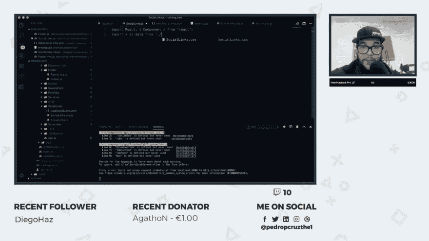

# 真实项目的流式编码

> 原文：<https://dev.to/pedropcruz/streaming-coding-with-real-projects-1k1e>

嘿人们，

因此，正如我已经与社区分享的那样，我是一名前端开发人员，我有一个巨大的梦想，那就是成为一个完整的堆栈，并在我的国家得到社区的认可。

为此，我开始了现场编码(主要是葡萄牙语，但我也会说英语)，在这里你可以喊出任何关于代码的问题，我可以回答，或者在聊天中与他人分享。

但我想改进更多(而且@dev.to 还没有对 twitch 频道进行降价)，但这里是我的流:[https://www.twitch.tv/pedropcruz](https://www.twitch.tv/pedropcruz)

[T2】](https://res.cloudinary.com/practicaldev/image/fetch/s--0Y1d6_w_--/c_limit%2Cf_auto%2Cfl_progressive%2Cq_auto%2Cw_880/https://thepracticaldev.s3.amazonaws.com/i/zbqsh0wh1nhss8zm85lk.png)

通常，我做一些平面设计，或品牌设计，然后我做我以前设计的网站的所有代码，解释我正在做的所有事情。有些人喜欢它，我觉得人们似乎对这种类型的内容感到厌倦。

所以对你们来说，因为我真的很享受作为一个“社区”的想法，我请求帮助来改善我的流编码。需要新的想法。你喜欢屏幕吗？(别管捐款栏了。这是一个为人们着想的微笑 xD，这不是我的主要目的。我这样做是为了好玩，不是为了赢钱)对你来说，什么是最好的事情，能让你每天保持 3/4 小时的精力充沛？

非常感谢庞大的社区！

佩德罗克鲁斯
[www.pedropcruz.pt](http://www.pedropcruz.pt)