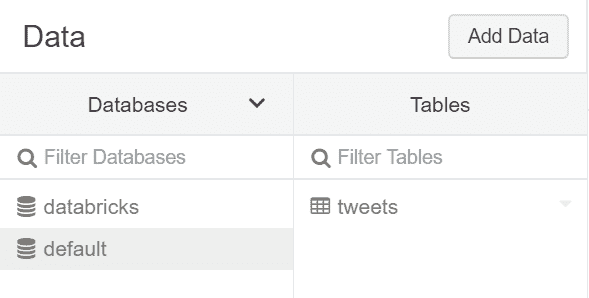
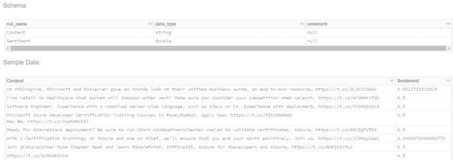
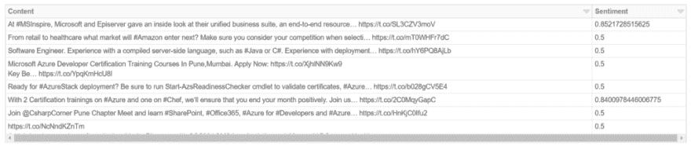

# 数据块增量表中的数据流

> 原文：<https://dev.to/willvelida/streaming-data-in-databricks-delta-tables-4n9p>

Databricks Delta 使用 Apache Spark 和 Databricks 文件系统(DBFS)来提供一个事务存储层，它可以为我们这些数据工程师做一些不可思议的事情。Databricks Delta 是一个优化的 Spark 表，它在 DBFS 以 Parquet 文件格式存储数据，并且它使用一个事务日志来有效地跟踪表的更改。

在本教程中，我们将从 twitter 上传一些包含 **#azure** 字符串的推文，将其发送到 Azure Event hubs，然后将这些推文写入并附加到一个表中。

本教程建立在 Azure docs 上的使用 Azure Databricks 教程对流数据进行[情感分析的基础上。如果你刚刚开始使用 Databricks 中的流，我建议你在开始使用一些非常酷的 Azure 服务时去看看。](https://docs.microsoft.com/en-us/azure/azure-databricks/databricks-sentiment-analysis-cognitive-services)

在本教程中，我们将把数据追加到一个增量表中，并存储在数据库中，而不是打印到控制台。如果你想继续这个教程，确保你先完成 Azure one，这样你就知道我在说什么了。还要记住，在撰写本文时，Databricks Delta 要求 Databricks 运行时为 4.1 或更高版本。

为了将数据写入增量表，我们将执行以下操作:

*   将流式数据保存到拼花文件，因为它们进入了 DBFS 的一个水槽。
*   读取拼花文件，然后将每个文件附加到一个名为“tweets”的表中

让我们继续吧！

**将流数据保存在接收器中**

我们可以使用结构化流将数据写入 Databricks Delta 表。在本教程中，我们将把我们的流写到一个路径中，我们将使用这个路径向我们将要创建的表中添加新记录。在 AnalyzeTweetsFromEventHubs 的末尾编写以下 Scala 代码:

```
streamingDataFrame.writeStream
  .format("delta")
  .outputMode("append")
  .option("checkpointLocation", "/delta/events/checkpoints/tweets")
  .start("/delta/tweets") 
```

在这段代码中，我们将增量格式的流附加到 location /delta/tweets。

你可能会问 delta 格式到底是什么？’答案是

**读取拼花文件并添加到 tweets 表**

现在我们已经有了接收器，让我们为这些文件创建一个表。在你的接收器代码下面，写下下面的 Scala 代码:

```
val tweets = spark.read.parquet("/delta/tweets")
tweets.write.format("delta").mode("append").saveAsTable("tweets") 
```

在这里，我们创建了一个名为 tweets 的值来读取我们的流拼花文件，然后我们将这些格式写入一个名为 tweets 的表中。我们可以通过单击 UI 中的数据图标来查看该表。

[T2】](https://res.cloudinary.com/practicaldev/image/fetch/s--tHuaVn-T--/c_limit%2Cf_auto%2Cfl_progressive%2Cq_auto%2Cw_880/https://cdn-images-1.medium.com/max/589/1%2A43vh6vJ2RpUHNLoYM2zIKA.png)

我们可以看一下我们的表，我们可以看到，我们没有将内容和情绪打印到控制台，而是将它放在 Databricks 的一个表中

[T2】](https://res.cloudinary.com/practicaldev/image/fetch/s--L3eODlon--/c_limit%2Cf_auto%2Cfl_progressive%2Cq_auto%2Cw_880/https://cdn-images-1.medium.com/max/1024/1%2AX9a--STwbWwI_wDVg1cMiQ.png)

我们还可以使用显示器查看笔记本内的内容:

```
val tweetsTable = spark.table("tweets")
display(tweetsTable) 
```

根据运行时间的不同，您的输出可能会有所不同，但它可能是这样的:

[T2】](https://res.cloudinary.com/practicaldev/image/fetch/s--75HhhxJ_--/c_limit%2Cf_auto%2Cfl_progressive%2Cq_auto%2Cw_880/https://cdn-images-1.medium.com/max/1024/1%2AJGH3UPi3os2HyazMihAmSg.png)

**总之**

在本教程中，我们使用了 Databricks Delta 的强大功能来获取我们的流数据，并将其放入一个表中，我们可以对该表运行查询并将其存储在 Databricks 的数据库中。我们可以进一步扩展这个例子，将它与一些静态数据结合，或者在 Spark 2 . 3 . 0+版中，将它与另一个流数据集结合。

这个例子使用了 Azure Event Hubs，但是对于结构化流，你可以很容易地在 HDInsight 集群上使用类似于 [Apache Kafka 的东西。](https://docs.azuredatabricks.net/spark/latest/structured-streaming/kafka.html)