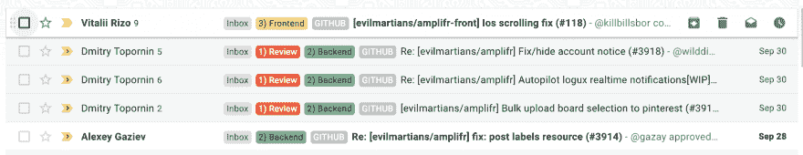
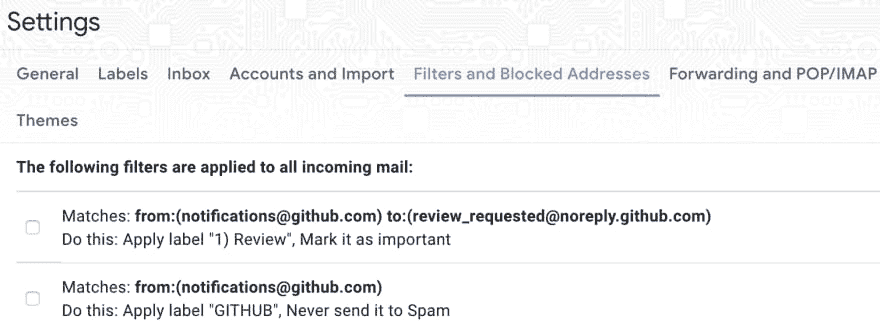
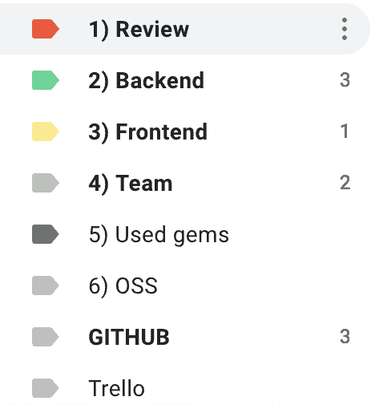
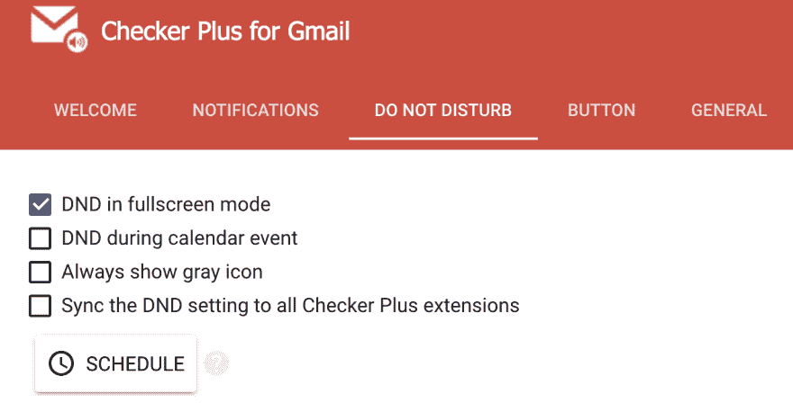
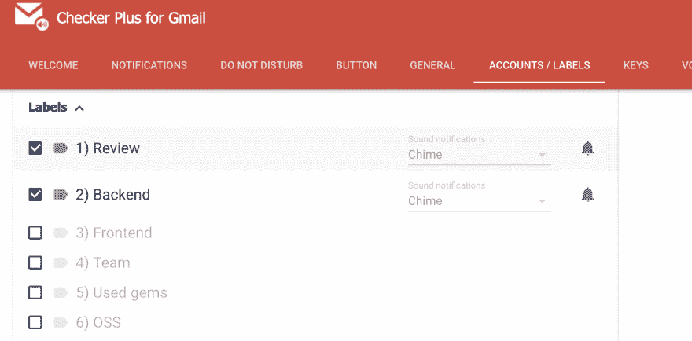

# 使用谷歌邮件进行无压力的拉式请求观看

> 原文：<https://dev.to/amplifr/stressless-pull-request-watching-with-google-mail-2ob9>

让我们分享一下观看存储库、进行评审和对消息做出反应的经验。

我将回顾一些用谷歌邮件组织拉式请求观看的常用技巧，它们对我有用。

## 为什么不懈怠

Slack 仅仅与 GitHub 集成，但是没有分组，没有优先级。消息放在时间线提要中，因此不同拉取请求的评论会交替和混杂。

## 谷歌邮件的好处

谷歌邮件非常智能，有助于组织电子邮件处理，并且有许多功能可以提高工作效率。我们将回顾其中的一些。

## 消息链

Google Mail 将所有收到的消息分组到链中，并将 GitHub 对一个拉请求的所有评论放在一个链中。无论你有多少条未读的拉取请求消息，它们都显示为一条未读的链(和收入的数量一起)。

[T2】](https://res.cloudinary.com/practicaldev/image/fetch/s--j0xcm8Ps--/c_limit%2Cf_auto%2Cfl_progressive%2Cq_auto%2Cw_880/https://thepracticaldev.s3.amazonaws.com/i/pa60gef46p0m7fqhv4vq.png)

重命名 pull-request 后，❗链接会中断，所有新注释会加入新组。这就是为什么不建议第一次正确命名拉式请求。

## 标签

[标签](https://support.google.com/mail/answer/118708?hl=en&ref_topic=3394656)允许将所有电子邮件组织成组。它们的工作方式类似于文件夹，但是您可以为一封邮件添加多个标签。我们将使用它们来指定消息类型，例如*【待审核】**【我的团队】**【OSS】*等等。

[T2】](https://res.cloudinary.com/practicaldev/image/fetch/s--GoeHl-Rc--/c_limit%2Cf_auto%2Cfl_progressive%2Cq_auto%2Cw_880/https://thepracticaldev.s3.amazonaws.com/i/k3imaqj2f9tedl5ohrgd.png)

❗标签是灵活的，当你需要重新组织你的流程时，你可以随时重新配置它们。

## 滤镜

谷歌邮件使用[可定制的规则](https://support.google.com/mail/answer/6579?hl=en&ref_topic=3394656)来预处理收到的邮件。这是对电子邮件进行分类并将特定来源标签应用于电子邮件的最佳方式。

[T2】](https://res.cloudinary.com/practicaldev/image/fetch/s--_Eze4vWq--/c_limit%2Cf_auto%2Cfl_progressive%2Cq_auto%2Cw_880/https://thepracticaldev.s3.amazonaws.com/i/9v4yhewv7mujwg753xen.png)

## 区分轻重缓急

简单的“优先排序”可以通过排列标签来降低你必须做出反应的信息的紧急程度。

## 打盹

打盹是新功能。在观察拉式请求的情况下，这是很方便的，因为当你一时无法做出反应时，它允许立即推迟接收邮件。

现在，我们将调整这些功能，以改进观看和查看拉式请求流程的组织。

# 谷歌邮件功能在行动

## 1。标签

首先，我们必须考虑您正在监视的存储库以及传入数据的紧迫性。这是我的样品。您可以使用它开始并使它更适合您的情况:

[T2】](https://res.cloudinary.com/practicaldev/image/fetch/s--JL4A88Kq--/c_limit%2Cf_auto%2Cfl_progressive%2Cq_auto%2Cw_880/https://thepracticaldev.s3.amazonaws.com/i/yhizw7sew036lf61dmm8.png)

**Review**——保存来自有人用 GitHub 的“Reviewers”工具请求我评论的请求。

**后端** -用于放置来自后端团队的消息。这里可能有一些正在处理(WIP)的拉动式请求，可能还没有请求审核。因为我在后端团队中，所以跟踪我的团队的事件是很重要的。

**前端**标签，用于标记前端团队的拉取请求。观察这些拉取请求并不重要，但可以让我观察 Amplifr 前端发生了什么。

团队:这是所有 Amplifr 工作项目库的所有拉取请求。大部分都是辅助性的，不太经常换。

**用过的宝石**。在用 Ruby on Rails 编写的后端项目中，我们使用了许多 Ruby gems。跟踪所有的更新是很方便的，这就是为什么我看一些像 [twitter gem](https://github.com/sferik/twitter) 这样的库。
但是这个更新不急，可以在空闲时间看。

这个标签用于跟踪我参与或喜欢跟踪更新的开源项目的请求。

我用这个标签来标记所有来自 GITHUB 的消息，以查看总数。

## 滤镜

这些过滤器对我有用:

```
Matches: from:(notifications@github.com)
Do this: Apply label "GITHUB", Never send it to Spam

Matches: from:(noreply@github.com) subject:(Github Subscribed)
Do this: Mark as read, Delete it

Matches: from:(notifications@github.com) to:(review_requested@noreply.github.com)
Do this: Apply label "1) Review", Mark it as important

Matches: to:(evilmartians/amplifr <amplifr@noreply.github.com>)
Do this: Apply label "2) Backend", Mark it as important

Matches: to:(evilmartians/amplifr-front <amplifr@noreply.github.com>)
Do this: Apply label "3) Frontend"

Matches: (to:(gazay/gon) OR to:(sferik/twitter) OR to:(philnash/bitly) OR :to:(wilddima/logux_rails)
Do this: Apply label "5) Used gems" 
```

Enter fullscreen mode Exit fullscreen mode

❗ [你可以从我的网站](https://gist.github.com/dsalahutdinov/d0d33ef0aaedea4c54071665572d1bd5#file-filters-xml)下载基本过滤器，把它们导入谷歌邮箱，然后开始根据你的流量调整它们。

之后，我们可以看到所有的邮件按紧急程度分组。快速查看标签表可以让您看到有多少任务正在等待处理。

## 谷歌邮件检查器

[“GMail Checker”](https://jasonsavard.com/ru-RU/Checker-Plus-for-Gmail)是一款优秀的浏览器插件，用于检查邮件和接收新邮件通知。

我使用的主要功能是:

1)全屏模式的“请勿打扰”。

[T2】](https://res.cloudinary.com/practicaldev/image/fetch/s--rUsI_duB--/c_limit%2Cf_auto%2Cfl_progressive%2Cq_auto%2Cw_880/https://thepracticaldev.s3.amazonaws.com/i/3pg92niya9ylqz9zg2ej.png)

当您在 VIM 中编码或全屏浏览时，此选项有助于您集中注意力。

2)通知指定标签的电子邮件:

[T2】](https://res.cloudinary.com/practicaldev/image/fetch/s--iZnJHkDJ--/c_limit%2Cf_auto%2Cfl_progressive%2Cq_auto%2Cw_880/https://thepracticaldev.s3.amazonaws.com/i/2nbq00crnzhdhdvnxr08.png)

这个功能让我对最重要的信息做出快速反应。

邮件检查器也有许多功能，这对提高邮件的使用率非常有用。

## 心理设置

当自动化运行良好时，您只需要查看从到最紧急的评论，并对它们做出反应。这是人为因素最关键的部分。

想象一下原因，你打开新邮件，阅读评论，进入 GitHub，然后你看向一边，切换到其他活动，忘记这条消息。在这种情况下，你错过了这一幕，因为你在谷歌邮件中阅读了这封信，但没有任何反应。

❗The 的主要心理设置是专注地查看收到的邮件，并总是做出反应:

*   直接批准拉动式请求，进行审核或评论
*   含蓄地说，在更合适的时候，让消息休眠
*   或者将邮件标记为“未读”,留待下一个会话处理，您将处理该邮件。

# 总结起来

花一个小时整理收到的电子邮件可以节省更多的时间:

*   通过使用优先级和标签，让电子邮件浏览更加智能
*   缩短最紧急消息的反应时间
*   提供了灵活性-所有的设置都可以在任何时候改变，在任何情况下发挥最大作用

感谢阅读。