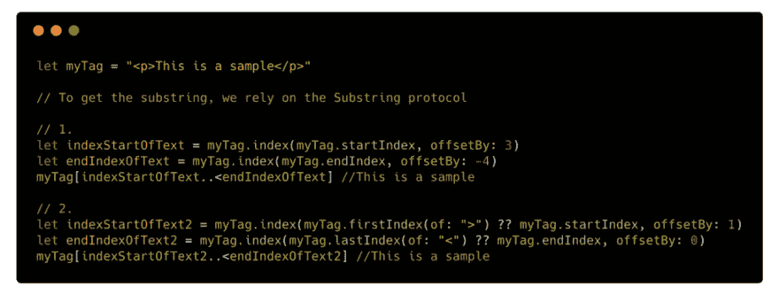
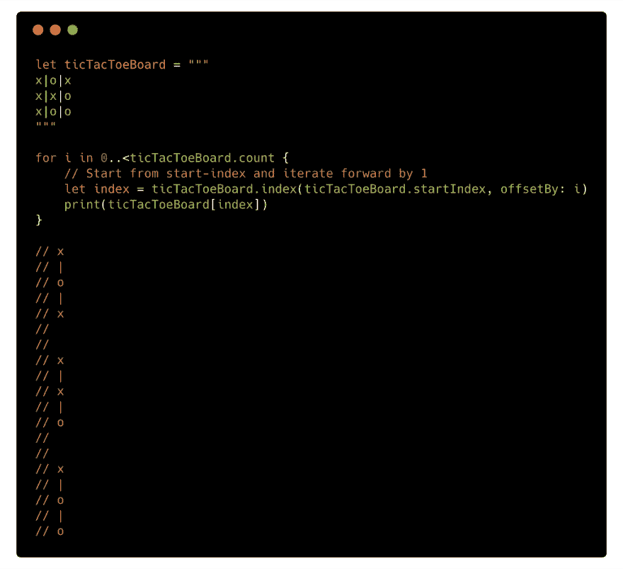
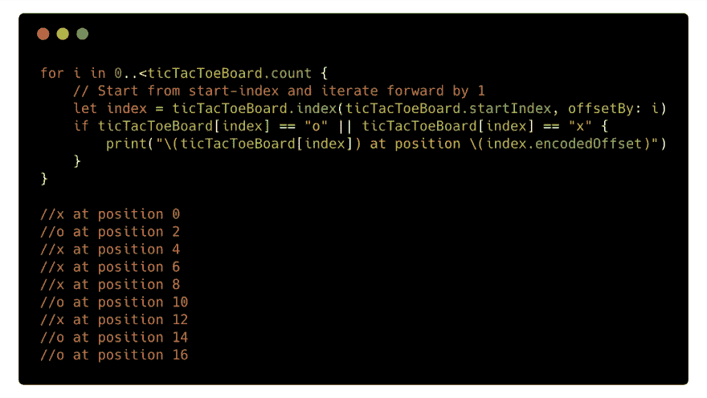

# Swift 4 中的字符串操作

> 原文：<https://dev.to/tiptopgs/string-manipulations-in-swift-4-2gc6>

首先，Swift 4 的 String API 增加了许多强大的功能。字符串和字符串操作是任何或大多数解决方案的基础。Swift 语言提供了一些强有力的方法来做到这一点。所以让我们来复习一些语言能力。

要创建字符串，可以将其分配给一个属性:

<figure> 

<figcaption>样恒弦</figcaption>

</figure>

如果要多次重复一个字符串呢？您可以使用重复功能:

<figure> 

<figcaption>说出我的名字，说出我的名字……</figcaption>

</figure>

有时你需要表示一个多行的字符串，这可以用 3 个左引号和 3 个右引号轻松完成。多行字符串中的每一行都包含一个行尾字符。

<figure> 

<figcaption>多行字符串文字表示</figcaption>

</figure>

要解析字符串中的每个字符，可以执行以下操作:

<figure> 

<figcaption>循环遍历字符串中的每个字符</figcaption>

</figure>

有几种方法可以获得两个段落标记之间的字符串部分或内容。

<figure> 

<figcaption>使用索引提取字符串的一部分</figcaption>

</figure>

让我解释一下这是怎么回事。上面的第一种方法假设

tags exist. So we use a fixed offset from the start and end of the string to extract the middle portion. On the other hand, we can use the second approach to determine the index based on identifiable parts of the tags. Because we may not find the matching index, we default to using the start and end index of the original string. Which way do you prefer? Is there a better way of doing the same? Feel free to share it in the comments below.

有时我们可能需要确定字符在字符串中的位置。我们如何做到这一点？

<figure> 

<figcaption>循环遍历字符串中的每个字符，通过它们各自的索引(或位置)</figcaption>

</figure>

请注意，每次检索下一个字符时，我们都将偏移量从字符串的起始索引向前移动一个位置。有时，您可能只关心“x”和“o”的位置，所以您可以使用比较来打印它们。请参见以下示例:

<figure> 

<figcaption>循环遍历多行字符串文字提取字符“x”和“o”的位置</figcaption>

</figure>

### 何去何从？

Swift 中的字符串操作已经走过了漫长的道路。查看苹果文档了解更多: [Swift 标准库参考—字符串](https://developer.apple.com/reference/swift/string)并在下面的评论中发布一些你最喜欢的字符串操作。