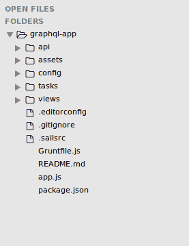
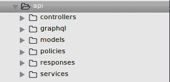
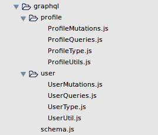
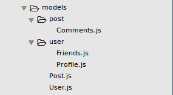
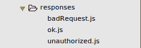
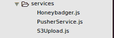
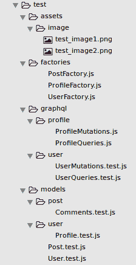

# SailsJS+GraphQL 应用程序的结构

> 原文：<https://dev.to/neshaz/structure-of-a-sailsjsgraphql-application-3d6o>

如果你在为 [Node.js](https://kolosek.com/learn-about-node) 应用组织 API，使用 [Sails.js](https://sailsjs.com/) 框架和 [GraphQL](http://graphql.org/graphql-js/) 时遇到困难，要知道你不是唯一的一个——我也遇到过。

由于这不是一个日常的技术组合，定义这样的应用程序及其测试的解剖结构是一个挑战，但我做到了！

你会问自己这样的问题吗:

*   我将如何组织所有的**查询**和**突变**？
*   将在哪里定义**模式**？
*   我应该如何处理授权和其他实用程序？

如果答案是肯定的，这篇文章可以回答你所有的问题！

## 开始吧！

首先，你将生成 sails 应用程序(我假设你已经安装了**和 **Sails** ，如果没有，这里有一点帮助[如何开始](https://sailsjs.com/get-started)):**

```
 $ sails new graphql-app 
```

如果生成成功，您应该会得到一个结构如下的小应用程序:

[T2】](https://res.cloudinary.com/practicaldev/image/fetch/s--7so5VR7S--/c_limit%2Cf_auto%2Cfl_progressive%2Cq_auto%2Cw_880/https://storage.kraken.io/kk8yWPxzXVfBD3654oMN/a18c934d165196bc4696d5677987b0fa/sails-structure.png)

首先，我将浏览 ***api/*** 文件夹，它和它的子文件夹包含什么:

[T2】](https://res.cloudinary.com/practicaldev/image/fetch/s--fmRmHNSt--/c_limit%2Cf_auto%2Cfl_progressive%2Cq_auto%2Cw_880/https://storage.kraken.io/kk8yWPxzXVfBD3654oMN/3ecfbdb32b0c3ff03f2792b7e9c123a1/sails-api.png)

## 控制器

顾名思义，这个文件夹将包含我们的控制器，或者，我可以说，**一个控制器**，因为你正在使用 GraphQL。
*这句话真的需要一个[文字修饰:下划线](https://kolosek.com/css-text-underlined/) -* ==GraphQL 只需要**一个**控制器来处理发送给 API 的所有请求。==

控制器的目的是将请求重定向到右边的**查询**或**变异**字段，并将解析后的值返回给客户端。

## Graphql

默认情况下不会创建此文件夹，因此您需要自己创建。

在这里，您将存储所有与 GraphQL 相关的文件:查询、变异、类型、模式等。您为我们的应用程序模型中的每个实体创建了一个文件夹，并存储了它的查询和变化，还在该文件夹中定义了关于实体的类型和实用程序。

因此，用户模型将拥有自己的文件夹，其中包含 *UserQueries.js* 、 *UserMutations.js* 、 *UserType* 和 *UserUtils.js* (如果需要的话)，概要文件模型将拥有自己的相关文件，等等...

这是一个直观的表示:

[T2】](https://res.cloudinary.com/practicaldev/image/fetch/s--2TBvK9sL--/c_limit%2Cf_auto%2Cfl_progressive%2Cq_auto%2Cw_880/https://storage.kraken.io/kk8yWPxzXVfBD3654oMN/8596fc2aba90eb1990587f0ac4f5e33f/sails-graphql.png)

根文件夹将包含 ***schema.js*** 文件，在该文件中，您将把所有的查询和变化组合成一个大的 **GraphQL 模式**。

我最初选择 SailsJS 是因为它与 [Rails](https://kolosek.com/install-ruby-on-rails-on-ubuntu/) 非常相似。

## 型号

同样，这是一个不言自明的目录，其中将包含我们所有的应用程序*。*

 *模型表示结构化数据的集合，通常对应于数据库中的单个表或集合。您将基本模型保存在 ***model/*** 文件夹的根目录下，而所有与我们基本模型相关的模型都保存在一个单独的文件夹中。

例如，一个用户的基本信息将保存在 ***User.js*** model 中，但是他的详细信息将保存在 ***Profile.js*** model 中，该模型将包含在 ***models/user/*** 子文件夹中:

[](https://res.cloudinary.com/practicaldev/image/fetch/s--ko0S3cxE--/c_limit%2Cf_auto%2Cfl_progressive%2Cq_auto%2Cw_880/https://storage.kraken.io/kk8yWPxzXVfBD3654oMN/601eba447c5fc37503e67015adfccb0b/sails-models.png) 。

## 政策

SailsJS 中的策略是授权和访问控制的通用工具。策略文件是为特定路由定义的，由于您将只有一个通过 **POST /graphql** 访问的控制器，因此您将只有一个策略文件。

通过该策略，您将允许或拒绝客户端访问我们的 GraphQL 控制器(我们的客户端是一个通用的 [ReactJS](https://kolosek.com/react-jsx-loops/) 应用程序！).

## 回应

默认情况下，Sails 附带了一些最常见的响应类型，它们可以在 ***api/responses*** 目录中找到。如果你认为它们是不必要的，你可以自由地编辑它们，添加新的或者删除它们。

由于所有的流量都通过一个特定的控制器，您将只保留其中的两个响应，并创建一个新的。您将保留 ***ok.js*** 和 ***badRequest.js*** ，因为这些是我们的 GraphQL 控制器能够提供给我们的仅有的两个响应，并且您将创建***unauthorized . js***，如果请求没有通过我们的上述策略，您将发送这些响应。

[T2】](https://res.cloudinary.com/practicaldev/image/fetch/s--ciSnX6C---/c_limit%2Cf_auto%2Cfl_progressive%2Cq_auto%2Cw_880/https://storage.kraken.io/kk8yWPxzXVfBD3654oMN/2ad3114d4f90888edf961cd150b050f6/sails-responses.png)

## 服务

服务是无状态的函数库(**助手**)，你可以在你的 Sails 应用中的任何地方使用。例如，您可能有一个 ***EmailService.js*** ，它整齐地包装了一个或多个助手函数，因此您可以在应用程序的多个地方使用它们。

服务及其助手是在 Sails 应用程序中构建可重用代码的最佳和最简单的方式。它们最伟大的地方在于它们是全球化的，这意味着你可以使用它们，而不必**要求()**或**进口**它们。

我使用 ***api/services/*** 作为可重用工具，如 S3Upload.js、Honeybadger.js、PusherService.js 等。

[T2】](https://res.cloudinary.com/practicaldev/image/fetch/s--u68otqYI--/c_limit%2Cf_auto%2Cfl_progressive%2Cq_auto%2Cw_880/https://storage.kraken.io/kk8yWPxzXVfBD3654oMN/28376d794a613cceb91c83421eaa109f/sails-services.png)

用上面的文字，我覆盖了 ***api/*** 及其子文件夹的结构。我就不一一赘述 ***资产/******配置/*** 和 ***任务/*** 了，因为它们最初是中组织得最好的。

现在让我们看看测试应该是什么样子。

## 测试

Sails 不会自动为我们创建 ***test/*** 文件夹，所以您可以自己创建一个。测试文件夹应该模仿我们的 api 文件夹的结构，这将导致更好的 *DX* ，更容易的代码调试和解决问题(一个好的程序员想要的一切)。

为了创建一些质量测试，您将需要一个 ***assets/*** 文件夹来保存您在测试中需要的文件，您将需要 ***【工厂】/*** 来干净地创建我们的测试数据对象，***【graph QL/***在那里您将放置专用于测试查询和突变的测试，以及 ***【模型】/*** 用于单元测试。

[T2】](https://res.cloudinary.com/practicaldev/image/fetch/s--9zLEVwlA--/c_limit%2Cf_auto%2Cfl_progressive%2Cq_auto%2Cw_880/https://storage.kraken.io/kk8yWPxzXVfBD3654oMN/85ad0b7b32381780133b4f8ba11b9f3c/sails-test.png)

如前所述，剖析 ***测试/*** 文件夹与 ***api/*** 文件夹结构完全相同，除了你有工厂和资产的附加文件夹。

这涵盖了 Kolosek 团队如何组织代码的所有细节。我希望这篇文章能启发你编写一些优秀的、结构良好的 Sails 应用程序！

本文原载于 [Kolosek 博客](https://kolosek.com/sails-graphql-guide/)。***