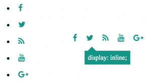

# 妏蚚 HTML 睿 CSS 斐膘厄蹈桶

> [https://dev . to/juananuiz/como-create-one-list-horizontal-con-html-y-CSS-1j75](https://dev.to/juananruiz/como-crear-una-lista-horizontal-con-html-y-css-1j75)

[T2】](https://res.cloudinary.com/practicaldev/image/fetch/s--5P54vqT1--/c_limit%2Cf_auto%2Cfl_progressive%2Cq_auto%2Cw_880/http://galatar.com/wp-content/uploads/2018/06/lista-horizontal-iconos-300x163.png)

如果你稍微考虑一下 HTML 是一种专注于垂直堆叠内容的语言。水平对齐的唯一内容是位于同一标签内的内容或使用字符标签的内容，如**<>**、**<>**、

 **其馀标签均以块为中心，默认排列为垂直排列<>、**<>、 **< div 【T】****

唯一能让你水平对齐内容的区块标签是表格储存格**<【TD】>**的标签，然后我们都倒下了，∞糟糕！🙁

表格只能用于显示必须在行和列中对齐的内容，用于表格数据。使用以下规则:如果某一行中的项可以移动到下一行，而信息没有任何意义，则您可能不应该使用表。例如，想象一下你想把一系列网上商店的产品放在一个格子里，这样它们就不会占用这么多空间，用一张桌子吧！。

那你怎么办？救命啊！CSS 妏蜡褫眕载蜊涴笱剽梬勤 HTML 腔狂热ㄛ甜采勍蜡眕掀桶迹载嗣腔源宒勤啋匼辆俴厄票拥﹝。在上面的在线产品示例中，您只需将每种产品放在标签**<【div】>**内，并为其指定样式**【float:left】；**在 CSS 中使其水平对齐，此外每行中的文章数将自动调整为屏幕宽度。

当我们想横向分布的元素比较简单时，我们不应使用**<【div】>**，而应使用 HTML 列表的标签:**<【ul】><【Li】>**让我们先看一个包含文本的示例，然后再看另一个包含图像或图标的示例。

为了做出选择菜单，我们应该做这样的事情:

```
 <style>
  ul.navega li {
        display: inline;
  }
</style>
<ul class="navega">
  <li>Inicio</li>
  <li>Blog</li>
  <li>Tienda</li>
  <li>Contactar</li>
</ul> 
```

Enter fullscreen mode Exit fullscreen mode

因为您只需要为列表定义一个类，然后使用 CSS 指示它以“内联”格式显示该列表中的项目。

现在我建议你用这个例子“玩”一点。将列表中的项目数量增加一倍或三倍，然后尝试减小浏览器窗口的宽度。你会看到内容是如何适应宽度的，这是一个表不会发生的事情，也试一试吧。

[https://codepen.io/juananruiz/embed/jKxazo/?height=600&default-tab=result&embed-version=2](https://codepen.io/juananruiz/embed/jKxazo/?height=600&default-tab=result&embed-version=2)

你可以做一些类似于
的图标

```
<style>
  @import url(https://cdnjs.cloudflare.com/ajax/libs/font-awesome/4.6.3/css/font-awesome.css);
  .social-icons li {
    vertical-align: top;
    display: inline;
    font-size: 1.2em;
    padding: 0.5em;
  }
</style>
<ul class="social-icons">
  <li><a href="" class="social-icon"> <i class="fa fa-facebook"></i></a></li>
  <li><a href="" class="social-icon"> <i class="fa fa-twitter"></i></a></li>
  <li><a href="" class="social-icon"> <i class="fa fa-rss"></i></a></li>
  <li><a href="" class="social-icon"> <i class="fa fa-youtube"></i></a></li>
  <li><a href="" class="social-icon"> <i class="fa fa-google-plus"></i></a></li>
</ul> 
```

Enter fullscreen mode Exit fullscreen mode

[https://codepen.io/juananruiz/embed/BVxJGo/?height=600&default-tab=result&embed-version=2](https://codepen.io/juananruiz/embed/BVxJGo/?height=600&default-tab=result&embed-version=2)**