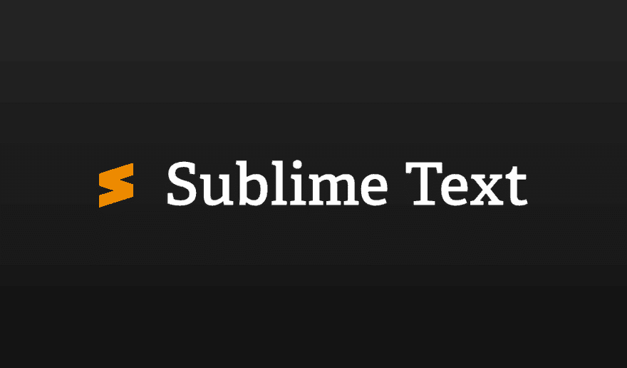

# 绝版文字 3 安装

> 原文：<https://dev.to/ahmetcadirci25/sublime-text-3-24k5>

[T2】](https://res.cloudinary.com/practicaldev/image/fetch/s--ptHFBGmO--/c_limit%2Cf_auto%2Cfl_progressive%2Cq_auto%2Cw_880/https://thepracticaldev.s3.amazonaws.com/i/0xt5oihkmnqhbmlwtzm2.png)

安装 superior text 3 并安装常用的外挂程式

## /[sublime-text-3](https://github.com/ahmetcadirci25/sublime-text-3)

### 安装 superior text 3 并安装常用的外挂程式

<article class="markdown-body entry-content" itemprop="text">

## 中国人

*   [崇高正文 3](#sublime-text-3-kurulumu)
*   [包装控制](#package-control-kurulumu)
*   [埃米特](#emmet-kurulumu)
*   [侧边栏增强功能](#sidebar-enhancements-kurulumu)
*   [升华棉绒](#sublimelinter-kurulumu)
    *   [SublimeLinter-csslint](#sublimelinter-csslint-kurulumu)
    *   [SublimeLinter-jshint](#sublimelinter-jshint-kurulumu)
    *   [SublimeLinter-contrib-scss-lint](#sublimelinter-contrib-scss-lint-kurulumu)
    *   [SublimeLinter-contrib-sass-lint](#sublimelinter-contrib-sass-lint-kurulumu)
    *   [SublimeLinter-contrib-html hint](#sublimelinter-contrib-htmlhint-kurulumu)
*   [支架打火机](#brackethighlighter-kurulumu)
*   [崇高的代码英特尔](#sublimecodeintel-kurulumu)
*   [HTML5](#html5-kurulumu)
*   [对准](#alignment-kurulumu)
*   [SASS](#sass-kurulumu)
*   [颜色选择器](#colorpicker-kurulumu)
*   [j 查询](#jquery-kurulumu)
*   [去](#git-kurulumu)
*   [FTPSync](#ftpsync-kurulumu)
*   [DocBlockr](#docblockr-kurulumu)
*   [HTML-CSS-JS 美化](#html-css-js-prettify-kurulumu)
*   [转换为 UTF8](#converttoutf8-kurulumu)
*   [自动文件名](#autofilename-kurulumu)
*   [彩色荧光笔](#color-highlighter-kurulumu)
*   [全部自动完成](#all-autocomplete-kurulumu)
*   [一个文件图标](#a-file-icon-kurulumu)
*   [素材主题](#material-theme-kurulumu)
*   [Emmet CSS 片段](#emmet-css-snippets-kurulumu)
*   [排水沟](#gitgutter-kurulumu)
*   [Bootstrap 3 自动完成](#bootstrap-3-autocomplete-kurulumu)
*   [Bootstrap 4 自动完成](#bootstrap-4-autocomplete-kurulumu)
*   [谷歌搜索](#google-search-kurulumu)
*   [CSS3](#css3-kurulumu)
*   [高级新文件](#advancednewfile-kurulumu)
*   [SCSS](#scss-kurulumu)
*   [YUI 压缩机](#scss-kurulumu)
*   [自动修复程序](#autoprefixer-kurulumu)
*   [普通任务](#plaintasks-kurulumu)

* * *

### [精装文字 3 安装](https://www.sublimetext.com/)

[精益求精的文本](https://www.sublimetext.com/)是一个包含多种编程语言的界面，源代码编辑和文本编辑器。您可以使用[套件控制项](#package-control-kurulumu)来增强功能。然而，大部分的扩充套件都是由自由软体授权发行，而且是由文字使用者建立的社群所开发。

选择适合您的操作系统。下载安装文件并完成安装。

*   **[视窗](https://www.sublimetext.com/3)**
*   **[macOS](https://www.sublimetext.com/3)**
*   **[Linux](https://www.sublimetext.com/3)T3】**

[上来](#i%CC%87%C3%A7indekiler)

### [包装控制 Kurulumu](https://packagecontrol.io/installation)

用于加载和管理高级文本插件的工具非常方便。使用简单易用，您可以快速安装和自定义增效工具。

**精进文字 3** 中的一个…

</article>

[View on GitHub](https://github.com/ahmetcadirci25/sublime-text-3)

## 中国人

*   [崇高正文 3](https://ahmetcadirci.com.tr/sublime-text-3#sublime-text-3-kurulumu)
*   [包装控制](https://ahmetcadirci.com.tr/sublime-text-3#package-control-kurulumu)
*   [埃米特](https://ahmetcadirci.com.tr/sublime-text-3#emmet-kurulumu)
*   [侧边栏增强功能](https://ahmetcadirci.com.tr/sublime-text-3#sidebar-enhancements-kurulumu)
*   [升华棉绒](https://ahmetcadirci.com.tr/sublime-text-3#sublimelinter-kurulumu)
    *   [SublimeLinter-csslint](https://ahmetcadirci.com.tr/sublime-text-3#sublimelinter-csslint-kurulumu)
    *   [SublimeLinter-jshint](https://ahmetcadirci.com.tr/sublime-text-3#sublimelinter-jshint-kurulumu)
    *   [SublimeLinter-contrib-scss-lint](https://ahmetcadirci.com.tr/sublime-text-3#sublimelinter-contrib-scss-lint-kurulumu)
    *   [SublimeLinter-contrib-sass-lint](https://ahmetcadirci.com.tr/sublime-text-3#sublimelinter-contrib-sass-lint-kurulumu)
    *   [SublimeLinter-contrib-html hint](https://ahmetcadirci.com.tr/sublime-text-3#sublimelinter-contrib-htmlhint-kurulumu)

*   [支架打火机](https://ahmetcadirci.com.tr/sublime-text-3#brackethighlighter-kurulumu)

*   [崇高的代码英特尔](https://ahmetcadirci.com.tr/sublime-text-3#sublimecodeintel-kurulumu)

*   [HTML5](https://ahmetcadirci.com.tr/sublime-text-3#html5-kurulumu)

*   [对准](https://ahmetcadirci.com.tr/sublime-text-3#alignment-kurulumu)

*   [SASS](https://ahmetcadirci.com.tr/sublime-text-3#sass-kurulumu)

*   [颜色选择器](https://ahmetcadirci.com.tr/sublime-text-3#colorpicker-kurulumu)

*   [j 查询](https://ahmetcadirci.com.tr/sublime-text-3#jquery-kurulumu)

*   [去](https://ahmetcadirci.com.tr/sublime-text-3#git-kurulumu)

*   [FTPSync](https://ahmetcadirci.com.tr/sublime-text-3#ftpsync-kurulumu)

*   [DocBlockr](https://ahmetcadirci.com.tr/sublime-text-3#docblockr-kurulumu)

*   [HTML-CSS-JS 美化](https://ahmetcadirci.com.tr/sublime-text-3#html-css-js-prettify-kurulumu)

*   [转换为 UTF8](https://ahmetcadirci.com.tr/sublime-text-3#converttoutf8-kurulumu)

*   [自动文件名](https://ahmetcadirci.com.tr/sublime-text-3#autofilename-kurulumu)

*   [彩色荧光笔](https://ahmetcadirci.com.tr/sublime-text-3#color-highlighter-kurulumu)

*   [全部自动完成](https://ahmetcadirci.com.tr/sublime-text-3#all-autocomplete-kurulumu)

*   [一个文件图标](https://ahmetcadirci.com.tr/sublime-text-3#a-file-icon-kurulumu)

*   [素材主题](https://ahmetcadirci.com.tr/sublime-text-3#material-theme-kurulumu)

*   [Emmet CSS 片段](https://ahmetcadirci.com.tr/sublime-text-3#emmet-css-snippets-kurulumu)

*   [天沟](https://ahmetcadirci.com.tr/sublime-text-3#gitgutter-kurulumu)

*   [Bootstrap 3 自动完成](https://ahmetcadirci.com.tr/sublime-text-3#bootstrap-3-autocomplete-kurulumu)

*   [Bootstrap 4 自动完成](https://ahmetcadirci.com.tr/sublime-text-3#bootstrap-4-autocomplete-kurulumu)

*   [谷歌搜索](https://ahmetcadirci.com.tr/sublime-text-3#google-search-kurulumu)

*   [CSS3](https://ahmetcadirci.com.tr/sublime-text-3#css3-kurulumu)

*   [高级新文件](https://ahmetcadirci.com.tr/sublime-text-3#advancednewfile-kurulumu)

*   [SCSS](https://ahmetcadirci.com.tr/sublime-text-3#scss-kurulumu)

*   [YUI 压缩机](https://ahmetcadirci.com.tr/sublime-text-3#scss-kurulumu)

*   [自动修复程序](https://ahmetcadirci.com.tr/sublime-text-3#autoprefixer-kurulumu)

*   [普通任务](https://ahmetcadirci.com.tr/sublime-text-3#plaintasks-kurulumu)