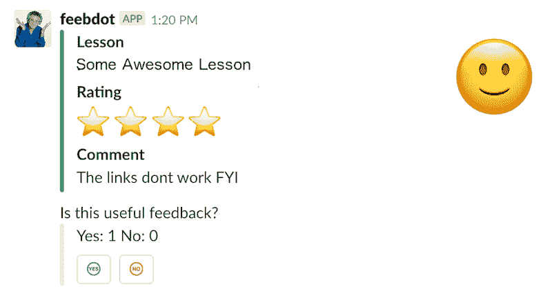

# 通过捕捉承诺来提供占位符数据

> 原文：<https://dev.to/annarankin/supplying-placeholder-data-by-catching-promises-372l>

最近，我编写了一个简单的 Slack bot，它查询 API 以获得对我们产品的反馈，然后将反馈发布到指定的频道。该机器人还允许用户投票决定一条反馈是否对他们可行(即:“这一课有一个打字错误”与“好”或“无可奉告”)。

[T2】](https://res.cloudinary.com/practicaldev/image/fetch/s--xLfqhl53--/c_limit%2Cf_auto%2Cfl_progressive%2Cq_auto%2Cw_880/https://thepracticaldev.s3.amazonaws.com/i/jl4qndzugyl136mswm1c.png)

由于这是一个“黑客日”项目，最初的实现名副其实，非常黑客——投票不被服务器存储；用户可以随心所欲地投票。投票是通过修改 POST `/handle-vote`请求中的字符串来处理的(Slack 作为持久层😂).

```
// text => 'Yes: 0 No: 0'
// value => 'yes' || 'no

function updateAttachmentText(text, value) {
  votes = text.split('  ')
  if (value === 'no') {
    votes[3] = parseInt(votes[3]) + 1
  } else if (value === 'yes') {
    votes[1] = parseInt(votes[1]) + 1
  }
  return votes.join('  ')
}

const updated = updateAttachmentText('Yes: 0 No: 0', 'yes')
// => 'Yes: 1 No: 0' 
```

Enter fullscreen mode Exit fullscreen mode

这个小机器人对我们的产品团队来说非常有用——但我知道它黑暗、可怕的秘密，并决定编写一个更健壮的版本，使用 Redis 存储投票数据——它将存储投票者的备用用户 id，并防止一个用户多次投票。

机器人本身使用 cron 作业向频道发布新的反馈。升级时，我在脚本中添加了一个步骤，用该反馈的 ID 创建一个新的“空白”记录。

```
const initialVotes = { votes: { yes: [], no: [] } }
redisClient.store(id, JSON.stringify(initialVotes)) 
```

Enter fullscreen mode Exit fullscreen mode

一旦用户点击一个按钮，服务器接收请求，通过 id 查找反馈，将用户的 ID 添加到正确的列表中(“是”或“否”)，然后在执行一些逻辑以确保用户只能投票一次，而且只能以一种方式投票之后，将用户的 ID 保存回 Redis 存储。

这里的问题是来自原始机器人的消息——这些反馈在我们的应用程序中没有与它们的 id 相关联的记录；因此，如果用户点击投票按钮，下面的代码将会失败:

```
// Imagine our Redis client setup...
class Redis {
  // setup, etc

  fetch(key) {
    return new Promise((resolve, reject) => {
      this.client.get(key, (err, response) => {
        if (err || !response) { 
          return reject('Unable to find result for', key, err) 
        }
        return resolve(response)
      })
    })
  }
}

// ... and a Vote loading class...
class Vote {
  constructor(id, redisClient) { 
    this.id = id 
    this.redisClient = redisClient 
  }

  loadVote() {
    return this.redisClient.fetch(this.id)
      .then(voteData => JSON.parse(voteData))
  }
}

const vote = new Vote(someId, someRedisClient)

vote.loadVote().then((vote) => incrementCounterAndSave(vote)) 
// Uncaught rejection :( 
```

Enter fullscreen mode Exit fullscreen mode

最初我认为这将是一个恼人的问题，我需要条件逻辑来处理我的服务器代码中不存在的记录。不过，看看`Vote`类的代码本身，会发现一个更简洁的选项:

```
class Vote {
  // ...
  loadVote() {
    return this.redisClient.fetch(this.id)
      .then(voteData => JSON.parse(voteData))
      .catch((err) => {
        console.log('Encountered an error, returning placeholder data:', err)
        return { votes: { yes: [], no: [] } }
      })
  }
}

const vote = new Vote(someId, someRedisClient)

vote.loadVote()
  .then((vote) => {
    console.log(vote)
    incrementCounterAndSave(vote)
  }) 
// Encountered an error, returning placeholder data: 
//   'Unable to find result for someId (error here)
// { votes: { yes: [], no: [] } } 
```

Enter fullscreen mode Exit fullscreen mode

我想我应该把这个写下来，因为，虽然我已经做了一段时间的承诺，但这个概念不是我的第一直觉:除了在我的`then`调用链的最后，我没有想到在任何地方使用`catch`。

这里有一些代码，您可以在控制台中随意摆弄，非常简单地演示了这一点！

```
class DataFetcher {
  constructor() {
    this.count = 0
  }

  fetch() {
    this.count += 1
    return new Promise((resolve, reject) => {
      // Cause this Promise to be rejected/fail every other time the fetch function is called.
      this.count % 2 === 0 ? resolve('data from DB!') : reject('data not found')
    })
  }
}

const client = new DataFetcher()

const getData = () => {
  return client.fetch()
    .then((res) => {
      return res
    })
    .catch(err => {
      return 'placeholder data'
    })
}

getData.then(console.log) // placeholder data
getData.then(console.log) //data from DB! 
```

Enter fullscreen mode Exit fullscreen mode

顺便提一下，你完全可以使用`async` / `await`以一种嵌套更少(并且更具可读性)的方式编写这段代码——我对这两种方式都没有强烈的感觉，所以我只是答应了。

编码快乐！