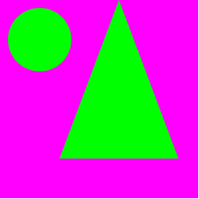
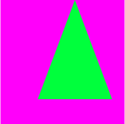
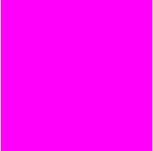

# SVG 和“所有”属性

> 原文：<https://dev.to/johnkreitlow/svg-and-the-all-property-30d7>

这是一个 bug，还是一个特性？我想用`all`属性重置 div 中的所有元素，但是我在 Chrome 和 Firefox 中得到不同的结果。Chrome 似乎认为`cx`、`cy`、`d`、`r`、`stroke`、`fill`(可能还有其他属性)都是 CSS 可控的。火狐似乎恰当地应用了`fill`，并没有触及其他属性。

[https://codepen.io/radium-v/embed/gKLONY?height=600&default-tab=result&embed-version=2](https://codepen.io/radium-v/embed/gKLONY?height=600&default-tab=result&embed-version=2)

Firefox 给了我多少有些期待的东西。它并不完美，但我真的不知道该期待什么:

Safari 只显示三角形:

Chrome 对待`all`非常非常认真:

wat do? 🤷🏻‍♂️

# 更新

我查阅了 W3C 规范，发现了[这一节](https://drafts.csswg.org/css-cascade-3/#preshint)。我认为它属于这个问题，但我真的不知道如何破译它。