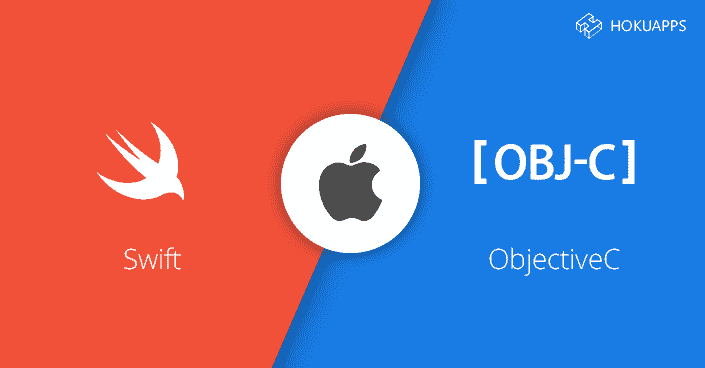

# swift vs Objective-C:iPhone App 开发哪个最好？

> 原文：<https://dev.to/nancy07/swift-vs-objective-c-which-is-the-best-for-iphone-app-development-chn>

[T2】](https://res.cloudinary.com/practicaldev/image/fetch/s--GEri6m5o--/c_limit%2Cf_auto%2Cfl_progressive%2Cq_auto%2Cw_880/https://thepracticaldev.s3.amazonaws.com/i/oodj999eglnc2o0dfeg3.png)

苹果在 2014 年 6 月宣布的 Swift 是 iPhone 应用开发的最新编程语言。在 Swift 推出之前，Objective-C 用于开发 iOS 平台上的应用程序。

最近，我们看到开发人员明显从 Objective-C 转向 Swift。在我们说明哪一个更适合于 iPhone 应用程序开发以及为什么 Swift 最近越来越受欢迎之前，我们需要了解两者之间的差异以及它如何影响整个 iPhone 应用程序开发流程。

**什么是雨燕？**

Swift 作为一种消费者友好的编程语言推出，用于在 iPhone 应用程序开发中创建引人入胜的应用程序。Swift 主要用于开发与物联网完全兼容的软件，如 Apple Watch 和其他类似设备。这种语言的开发方式提高了应用程序的性能，并且具有 Objective-C 的所有特性。

**Swift 和 Objective-C 简史**

为了简单了解从 Objective-C 到 Swift 的转变，我们需要看一下 iOS 编程语言在 iPhone 应用程序开发中的发展历史。

2008 年，我见证了 iPhone SDK 2.0 的开发。这是美国 iPhone 应用程序开发的一次革命。应用程序开发人员在用 Objective-C 开发应用程序时面临着巨大的挑战。当时很难招聘到精通这种语言的 iOS 程序员。

2010 年，看到了开发前沿的新变化，苹果推出了 iPhone OS 的第 4 版。一份新的开发人员协议规定，所有应用程序都需要用 C、C++和 Objective-C 编写，只有这些应用程序才能编译并直接链接到文档化的 API。这些变化有助于成功地将几个高质量的应用程序填充到应用程序商店中。

尽管 Objective-C 在应用程序领域越来越受欢迎，但在 iPhone 应用程序开发过程中，许多开发人员对 Objective-C 并不满意。IOS 应用开发者试图用其他语言开发 iPhone 应用。苹果一直致力于 Objective-C，并在许多层面上对其进行改进。然而，苹果公司花了将近 6 年的时间才明白 Objective-C 可能不是编写应用程序的最佳语言。在这个阶段之后，iOS 开发了新的编码语言 Swift。

Swift 是一个互动平台，被认为易于学习和编写具有强大新功能的应用程序，并促进了 iPhone 应用程序的开发。作为 iPhone 应用开发的一部分，它提供了速度和实时反馈，有助于更好地开发应用。

在很大程度上，Swift 更容易，让开发人员在整个 iPhone 应用程序开发过程中更有效率。市场是开放多元化的，这使得雇佣 iOS 开发者变得很容易。

【Swift 在 iPhone 应用开发中取代 Objective-C 的 10 个原因

**1。离未来更近一步**——Swift 是美国 iPhone 应用开发中使用的组织性和结构性最好的开源 app 编程语言之一。2015 年被宣布为开源编程语言后，成为世界上发展最快的网络。

**2。减少编码工作** -借助适当的内联支持，Swift 有助于进行适当且完全无错的编码。生成字符串在很大程度上有助于减少编码工作。这很容易实现，文件数量减少了一半，也更容易处理。

**3。更少的维护** - Objective-C 有两个独立的文件，开发人员应该管理这两个文件来提高任何应用程序的效率和构建时间。Swift 更紧凑，因此文件需要更少的维护。Swift 结合了 Objective-C 实施(。m)文件和标题(。h)文件和一个单独的程序代码文件(.swift)。这使得它更加可靠，从而提高了性能。

**4。更少的崩溃机会** - Swift 检测错误的速度更快，因为它们在开发过程中检测语法错误。它还提供了一些建议，使错误识别成为一个简单的过程。iPhone 应用程序开发过程也很快，因为维护变得容易，保持了应用程序的质量完好无损。

**5。较小的错误** -编码人员正在利用 Swift 的特性来减少编码长度。类型接口有助于开发人员避免因输入值不正确而导致编码错误。它还提供了一个反馈回路，有助于消除错误。

**6。高度安全的应用程序** - Swift 有一个包含多个 API 的安全框架，用于处理证书、授权服务、信任政策、密钥，并对报文应用加密技术。这使得 iPhone 应用程序开发过程和最终产品都是安全的。

**7。应用程序占用更少的空间** -使用 Swift 应用程序，更多的动态库被直接加载到应用程序内存中，减少了原始应用程序的大小。这反过来提高了应用程序的性能。

**8。更顺畅的更新** -由于 Swift 提供的简单编码，更新也变得很容易。这有助于保持应用程序与当前需求同步

**9。云的完美选择** - Swift 是基于云的应用开发的理想选择。你在基于云的应用中寻找的所有东西，比如安全性、速度、友好的界面，都在 Swift 上。在很少的时间里，它已经成为最受欢迎的语言选择。

10。所有应用程序的开发 - Swift 是一个包罗万象的平台，它可以帮助开发复杂和简单的应用程序。无论应用程序是具有复杂功能还是单一功能，都可以使用 Swift 编程语言轻松开发。

此外，Swift 帮助开发者以更快的速度构建 iOS 应用，这比 Objective-C 要好得多。

**Swift 的最大优势**

Swift 的关键是始终专注于社区支持。由于 Swift 是一个开源平台，它得到了大量开发人员的支持。如果系统中有任何错误或它在任何时候崩溃，都可以对其进行实时修复。如果开发人员在任何一个阶段被卡住了，他们可以在开发过程中互相帮助。Swift 因其社区支持而变得极为重要。有了 Swift 及其社区支持，iPhone 应用程序开发变得更加顺畅。

一方面，Objective-C 需要分号、头文件和指针。类型必须在 Objective-C 中声明，它还需要 KVO 和自定义设置。另一方面，在 Swift 上，类型是推断的，函数是第一类对象，集合是使用泛型类型化的。Swift 提供更简单的字符串操作，并且内存是自动管理的。

凭借简单的语法和句法，Swift 在以更快的速度和用户友好的界面交付高质量应用程序方面具有更大的潜力。借助 Swift，雇佣 iOS 开发人员的流程变得更加顺畅。随着 Swift 在 iOS 平台的成功，可以很容易预见，很快 Swift 将被做成兼容 Android 的。这将帮助我们[将 iOS 应用移植到 Android](https://www.hokuapps.com/services/convert-ios-app-to-android/) 而无需单独编码。随着 Swift 在全球的广泛流行，雇佣 iOS 开发人员变得非常容易。

**关于作者:**
凯·帕卡尔(Kay Parkar)是 HokuApps 的联合创始人，该公司在移动应用开发技术方面帮助初创公司和企业。他热爱低代码开发平台，尤其是快速应用技术。他在一家领先的 Iphone 应用程序开发服务公司工作，与经验丰富的 iOS 应用程序开发人员一起开发创新的 iPhone 应用程序，涉及娱乐、生产力、社会事业、教育、金融、保险、健康等多个领域，并因此获得了众多奖项。