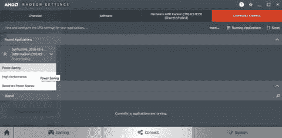

# 可切换显卡与 D3D11 适配器

> 原文：<https://dev.to/reg__/switchable-graphics-versus-d3d11-adapters-45fa>

当你有一个所谓的“可切换图形”的笔记本电脑时(就像我在我的联想 IdeaPad G50-80 中所做的那样)，你实际上有两个 GPU。在我的情况下，这些是:英特尔 i7-5500U 和 AMD 镭龙 R5 M330。在 DirectX 11 中编程时，可以枚举这两个适配器，并在创建一个`ID3D11Device`对象时选择其中任何一个。很长一段时间我都在想这个“可切换图形”的各种设置会如何影响我的应用程序？今天我终于想通了。长话短说:他们只是改变了这些适配器对我的程序可见的顺序，因此合适的适配器是可见的适配器 0。以下是完整的故事:

看起来基本设置可以在 Windows 设置>电源选项>编辑电源计划>可切换动态图形中找到。(不要和“AMD 显卡电源设置”混淆！)当您将其设置为“优化节能”或“优化性能”时，应用会将英特尔 GPU 视为第一个适配器:

[T2】](https://res.cloudinary.com/practicaldev/image/fetch/s--DXcAky9e--/c_limit%2Cf_auto%2Cfl_progressive%2Cq_auto%2Cw_880/http://asawicki.info/files/SwitchableGraphics/Power%2520Options%2520Optimize%2520power%2520savings.png)

[T2】](https://res.cloudinary.com/practicaldev/image/fetch/s--tSXZCALH--/c_limit%2Cf_auto%2Cfl_progressive%2Cq_auto%2Cw_880/http://asawicki.info/files/SwitchableGraphics/SynTechVis%25200Intel%2520Sel0.png)

当您选择“最大化性能”时，应用程序会将 AMD GPU 视为第一个适配器:

[T2】](https://res.cloudinary.com/practicaldev/image/fetch/s--tE7SreQA--/c_limit%2Cf_auto%2Cfl_progressive%2Cq_auto%2Cw_880/http://asawicki.info/files/SwitchableGraphics/Power%2520Options%2520Maximize%2520performance.png)

[T2】](https://res.cloudinary.com/practicaldev/image/fetch/s--Wwex4dFL--/c_limit%2Cf_auto%2Cfl_progressive%2Cq_auto%2Cw_880/http://asawicki.info/files/SwitchableGraphics/SynTechVis%25200AMD%2520Sel0.png)

我还发现镭龙设置(AMD 显卡驱动自带的应用)会覆盖这个系统设置。如果你进入系统>可切换显卡，并为你的特定可执行文件进行配置，那么再次:选择“节能”会使你的应用程序将英特尔 GPU 视为第一适配器，而选择“高性能”会使 AMD 显卡优先。

[T2】](http://asawicki.info/files/SwitchableGraphics/Radeon%20Settings%20Power%20Saving.png)

就这么简单。基本上，如果你总是使用你找到的第一个适配器，那么你遵循系统的推荐设置。创建 D3D11 设备时，您仍然可以自由使用另一个适配器。我检查过了——它能工作，而且真的用了那个。

[T2】](https://res.cloudinary.com/practicaldev/image/fetch/s--dhv8TtVS--/c_limit%2Cf_auto%2Cfl_progressive%2Cq_auto%2Cw_880/http://asawicki.info/files/SwitchableGraphics/SynTechVis%25200AMD%2520Sel1.png)

如果你遇到一个奇怪的 bug，你的应用程序挂在这些 GPU 中的一个上，这一点尤为重要。