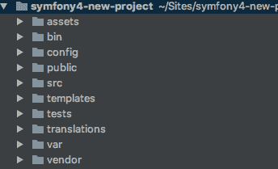
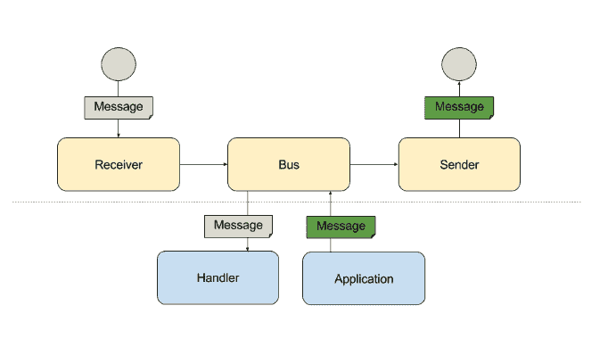

# Symfony 4 安装和新功能

> 原文：<https://dev.to/minompi/symfony-4-installation-and-new-features-oj8>

Symfony 4 是最著名的 PHP 框架之一的最新版本。
它已于 2017 年 11 月 30 日发行，并取得了巨大成功！与旧版本最大的区别之一是当你初始化你的 Symfony 4 项目时，安装了非常小的依赖项。
Symfony 4 太小了，以至于 Silex 项目已经被取消。

## 如何安装 Symfony 4

为了创建一个新的 Symfony 4 应用程序，你需要安装 PHP 7.1 或更高版本和 Composer。
安装了 **Composer** 之后，你就可以创建项目了，在你的控制台上发出这个命令:

```
composer create-project symfony/website-skeleton my-project 
```

Enter fullscreen mode Exit fullscreen mode

这是用于传统 web 应用程序的命令，它下载一个 Symfony 项目的基本框架，并准备好启动默认配置。如果您正在构建微服务、控制台应用程序或 API，请考虑使用更简单的 skeleton 项目。

```
composer create-project symfony/skeleton my-project 
```

Enter fullscreen mode Exit fullscreen mode

在这个版本中，没有安装软件包，所以它更小。

## 目录结构

根据其他框架和社区的要求，Symfony 4 稍微改变了它的目录结构，所以现在新的目录结构是:

[T2】](https://res.cloudinary.com/practicaldev/image/fetch/s--yjvvaj37--/c_limit%2Cf_auto%2Cfl_progressive%2Cq_auto%2Cw_880/https://alessandrominoccheri.github.io/img/symfony_folder_strcuture.jpg)

**app/**
应用配置，模板和翻译，在这里可以找到 AppKernel 文件，应用配置的主入口点。

**bin/**
可执行文件(如 bin/console)。

**src/**
项目的 PHP 代码，这里有控制器、模板和实体目录。
在这个文件夹中没有主包，因为 Symfony 4 的想法是在一个项目中有一个单独的项目，而不是多个包。

**tests/**
自动测试(例如使用 PHPUnit 或 Behat 或其他的单元测试)。

**var/**
生成文件(缓存、日志等。).

**vendor/**
由 composer 安装的外部库。

**public/**
web 根目录，存放图片、样式表、JavaScript 文件等公共静态文件，这个文件夹是旧的“web”文件夹。

## 环境变量

在设计您的系统时，您可能希望拥有不同的变量，这些变量可以与其他环境中的变量不同。在以前的 Symfony 版本中，你将这些变量放入一个名为 **parameters.yml** 的文件和 parameters.yml.yourenv 中，现在这个文件不存在了(很明显你可以修改你的代码来使用它，但是有点复杂)，你需要将这些变量写入一个名为。项目根中的 env。
显然你可以有不同。但是这取决于你的应用程序中有多少个环境。
下面是一个简单的**。env** 文件:

```
DB_USER=root
DB_PASS=pass 
```

Enter fullscreen mode Exit fullscreen mode

你也可以像这样在里面使用变量:

```
DB_USER=root
DB_PASS=${DB_USER}pass 
```

Enter fullscreen mode Exit fullscreen mode

读取这些文件的组件是 Dotenv 组件。env 文件，使存储在其中的环境变量可以通过 **getenv()** 、 **$_ENV** 或 **$_SERVER** 访问。
如果您的项目中还没有它，您可以启动这个命令来形成您的 CLI 以使用它:

```
composer require symfony/dotenv 
```

Enter fullscreen mode Exit fullscreen mode

要获取环境变量的值，可以在代码中使用以下语法:

```
$dbUser = getenv('DB_USER'); 
```

Enter fullscreen mode Exit fullscreen mode

请记住，Symfony Dotenv 永远不会覆盖现有的环境变量。

## 自动布线

**自动连线**是 Symfony 4 中最强大的功能之一(从 Symfony 3.3 版本开始就可以使用)。
它允许你用最少的配置管理容器中的服务，例如，不需要指定所有必须传递给你的服务的参数(现在控制器也是服务！).
因此，如果您有一个服务类，需要向 __construct 方法传递一些其他服务，您只需启用自动连接，Symfony 就会为您完成！

示例:

```
namespace App\Service;
use App\Util\Bar;
use Psr\Log\LoggerInterface;
class Foo
{
    private $logger;
    public function __construct(LoggerInterface $logger)
    {
        $this->logger = $logger;
    }
} 
```

Enter fullscreen mode Exit fullscreen mode

在旧的方法中，你需要在你的**服务中这样做。yml**

```
app.foo:
    class:     AppBundle\Services\Foo
    arguments: ['@logger'] 
```

Enter fullscreen mode Exit fullscreen mode

在这个新版本中你可以这样做:

```
app.foo:
    class: AppBundle\Services\Foo
    public: true 
```

Enter fullscreen mode Exit fullscreen mode

所以您只需要将 public 指定为 true。想象一下，许多服务都有大量的参数要申报，这样你就可以节省时间了！
基本上，服务不是公共的，所以你需要把它转换成 services.yml，如果你也想这样的话:

```
services:
    _defaults:
        autowire: true
        autoconfigure: true
        public: true 
```

Enter fullscreen mode Exit fullscreen mode

这是您的服务的默认配置，正如您所看到的，它位于 _defaults 之下。
如果你想让你的服务有不同的配置，比如一个私有服务，你可以写这个:

```
services:
    _defaults:
        autowire: true
        autoconfigure: true
        public: true

    App\Services\YourService:
        class: App\Services\YourService
        public: false 
```

Enter fullscreen mode Exit fullscreen mode

因此，Autowire 选项指示 Symfony 在您的服务中自动注入依赖项。自动配置选项指示 Symfony 自动将您的服务注册为命令、事件订阅者等。

现在控制器也是服务，所以很容易在其上进行单元测试，而不是使用较慢的集成测试。
所以现在你也可以像这样在你的控制器中注入服务:

```
public function index(LoggerInterface $logger) 
{
    $logger->info('This is a injected service!');
    //code
} 
```

Enter fullscreen mode Exit fullscreen mode

在这个动作中，你直接注入 **LoggerInterface** ，你不需要在动作中实例化它！

## 弹性和配方

Symfony Flex 是一个 Composer 插件，当您运行 require、update 和 remove composer 命令时会调用它。
当你在 **Symfony flex** 里面运行这些 Flex 搜索命令的时候，如果软件包在里面的话，服务器会接收、安装并为你配置。
Flex 的强大之处在于，您不必查看所有库的自述文件来配置您的软件包，因为有一个方法可以帮您完成这项工作。你不需要把你的新包添加到 AppKernel.php，因为 flex 在你安装的时候已经完成了。
如果您的包不存在，它会退回到 Composer 标准行为。

Flex 跟踪它安装在一个 **symfony.lock** 文件中的配方，该文件必须提交到您的代码库中。
菜谱存储在两个不同的 github 存储库中:

*   [Recipe](https://github.com/symfony/recipes) ，是高质量和维护包的精选配方列表。默认情况下，Symfony Flex 会查看这个存储库。

*   [Recipes-Contrib](https://github.com/symfony/recipes-contrib) ，包含社区创建的所有食谱。它们都保证可以工作，但是它们相关的包可能无法维护。默认情况下，Symfony Flex 会忽略这些配方，但是您可以执行此命令，开始在您的项目中使用它们:

```
composer config extra.symfony.allow-contrib true 
```

Enter fullscreen mode Exit fullscreen mode

在这个网站里，你可以查看完整的食谱列表，在那里你可以找到如何将它们安装到你的项目中。
有时有一个别名，所以你可以像这样使用它，以便更快和更容易记住命令:

```
composer require logger 
```

Enter fullscreen mode Exit fullscreen mode

一个配方包含一个存储包配置的 **manifest.json** 文件。当 Flex 安装这个包时，它会获取 manifest.json 文件并将默认配置应用到您的项目，因此您可以立即使用这个新库，而无需编写任何配置。

## 信使组件

Messenger 组件帮助应用程序向/从其他应用程序或通过消息队列发送和接收消息。
为了安装组件，您需要从控制台启动:

```
composer require symfony/messenger 
```

Enter fullscreen mode Exit fullscreen mode

[T2】](https://res.cloudinary.com/practicaldev/image/fetch/s--xQ6l4RkL--/c_limit%2Cf_auto%2Cfl_progressive%2Cq_auto%2Cw_880/https://alessandrominoccheri.github.io/img/symfony_messenger_component.jpg)

### 它是如何工作的？

发送者将消息序列化并发送给某物。例如，这个东西可以是消息代理或第三方 API。公共汽车发送信息。总线的行为在其有序的中间件堆栈中。该组件附带了一套您可以使用的中间件。
将消息总线与 **Symfony 的 FrameworkBundle** 一起使用时，为您配置了以下中间件:

**日志中间件**(记录您的消息处理)

**sendmessage 中间件**(启用异步处理)

**HandleMessageMiddleware** (调用注册的句柄)

一旦消息被发送到总线，它将由“消息处理器”处理。消息处理程序是一个 PHP 可调用程序(即一个函数或一个类的实例),它将对你的消息进行所需的处理。
为了发送和接收消息，您必须配置适配器。适配器将负责与您的消息代理或第三方通信。
然后接收方将消息反序列化并转发给处理程序。这可以是消息队列提取器或 API 端点。

欲了解更多信息，请联系我或关注我:

[推特](https://twitter.com/minompi)
T3】GitHub