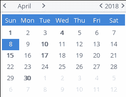
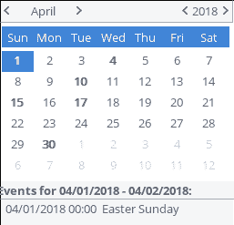

# 使用 Vdirsyncer 和 Orage 同步 Google 日历

> 原文：<https://dev.to/aymanbagabas/sync-google-calendar-using-vdirsyncer-and-orage-1mok>

很长一段时间以来，我想让我所有的日历和待办事项与我当前的桌面设置同步。目前，我使用 XFCE 的软件，比如 Thunar 和 Openbox 来管理日常事务。是的，我知道用 Gnome DE 你可以很容易地做到这一点，但是 Gnome 有很大的软件包依赖性。另一方面，XFCE 非常轻量级和简单。

另一个很棒的软件是 [vdirsyncer](https://vdirsyncer.pimutils.org) 。它支持 CalDAV 协议，Google calendar 也支持该协议。通过简单的配置，我们可以本地同步谷歌日历。然后我们可以使用 Orage 查看/修改我们的日历文件。Orage 是一个时间管理应用程序，可以管理您的日历、约会、闹钟和待办事项。

首先，确保我们有所有需要的包。Orage 和 Vdirsyncer 应该存在于大多数发行版的官方仓库中。在 Archlinux 中，安装可以用`sudo pacman -S vdirsyncer orage`来完成。其他发行版也是如此。Ubuntu/Debian `sudo apt-get install vdirsyncer orage`。

[](https://res.cloudinary.com/practicaldev/image/fetch/s--1kAN1q09--/c_limit%2Cf_auto%2Cfl_progressive%2Cq_auto%2Cw_880/https://aymanbagabas.com/asseimg/orage1.png) 
*Orage 高亮事件*

在这里你可以看到 orage 是如何突出显示带有事件的日期的。例如，4 月 1 日是复活节三德科技。这是从我的谷歌美国假期日历中提取的。

[](https://res.cloudinary.com/practicaldev/image/fetch/s--36Y93XrX--/c_limit%2Cf_auto%2Cfl_progressive%2Cq_auto%2Cw_880/https://aymanbagabas.com/asseimg/orage2.png) 
*Orage 显示事件*

### Vdirsyncer 设置

首先，我们从配置 Vdirsyncer 来同步 Google 日历开始。我的配置文件是这样的:

```
[general]
status_path = "~/.vdirsyncer/status/"

[pair calendar]
a = "google_calendar"
b = "local_calendar"
collections = ["from a", "from b"]
metadata = ["color"]

[storage local_calendar]
type = "singlefile"
path = "~/.calendars/%s.ics"

[storage google_calendar]
type = "google_calendar"
token_file = "~/.vdirsyncer/google_token"
client_id = "CLIENT_ID"
client_secret = "CLIENT_SECRET" 
```

Enter fullscreen mode Exit fullscreen mode

在这里，我们指定了 Vdirsyncer 的状态应该位于何处。我的位于~/下。vdirsyncer/状态。然后我们告诉 Vdirsyncer 创建一对用于双向同步的日历，其中 **a** 是实际的 Google 日历， **b** 是从云中提取的本地文件。然后我们将这两个日历定义为存储。

*   storage local_calendar，我们在这里指定此存储的类型，即“singlefile ”,这意味着 Vdirsyncer 将为您拥有的每个日历创建一个文件。
*   存储 google_calendar，这里是它感兴趣的地方。这里的类型是“google_calendar ”,这意味着使用 Google cloud 来获取日历。对于这种类型，您必须指定令牌文件、客户端 id 和客户端机密。所有这些对于同步都是必不可少的。

现在我们必须为我们的 Google 帐户启用 CalDAV API。

1.  转到[这里](https://console.developers.google.com)并创建一个新项目。这是必需的，以便您可以为该项目启用 CalDAV API。
2.  单击“启用 API 和服务”或在左侧单击“库”，然后搜索“CalDAV”并启用它。
3.  现在，我们需要为 API 获取我们的凭证、客户端机密和 id。单击“创建凭据”，然后为您的 API 选择“CalDAV API ”,并为应用程序类型选择“其他”。单击下一步，选择一个名称，例如“vdirsyncer ”,然后单击继续。
4.  您将获得您的客户端 id，将其粘贴到您的配置文件中。
5.  我们仍然没有客户的秘密。获得客户端 id 后，单击 done，然后单击凭证名称并从那里获得客户端密码。

现在我们有了 Vdirsyncer 配置设置，我们需要授权它访问我们的谷歌帐户。

```
vdirsyncer discover calendar 
```

Enter fullscreen mode Exit fullscreen mode

这将尝试授权配置文件中定义的“日历”对。应该会弹出一个浏览器窗口或链接来完成授权，这将创建配置中定义的访问令牌。现在我们可以通过
同步谷歌日历

```
vdirsyncer sync 
```

Enter fullscreen mode Exit fullscreen mode

阅读更多关于 [Vdirsyncer](https://vdirsyncer.pimutils.org/en/stable/index.html) 的信息。

### 祈祷设置

现在我们需要告诉 Orage 日历 ics 文件在哪里，这样我们就可以在 Orage 中查看它们。运行 Orage，然后进入文件->交换数据，并添加所有从~/.calendar 中提取的 ics 文件。注意只读复选标记，如果你想修改你的 Google 日历，你必须确保在添加与你的 Google 帐户名“[google@gmail.com.ics](mailto:google@gmail.com.ics)相同的日历文件时取消选中该标记。您应该可以在 Orage 中看到所有突出显示的日历事件。你可以通过修改设置来隐藏窗口边框和托盘图标。当双击某个日期时，会弹出一个事件窗口，然后你可以添加事件、待办事项等，但要确保你从顶栏选择了你的谷歌账户文件，以便同步。

### 使用 Cron 定期同步

您可以添加一个 cron 来自动执行同步命令。`crontab -e`

```
MAILTO=""
@hourly vdirsyncer sync 
```

Enter fullscreen mode Exit fullscreen mode

这将每小时同步一次日历。确保 cron 服务正在运行。我在我的设置中使用了“cronie ”,在 Archlinux 中，我必须启用 cronie 服务才能实现。

```
sudo systemctl enable cronie
sudo systemctl start cronie 
```

Enter fullscreen mode Exit fullscreen mode