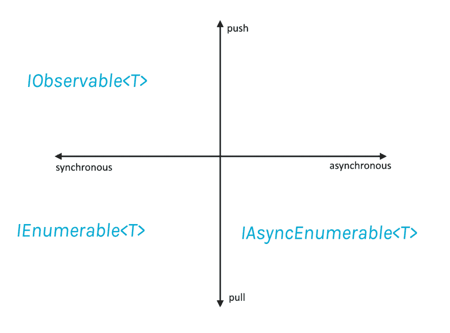

# IAsyncEnumerable <t>-简介</t>

> 原文：<https://dev.to/stuartblang/iasyncenumerablet---an-introduction-g99>

### 问题

```
public async Task<IEnumerable<User>> GetUsers()
{
    var allResults = new List<User>();
    var nextUrl = "https://account.zendesk.com/api/v2/users.json";
    while (nextUrl != null)
    {
        var page = await _client.GetAsync(nextUrl)
                            .Content.ReadAsAsync<UsersListResponse>();
        allResults.AddRange(page.Users);
        nextUrl = page.NextPage;
        // eg "https://account.zendesk.com/api/v2/users.json?page=2"
    }
    return allResults;
} 
```

看一下上面的代码，您自己可能也遇到过这个熟悉的问题。我们希望在我们的类型中表示这个 HTTP API 的可分页结果，同时仍然是异步的。

传统上，有 4 种方法可以解决这个问题；

1.  用`.Result` / `.GetAwaiter().GetResult()`或`.Wait()`阻塞异步代码。这不是一个好主意。
2.  上面的方法等待每个异步任务，但急切地完成所有任务，并在一个物化的集合中返回完整的结果。这违背了这个分页 API 的目的，更普遍的是，我们失去了我们试图建模的问题的惰性。
3.  我们将返回类型翻转为`IEnumerable<Task<User>>`。这将要求我们相信该代码的任何消费者在每次枚举后都会等待每个任务的结果。有一些方法可以在运行时强制实现这一点，如果没有正确使用它，就会抛出异常，但是，这最终是一个误导性的类型，并且该类型的形状没有传达其隐藏的约束。
4.  我们不尝试返回一个单一的类型，比如`Task<IEnumerable<T>>`，而是自己建模。这可能是一个好主意，但是我们失去了与熟悉的类型一起工作的好处。

好吧，是时候我们采用一种新的类型来结束这种疯狂了。这就是`IAsyncEnumerable<T>`的作用。

### 关于 Ix。异步ˌ非同步(asynchronous)

目前`IAsyncEnumerable<T>`是一个存在于少数地方的概念，没有单一的定义。我今天将使用的版本存在于[反应式扩展回购](https://github.com/dotnet/reactive)中，在[一个基于](https://github.com/dotnet/reactive/tree/IxAsyncCSharp8/Ix.NET/Source)[最新 C# 8.0 提案](https://github.com/dotnet/csharplang/blob/9d86668fcd915e1d3ef7634551d52e4d22c0631a/proposals/async-streams.md)的分叉中。

Reactive Extensions (Rx)是 Observable 实现和扩展的家园，它也是一个名为 Interactive Extensions(简称 Ix)的兄弟项目的家园。Rx 有很多扩展和工具来组成基于推的序列，Ix 非常类似，但用于基于拉的序列(`IEnumerable<T>`)。这篇文章中我感兴趣的部分是异步部分，我称之为 Ix。Async，这是在它自己的 nuget 包中提供的，我通常会引用这里的`IAsyncEnumerable<T>`定义(尽管这将映射到其他实现)。

在不久的将来，C# 8.0 将引入异步流(我更喜欢术语序列，因为`Stream`已经是一个不同的。NET concept)作为一个语言特性，并且将会有一个新的`IAsyncEnumerable<T>`定义，但是这并不能阻止我们使用 Ix。Async 今天，要么使用与 C# 8.0 提案略有不同的当前定义，要么使用。

### 定义

```
public interface IAsyncEnumerable<out T>
{
    IAsyncEnumerator<T> GetAsyncEnumerator();
}

public interface IAsyncEnumerator<out T> : IAsyncDisposable
{
    T Current { get; }
    ValueTask<bool> MoveNextAsync();
}

public interface IAsyncDisposable
{
    ValueTask DisposeAsync();
} 
```

这是 C# 8.0 提案中对`IAsyncEnumerable<T>`的定义，看起来应该很熟悉，正如你所料，它只是带有异步`MoveNext`方法的`IEnumerable<T>`。

[](https://res.cloudinary.com/practicaldev/image/fetch/s--gm1ko14N--/c_limit%2Cf_auto%2Cfl_progressive%2Cq_auto%2Cw_880/https://stu.dev/conteimg/2018/06/async-enum12.png) 

我们现在可以看到与`IObservable<T>`和`IEnumerable<T>`的关系。

在这个熟悉的家族中，意味着我们不必学习新的概念来开始消费和组合这种类型的操作。

```
IAsyncEnumerable<Bar> ConvertGoodFoosToBars(IAsyncEnumerable<Foo> items)
{
    return items
        .Where(foo => foo.IsGood)
        .Select(foo => Bar.FromFoo(foo));
} 
```

这些扩展方法对我们来说很容易理解，并且在 C#中已经无处不在。

### 生产序列

如果我们不能生成可供消费的序列，所有这些都将是非常学术的。今天有几个选择。

#### 1。直接实现`IAsyncEnumerable<T>`和`IAsyncEnumerator<T>`接口

您可以这样做，对于性能关键的代码，这可能是最合适的方法。

然而，它确实需要相当多的样板代码，所以这里是一个起点:

```
// A starting point for your own IAsyncEnumerable extensions
public static class AsyncEnumerableExtensions
{
    public static IAsyncEnumerable<T> MyExtensionMethod<T>(this IAsyncEnumerable<T> source)
    {
        return new MyAsyncEnumerable<T>(source);
    }

    public struct MyAsyncEnumerable<T> : IAsyncEnumerable<T>
    {
        readonly IAsyncEnumerable<T> enumerable;

        internal MyAsyncEnumerable(IAsyncEnumerable<T> enumerable)
        {
            this.enumerable = enumerable;
        }

        public IAsyncEnumerator<T> GetAsyncEnumerator()
        {
            return new MyAsyncEnumerator(enumerable.GetAsyncEnumerator());
        }

        public struct MyAsyncEnumerator : IAsyncEnumerator<T>
        {
            readonly IAsyncEnumerator<T> enumerator;

            internal MyAsyncEnumerator(IAsyncEnumerator<T> enumerator)
            {
                this.enumerator = enumerator;
            }

            public ValueTask DisposeAsync()
            {
                return enumerator.DisposeAsync();
            }

            public T Current => enumerator.Current;

            public ValueTask<bool> MoveNextAsync()
            {
                return enumerator.MoveNextAsync();
            }
        }
    }
} 
```

#### 2。在 Ix.NET 中使用静态帮助器方法

```
IAsyncEnumerable<int> GenerateWithIx()
{
    return AsyncEnumerable.CreateEnumerable( 
        () =>
        {
            var current = 0;

            async Task<bool> f(CancellationToken ct)
            {
                await Task. Delay(TimeSpan.FromSeconds(0.5));
                current++; 
                return true; 
            } 

            return AsyncEnumerable.CreateEnumerator( 
                moveNext: f,
                current: () => current,
                dispose: () => { } 
            );
        });
} 
```

#### 3。用 c 雪松。AsyncEnumerableExtensions

我本来想自己建一个这样的东西，然后[我发现了这个库](https://github.com/CXuesong/AsyncEnumerableExtensions)，所以我不需要！[陈](https://github.com/CXuesong)的功劳，这是一座了不起的图书馆。

```
// using CXuesong.AsyncEnumerableExtensions 
async Task Generator(IAsyncEnumerableSink<int> sink)
{
    var i = 1;
    while (true)
    {
        await Task.Delay(TimeSpan.FromSeconds(0.5));
        await sink.YieldAndWait(i++);
    }
}

AsyncEnumerableFactory.FromAsyncGenerator<int>(Generator) 
```

这个库提供了一个非常好和简单的方法来表达序列。您构建了一个异步函数，它接受一个`IAsyncEnumberableSink<T>`(由库定义)并返回一个`Task`。现在你可以做你的等待，但是当你想让一个项目进入序列时，你调用`sink.YieldAndWait(value)`，其中`sink`是那个参数。

#### 4。即将在您身边推出 C# 8.0

今天，你不能同时使用`async`关键字和迭代器方法，所以拥有一个异步迭代器方法需要一个新的语言特性。嗯，好消息，它正在工作中，[先睹为快](https://github.com/dotnet/csharplang/blob/master/proposals/async-streams.md)。

这里有一个片段展示了它可能的样子。

```
static async IAsyncEnumerable<int> Mylterator()
{
    try
    {
        for (int i = 0; i < 100; i++)
        {
            await Task.Delay(1000);
            yield return i;
        }
    }
    finally
    {
        await Task.Delay(200); 
        Console.WriteLine("finally");
    }
} 
```

### 消耗排序

我们可以产生序列，但是如果我们不能消费它们，那对我们来说就没什么用了。

#### 1。ForEachAsync

就像`List<T>`上的`.ForEach(...)`扩展方法一样，我们有来自 Ix 的`.ForEachAsync(...)`。异步，这让我们在每个项目上工作，并给我们一个`Task`来等待驱动整个基于拉动的工作链。

```
await seq.ForEachAsync(x => Console.WriteLine(x)); 
```

不幸的是，教条主义在这里失败了，`ForEachAsync`以`Async`为后缀，因为它返回一个`Task`并异步操作，然而，它接受的委托是同步的，这使我构建了一个可以接受异步委托并将其命名为`ForEachAsyncButActuallyAsync`的方法。🤦

```
await seq.ForEachAsyncButActuallyAsync(x => Console.WriteLine(x)); 
```

#### 2。C# 8.0 foreach

同样，我们也即将推出语言支持。下面是它的样子:

```
var asyncSequence = GetMyAsyncSequence(cancellationToken: ct);
await foreach (var item in asyncSequence)
{
    ...
} 
```

### 设计决策

一个问题意味着我们不得不等待这么长时间的第一类`IAsyncEnumberable<T>`和语言特性是因为有许多设计决策需要回答，例如；

*   `IAsyncEnumerator<T>`实现了`IDisposable`还是一个新的异步版本(`IAsyncDisposable`)？**更新** `IAsyncDisposable`正是！
*   如果有一个`IAsyncDisposable`，语言应该支持它的`using`语法吗？
*   `CancellationToken`是每次移动都传到`MoveNext`还是一次传到`GetEnumerator`？ **Update** `CancellationToken`不会被语法处理，所以你应该自己把它转换成`IAsyncEnumerable<T>`类型。
*   应该是`MoveNext`，还是`MoveNextAsync`？**更新** `MoveNextAsync`胜了！
*   `MoveNextAsync`应该回一个`Task<bool>`还是一个`ValueTask<bool>`？**更新** `ValueTask<bool>`有了！
*   在 foreach 语法中，`await`修饰符在哪里？在括号外？(是的，当然，你把我当成什么怪物了？)
*   在 foreach 语法中，如何做`.ConfigureAwait(false)`的等价操作？**更新** [像这样](https://github.com/dotnet/corefx/issues/32684#issue-367616580)。
*   foreach 语法会寻找类型还是模式？`await`不仅仅适用于`Task`比如。

这只是你脑海中立即浮现的东西，你想得越多，你发现的就越多。

### 今天谁在用？

目前有几个大型项目在使用这种方法:

*   实体框架核心——目前使用内部定义，但是[有传言说](https://github.com/aspnet/EntityFrameworkCore/issues/11866#issuecomment-385753917)计划使用 C# 8 中的任何东西。
*   谷歌云平台库——这个对我来说有点意外。如果你安装任何谷歌云包，它将引用他们的核心包，使用并引用 Ix.Async。构建这个包的团队成员之一是 Jon Skeet，所以这是一个相当大的认可！

请继续关注，关于这个话题还有更多内容。