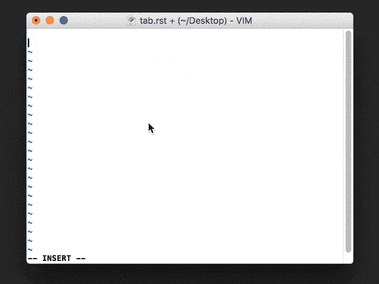

# 表格(+)重组文本

> 原文：<https://dev.to/atorin/tables--restructuredtext-1m6n>

*这篇文章摘自我在个人博客* 上发表的一篇文章。

# 里面有什么

*   RST +桌子+ Vim
*   Sphinx +表格+ PDF 输出
*   HTML 表格-> RST 表格

# RST +牌桌+ Vim

我喜欢 Vim(实际上是， [MacVim](http://macvim-dev.github.io/macvim/) )，当我第一次开始使用 [reStructuredText](http://docutils.sourceforge.net/rst.html) (RST)文档时，我希望找到一个好的插件来加快我的编辑速度。手动创建表格特别痛苦！

当然，有人已经找到了解决方案...输入 **Riv** ！

Riv 是一个很棒的插件，有很多快捷方式让你处理 RST 文件时更轻松。在我看来，Riv 最好的一点是它处理表创建的方式。您只需按 tab 键即可创建单元格，当您修改内容时，表格会在您退出编辑模式时自动调整形状。

给你几个快捷键(在 MacOS 上):

*   `tab`:移动到下一个单元格

*   `option + enter`:创建标题行

*   `control + enter`:创建新的常规行

[T2】](https://res.cloudinary.com/practicaldev/image/fetch/s--LLCT-9yJ--/c_limit%2Cf_auto%2Cfl_progressive%2Cq_66%2Cw_880/http://www.albertotorin.it/blog-files/rst-tables-with-riv-opt.gif)

如果你尝试 Riv，不要忘记安装 [InstantRst](https://github.com/gu-fan/InstantRst) 。这将在您编辑文档时在浏览器中启用实时预览。

# Sphinx +表格+ PDF 输出

如果你写技术文档，迟早你会发现斯芬克斯和 T2 阅读文档。

Sphinx 中的表格可能是一件非常令人沮丧的事情(参见上文！).有时候你有一个很大的表格，用 RST 语法很难表现出来；在其他情况下，该表在 HTML 页面中看起来不错，但在 PDF 输出中却很糟糕。

对于这些情况，我用 Sphinx 创建了一个关于表的简短教程[。](http://http://tables-with-sphinx.readthedocs.io/)

在我看来，最好的选择之一是使用 **CSV 表**。您可以在电子表格中创建您的表格，而无需担心 RST 中的正确格式。

为了处理那些不适合一页的长表格的 PDF 输出，可以使用`longtable`类。然后，使用`tabularcolumns`指令，您可以控制 PDF 中的列宽。

这是一个示例代码片段，用于从一个包含两列的 CSV 文件中呈现一个表格。在[教程](http://tables-with-sphinx.readthedocs.io/en/latest/csv-table.html)中查看结果。

```
 .. tabularcolumns:: |p{1cm}|p{7cm}|

   .. csv-table:: Caption of the table
      :file: path-to-the/file.csv 
      :header-rows: 1 
      :class: longtable
      :widths: 1 1 
```

Enter fullscreen mode Exit fullscreen mode

如果您使用一个[网格表格](http://www.sphinx-doc.org/en/master/rest.html#tables)(上面 GIF 中显示的表格类型)而不是 CSV 表格，经过适当的修改，这种方法也是可行的。

# HTML 表格- > RST 表格

说到表格，如果你从 HTML 中的一个表格开始，你可以使用 [DashTable](https://github.com/doakey3/DashTable) 将其转换为 RST。

这个工具将为您生成一个漂亮的网格表，您可以轻松地复制并粘贴到您的 RST 文件。