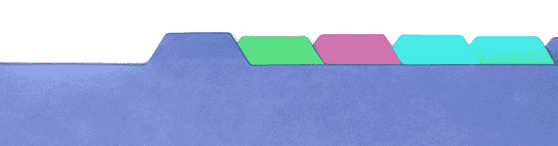
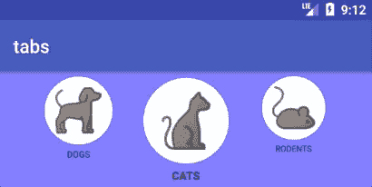

# Android 上的标签导航模式

> 原文：<https://dev.to/brightdevs/tabs---navigation-pattern-on-android-321c>

Android 应用程序中适当的内容组织可以通过多种布局和小部件来实现。今天我想重点谈谈选项卡，即在应用程序中什么样的组件专用于使用选项卡，使用它们的关键原则是什么，以及如何定制它们的视图。

[T4】](https://res.cloudinary.com/practicaldev/image/fetch/s--hXIUMU-b--/c_limit%2Cf_auto%2Cfl_progressive%2Cq_auto%2Cw_880/https://thepracticaldev.s3.amazonaws.com/i/myekfaw3sohq0trv8u6f.jpg)

## 基本概念

标签是一种普通而简单的模式，它超越了手机或网络应用程序的设计。为了避免过度使用它，我们需要对它的用法做一些澄清。

【目的】什么？

主要功能是让用户了解备选视图，并能够在它们之间频繁切换。它可以帮助组织数据集(音乐>摇滚，流行，爵士，摇摆)或具有相似方面的视图(音乐>全部，最近，推荐)。

**不是为了什么？**

具有深度导航结构的应用或具有单一核心功能的应用。对应用程序进行这样的分类可能不容易，但它不适合大多数情况。

如果我们开始设计一个选项卡布局，首先让我们定义一些我们将遵循的原则。在开始实现之前说出来并牢记在心可能很重要。

> 每个标签应该同等重要

有时可能会有点混乱，但尽量把它带到基础。有个小例子:

好用法:恐怖、喜剧、惊悚、剧情

坏用法:博客、商店、联系我们、关于

> 遵循布局原则

即使我们要定制我们的视图，有一些点我们永远不会打破。我知道你可能不同意一些人的观点，但是在我看来，这些是让布局清晰易懂的原因。首先，将选项卡显示为单行，可以是水平的也可以是垂直的。其次，总是突出显示一个选中的标签，这样用户就知道他们在应用程序中的位置。第三，不要嵌套标签。第四，调整选项卡名称或视图以适应其内容，因此照片部分的前导选项卡的名称为“照片”，而不是例如“记录”。

> 保持标签设计的一致性

在两种情况下可能会有问题。一个是标签的大小，应该和每一个都差不多。你应该避免在标签页中使用冗长的描述，因为一个单词的标签页更容易相互调整大小。第二个是，如果你决定使用文本标签以外的东西，比如图像，你应该保留每个标签的样式，不要把图像标签和文本标签结合起来。它带来了不必要的混乱。

上面的概念应该非常普遍，不仅适用于 Android 应用程序。从现在开始让我们写一些代码吧！这将是非常 Android 特有的！

## 默认用法

首先，为了使用`android.support.design.widget.TabLayout`，将设计支持依赖关系添加到`build.gradle` :

```
compile 'com.android.support:design:__NEWEST_VERSION_HERE__' 
```

Enter fullscreen mode Exit fullscreen mode

然后我们可以将 TabLayout 定义到布局 XML 中。TabLayout 最基本的用法是将其用作任何其他视图容器:

```
<android.support.design.widget.TabLayout
        android:id="@+id/myTabLayout"
        android:layout_height="wrap_content"
        android:layout_width="match_parent">

        <android.support.design.widget.TabItem
            android:text="DOGS"
            android:layout_height="wrap_content"
            android:layout_width="wrap_content" />

        <android.support.design.widget.TabItem
            android:text="CATS"
            android:layout_height="wrap_content"
            android:layout_width="wrap_content" />

    </android.support.design.widget.TabLayout> 
```

Enter fullscreen mode Exit fullscreen mode

请注意，只有 TabItem 实例可以添加到 TabLayout 中。

然后，为了在选项卡被选中时执行一些操作，我们必须在选项卡布局之外添加一个监听器:

```
myTabLayout.addOnTabSelectedListener( object : TabLayout.OnTabSelectedListener{
            override fun onTabReselected(tab: TabLayout.Tab?) {}

            override fun onTabUnselected(tab: TabLayout.Tab?){}

            override fun onTabSelected(tab: TabLayout.Tab?) {
                Toast.makeText(applicationContext,tab!!.text,Toast.LENGTH_SHORT).show()
            }

        }) 
```

Enter fullscreen mode Exit fullscreen mode

在`onTabSelected`方法中，我们可以访问选定的选项卡及其所有视图元素，例如文本。非常有用的是一个`position`字段，它可以用作不同容器的索引或另一个视图的引用。

#### 以编程方式添加选项卡

要以编程方式添加选项卡，而不是将其定义到 xml 中，只需使用`addTab()`方法。要添加包含单个文本的标签，只需简单地定义如下:

```
val tab = myTabLayout.newTab()
tab.text = "DOGS"
myTabLayout.addTab(tab) 
```

Enter fullscreen mode Exit fullscreen mode

#### 自定义选项卡视图

有趣的部分是最终添加了一些更有趣的标签视图，而不是只使用文本。让我们把文字和一些好看的图片结合起来！像这样:

[T2】](https://res.cloudinary.com/practicaldev/image/fetch/s--86RYVjok--/c_limit%2Cf_auto%2Cfl_progressive%2Cq_auto%2Cw_880/https://thepracticaldev.s3.amazonaws.com/i/bgmg5omo8bp374hds2p4.png)

在`res/drawable` :
下为我们的图像定义一个圆形背景

```
<shape xmlns:android="http://schemas.android.com/apk/res/android"
    android:shape="oval">
    <solid android:color="#ffffff" />
    <size
        android:width="48dp"
        android:height="48dp" />
</shape> 
```

Enter fullscreen mode Exit fullscreen mode

然后`res/layout`下的`custom_tab.xml`

```
<LinearLayout xmlns:android="http://schemas.android.com/apk/res/android"
    android:layout_width="wrap_content"
    android:layout_height="wrap_content"
    android:orientation="vertical"
    android:background="#888"
    android:layout_marginTop="10dp"
    android:layout_marginStart="10dp"
    android:gravity="center">

    <ImageView
        android:padding="15dp"
        android:id="@+id/tabImage"
        android:layout_width="wrap_content"
        android:layout_height="wrap_content"
        android:scaleType="centerInside"
        android:background="@drawable/white_circle" />

    <TextView
        android:paddingTop="5dp"
        android:id="@+id/tabText"
        android:layout_width="wrap_content"
        android:layout_height="wrap_content"
        android:textColor="#000"
        android:textSize="12sp" />

</LinearLayout> 
```

Enter fullscreen mode Exit fullscreen mode

再次在`drawable`下添加一些你想用于标签的图片。假设他们是`dog.png`和`cat.png`。现在，添加一个带有自定义布局的整洁标签将像上次一样简单。

```
val tab = LayoutInflater.from(applicationContext).inflate(R.layout.custom_tab, null)
tab.tabImage.setImageResource(R.drawable.dog)
tab.tabText.text = "DOG"
myTabLayout.addTab(myTabLayout.newTab().setCustomView(tab)) 
```

Enter fullscreen mode Exit fullscreen mode

## 小花式定制

最后，我想和你分享一下我对 TabLayout 视图的看法，你可以从中获得一些灵感。这是它看起来的样子:

[T2】](https://res.cloudinary.com/practicaldev/image/fetch/s--dJ8CW7_n--/c_limit%2Cf_auto%2Cfl_progressive%2Cq_66%2Cw_880/https://thepracticaldev.s3.amazonaws.com/i/h4ab85qiccio43g3zuq0.gif)

为了实现这一点，我们需要覆盖一些 TabLayout 功能！这是我们将要开始的:

```
class SlideLayout @JvmOverloads constructor(
        context: Context,
        attrs: AttributeSet? = null,
        defStyleAttr: Int = 0) : TabLayout(context, attrs, defStyleAttr) {

      init {
        addOnTabSelectedListener(object : TabLayout.OnTabSelectedListener {

            override fun onTabSelected(tab: TabLayout.Tab) {
                tab.customView?.tabText?.setTypeface(null, Typeface.BOLD)
            }

            override fun onTabUnselected(tab: TabLayout.Tab) {
                tab.customView?.tabText?.setTypeface(null, Typeface.NORMAL)
            }

            override fun onTabReselected(tab: TabLayout.Tab) = Unit

        })
    }

} 
```

Enter fullscreen mode Exit fullscreen mode

最简单的改变是当选项卡被选中时，使其文本加粗。我们需要`addOnTabSelectedListener`,在这里我们可以实现选项卡的选择行为。然后就像上面一样涂一个`typeface`！在 XML 定义中用下列属性删除高亮:

```
<com.bob.tabs.SlideLayout
    ...
    app:tabIndicatorHeight="0dp" 
```

Enter fullscreen mode Exit fullscreen mode

第一步完成了。

#### 居中制表符

接下来我们要做的是显示标签页，选中的标签页在中间。将此属性添加到 XML 定义:

```
<com.bob.tabs.SlideLayout
    ...
    app:tabMode="scrollable" 
```

Enter fullscreen mode Exit fullscreen mode

它将允许标签在屏幕上移动。因此，选择不同的选项卡将滚动整个布局，并且如果剩余的选项卡填充屏幕的剩余部分，则在中心显示所选择的一个。这意味着前几个和后几个选项卡不会居中，而是与父视图的边缘对齐。但是！我们可以改变它！在`onLayout`方法中，让我们做一些数学计算。我们将在第一个和最后一个选项卡上添加填充，所以它总是在中间，这就是我们如何计算它:

```
override fun onLayout(changed: Boolean, l: Int, t: Int, r: Int, b: Int) {
    super.onLayout(changed, l, t, r, b)

    val lastTabIndex = getTabContainer()?.childCount?.minus(1) ?: 0
    val firstTab = getTabView(0)
    val lastTab = getTabView(lastTabIndex)

    if (firstTab != null && lastTab != null) {
        val paddingLeft = width / 2 - firstTab.width / 2
        val paddingRight: Int = width / 2 - lastTab.width / 2

        ViewCompat.setPaddingRelative(getTabContainer(), paddingLeft, 0, paddingRight, 0)
    }
} 
```

Enter fullscreen mode Exit fullscreen mode

这些是一些辅助方法:

```
private fun getTabContainer(): ViewGroup? = getChildAt(0) as? ViewGroup
private fun getTabView(position: Int): View? = getTabContainer()?.getChildAt(position) 
```

Enter fullscreen mode Exit fullscreen mode

#### 调整大小

现在是最后一个功能！让我们调整标签远离中心时的大小，这样我们就可以得到标签在传送带上的印象。定义一些缩放倍率和帮助数组:

```
private val MAX_ZOOM = 1.0f
private val MIN_ZOOM = 0.6f
private var screenPos = IntArray(2) 
```

Enter fullscreen mode Exit fullscreen mode

然后再做一次数学！这一次我们需要覆盖`onDraw`方法:

```
override fun onDraw(canvas: Canvas) {

        getTabContainer()?.let {
            for (i in 0 until it.childCount) {
                getTabView(i)?.let {

                    it.getLocationOnScreen(screenPos)
                    val pos = screenPos[0]
                    val width = it.width

                    val scale: Float
                    val tabCenter = pos + width / 2

                    if (tabCenter <= 0 || getWidth() <= tabCenter) {
                        scale = MIN_ZOOM
                    } else {
                        val sliderCenter = (getWidth() / 2).toFloat()
                        val distance = Math.abs(sliderCenter - tabCenter)
                        scale = MAX_ZOOM - (MAX_ZOOM - MIN_ZOOM) * distance / sliderCenter
                    }

                    /* View draw start in left top corner */
                    it.pivotY = 0f

                    it.scaleX = scale
                    it.scaleY = scale

                }
            }
        }

        super.onDraw(canvas)
    } 
```

Enter fullscreen mode Exit fullscreen mode

在计算选项卡缩放多少的时候，我们需要定义我们的选项卡离中心(`sliderCenter`)有多远(`distance`)。基于我们选择，在`MIN_ZOOM`和`MAX_ZOOM`之间缩放乘数。

就这样，你的滑动拉环就可以使用了！

[T2】](https://res.cloudinary.com/practicaldev/image/fetch/s--H1Tiu7Om--/c_limit%2Cf_auto%2Cfl_progressive%2Cq_66%2Cw_880/https://thepracticaldev.s3.amazonaws.com/i/kjbzitp3apgrmweeluo8.gif)

你可以在我的 github 账户上找到完整的代码。它包含更多的功能，滚动和停靠标签在中心。可以随意测试，使用，修改！

最初发布于 [brightinventions.pl](https://brightinventions.pl/blog/)

软件工程师拉德克·pieczątkiewicz @光明发明
[电子邮件](//radek.pieczatkiewicz@brightinventions.pl)

#### 参考文献:

1.  [tab/material . io](https://material.io/guidelines/components/tabs.html)
2.  [塔布莱尤特/developer.android.com](https://developer.android.com/reference/android/support/design/widget/TabLayout.html)