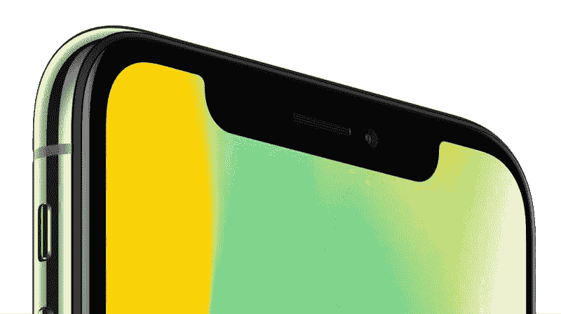
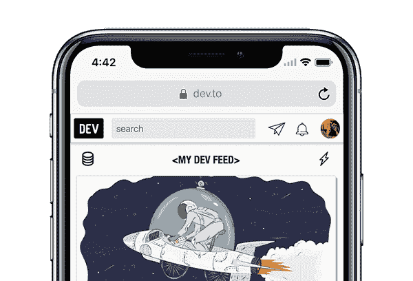
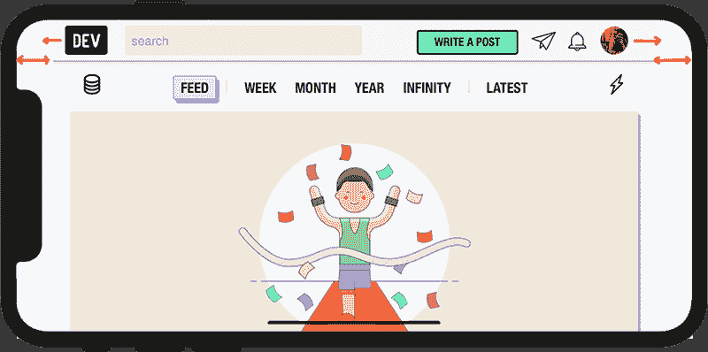
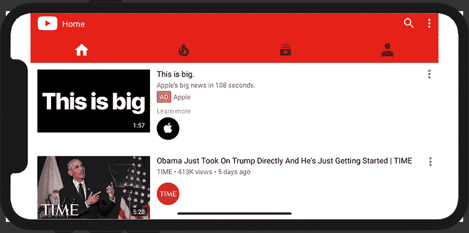
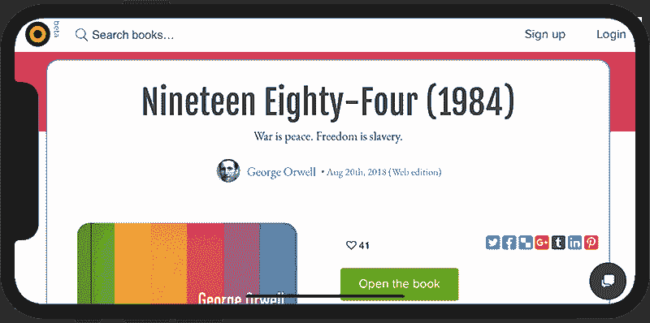
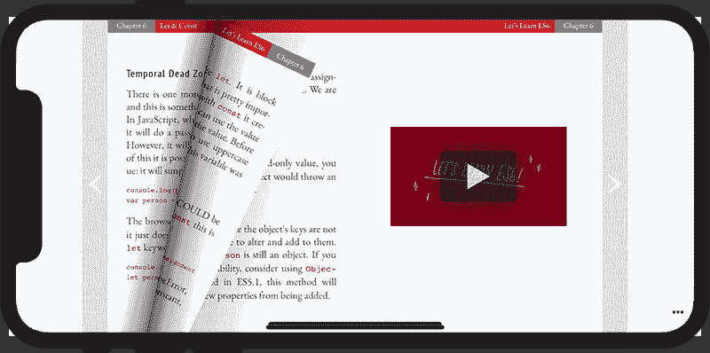

# 让你的网络开发技能更上一层楼

> 原文：<https://dev.to/marvindanig/take-your-web-development-skills-a-notch-higher-2cge>

如果你喜欢 iPhone X、XS、XR 或 XS Max 上的凹槽，请举手！🙋🏻‍♀️🙋
[](https://res.cloudinary.com/practicaldev/image/fetch/s--h0G80odQ--/c_limit%2Cf_auto%2Cfl_progressive%2Cq_auto%2Cw_880/https://thepracticaldev.s3.amazonaws.com/i/b08q03geomlfmbcgzfog.png)

好吧，没有多少人举手，但是我确信作为一个开发者，你确实喜欢在你的屏幕上有一些额外的“不动产”可以利用。漂亮的边到边显示屏——嗯，差不多——让边框顶部的凹口对大多数人来说不那么碍眼了。

事实上，对于大多数网站来说，在纵向模式下，这甚至都不是问题。

[T2】](https://res.cloudinary.com/practicaldev/image/fetch/s--8cI5Bisq--/c_limit%2Cf_auto%2Cfl_progressive%2Cq_auto%2Cw_880/https://thepracticaldev.s3.amazonaws.com/i/jep9r6fa1nsc0wkoyply.png)

风景观赏是凹口戳中眼睛的地方。

以 dev.to 为例:

[T2】](https://res.cloudinary.com/practicaldev/image/fetch/s--6k5PVSk9--/c_limit%2Cf_auto%2Cfl_progressive%2Cq_auto%2Cw_880/https://thepracticaldev.s3.amazonaws.com/i/kgvldw20kmmcryhzop76.png)

我不确定你是否能清楚地看到图片，但是标题在左右两边都突然结束了，给人一种布局有问题的感觉。这在 Youtube.com 上更真实也更糟糕:

[T2】](https://res.cloudinary.com/practicaldev/image/fetch/s--JmuMBQ3G--/c_limit%2Cf_auto%2Cfl_progressive%2Cq_auto%2Cw_880/https://thepracticaldev.s3.amazonaws.com/i/9ys5giyib03mu9vkafea.png)

糟透了。

这个问题在 Youtube 上感觉特别糟糕，因为我通常在风景模式下观看视频，每次视频结束后，我都会看到这个到处都是血红色的炫目的虫子。🤢

这里需要注意的是，上面讨论的所有网站都将页眉`width`设置为 100%。因此，标题占据整个屏幕宽度是可以理解的。然而事实并非如此。只是像 Safari 这样的浏览器，甚至 iOS 上的 [Chrome v69](https://developers.google.com/web/updates/2018/09/nic69#notch) 都引入了这些白条，给你的页面增加了一点额外的空白，这样内容就不会被缺口遮住了。

他们称之为利润。

# 输入 viewport-fit meta 标签和 CSS 环境变量。

这里有一个简单的方法来利用所有多余的空间。要让浏览器扩展到显示剪切区域，将`viewport-fit`属性设置为`cover`，如下:

```
<meta name='viewport' content='initial-scale=1, viewport-fit=cover'> 
```

Enter fullscreen mode Exit fullscreen mode

这应该可以了，尤其是顶部的`sticky`标题。如果你想使用整个屏幕区域，但同时避免内容在凹槽下，使用`css`环境变量，比如:

```
 .content {
  padding: 16px;
  padding-left: env(safe-area-inset-left);
  padding-right: env(safe-area-inset-right);
}

/* Basically there are four CSS rule options to handle 
   the notch from all four sides of the iPhone. I don't 
   recommend using them though!

padding: env(safe-area-inset-top) 
         env(safe-area-inset-right) 
         env(safe-area-inset-bottom) 
         env(safe-area-inset-left);

*/ 
```

Enter fullscreen mode Exit fullscreen mode

另一种正确解决内容主体左右填充的方法是简单地使用`@media-query`的`width`定义，比如:

```
 @media only screen and (orientation: portrait) {
    body {
        .shrink {
            width: 95%;        
        }
    }
}

@media only screen and (orientation: landscape) {
    body {
        .shrink {
            width: 90%;      // Shrink a little extra to avoid the notch.
        }
    }
}

.center {
    text-align: center;
    margin: 0 auto;
} 
```

Enter fullscreen mode Exit fullscreen mode

然后在你的 HTML 中，`main`容器元素可以和`css`类`shrink center`放在一起，通过一个规则定义跨*所有*设备和*所有*视口工作。我更喜欢这样做，以避免使用像`safe-area-insets`这样的特定于设备的方法。

```
<header>
    <!--Sticky header with 100% width across and above the notch -->
<header>
<main class="shrink center">
    <!-- Body goes here -->
</main>
<footer>
    <!-- Full screen width under the notch -->
</footer> 
```

Enter fullscreen mode Exit fullscreen mode

这就是 Bubblin 超级本如何从 Apple Watch 扩展到 iPad、台式机，一直到电视机。🎩

使用`JavaScript`还有一些其他奇特的解决方案，但不推荐使用。过度杀戮。较少的代码意味着更好的可维护性。同样，CSS = >越少，可伸缩性越强。

[T2】](https://res.cloudinary.com/practicaldev/image/fetch/s--MBCXqUN---/c_limit%2Cf_auto%2Cfl_progressive%2Cq_auto%2Cw_880/https://thepracticaldev.s3.amazonaws.com/i/pqksv766pnuwd3csyb4s.png)

[T2】](https://res.cloudinary.com/practicaldev/image/fetch/s--W1d874QL--/c_limit%2Cf_auto%2Cfl_progressive%2Cq_auto%2Cw_880/https://thepracticaldev.s3.amazonaws.com/i/4wo5tvmrk9o5k5dxwtln.png)

伙计们，现在就到这里吧。保持冷静。❤️

* * *

在推特或 [Github](https://github.com/marvindanig) 上关注我。

这篇文章最初出现在[泡泡博客](https://bubblin.io/blog/notch)