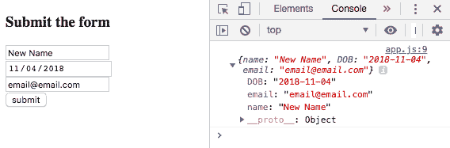

# 接受意见:用我自己的话说

> 原文：<https://dev.to/rjdoughty/taking-in-an-input-in-my-own-words-4fap>

因为我的上一篇博客是关于输入的，所以我想我应该继续写一篇关于如何从表单中获取和控制台记录值的文章。为了完成，我们将用 JavaScript 编写一个函数来接受表单值。jQuery 是一个 JavaScript 函数库，它可以使工作变得更加容易。

让我们从 HTML 文件开始，向上周创建的输入添加 id。我还在 HTML 文件所在的文件夹中创建了一个 JS 文件(app.js)。我现在去掉了复选框(我稍后会讨论)。不能忘记使用脚本标签和源(src)属性将 JS 文件和 jQuery 链接到 html 文件。

```
<body>
    <h3>Submit the form</h3>
    <form>
        <input id="name" type="text" name="name" placeholder="name"/><br>
        <input id="date" type ="date" name="birthdate"/><br>
        <input id="email" type="email" name="email" placeholder="name@email.com"/><br>
        <input id="submit" type ="submit" value="submit">
    </form>

    <script src="https://code.jquery.com/jquery.js"></script>
    <script src="app.js"></script>
</body> 
```

我们将在 app.js 文件中添加函数来接收输入。jQuery 允许我们使用“$”作为方法`$(‘#id’)`，在类或 id 上放置一个监听器。我们可以添加 jQuery 方法`.on()`,它接收一个事件(动作)和一个处理程序(函数),当在 id `$(‘#id’).on(‘action’, function);`上进行动作时，处理程序将被完成。

出于我们的目的，我将使用 id `‘submit’`将监听器添加到提交输入/按钮；使用`‘click’`作为动作；并将创建一个函数`submitUser`来接收输入值。

```
 $('#submit').on('click', submitUser); 
```

所以`$('#submit').on('click', submitUser)`调用 submitUser 函数，并在单击 submit 时接受值。

接下来，我将创建一个函数(submitUser)来接收输入值。在函数内部，我设置了一个等于对象的常量(user)。在对象内部，我为每个输入设置了一个属性，并分配了键“name、DOB 和 email”

```
const submitUser = function() {
    const user = {
        name: $('#name').val(),
        DOB: $('#date').val(),
        email: $('#email').val()
    }
    console.log(user);
} 
```

jQuery 方法`.val()`允许我们从表单元素中获取值。`$('#id')`我们为每个输入的 id 添加一个监听器，并添加`.val()`方法来接收函数中的每个输入`$('#id').val()`，我们添加`console.log(user)`来确认对象已经被捕获。

如果您在浏览器和控制台中打开此页面并尝试使用此功能，您会注意到在提交数据时，它会短暂地出现在控制台中，然后消失，表单会重置。jQuery 有另一个方便的内置方法`preventdefault()`,我们可以将它添加到函数中，并传入事件来阻止默认动作的发生。

```
const submitUser = function(event) {
    event.preventDefault();

    const user = {
        name: $('#name').val(),
        DOB: $('#date').val(),
        email: $('#email').val()
    }
    console.log(user);
} 
```

现在，当我们在控制台打开的情况下提交表单时，我们可以看到对象出现在控制台中。我们现在可以根据需要存储和处理这些数据。
[T3】](https://res.cloudinary.com/practicaldev/image/fetch/s--Dyz4qVAL--/c_limit%2Cf_auto%2Cfl_progressive%2Cq_auto%2Cw_880/https://thepracticaldev.s3.amazonaws.com/i/n47d6q8kobyxhlw7vy7p.png)