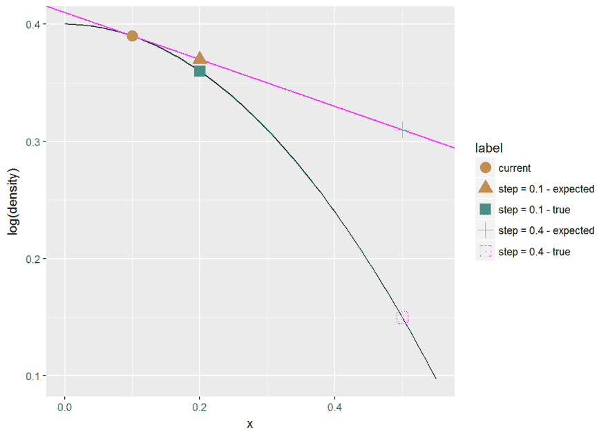
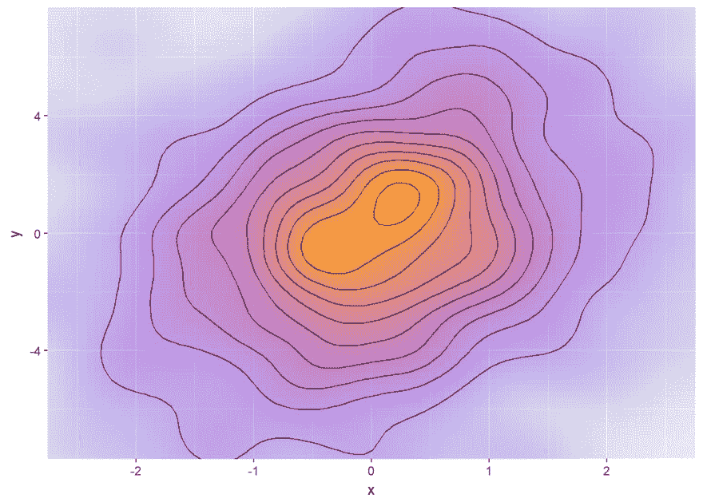
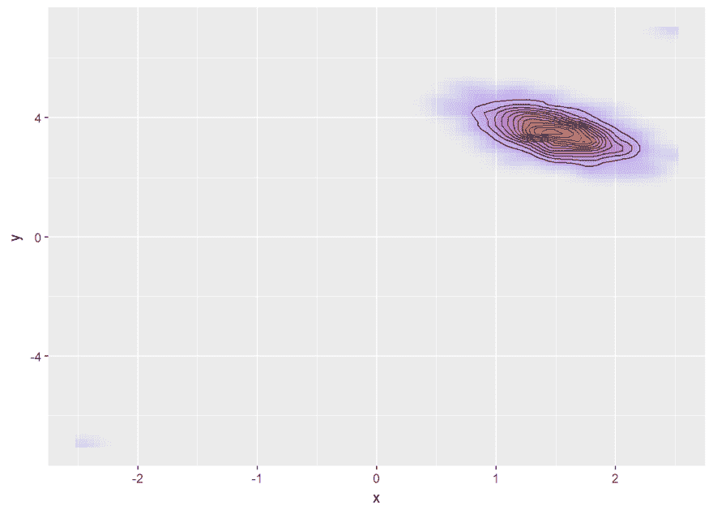
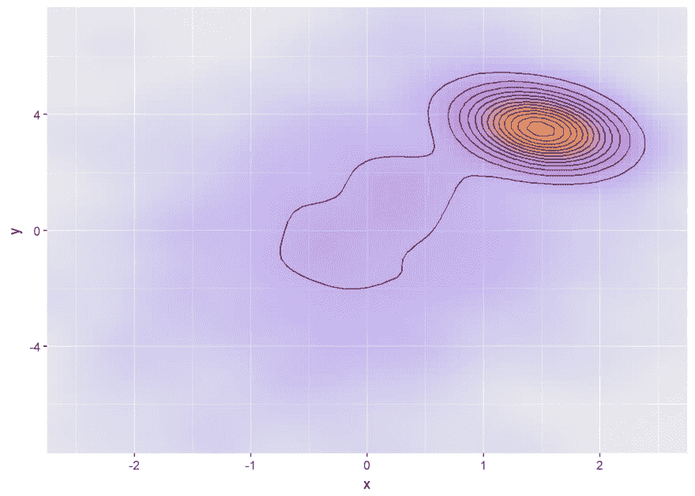
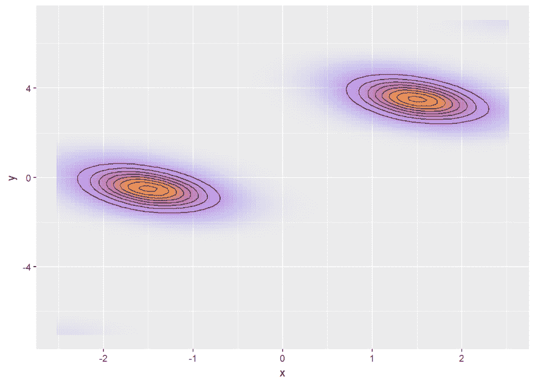
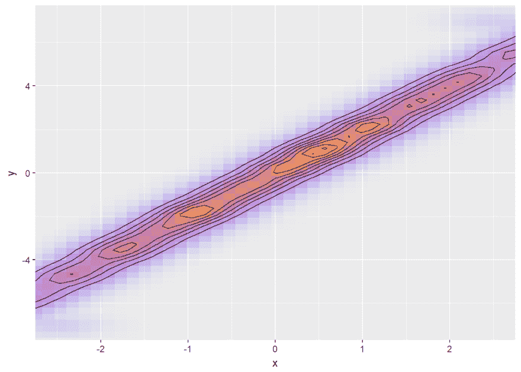
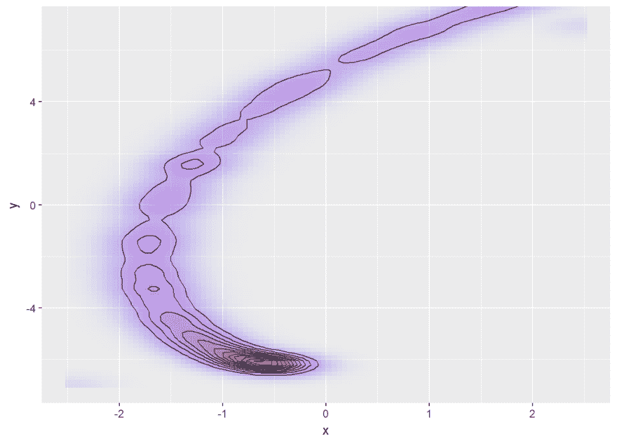

# 斯坦模型中的驯服分歧

> 原文：<https://dev.to/martinmodrak/taming-divergences-in-stan-models-5762>

虽然我用 Stan 语言进行统计计算的时间很愉快，但是用 Stan 建模时有一件事并不有趣。这是可怕的警告信息:

```
There were X divergent transitions after warmup. 
Increasing adapt_delta above 0.8 may help. 
```

现在一旦你增加了`adapt_delta`却无济于事，你该怎么办？背离(以及最大树深和低 BFMI 警告)告诉你你的模型有问题，但没有确切告诉你是什么问题。诊断融合问题的技巧和策略有很多，但是目前，这些技巧和策略分散在 [Stan 文档](http://mc-stan.org/users/documentation/)、[话语](http://discourse.mc-stan.org/)和[旧邮件列表](https://groups.google.com/forum/#!forum/stan-users)中。在这里，我将尝试把在某个时候帮助过我的所有技巧集中到一个地方，供未来绝望的建模者参考。

# 攻略

我不想让你久等，所以下面列出了我曾经用来诊断和/或补救分歧的所有策略:

1.  检查您的代码。两次。分歧几乎可能是编程错误的结果，因为它们是一个真正的统计问题。所有参数都有先验吗？你的数组索引和 for 循环匹配吗？

2.  用所有参数的已知真值创建模拟数据集。它对很多事情都有用(包括检查编码错误)。如果模拟数据中的误差消失，您的模型可能不适合实际观察到的数据。

3.  检查你的前科。如果模型在你的先验的尾部或者在参数约束的边界上大量采样，这是一个不好的信号。

4.  观想:使用 [`bayesplot`](https://cran.r-project.org/web/packages/bayesplot/index.html) 包中的`mcmc_parcoord`，使用`rstan`包中的[【希尼斯坦】](https://cran.r-project.org/web/packages/shinystan/index.html)和`pairs`。【Stan 警告的文档(包含一些提示)[案例研究-诊断多级模型](http://mc-stan.org/users/documentation/case-studies/divergences_and_bias.html)， [Gabry 等人 2017 -贝叶斯工作流中的可视化](https://arxiv.org/pdf/1709.01449.pdf)

5.  确保你的模型是*可识别的* -不可识别性和/或多模态性(后验分布的多个局部最大值)是一个问题。[案例研究-混合模型](http://mc-stan.org/users/documentation/case-studies/identifying_mixture_models.html)。

6.  使用`test_grad`选项运行 Stan。

7.  *重新参数化*您的模型，使您的参数独立(不相关)并接近 N(0，1)(也称为改变实际参数并在`transformed parameters`块中计算您感兴趣的参数)。

8.  尝试*非居中参数化* -这是重新参数化的一个特例，它非常有用，值得拥有自己的子弹。[案例研究——诊断多级模型](http://mc-stan.org/users/documentation/case-studies/divergences_and_bias.html)，[贝当古&吉罗拉米 2015](https://arxiv.org/pdf/1312.0906)

9.  将参数移动到`data`块，并将其设置为真实值(来自模拟数据)。然后把它们一个个放回`paremters`块。哪个参数会引起问题？

10.  引入以真实参数值为中心的紧密先验。先验需要多严密才能让模型符合？有助于识别多模态。

11.  多玩一点`adapt_delta`、`stepsize`和`max_treedepth`。[例子](http://singmann.org/hierarchical-mpt-in-stan-i-dealing-with-convergent-transitions-via-co%20ntrol-arguments/)

在接下来的几周里，我希望能够就上面的一些要点提供单独的帖子，并给出一个例子。在这篇介绍性的文章中，我将试着为你提供一些什么是发散背后的几何直觉。

# 在我们钻研之前

**警告:** *我不是统计学家，我对 Stan、坚果取样器和其他技术细节的了解有限，所以我的一些断言可能是错误的。如果你发现错误，请纠正我。*

确保遵循[标准最佳实践](https://github.com/stan-dev/stan/wiki/Stan-Best-Practices)。特别是，**从一个简单的模型**开始，确保它能工作，然后一步一步地增加复杂性。我真的不能重复这一点。老实说，我自己经常不遵循这个建议，因为仅仅是写下完整的模型就太有趣了。老实说，这总是让我感到难过，浪费了很多时间。

还要注意，直接翻译来自 JAGS/bug 的模型经常会失败，因为 Stan 需要不同的建模方法。Stan 开发人员亲身经历了一些 JAGS 模型产生错误的结果，甚至在 JAGS 也不收敛，但是在他们将他们的输出与 Stan 的结果进行比较之前，没有人注意到这一点。

# 什么是发散？

遵循 Stan 手册:

> 当通过哈密尔顿值偏离其初始值来测量模拟的哈密尔顿轨迹偏离真实轨迹时，发散出现。

这到底意味着什么？哈密顿量是后验密度和辅助动量参数的函数。辅助参数通过构造表现良好，所以问题几乎总是在后验密度。请记住，由于数值原因，斯坦使用后验密度的对数(也称为:`log_prob`、`__lp`和`target`)。NUTS 采样器每次迭代执行几个离散步骤，并由密度梯度引导。经过一些简化，采样器假设当前点的对数密度近似为线性，即参数的微小变化将导致对数密度的微小变化。如果步长足够小，这个假设大致正确。让我们在一维示例中查看两种不同的步长:

[](https://res.cloudinary.com/practicaldev/image/fetch/s--P5HkP7eR--/c_limit%2Cf_auto%2Cfl_progressive%2Cq_auto%2Cw_880/http://www.martinmodrak.cz/post/2018-03-01-strategies-for-diverging-stan-models_files/figure-html/unnamed-chunk-1-1.png) 采样器从红点开始，黑线是对数密度，洋红色线是梯度。当向右移动 0.1 时，采样器预计对数密度线性下降(绿色三角形)，尽管实际对数密度下降更多(绿色正方形)，但差异很小。但是当向右移动 0.4 时，预期值(蓝色十字)和实际值(粉色十字方块)之间的差异会变得更大。这是一种类似的巨大差异，被视为背离。在预热过程中，Stan 会尝试将步长调整得足够小，以避免出现发散，但又要调整得足够大，以提高采样效率。但是如果参数空间表现不好，这可能是不可能的。为什么？无畏的读者，继续读下去。

## 2D 的例子

让我们试着在 2D 参数空间中建立一些几何直觉。请记住，采样是与相关后验密度成比例地探索参数空间，或者换句话说，是在零平面和密度(概率质量)定义的表面之间的体积上均匀地探索。为了简单起见，我们将忽略斯坦实际做的对数变换，在本文的其余部分直接讨论密度。想象后验密度是一个平滑宽阔的山丘:

[ ](https://res.cloudinary.com/practicaldev/image/fetch/s--_sezOPLk--/c_limit%2Cf_auto%2Cfl_progressive%2Cq_auto%2Cw_880/http://www.martinmodrak.cz/post/2018-03-01-strategies-for-diverging-stan-models_files/figure-html/unnamed-chunk-2-1.png) Stan 通过在随机方向上移动穿过后部来开始每次迭代，然后让密度梯度优先引导移动到密度高的区域。为了有效地探索这座山，我们需要在这个过程中采取相当大的步骤——如果样本链能够以少量的步骤(实际上最多`2^max_treedepth`步)穿过整个后部，那么它将代表后部井。因此，平均步长大约为 0.1 可能是合理的，因为后验概率在这个尺度上近似为线性。我们需要在中心周围多花一点时间，但不是那么多，因为有很多体积也靠近边缘-它的密度较低，但它是一个更大的区域。

现在想象一下，后半部分要清晰得多:

[](https://res.cloudinary.com/practicaldev/image/fetch/s--Gq4gyoEA--/c_limit%2Cf_auto%2Cfl_progressive%2Cq_auto%2Cw_880/http://www.martinmodrak.cz/post/2018-03-01-strategies-for-diverging-stan-models_files/figure-html/unnamed-chunk-3-1.png) 现在我们需要小得多的步子才能安全地探索。步长为 0.1 是行不通的，因为后验概率在这个尺度上是非线性的，这会导致发散。然而，采样器能够适应并相应地选择较小的步长。Stan 要做的另一件事是重新调整后验概率较窄的维度。在上面的例子中，后验概率在`y`中更窄，因此该维度将被膨胀以大致匹配`x`中的扩散。请记住，Stan 单独重新调整每个维度(后验矩阵由对角矩阵转换)。

现在，如果后面是一个“平滑的山”和一个“尖锐的山”的组合呢？

[](https://res.cloudinary.com/practicaldev/image/fetch/s--Gy_pkyHg--/c_limit%2Cf_auto%2Cfl_progressive%2Cq_auto%2Cw_880/http://www.martinmodrak.cz/post/2018-03-01-strategies-for-diverging-stan-models_files/figure-html/unnamed-chunk-4-1.png) 采样器大约一半的时间要花在“尖山”，另一半的时间要花在“平山”，但是那些区域需要不同的步长，采样器只取一个步长。也没有办法重新调整尺寸来补偿。适应“平滑山”区域的链将在“尖锐山”区域中经历分叉，适应“尖锐山”的链将不能有效地在“平滑山”区域中移动(这将作为超过最大树深度的转变而被发出信号)。然而，后一种情况不太可能，因为“光滑的山”更大，链更可能从那里开始。我*认为*这就是为什么这类问题大多表现为分歧，而不太可能表现为超过最大树深。

这只是多模态后验概率损害抽样的众多原因之一。即使所有模式都相似，多模态也是有问题的，另一个问题是在模式之间遍历可能需要比在每个模式内探索大得多的步长，如下例所示:

[T2】](https://res.cloudinary.com/practicaldev/image/fetch/s--hSFb0CaF--/c_limit%2Cf_auto%2Cfl_progressive%2Cq_auto%2Cw_880/http://www.martinmodrak.cz/post/2018-03-01-strategies-for-diverging-stan-models_files/figure-html/unnamed-chunk-5-1.png)

我敢打赌 Stan devs 会添加大量的其他原因来解释为什么多模态对你不好(确实如此)，但是我会在这里停下来，转到其他可能的分歧来源。

后几何可能有问题，即使它是单峰的。典型的例子是漏斗，它经常出现在多级模型中:

[同样，没有办法独立地重新调整每个维度来选择性地“拉伸”峰周围的区域。类似的问题也出现在与单模结合的恒定或几乎恒定密度的大区域。](https://res.cloudinary.com/practicaldev/image/fetch/s--RL64jcTe--/c_limit%2Cf_auto%2Cfl_progressive%2Cq_auto%2Cw_880/http://www.martinmodrak.cz/post/2018-03-01-strategies-for-diverging-stan-models_files/figure-html/unnamed-chunk-6-1.png)

最后但同样重要的是，让我们看看变量之间的紧密相关性，这是一个不同但常见的问题:

[](https://res.cloudinary.com/practicaldev/image/fetch/s--iHMJWUgp--/c_limit%2Cf_auto%2Cfl_progressive%2Cq_auto%2Cw_880/http://www.martinmodrak.cz/post/2018-03-01-strategies-for-diverging-stan-models_files/figure-html/unnamed-chunk-7-1.png) 问题是，如果我们在脊的方向上移动，我们需要大的步长，但是当我们在那个方向的切线方向上移动时，我们需要小的步长。同样，Stan 无法重新缩放后部来进行补偿，因为缩放`x`或`y`本身会增加脊的宽度和长度。

当两个变量之间的关系不是线性的时，事情变得更加阴险:

[T2】](https://res.cloudinary.com/practicaldev/image/fetch/s--1ZkzLjgK--/c_limit%2Cf_auto%2Cfl_progressive%2Cq_auto%2Cw_880/http://www.martinmodrak.cz/post/2018-03-01-strategies-for-diverging-stan-models_files/figure-html/unnamed-chunk-8-1.png)

这里，一个好的步长是位置(峰值附近较小)和方向(沿螺旋方向时较大)的函数，使得这种后验很难采样。

## 大图

这一切都很模糊和民间。记住这些例子只是为了提供直觉。要做到 100%正确，你需要查阅[坚果论文](http://www.jmlr.org/papers/volume15/hoffman14a/hoffman14a.pdf)和/或[HMC 概念介绍论文](https://arxiv.org/abs/1701.02434)并钻研数学。数学总是正确的。

特别是所有上述几何形状**可能**对坚果来说很难，在视觉上看到它们暗示了可能的问题，但是它们**可能**也处理得很好。事实上，如果斯坦在二维空间中处理任何东西，我都不会感到惊讶。根据我的经验，形成宽脊的弱线性相关性也很可能被很好地采样，即使是在更高维的情况下。当不可忽略密度的区域在某些方向非常窄而在其他方向非常宽时，问题就出现了，并且单独重新调整每个维度不会有帮助。最后，请记住，我们讨论的后验对于 Gibbs 或其他旧的采样器来说更加困难——Gibbs 甚至不会让你知道有问题。

# 爱你的分歧

关于偏差的惊人之处在于，本质上是一个数值问题实际上预示着一系列可能严重的建模问题。庆幸吧——很少有算法(在任何领域)有如此明确的信号表明事情出错了。这也是为什么你应该对你的结果持怀疑态度，即使只有一个单一的分歧被报道-你不知道什么是隐藏在你的部分后，目前的步长无法达到。

目前就这些。希望在未来看到你与实际发散斯坦模型的例子。