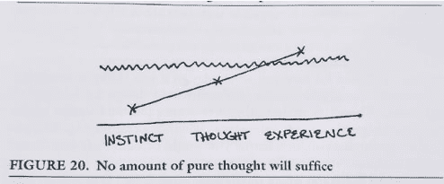

# 软件开发中的 TDD 实例(上)

> 原文：<https://dev.to/apium_hub/tdd-example-in-software-development-part-i-5bjn>

过了一会儿，我考虑了应该写什么类型的 TDD 文章，因为有很多这样的文章，而且都是很好的理论文章(由软件开发领域的有影响力的人写的)，我选择开发一个迷你项目，同时解释应用程序开发的要点，基本上是给你一个 TDD 的例子。

该应用程序将是一个 notes manager，用户可以看到我们如何使用 [TDD](https://apiumhub.com/tech-blog-barcelona/advantages-of-test-driven-development/) 测试应用程序的每一层。

我想强调的是，这篇文章的目的是看看 TDD 将如何帮助我们开发干净的代码，向您展示 TDD 将如何为我们提供一个连续的设计空间。

## 理论

首先，让我们复习一下基础知识，以确保我们所有人在理论上是一致的。首先也是最重要的是，TDD 和[单元测试](https://apiumhub.com/tech-blog-barcelona/top-benefits-of-unit-testing/)是两码事。TDD 是一个基于在设计我们的应用程序时尽可能快地获得反馈的开发过程，而单元测试是一个证明“单元”按预期工作的工具。

单元测试的定义有些模糊，人们迷失在定义中，尤其是在“[单元](https://martinfowler.com/bliki/UnitTest.html)的部分。人们认为单元是一个函数或一个类，但事实并非如此，单元指的是一个功能/用例。该功能可能涉及几个方法/实体之间的通信。

然而，TDD 并不含糊，它是基于两个非常简单的规则，遵循它们将引导我们走上正确的道路:

1.  只有当我们有一个单元测试失败时才写代码。重构/消除重复

## TDD

TDD 机制很简单，编写一个测试来证明我们想要实现的功能如预期的那样工作(一个用例)，然后编写尽可能少的代码来进行测试。一旦我们有了绿色，删除重复和重构。简单。

TDD 是一种快速反馈机制，是一个人开发红绿重构的循环，以及它所基于的三个法则:

1.在编写失败的单元测试之前，您不能编写任何产品代码。

2。你不能写多于一个足以失败的单元测试，不编译就是失败。

3。您不能编写超过足以通过当前失败的单元测试的生产代码。

我们都知道在代码中有一个 bug 而没有发现它是痛苦的，但是更痛苦的是当你在测试中有一个 bug 时。测试给你绿灯，你信任测试，你看到的代码看起来不错，但是当你改变生产代码，产生一个真正的错误，你不明白为什么，在哪里和如何…时间的损失和失望的程度，当这种情况发生时是残酷的。在 TDD 周期中，当我们看到红色的测试并把它变成绿色时，我们控制我们的测试确实做了它应该做的事情，避免了这种类型的问题。

## 绿色条形图案

有一些特定的模式可以帮助我们以最快的方式将测试绿色化

**1。假它**

返回一个常数并通过变量逐渐改变它们。使用这种技术，我们将采取许多小步骤，尽可能快地完成测试

*TDD 示例:*

```
 expect(suma(1,2)).toEqual(3);

  function suma(a,b) {return 3} 
```

一旦它显示为绿色，我们就进入重构阶段，在这种情况下，我们将删除重复。在这种情况下，重复的不是代码，而是数据，我们有乍看之下看不到的重复数据，这一点小小的改变会更好:

```
 expect(suma(1,2)).toEqual(3);

  function suma(a,b) {return 1+2} 
```

我们放了 3 个，但我们想做的是 1 + 2，这是我们作为参数传递给函数的相同数字，现在我们看到了重复，我们将删除它:

```
 expect(suma(1,2)).toEqual(3);

  function suma(a,b) {return a+b} 
```

搞定了。稍后，我们将向您解释如何用更保守的技术获得相同的实现。

**2。显而易见的实现**

该技术基于实现我们认为我们知道的东西，并尽快确认它是正确的。这往往会导致更少的测试，起初你可能认为这是积极的，因为你走得更快，但这并不是真的，因为在重构阶段，如果你没有测试 SUT 的所有规范，你可能会在没有注意到的情况下破坏一些东西。

对于显而易见的实现，我们所寻求的(或者更确切地说，我们所得到的)是通过跳过一个非常重要的步骤来加速周期，并且监听我们的测试。当我们看到一个测试，它是红色的，我们被迫问自己我们应该如何实现它，我们怀疑我们的解决方案，但我们有一个机制来告诉我们是否做得对或错。对于显而易见的实现，这一步，我们跳过它，直接进入我们头脑中的实现部分，我们可以在实现算法后编写测试，我们会得到相同的结果。

当实现不仅仅是显而易见的，而且是微不足道的时候，建议应用这种技术，在这种情况下，规范更少，失败的风险更小，即使如此，我们也必须始终非常小心。

简而言之，你将如何实现简单的操作？简单地实现它们。

*TDD 示例:*

```
 expect(suma(1,2)).toEqual(3);

  function suma(a,b) {return a+b} 
```

**3。三角测量**

正如 Kent Beck 在他的书 [TDD By Example](https://www.amazon.com/dp/0321146530/ref=cm_sw_r_cp_ep_dp_DuCABbHJ7RW9A) 中所说，三角形是实现我们正在寻找的实现的最保守的技术，他是对的。第一个是相同的假它，我们写一个测试，并把它放在绿色返回一个常数。下一件事是进行重构，但我们现在不打算这么做，让我们的测试显示为绿色，我们要做的是编写另一个测试，让它显示为红色:

*TDD 示例:*

```
 expect(suma(1,2)).toEqual(3);
  expect(suma(3,4)).toEqual(7);

  function suma(a,b) {return 3} 
```

现在我们有两条路:

*   开发实现，使两个测试显示为绿色
*   用一个比真正的实现更简单的实现继续返回常数

```
 > function suma(a,b) {if(a===1) return 3 else return 7} 
```

一旦我们有了我们的实现，我们可以考虑消除我们用于实现的测试，我们可能已经创建了多余的测试，但这取决于每个案例和每个人。

## 用什么手法？

嗯，这是个人主观的东西，是随着经验而发展的东西。贝克在书中说，我们必须实现的是快速开发 rythm，红/绿/持续重构，如果你知道你要开发什么，使用明显的实现。如果你不知道，用假的，如果你陷入设计，结束三角测量。

在 [Apiumhub](/) (通过电子邮件、开放空间和午餐时间的非正式会谈)的几次内部辩论之后，如何把它变成绿色是个人的事情(尽管假 it /三角测量通常是最常用的技术)，但是如果我们得出一个明确的结论，我们不应该在没有测试的情况下留下任何规范，这是很容易跳过的明显的实现。

## 反馈:TDD 示例

TDD 是一个我们可以快速获得关于我们设计的反馈的过程(我会根据需要重复多次)，反馈将通过自动化测试给我们，那么我们需要多少次测试来确保我们的代码工作？有人可能会认为，开发时的信心是知道何时停止做测试要考虑的因素，尽管它有其重要性，但它是非常主观的东西。我们如何将这种主观性转化为客观性？正如我们已经提到的，一个测试必须覆盖一个规范，如果我们有一个针对我们头脑中所有规范的测试，我们就将个人信心的主观性转化为业务层面的信任。

让我们强调一下，TDD 是作为敏捷方法([极限编程](http://www.extremeprogramming.org/))中的一个过程而诞生的，需求可能会改变，新的需求可能会出现，等等，需求是在整个开发周期中被发现的，甚至一旦它被上传到产品中，新的需求也可能被发现。

当我们发现一种情况(这种情况很少),在这种情况下[我们认为我们完全了解]实现，这是微不足道的，我们盲目信任，我们会花一些时间编写测试来涵盖规范。但是没有借口说它花费你额外的时间，因为或者你有 TDD 的经验或者你没有。如果您有经验，您将直接编写测试，如果您没有经验，实践是理解 TDD 的唯一方法。你可以大量阅读，找到 TDD 的例子和案例研究，对 TDD 有积极的看法，但是经验是唯一能让你与众不同的东西。

*[](https://apiumhub.com/wp-content/uploads/2018/08/image-2.png)T4】*

*图片来源: [XP 解释](https://www.amazon.es/dp/0321278658/ref=cm_sw_r_cp_ep_dp_evRABb12CAH6G)T3】*

如果你想了解更多关于 TDD 的信息或者得到另一个 TDD 的例子，我强烈推荐你点击[这里](http://eepurl.com/cC96MY)订阅我们的每月时事通讯。

## 如果你觉得这篇关于 TDD 例子的文章很有趣，你可能会喜欢…

[Scala 泛型 I: Scala 类型界限](https://dev.to/apium_hub/scala-generics-i--scala-type-bounds-38)

[Scala generics II:协方差和逆变](https://dev.to/apium_hub/scala-generics-ii-covariance-and-contravariance-in-generics-5dib)

[Scala generics III:通用类型约束](https://dev.to/apium_hub/scala-generics-iii-generalized-type-constraints-58km)

BDD:用户界面测试

[Scala 中泛型类型的 F-bound](https://apiumhub.com/tech-blog-barcelona/f-bound-scala-generics/)

[微服务 vs 整体架构](https://apiumhub.com/tech-blog-barcelona/microservices-vs-monolithic-architecture/)

[“几乎无限”的可扩展性](https://apiumhub.com/tech-blog-barcelona/almost-infinite-scalability/)

[iOS Objective-C app:成功案例研究](https://dev.to/apium_hub/protected-ios-objective-c-app-cornerjob-successfull-case-study-89e)

[年度移动应用开发趋势](https://dev.to/apium_hub/mobile-app-development-trends-of-the-year)

[Banco Falabella 可穿戴设备案例研究](https://apiumhub.com/tech-blog-barcelona/banco-falabella-wearable-ios-android/)

[移动开发项目](https://apiumhub.com/software-projects-barcelona/)

[面向 iOS 应用的 Viper 架构优势](https://apiumhub.com/tech-blog-barcelona/viper-architecture/)

[为什么是科特林？](https://dev.to/apium_hub/why-kotlin-language-android-why-did-google-choose-kotlin--639)

[软件架构会议](https://dev.to/apium_hub/apiumhub-software-architecture-meetups-in-barcelona-31df)

[安卓纯 MVP](https://dev.to/apium_hub/pure-model-view-presenter-in-android-1736)

[在 Java 中使用 Vavr 功能更强](https://dev.to/apium_hub/be-more-functional-in-java-with-vavr-5b4i)

软件开发(第一部分)中的 [TDD 示例这个帖子最早出现在](https://apiumhub.com/tech-blog-barcelona/tdd-example-software-development/) [Apiumhub](https://apiumhub.com) 上。