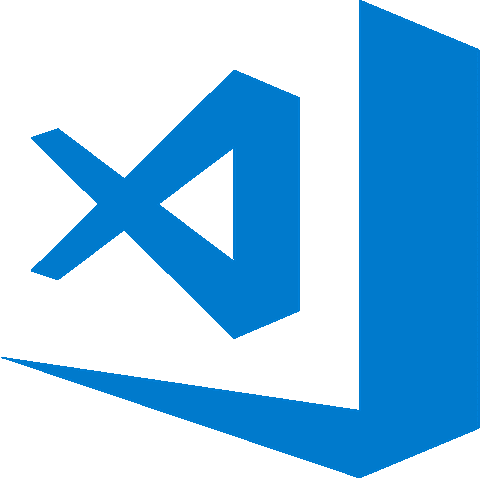
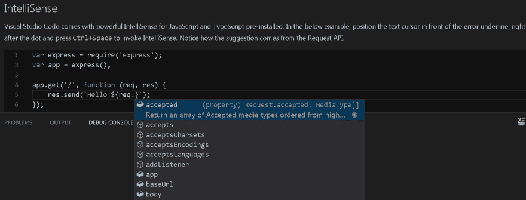
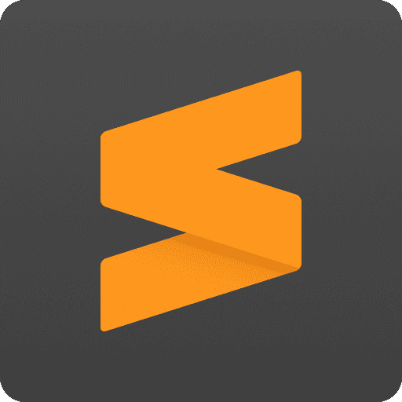

# 拆卸:Visual Studio 代码 VS . Sublime(JavaScript 焦点)

> 原文：<https://dev.to/couellet/teardown-visual-studio-code-vs-sublime-javascript-focus-2424>

[T2】](https://res.cloudinary.com/practicaldev/image/fetch/s--9iAeVNv3--/c_limit%2Cf_auto%2Cfl_progressive%2Cq_auto%2Cw_880/https://snipcart.com/media/203619/vscodevssublime.jpg)

不同的项目需要不同的工具。开发人员必须[选择正确的](https://snipcart.com/blog/startup-tech-stack)，这在这个快节奏的环境中不是一个小任务。

你的第一个选择——选择代码编辑器——是至关重要的。

在这篇文章中，我想探究其中的两个， **Visual Studio Code** 和 **Sublime Text** ，并帮助你做出决定。

你会问，为什么是这两个？因为:

1.  他们是目前最受欢迎的两个代码编辑器。
2.  他们是我们团队用得最多的。

我将介绍这两种方法，并比较它们的优点和局限性。

然后，我将用一整节的篇幅来介绍 VS 代码的 JavaScript 开发。前端开发人员，你可能想留在最后一个！

### 什么是 Visual Studio 代码？

[VS 代码](https://code.visualstudio.com/)是微软在 2015 年发布的。**它是跨平台的、开源的、完全免费的。**

但是不要让它的年轻欺骗了你:它发展得非常快，已经有了一个广泛的扩展和插件社区。

[T2】](https://res.cloudinary.com/practicaldev/image/fetch/s--vIZn07Zu--/c_limit%2Cf_auto%2Cfl_progressive%2Cq_auto%2Cw_880/https://snipcart.com/media/203620/vscode.png)

这是我们的开发团队在日常工作中使用最多的代码编辑器。但我保证会保持公正。；)

当问开发人员为什么选择 VS Code 作为他们的主要编辑器时，同样的特征经常出现:**精简、可定制、轻便&快速。**

一些关键功能也有助于它如此受欢迎。首先，它的超级智能感知为许多语言提供了最好的自动完成发现。

[T2】](https://res.cloudinary.com/practicaldev/image/fetch/s--UWRM2i7m--/c_limit%2Cf_auto%2Cfl_progressive%2Cq_auto%2Cw_880/https://snipcart.com/media/203618/vscode_intellisense.png)

它对调试的支持(主要是对 Node.js 和 JavaScript 的支持，我将在后面谈到)也减轻了开发人员可能会经历的许多痛苦。

没听过的话，[。NET 是我们在 Snipcart 的开发栈中的一个重要部分。尽管旧的 Visual Studio 可能更适合老年人。NET 解决方案，VS 代码是一个极好的匹配。网芯。](https://snipcart.com/blog/why-dot-net-technologies)

在不破坏这篇文章结尾的情况下，VS 代码也是 JavaScript 前端开发的一个非常可行的匹配...

总而言之，Visual Studio 代码是一个很棒的工具。我们的团队向任何喜欢微调代码环境的开发人员推荐它。

它庞大的扩展库可以在这里找到，在 [Visual Studio Marketplace](https://marketplace.visualstudio.com/) 中。

### 什么是崇高的文字

[Sublime](https://www.sublimetext.com/) 是一个比较成熟的代码编辑器，已经有十几年的历史了。它是由前谷歌工程师乔恩·斯金纳于 2007 年发布的。它自称为**,一个复杂的代码、标记和散文文本编辑器。**

同样是跨平台的，Sublime 不是免费的，价格是 80 美元/许可。

[T2】](https://res.cloudinary.com/practicaldev/image/fetch/s--nbAneE1r--/c_limit%2Cf_auto%2Cfl_progressive%2Cq_auto%2Cw_880/https://snipcart.com/media/203608/sublime.png)

与 VS Code 非常相似，Sublime 在性能和定制方面获得了很多好评。

有人说它是编写代码最快的文本编辑器。不仅在一般性能上，而且在任意数量的文件上运行快速搜索。它之所以能达到这样的性能水平，是因为它非常、非常轻。

总的来说，Sublime 是一个伟大的万能平台，它的速度和稳定性肯定会让任何开发者满意。

这里列出了它的所有扩展，在[包控制](https://packagecontrol.io/)中。

* * *

→在此阅读完整对比