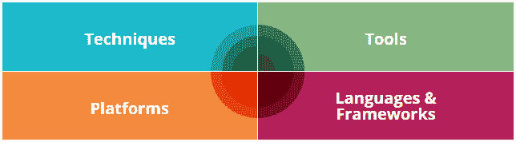

# ThoughtWorks 的技术雷达第 19 卷

> 原文：<https://dev.to/elmuerte/technology-radar-vol19-by-thoughtworks-5fpd>

每年 [ThoughtWorks](https://www.thoughtworks.com) 都会发布他们的 **[技术雷达](https://www.thoughtworks.com/radar)** 的新版本。这个技术雷达是他们认为有趣的软件开发工具、技术、框架和平台的概述。这些项目被映射到不同的级别:采用、跟踪、评估和保持。

我不打算解释这个雷达是如何工作的，因为他们自己做得很好。我只是想提醒你一个新的版本出来了，你应该去看看。它会给你一些你可能不知道的东西。如果有什么困难的话，那就是找出并评估软件开发世界中的所有不同部分。

[T2】](https://www.thoughtworks.com/radar)