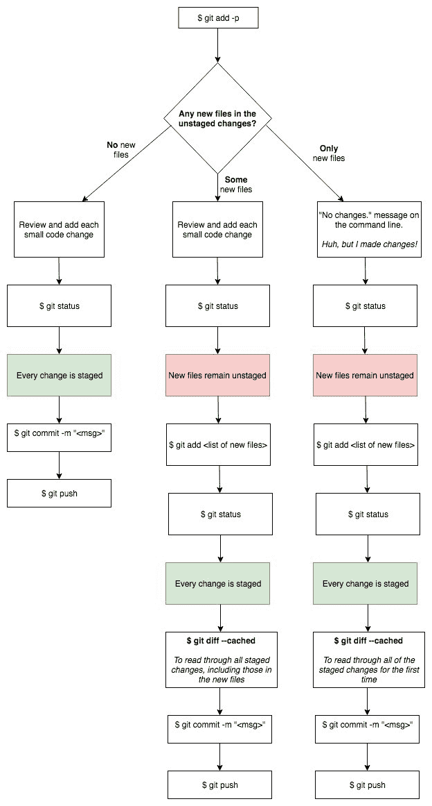
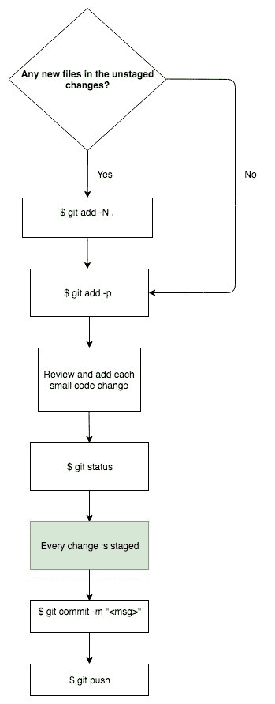

# 告诉 Git 你的意图

> 原文：<https://dev.to/nodunayo/tell-git-your-intentions-201a>

你的 Git 工作流程是怎样的？

我会给你看我的过去 5 年，然后几周前，一切都变了。

为了简单起见，让我们假设我的回购协议中有一些未分级的更改，并且所有这些更改都适合我的下一次提交。我总是从 git add -p 开始，一次一小块地检查所有的更改:

 

<figcaption>旧 Git 工作流程——新文件让事情变得‘复杂’</figcaption>

当只涉及一个新文件时，看看我的流程。你注意到事情变得多尴尬了吗？我也失去了用新文件部分添加更改的好处——在添加更改后，我只能扫描所有的更改。上面的流程图假设了幸福的道路。通常，我只想提交一些东西，而不想提交其他的，所以我必须返回并检查一些添加的更改。

几周前，我在添加了一些新文件后查看一个缓存的 diff，我意识到我没有仔细阅读这些更改就对它们进行了分页。我对自己的失误感到失望，对工作流程感到沮丧。这不是我第一次发现自己这么做。

人们经常谈论 Git 有多强大。考虑到这一点，这个工作流程似乎不必要的尴尬。一定有更好的办法。因此，在使用同样的工作流程 5 年后，我决定求助于谷歌来寻找更好的方法。我输入“部分添加新文件 git”，这时我发现了我的新好友:

> -N，— intent-to-add 仅记录稍后将添加路径的事实。该路径的一个条目被放在没有内容的索引中。这对于用 git diff 显示此类文件的未暂存内容以及用 git commit -a 提交它们非常有用。

这意味着，如果我准备好提交一个新文件，我可以键入 git add -N，然后对该文件执行 git add -p。

所以，下面是我的新 Git 工作流的样子:

 

<figcaption>一个精简的新 Git 工作流程</figcaption>

那不是好多了吗？

使用- intent-to-add 选项，我的所有文件现在都受到 VIP(非常重要的部分添加)处理，这意味着更少的错误和更好的提交。

你怎么想呢?您以前听说过“意向添加”选项吗？

如果你正在看我的工作流程，并想出一个新的方法来进一步提高它，那么请与我联系。我是推特上的[@ nodunayo](https://twitter.com/nodunayo)。