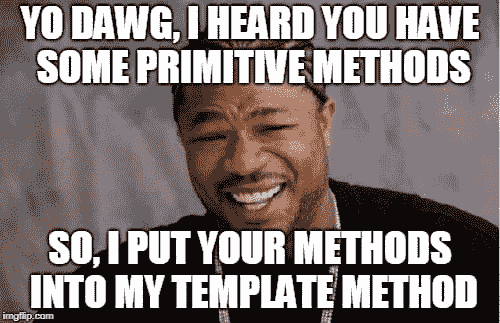
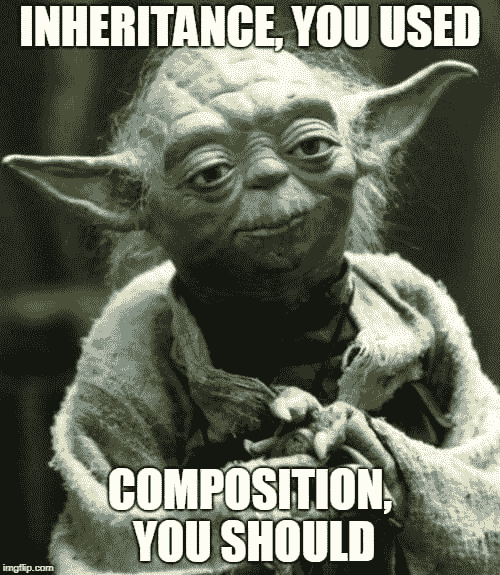
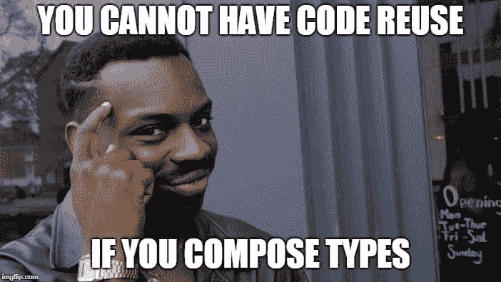
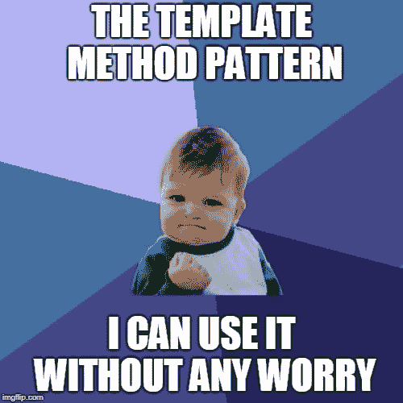

# 模板方法模式已修订

> 原文：<https://dev.to/riccardo_cardin/template-method-pattern-revised-3od3>

*原贴于:[大泥球](http://rcardin.github.io/)T3】*

当我开始编程时，有一种设计模式让我惊讶于它的有效性。这个模式就是模板方法模式。当我继续我的开发生涯时，我开始理解这种模式的轻率使用会导致一个大麻烦。问题是这种模式通过类继承促进了代码重用。随着函数式编程成为主流，可以使用 lambda 表达式修改这种模式，避免任何继承恐慌。

## 原始图案

现在是 2004 年。Martin Fowler 刚刚发表了一篇最受欢迎的帖子[控制容器的反转和依赖注入模式](https://martinfowler.com/articles/injection.html) (IoC)。该模式是著名的*好莱坞原则*的具体化，该原则指出

> 请勿来电；我们会通知你

那些年的每个 Java 框架都实现了那个原则:Struts、Spring MVC、Hibernate 等等。然而，国际奥委会并不是一个新鲜的想法。它源于四人组*中一个著名的设计模式，即*模板方法模式*。*

该模式的意图如下。

> 在操作中定义算法的框架，将一些步骤推迟到子类。模板方法允许子类在不改变算法结构的情况下重新定义算法的某些步骤。

嗯，看起来很有希望。我觉得还是举个具体的例子比较好。这个例子直接取自 GoF 的书。

考虑一个提供`Application`和`Document`类的应用程序框架。`Application`类负责*打开*以外部格式存储的现有文档，比如一个文件。然而，`Document`对象表示从文件中读取的文档信息。

因此，我们的目标是用这些类创建一个结构，以便能够轻松地添加新类型的文档。

在我们的例子中， *open* 算法由以下任务组成。

1.  检查文档是否可以打开
2.  创建文档的内存表示
3.  最终，进行初步操作
4.  阅读文件

将此转换成一些脏代码，我们获得了下面的类。

```
trait Application {
  // Template method
  def openDocument(fileName: String): Try[Document] = {
    Try {
      if (canOpen(fileName)) {
        val document = create(fileName)
        aboutToOpen(document)
        read(document)
        document
      }
    }
  }
  // Hook method
  def aboutToOpen(doc: Document) = { /* Some default implementation */ 34}
  // Primitives operations
  def canOpen(fileName: String): Boolean
  def create(fileName: String): Document
  def read(doc: Document)
} 
```

Enter fullscreen mode Exit fullscreen mode

如您所见，方法`openDocument`定义了打开文档所需算法的*模板*。为此，它被称为*模板方法*。然而，所有其他方法都是抽象的，或者为任务提供默认实现。前者称为*原始操作*；后者被称为*钩操作*，取而代之。

实现一个可以打开 CSV 文件的应用程序意味着扩展`Application`特征，正确地实现被保留为抽象的方法。

```
class CsvApplication() extends Application {
  def canOpen(fileName: String): Boolean = { /* Some implementation */ }
  def create(fileName: String): Document = { /* Some implementation */ }
  def read(doc: Document) = { /* Some implementation */ }
} 
```

Enter fullscreen mode Exit fullscreen mode

[T2】](https://res.cloudinary.com/practicaldev/image/fetch/s--ZNhIViEN--/c_limit%2Cf_auto%2Cfl_progressive%2Cq_auto%2Cw_880/https://i.imgflip.com/27j995.jpg)

### 弊端

原始模板方法模式的主要结果之一是**代码重用**。在这篇博客中，我们不喜欢代码重用。在[依赖](http://rcardin.github.io/programming/oop/software-engineering/2017/04/10/dependency-dot.html)的帖子中，我们了解到我们应该避免代码重用而支持*行为重用*。代码重用导致了类之间依赖性的增加，产生了组件紧密耦合的架构。

不好。真的很糟糕。

此外，模板方法模式的滥用倾向于生成*具体*类的深层层次。让我们回到我们的例子。有一天，你的老板要求你扩展上面的代码来处理多种类型的存储。他希望软件能够从本地文件系统和云中读取，或者从像 HDFS 这样的分布式文件系统中读取。

你觉得很简单。我们已经有了一个基本方法，`create` ( `read`是用来将字节解组到面向对象的结构中的)，我可以覆盖它以允许我的程序从任何存储中读取。你是一个聪明的男孩。

```
class CsvApplication() extends Application { /* ... */ }
class CsvOnHDFSApplication() extends Application { 
  /* ... */ 
  override def create(fileName: String): Document = { /* Some implementation */ }
}
class CsvOnCloudApplication() extends Application { 
  /* ... */ 
  override def create(fileName: String): Document = { /* Some implementation */ }
}
// And so on... 
```

Enter fullscreen mode Exit fullscreen mode

在某些时候，你需要改变`CsvApplication`中的`canOpen`。不幸的是，新的实现不符合`CsvOnCloudApplication`类中的行为。然后，您还需要覆盖这个类中的`canOpen`方法。有一天，你将不得不在你的层次结构中的其他类中改变另一个基本方法的实现。这个故事会一遍又一遍地重复。

你看出问题了吗？你错过了你的类的可维护性。您不知道哪个行为是在哪个类中实现的。每次修改一个类，都很难预测还需要修改哪些类。

此时我们能做什么？我们有哪些选择？

> 优先选择对象组合而不是类继承

上面的*格言*，由 GoF 创造，提醒我们每次使用面向对象编程语言开发东西时应该指导我们的原则之一。

[T2】](https://res.cloudinary.com/practicaldev/image/fetch/s--_epCn2z3--/c_limit%2Cf_auto%2Cfl_progressive%2Cq_auto%2Cw_880/https://i.imgflip.com/27j94u.jpg)

## 模板方法模式:正确的方式

不难想象我们将如何改变原来的模式来使用组合，而不是继承。我们将把包含在*原始方法*中的所有行为提取到专用类中。因此，在我们的例子中，我们可以识别以下类型。

```
// Subtypes of this trait give access to different types of storages
trait Storage {
  def openDocument(fileName: String): Try[Document]
  def canOpen(fileName: String): Boolean
  def create(fileName: String): Document
}
// Different types of file format can be read simply defining 
// subtypes of this trait
trait Reader {
  def read(doc: Document): Document
} 
```

Enter fullscreen mode Exit fullscreen mode

这样，我们原来的模板类型就变成了下面这样。

```
class Application(storage: Storage, reader: Reader) {
  def openDocument(fileName: String): Try[Document] = {
    Try {
      if (storage.canOpen(fileName)) {
        val document = storage.create(fileName)
        storage.aboutToOpen(document)
        reader.read(document)
      }
    }
  }  
} 
```

Enter fullscreen mode Exit fullscreen mode

哇哦。我们不再需要抽象类型了！我们也不需要使用类继承！在`Application`类的实例化过程中，一切都可以使用对象组合来解决。

```
val hdfsCsvApplication = new Application(new HdfsStorage(), new CsvReader())
val cloudCsvApplication = new Application(new CloudStorage(), new CsvReader())
// And so on... 
```

Enter fullscreen mode Exit fullscreen mode

另外，我们减少了整体架构的依赖性，避免了所有那些烦人的子类。

### 可编程模板法

大多数现代编程语言都具有一等公民的功能。模板方法模式的一个变体使用 lambdas 作为基本方法的实现。我喜欢称之为*可编程模板方法*。

正如约书亚·布洛赫在《有效的 Java》第三版中所写的:

> *模板方法模式*..]远没有那么吸引人。现代的替代方法是提供一个静态工厂或构造函数，它接受一个函数对象来达到同样的效果。

诀窍是在对象实例化期间传递函数来代替原始方法。所以，让我们把我们最初的`Application`特征变成一个具体的类，在构造过程中接收一些函数作为输入。

```
class Application(
  // Functions used to 'program' the behavior of the application
  canOpen: String => Boolean,
  create: String => Document,
  read: Document => ()
) {
  // Template method
  def openDocument(fileName: String): Try[Document] = {
    Try {
      if (canOpen(fileName)) {
        val document = create(fileName)
        aboutToOpen(document)
        read(document)
        document
      }
    }
  }
  def aboutToOpen(doc: Document) = { /* Some default implementation */ 34}
}

val app = new Application(
    (filename: String) => /* Some implementation */,
    (filename: String) => /* Some implemenation */,
    (doc: Document) => /* Some implementation */
  ) 
```

Enter fullscreen mode Exit fullscreen mode

这样，您不必为每个要实现的行为声明新的类型，只需创建一个 lambda 表达式，并在对象创建期间将其传递给构造函数。

[T2】](https://res.cloudinary.com/practicaldev/image/fetch/s--tyIdR5s5--/c_limit%2Cf_auto%2Cfl_progressive%2Cq_auto%2Cw_880/https://i.imgflip.com/27kw8q.jpg)

### 斯卡拉道

到目前为止，一切顺利。我们都知道 Scala 语言可以比简单的对象组合做得更好。Scala 有一些非常强大的构造，允许我们使用一些更智能的模板方法模式。

#### Mixins

我们要使用的第一个构造是 Scala *mixins* 。混合是用来组成一个类的特征。使用 mixins，我们可以在不使用继承的情况下向类中添加一些代码。这是一个与作文非常相似的概念。

修改我们在这篇文章中提出的第一个`Application`特征，我们也可以用这种方式使用 mixins 来实现模板方法。

```
trait Application {
  def openDocument(fileName: String): Try[Document]
  def canOpen(fileName: String): Boolean
  def create(fileName: String): Document
  def aboutToOpen(doc: Document) = { /* Some default implementation */ 34}
  def read(doc: Document)
}
// Hdfs storage implementation
trait HdfsStorage {
  def openDocument(fileName: String): Try[Document] = /* HDFS implementation */
  def canOpen(fileName: String): Boolean = /* HDFS implementation */
  def create(fileName: String): Document = /* HDFS implementation */
}
// Csv reader implementation
trait CsvReader {
  def read(doc: Document): Document = /* CSV implementation */
}
// Creating the application using the proper implementations
val hdfsCsvApplication = new Application with HdfsStorage with CsvReader 
```

Enter fullscreen mode Exit fullscreen mode

如您所见，我们可以在另一个特征的实例化过程中混合任何特征。我们用 mixins 实现了组合，用一种本地的方法。

#### 函数编程:currying 和局部应用

在函数式方法启发了我们之后，我们许多人放弃了面向对象的道路。模板方法模式在函数式编程中也有价值吗？在某种程度上，答案是肯定的。

在函数式编程中，有一种技术叫做*curry*。“currying”这个名字来自数学家哈斯克尔·库里，他是第一个使用这种技术的人。

> Currying 转换一个多参数函数，以便它可以作为一个单参数函数链来调用

为了简单起见，让我们取一个对两个整数求和的函数。

```
def sum(a: Int, b: Int): Int = a + b 
```

Enter fullscreen mode Exit fullscreen mode

然后，使用 currying，我们可以从`sum`得到它的 curryfied 形式。

```
def curryfiedSum(a: Int)(b: Int): Int = a + b 
```

Enter fullscreen mode Exit fullscreen mode

如果我们只将第一个参数传递给`curryfiedSum`，结果将是一个只剩下一个参数的新函数。用数学术语来说，这个函数被部分应用于 T2。使用这种方法，我们可以快速获得一个新的函数，该函数将 5 和任意整数相加。

```
def sumFive(x: Int): Int = curryfiedSum(5) 
```

Enter fullscreen mode Exit fullscreen mode

好了，现在我们已经给出了必要的背景，我们可以揭示 currying 和部分应用程序与模板方法模式之间的联系。让我们定义一个函数，它重复地将一个 lambda 应用于一组整数。我们可以称之为`aggregate`。使用这个函数，我们可以确定两个新的函数，阶乘 n！以及 n 以内所有数字的总和

```
def aggregate(neutral: Int, op: (Int, Int) => Int)(n: Int): Int =
  if (n == 0) neutral 
  else op(aggregate(neutral, op)(n-1), n)
// Factorial of integers from n to 0
def factorial = aggregate(1, _ * _)_
// Summing integers from n to 0
def sum = aggregate(0, _ + _)_ 
```

Enter fullscreen mode Exit fullscreen mode

如您所见，函数`aggregate`定义了一般算法的主体，而前两个参数定义了算法的可变部分。模板方法和基本操作:这是模板方法模式的相同方法。

你看到了吗？厉害！

## 结论

总之，我们开始展示原始的模板方法设计模式，如 GoF 所示。遵循组合优先于继承的原则，我们强调了最初方法的所有问题。然后，我们带来了一些程序，纠正原来的问题。

使用 composition、lambdas 和 curryfication，我们能够在 21 世纪带来模板方法模式。

[T2】](https://res.cloudinary.com/practicaldev/image/fetch/s--HKpqYQxJ--/c_limit%2Cf_auto%2Cfl_progressive%2Cq_auto%2Cw_880/https://i.imgflip.com/27kxg4.jpg)

## 参考文献

*   [控制容器的倒置和依赖注入模式](https://martinfowler.com/articles/injection.html)
*   [控制反转](https://en.wikipedia.org/wiki/Inversion_of_control)
*   [章:引言(第 20 页)。设计模式，可重用面向对象软件的元素，GoF，1995，Addison-Wesley](http://www.amazon.it/Design-Patterns-Elements-Reusable-Object-Oriented/dp/0201633612)
*   [章节:模板方法模式(第 325 页)。设计模式，可重用面向对象软件的元素，GoF，1995，Addison-Wesley](http://www.amazon.it/Design-Patterns-Elements-Reusable-Object-Oriented/dp/0201633612)
*   第 44 项:支持使用标准的功能接口。《有效的 Java 》,第三版，约书亚·布洛赫，2018，艾迪森-韦斯利专业版
*   [混合类构成](https://docs.scala-lang.org/tour/mixin-class-composition.html)
*   [功能设计模式，第 1 部分](https://www.ibm.com/developerworks/library/j-ft10/)