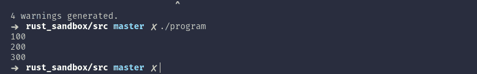

# C 中的模板

> 原文：<https://dev.to/noah11012/templates-in-c-5b94>

**什么？**

你可能在问自己这个问题。别担心，你没有阅读障碍。

这太疯狂了。我们将如何做到这一点？

很简单，通过使用宏。

对于这个例子，我们将使用这个宏模板机制创建一个通用向量。

list.h

```
#pragma once 
#include <stdlib.h> 
typedef struct _BaseList
{
    void *buffer;
    int   index;
    int   length;
    int   capacity;
} BaseList;

#define List(type)         \
    struct                  \
    {                       \
        type *buffer;       \
        int   element_size; \
        int   index;        \
        int   length;       \
        int   capacity;     \
    } * 

BaseList *list_new_  (int size_of_each_element);
void      list_delete(BaseList *list);
void      list_resize(BaseList *list, int new_size);

#define list_new(type) (List (type) ) list_new_(sizeof(type)); 
#define list_push(list, data)    \
    if(list->index > list->length) \
        list_resize(list, list->capacity * 2); \
    list->buffer[list->index++] = data;        \
    list->length++; 
```

我们定义一个叫做`List`的宏。它接受一个名为`type`的参数，并将为每个实例创建一个匿名结构。我们将使用的函数需要一个命名的结构。我称它为`BaseList`,这是函数将要用到的。

注意在`List`宏定义的末尾，有一个星号。如果我们想成功，这很重要。如果我们试图从一个`BaseList`转换成一个匿名结构，c 不会喜欢的。然而，如果我们能把一个指向`BaseList`的指针转换成一个指向匿名结构的指针，它会这样做，但是可能会给你一个警告。

对于 push 函数，创建一个简单的宏更容易。如果空间用完了，我们会分配两倍的空间。我们将数据存储在下一个可用的位置。

list.c:

```
#include "list.h" 
BaseList *list_new_(int size_of_each_element)
{
    BaseList *new_list = malloc(sizeof(*new_list));
    new_list->buffer = malloc(size_of_each_element * 8);

    new_list->index = 0;
    new_list->length = 0;
    new_list->capacity = 8;

    return new_list;
}

void list_resize(BaseList *list, int new_size)
{
    list->buffer = realloc(list->buffer, new_size);
}

void list_delete(BaseList *list)
{
    free(list->buffer);
    free(list);
} 
```

为了使代码更简单，我决定移除错误检查。

现在来测试这个婴儿:

main.cpp

```
#include <stdio.h>
#include "list.h" 

int main(void)
{
    List (int) list_of_ints = list_new(int);

    list_push(list_of_ints, 100);
    list_push(list_of_ints, 200);
    list_push(list_of_ints, 300);

    printf("%d\n%d\n%d\n", list_of_ints->buffer[0], list_of_ints->buffer[1], list_of_ints->buffer[2]);
} 
```

编译并运行。

[T2】](https://res.cloudinary.com/practicaldev/image/fetch/s--FJ8EzZVQ--/c_limit%2Cf_auto%2Cfl_progressive%2Cq_auto%2Cw_880/https://thepracticaldev.s3.amazonaws.com/i/c0b5281ys2f2v9b8n0wr.png)

有用！

当然，你可以对此进行扩展和改进。我希望您喜欢这篇文章，并认为它是对您忘记使用`SDL_Quit()`和没有上传使用 SDL2 的下一期文章的补偿。