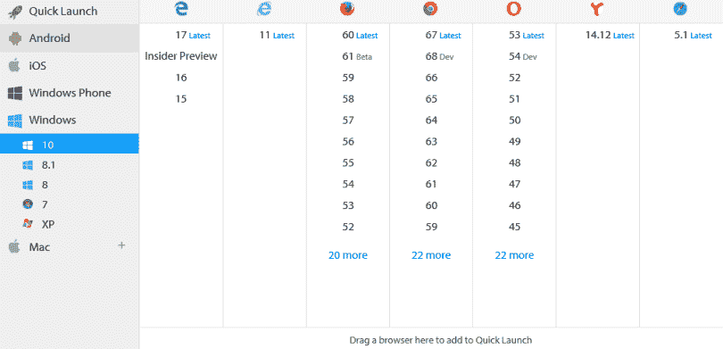
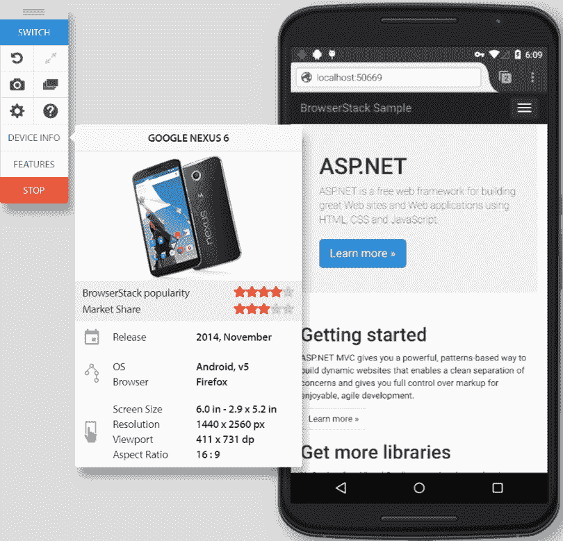

# 通过浏览器堆栈跨浏览器测试您的应用

> 原文：<https://dev.to/ankitvijay/test-your-app-across-the-browsers-through-browserstack-5f0f>

跨平台和跨浏览器测试应用程序并不是一个容易解决的问题。支持不同的版本、操作系统和设备可能是一个极其令人沮丧和耗时的过程。如果你需要支持 IE 9 或 IE 8 这样的传统浏览器，这可能会特别痛苦。

我们可以使用浏览器工具和模拟器来测试，但它们只能在一定程度上有所帮助。它需要昂贵的虚拟机、设备和仿真器的设置，以涵盖跨所有平台和浏览器的应用程序测试。然而，我们不能 100%确定我们是否已经涵盖了所有情况。这让我们无法专注于为客户创造价值的核心目标。

最近，我有机会在我的工作场所评估声称解决完全相同问题的浏览器堆栈。

根据[维基](https://en.wikipedia.org/wiki/BrowserStack):

> **Brows** ** erStack**是一款基于[云的](https://en.wikipedia.org/wiki/Cloud_computing) [跨浏览器](https://en.wikipedia.org/wiki/Cross-browser)测试工具，使[开发者](https://en.wikipedia.org/wiki/Web_developer)能够在不同的[操作系统](https://en.wikipedia.org/wiki/Operating_system)和移动设备上跨各种[浏览器](https://en.wikipedia.org/wiki/Web_browsers)测试他们的网站，而不需要用户安装[虚拟机](https://en.wikipedia.org/wiki/Virtual_machines)、设备或者[模拟器](https://en.wikipedia.org/wiki/Emulators)。

以下是 **BrowserStack** 的几个特点:

*   它帮助您在真实的浏览器和设备(不是模拟器)上测试您的应用程序
*   它使您能够跨不同的浏览器和设备在他们的云基础设施上运行自动化的 Selenium 测试。
*   [支持](https://www.browserstack.com/docs?product=automate)c#、Java、NodeJS、PHP、Python、Ruby 等主流语言和 NUnit、SpecFlow、JUnit 等测试框架。
*   它使您能够在公司防火墙后测试本地应用程序。
*   它与构建管道集成得很好。

[T2】](https://res.cloudinary.com/practicaldev/image/fetch/s--yK_9u6F_--/c_limit%2Cf_auto%2Cfl_progressive%2Cq_auto%2Cw_880/https://i0.wp.com/ankitvijay.net/wp-content/uploads/2018/06/BrowesstackBrowserOptions.png%3Fresize%3D810%252C391%26ssl%3D1)

**Browser stack 中的浏览器选择(图片来源:BrowserStack)**

[T2】](https://res.cloudinary.com/practicaldev/image/fetch/s--iHsg7m4d--/c_limit%2Cf_auto%2Cfl_progressive%2Cq_auto%2Cw_880/https://i0.wp.com/ankitvijay.net/wp-content/uploads/2018/06/Android-Browserstack-Local.png%3Fresize%3D810%252C779%26ssl%3D1)

**在 BrowserStack 上的真实设备上进行本地测试**

总的来说，我使用 BrowserStack 的体验是积极的。以下是我在 BrowerStack 上的主要收获:

### **好人**

*   做得很好。
*   即使您的组织没有深入研究自动化，您也可以利用他们的手动测试特性来测试您的应用程序
*   BrowserStack 有很棒的文档和代码示例。
*   易于运行的自动化测试用例(在最初的停顿之后)。
*   您可以通过添加 [BrowserStack 功能](https://www.browserstack.com/automate/capabilities)，轻松地将您现有的 Selenium UI 测试用例转换为在 BrowserStack 上运行。
*   良好支持(不是很好)-支持是通过电子邮件，通常在一天内得到回复。
*   强大的 API 支持提取网络和控制台日志。
*   BrowserStack 创建整个自动会话的视频。因此，如果需要调试问题，可以回放会话。

### **坏人**

*   在尝试运行本地自动化测试时，解决防火墙和浏览器堆栈本地问题需要一些努力。
*   在更多的浏览器/设备上运行测试，意味着我们需要注意随之而来的问题。例如，一个测试用例可能在一个特定的浏览器版本上成功运行，但是由于页面呈现的方式或网络延迟，相同的测试可能在其他浏览器/设备上失败。
*   支持是通过电子邮件，而不是即时聊天。因此，有时可能需要几天时间来解决问题。
*   虽然自动化测试可能是用 Selenium 编写的，但是 BrowserStack 可能会以不同的方式运行测试。例如，苹果 iPhone 设备上的测试可能在 [Appium 上运行。](http://appium.io/)因此，你也在大声疾呼 BrowserStack 内部使用的框架中的任何限制。
*   当测试失败时，有时 BrowserStack 抛出的异常并没有多大帮助。例如，我从 BrowserStack 收到的一个异常是:

```
_**System.InvalidOperationException : Element is obscured (WARNING: The server did not provide any stacktrace information)**_ 
```

*   BrowserStack 不能正确显示测试的状态。即使测试用例失败，它也会在门户上显示状态为 completed。尽管这不是一个大问题，因为测试用例状态仍然在测试运行程序上正确显示。

**学习**

*   在各种浏览器和设备上运行自动化测试的一个副作用是运行测试用例非常耗时，所以最好在单独的 VM 或每夜构建上运行这些测试用例。
*   复杂的 UI 测试用例通常是不可靠的。和 BrowserStack 可能会增加额外的复杂性。结果，有时一个测试用例可能没有特别的原因就失败了。因此，有一个好的重试策略是很重要的。
*   理解特定于 BrowserStack 的[功能](https://www.browserstack.com/automate/capabilities#)有助于正确配置 Selenium 测试。例如，您的测试用例分组、测试运行/构建的名称都是通过功能设置的。因此。正确设置它们以获得期望的结果是很重要的。
*   由于额外的设置和拆卸过程，在 BrowserStack 上运行本地测试会增加每个测试用例的执行时间。因此，与本地相比，测试用例执行缓慢是可以理解的。我建议设计您的测试用例，使它们既可以在本地运行也可以在 BrowserStack 上运行。

如果您的组织和我的组织有类似的问题，我建议将 BrowserStack 作为 try。请在评论区分享你的经历。[T2】](https://res.cloudinary.com/practicaldev/image/fetch/s--DvXCaIjD--/c_limit%2Cf_auto%2Cfl_progressive%2Cq_auto%2Cw_880/https://s.w.oimg/core/emoji/11/72x72/1f642.png)

帖子[通过浏览器堆栈](https://ankitvijay.net/2018/06/15/cross-browser-testing-through-browserstack/)跨浏览器测试你的应用最早出现在[嗨，我是 Ankit](https://ankitvijay.net) 。