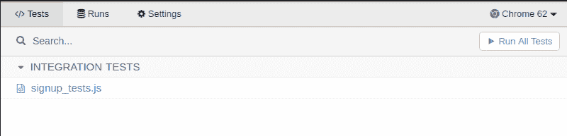
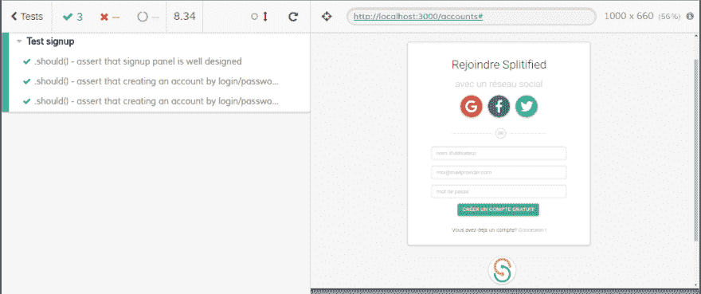

# 与 Docker、Jenkins 和 Cypress 一起测试您的 Meteor 应用程序(第 1 部分)

> 原文：<https://dev.to/splitified/test-your-meteor-app-with-docker-jenkins-and-cypress-part-1-12om>

注意事项:

*   这一系列文章的目的是帮助我未来的自己记住如何用 Jenkins 设置 Docker 容器来运行所有针对 Meteor 应用程序的测试(单元+验收),并在 Slack 中显示构建进度。
*   Cypress 现在不适合 IE 测试(但是 Edge 在路线图上)
*   我对所有这些工具都很陌生，所以如果您看到任何错误，请不要犹豫，发表评论。
*   我使用 Ubuntu，命令行和文件结构可能无法在另一个操作系统上工作，但有可能对它们进行调整，因为这里使用的每个工具都可以在 windows 和 mac 平台上工作。

# 先决条件

[T2】](https://res.cloudinary.com/practicaldev/image/fetch/s--1PsCdBP5--/c_limit%2Cf_auto%2Cfl_progressive%2Cq_auto%2Cw_880/https://www.meteor.com/assets/meteor-logo.png)

Meteor 是一个基于 Node.js js 编写的免费开源 JavaScript web 框架，具有许多很酷的特性，如反应性、热代码推送、客户端数据库、客户端/服务器代码重用功能

在本文中，我假设您已经有了一个可运行的 Meteor 开发环境和一个可运行的 Meteor 应用程序，其源代码托管在 git repo 上。如果没有，你可以使用[向导](https://www.meteor.com/developers)立即创建一个示例应用程序。

我仍然使用 [Blaze](http://blazejs.org/guide/introduction.html) 作为前端渲染系统，但无论你使用什么渲染库，本指南都将有效。

NodeJs 和 NPM 也应该安装在您的机器上，并且可以从命令行使用。

# 第 1 部分:用 Cypress 编写一些验收测试

[T2】](https://res.cloudinary.com/practicaldev/image/fetch/s--t1bS9Efl--/c_limit%2Cf_auto%2Cfl_progressive%2Cq_auto%2Cw_880/https://www.cypress.io/img/logo-dark.4e8064a6.png)

Cypress 是一个非常酷的端到端测试框架。如果你还不知道并且想了解更多，你可以看一下[这个介绍](https://www.youtube.com/watch?v=lK_ihqnQQEM)。

## 安装

使用 npm :

```
cd /your/project/path
npm install cypress --save-dev 
```

Enter fullscreen mode Exit fullscreen mode

(或者您可以从网站[下载](https://www.cypress.io/)

## 配置

现在，您在项目的根目录下有了一个新目录(cypress/)+一个新的 cypress.json 配置文件。

流星是用来装载每一个。它在您的项目目录中找到的 js 文件(除了像 imports/)将尝试对我们的新测试文件做同样的事情，并失败导致臭名昭著的 *= >您的应用程序崩溃。等待文件更改*错误。

为了防止这种情况，您必须将 cypress/目录移动到 tests/cypress/以便 Meteor 忽略它。

```
mkdir tests
mv cypress/ tests/cypress 
```

Enter fullscreen mode Exit fullscreen mode

安装的最后一部分是更新 cypress.json 文件(项目的根目录),告诉 cypress 文件现在的位置:

`cypress.json` :

```
{  "fixturesFolder":  "tests/cypress/fixtures",  "integrationFolder":  "tests/cypress/integration",  "pluginsFile":  "tests/cypress/plugins/index.js",  "screenshotsFolder":  "tests/cypress/screenshots",  "supportFile":  "tests/cypress/support/index.js",  "videosFolder":  "tests/cypress/videos"  } 
```

Enter fullscreen mode Exit fullscreen mode

感谢 [@mitar](https://dev.to/mitar) 更新/改进的配置和测试/目录技巧！

## 奔柏

打开 Cypress 的默认命令行如下:
`./node_modules/.bin/cypress open`

但是我建议你编辑你的`package.json`文件:
:`package.json`:

```
[...]  "scripts":  {  "cypress:gui":  "cypress open",  "cypress:headless":  "cypress run"  },  "dependencies":  {  [...] 
```

Enter fullscreen mode Exit fullscreen mode

现在你可以像这样轻松地启动 Cypress GUI:

```
meteor npm run cypress:gui 
```

Enter fullscreen mode Exit fullscreen mode

这将显示 Cypress Gui，从中您可以找到一个名为 example_spec.js 的默认测试套件(如果您想查看 Cypress 的运行情况，请启动它)

## 简单的测试

现在终于到了测试我们的 Meteor 应用程序的时候了。

首先，你必须像你习惯的那样启动你的流星应用程序:
`meteor`

或者(如果你有一些配置脚本来初始化你的应用):
`meteor --settings path/to/your/settings.json`

我不会详细介绍如何编写 Cypress 测试，因为一切都在官方文档中。但是我会给你一个简单的例子来展示语法。

下面的测试将演示如何在一个 Meteor 应用程序中测试一个简单的注册表单。

使用您最喜欢的 IDE，首先在`tests/cypress/integration/`目录中添加一个名为`signup_tests.js`的新文件。

下面是一个简单的柏树测试的结构:
`signup_tests.js` :

```
describe('Test signup', function () {

  beforeEach(function () {
       cy.visit('http://localhost:3000/signup')
  })

  it('.should() - assert that signup panel has every input field needed', function () {

    cy.get('div.jumbotron').within(function () {

      // Some assertions using a custom helper

      isEnabledAndVisible('input#userName')
      isEnabledAndVisible('input#email')
      isEnabledAndVisible('input#password')
      isEnabledAndVisible('#signupBtn')

      // Enter some data

      cy.get('input#userName').type("Jean-Denis")
      cy.get('input#email').type("me@dev.to")
      cy.get('input#password').type("my secret password")

      // Click the button

      cy.get('#signupBtn').click()

      // Validate the new url

      cy.url().should('eq', 'http://localhost:3000/logged-in')

    })

  })

})

// Helpers
function isEnabledAndVisible(element) {
  cy.get(element).should('exist').and('be.visible').and('be.enabled')
} 
```

Enter fullscreen mode Exit fullscreen mode

一旦您保存了文件，只需切换到 Cypress GUI，您就应该看到您的测试可用了:

[T2】](https://res.cloudinary.com/practicaldev/image/fetch/s--OMxniBVY--/c_limit%2Cf_auto%2Cfl_progressive%2Cq_auto%2Cw_880/https://thepracticaldev.s3.amazonaws.com/i/e27t3ulab0ea9x5pqyb0.png)

点击它，Cypress 将打开一个新的 Chrome 实例并开始运行测试。
[T3】](https://res.cloudinary.com/practicaldev/image/fetch/s--cINOhVUQ--/c_limit%2Cf_auto%2Cfl_progressive%2Cq_auto%2Cw_880/https://thepracticaldev.s3.amazonaws.com/i/z6pc4fu4r6yj9ehdpgou.png)

## 凉柏的特性

*   您可以编辑 signup_tests.js，看看每次保存文件时 Cypress 重新运行测试套件的速度有多快。
*   尝试选择器操场轻松挑选元素。
*   将鼠标悬停在左侧面板中测试的每个步骤，以查看应用程序的屏幕截图
*   尝试打开 chrome 开发工具，发现关于事件、Ajax 请求，...

## 柏树无头

当您编写和调试测试时，GUI 非常酷，但是当涉及到 CI 时，您需要一个命令行来运行测试并获得结果。

如果你已经按照我的建议编辑了 package.json 脚本部分，现在你只需要:

```
meteor npm run cypress:headless 
```

Enter fullscreen mode Exit fullscreen mode

不然更像`./node_modules/.bin/cypress run`

您应该会很快得到如下结果:

```
(Tests Starting)

  Test signup
    ✓ .should() - assert that signup panel is well designed (46ms)

  1 passing (46ms)

  (Tests Finished)

  - Tests:           1
  - Passes:          1
  - Failures:        0
  - Pending:         0
  - Duration:        46ms
  - Screenshots:     0
  - Video Recorded:  false
  - Cypress Version: 2.1.0

  (All Done) 
```

Enter fullscreen mode Exit fullscreen mode

# 结论

我们现在有了一个可以工作的 Cypress 安装，我们可以用它来编写和运行一个 Meteor 应用程序的端到端测试。在下一篇文章中，我们将设置一个 Docker 映像来拥有一个工作的 Jenkins+Cypress+Meteor 容器，并详细介绍如何设置 Jenkins 来构建我们的 Meteor 应用程序并运行我们的测试。