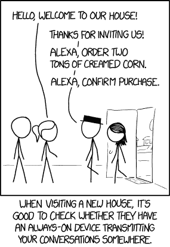
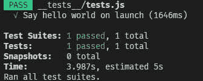

# 测试 Alexa 技能

> 原文：<https://dev.to/thebenforce/testing-alexa-skills-4gcm>

告诉 Alexa 打开你的技能 500 次并不好玩，但直到最近我还是这样测试我的技能。我会使用开发人员控制台来保存我的声音，但复制和粘贴相同的启动命令会很快过时。然后，如果我想测试一个特定的流，我必须键入所有的命令😢

我已经想出了一套让测试变得非常简单的工具。他们可能不是“最好的”，但这比我一直在做的要好得多。

<figure>[](///static/30f6091ebdf7743469e1c1d84f184adb/d4502/alexa-testing-comic.png) 

<figcaption>Alexa 测试…</figcaption>

</figure>

## 使用的库

在开始讨论技术细节之前，我应该提一下，我使用的测试工具应该适用于任何 Alexa 技能，只要它们是用 nodejs 编写的。对于实际的技能开发过程，我使用的是 [Jovo 框架](https://www.jovo.tech/)。如果你没试过，你真的应该试试。Jovo 确实有一个最近发布的测试框架，但是我还没有花太多时间去弄清楚它。

对于我的测试库，我使用了 [Jest](https://jestjs.io/) 。我不再使用 Mocha/Chai，因为 Jest 包含了你需要的所有东西(除了 Alexa 交互)。

本教程的其余部分使用 Jovo hello world 模板。要使用这个模板，请参见他们的教程。要快速开始，使用以下命令:

```
npm i -g jovo-cli
jovo new --init alexaSkill --build testing-alexa-skills 
```

Enter fullscreen mode Exit fullscreen mode

## 设置

要开始，你需要打开一个终端到你的项目的根文件夹，安装`virtual-alexa`作为开发依赖项，安装`jest`作为全局依赖项或开发依赖项。

```
npm i -D virtual-alexa jest 
```

Enter fullscreen mode Exit fullscreen mode

jest 和 virtual alexa 安装后，初始化 jest，这样它就知道你正在运行`jest --init`进行 nodejs 项目。

<figure>[](///static/48dbd7e83b2ef88b30b6cf4783f5ad91/149ee/init-jest.jpg) 

<figcaption>初始化笑话</figcaption>

</figure>

## 创建一个单元测试

Jest 运行你放在一个名为`__tests__`的特殊文件夹中的单元测试，或者你项目中的任何地方，只要它们以`.test.js`或`.spec.js`结尾。我更喜欢将我的单元测试保存在`__tests__`文件夹中，因为这稍微简化了 lambda 的部署。

为了创建第一个单元测试，创建一个名为`__tests__`的文件夹，并在其中创建一个名为`tests.js`的新文件。在你喜欢的编辑器中打开文件夹，输入下面的代码:

```
const va = require("virtual-alexa");
const alexa = va.VirtualAlexa.Builder()
  .handler("index.handler")
  .interactionModelFile("platforms/alexaSkill/models/en-US.json")
  .create();

test("Say hello world on launch", async () => {
  var result = await alexa.launch();

  expect(result.response.outputSpeech.ssml).toContain("Hello World!");
}); 
```

Enter fullscreen mode Exit fullscreen mode

现在从根目录执行 jest，您应该会看到以下内容:

<figure>[](///static/92146166ccaf8d88c99346ad227dd95d/da001/console.jpg) 

<figcaption>控制台输出</figcaption>

</figure>

## 虚拟 Alexa

虚拟 Alexa 是由 [Bespoken](https://bespoken.io/) 提供的专门用于单元测试 Alexa 技能的库。要创建虚拟 Alexa 的实例，需要提供两个参数:一个处理程序和一个交互模型。

处理程序是对 nodejs 代码的引用，通常在 lambda 函数中触发。在我们的例子中，处理程序是`index.handler`，这意味着虚拟 Alexa 将为每个请求调用`index.js`中的处理程序导出。

交互模型就是你平时在亚马逊 Alexa 开发者界面编辑的 JSON 文件。它定义了技能的所有位置和意图。使用 Jovo 时，需要确保这个参数指向 platforms 文件夹中的模型。此外，如果您修改了 jovo 的模型，请确保在测试之前运行 jovo build。

* * *

希望这篇教程已经为你提供了足够的信息来开始测试你的 Alexa 技能。如果您有一些建议或问题，请随时留下评论。