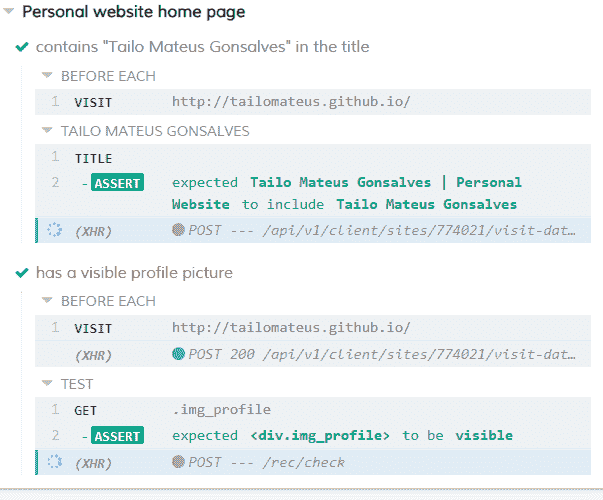

# 用 Cypress 测试应用程序

> 原文：<https://dev.to/tailomateus/testing-applications-withcypress-3dc7>

端到端测试非常出色，因为它们反映了用户的行为。这类测试表现得像真人一样，同时验证应用程序的各个部分。 *[柏树](https://www.cypress.io/)* 是一个新的*测试运行器*，其前提是在浏览器中运行的测试快速、简单、可靠。

**注意:**理想情况是总是让一个测试失败，然后让它通过，最后重构它。但是对于 T2 柏树 T3 的研究来说，大多数的例子并没有遵循这个顺序。

### 接下来是什么

*   柏树安装
*   配置测试环境
*   进行我们的第一次测试
*   运行我们的第一个测试
*   检查页面元素
*   测试我们元素的响应性
*   我们怎样才能更深入

### 安装柏树

我们可以使用 *npm* install。输入你的终端:

```
npm install --save-dev cypress 
```

Enter fullscreen mode Exit fullscreen mode

如果一切顺利，我们现在可以编写我们的第一个测试了。

### 测试配置

我就以[我的个人网站](https://tailomateus.github.io/)为例。默认情况下， *Cypress* 希望集成测试在 *cypress/integration* 文件夹中，所以我们必须创建它们。

如果您不想使用这个默认路径，您可以在您的根目录下创建一个 *cypress.json* [配置文件](https://docs.cypress.io/guides/references/configuration.html)。

### 测试页面标题

我们的第一个测试非常简单，我们只需检查页面标题是否正常工作。

在 *cypress/integration* 文件夹中，我创建了一个名为 *sample-spec.js*
的文件

```
describe('Personal website home page', () => {
  it('contains "Tailo Mateus Gonsalves" in the title', () => {
  })
}) 
```

Enter fullscreen mode Exit fullscreen mode

*描述*有两个参数，一个带主题的字符串和一个执行任何代码的*回调函数*，在这个函数中我们可以包含几个 *it's* (几个测试)。it 函数也需要两个参数。函数的返回应该检查我们的测试声明是否符合实际。

为了测试主页，我们必须说出它在哪里。因为我们所有的测试都将在这个页面上完成，所以我们可以将它添加到一个总是在我们的测试之前运行的地方:

```
describe('Personal Website home page', () => {
  beforeEach(() => {
    cy.visit('https://tailomateus.github.io/')
  })

  it('contains "Tailo Mateus Gonsalves" in the title', () => {
    cy.title().should('contain', 'Tailo Mateus Gonsalves)
  })
}) 
```

Enter fullscreen mode Exit fullscreen mode

在上面的例子中，我们在我们的 *beforeEach* 中添加了 *[cy.visit()](https://docs.cypress.io/api/commands/visit.html)* 函数，因此我们确保在运行测试之前，代码将知道我们正在测试哪个页面。我们声称该网页的标题包含名称“泰洛·蜜桃红·贡萨尔维斯”，[你可以在这里看到其他支持的断言。](https://docs.cypress.io/guides/references/assertions.html#Chai)

### 运行我们的第一个测试

由于 *Cypress* 没有全局安装，我们必须在我们的文件夹 *node_modules* 里面添加 *bin* 文件夹的路径。在项目的根使用该命令:

```
(npm bin)/cypress open 
```

Enter fullscreen mode Exit fullscreen mode

在我的机器上是这样的:

```
node_modules/cypress/bin/cypress open 
```

Enter fullscreen mode Exit fullscreen mode

如果一切顺利，这个界面将会打开:

[T2】](https://res.cloudinary.com/practicaldev/image/fetch/s--crBSNo26--/c_limit%2Cf_auto%2Cfl_progressive%2Cq_auto%2Cw_880/https://cdn-images-1.medium.com/max/800/1%2ALolhBhXNFHk0ne-Q1qIDRg.png)

我们创建的文件是可用的，所以我们可以运行我们的测试。我们有一个界面，在那里我们可以看到我们的网页是如何表现和获得的结果。

[T2】](https://res.cloudinary.com/practicaldev/image/fetch/s--CPWimj0N--/c_limit%2Cf_auto%2Cfl_progressive%2Cq_auto%2Cw_880/https://cdn-images-1.medium.com/max/800/1%2Axb7WjOdjOUJe43hK3NhRYA.png)

### 检查页面上的一个元素

现在让我们检查一个元素是否真的出现在页面上。在本测试中，我们将验证个人资料图像是否可见。

由于我们测试的是同一个页面，我们可以用同样的*描述*，只需添加一个新的 *it* 。

```
it('has a visible profile picture', () => {
  cy.get('.img_profile').should('be.visible')
}) 
```

Enter fullscreen mode Exit fullscreen mode

这个测试使用 *[cy.get()](https://docs.cypress.io/api/commands/get.html#Syntax)* 来捕获元素。如果元素被异步加载，该函数将等待 *defaultCommandTimeout* 出现(默认值为 4 秒，可以设置为 *[cypress.json](https://docs.cypress.io/guides/references/configuration.html#Timeouts)* )。

我们的测试结果:

[T2】](https://res.cloudinary.com/practicaldev/image/fetch/s--AS6MHu4R--/c_limit%2Cf_auto%2Cfl_progressive%2Cq_auto%2Cw_880/https://cdn-images-1.medium.com/max/800/1%2AyZFX1NmJavGysMbeYntbUQ.png)

但是如果由于某种原因我们在测试中犯了错误，结果就会是这样的:

[T2】](https://res.cloudinary.com/practicaldev/image/fetch/s--Cm1KnLns--/c_limit%2Cf_auto%2Cfl_progressive%2Cq_auto%2Cw_880/https://cdn-images-1.medium.com/max/800/1%2AYvE1hed6KvHJ7TBH1j-JOg.png)

### 测试响应性

让我们做一个稍微不同的测试。我目前必须确保该网站将在不同的维度上工作。这样，所有用户都能够正确使用它。

由于我们仍在测试同一个页面，我们将只在现有页面中添加另一个*描述*。在这里，我们测试 320 像素的宽度，并检查是否仍然可以看到轮廓图像。为了改变这个测试的宽度，我们可以使用 *[cy.viewport()](https://docs.cypress.io/api/commands/viewport.html#Syntax)* 。

```
describe('with a 320x568 viewport', () => {
  beforeEach(() => {
    cy.viewport(320, 568);
  })
   it('has a visible mobile profile picture', () => {
    cy.get('.img_profile').should('be.visible')
  })
}) 
```

Enter fullscreen mode Exit fullscreen mode

默认情况下大小是 1000×660，但是我们可以在配置文件中更改它，前面提到的 *cypress.json* 。您可以测试任何屏幕尺寸。查看我们在移动设备上的测试结果:

[T2】](https://res.cloudinary.com/practicaldev/image/fetch/s--f8AbFmI7--/c_limit%2Cf_auto%2Cfl_progressive%2Cq_auto%2Cw_880/https://cdn-images-1.medium.com/max/800/1%2ATB71xoVOqBCoE26FHt3Vjg.png)

### 我想更深入

在文档中，你会找到几个例子。但是如果你想要一些可见的东西，当你安装 *Cypress* 时，你会有一个名为“examples”的文件夹，里面有 100 多个测试要运行。

[T2】](https://res.cloudinary.com/practicaldev/image/fetch/s--MukTSuOJ--/c_limit%2Cf_auto%2Cfl_progressive%2Cq_auto%2Cw_880/https://cdn-images-1.medium.com/max/800/1%2AL2_GisT-XWYYqRDF8HLquA.png)

如图所示，有几种类型的函数。本文没有探讨的一件很酷的事情是 *Cypress* 如何在 *ajax* 和*前端*响应之间排名。我们可以控制从服务器获得的结果。

随着你的项目获得新的特性，出现错误的几率会急剧增加。我知道你不希望这样。因此，只需测试并开始在您的项目中实现它。

**例子的代码在 [GitHub](https://github.com/TailoMateus/testing_personal_site_cypress) 中。**

**鸣谢:** *本文由[马科斯·戈比](https://github.com/macpardo)T5】审阅*

### 演职员表及参考资料:

[Cypress 文档](https://docs.cypress.io/api/introduction/api.html#Sections)
[用 Cypress 进行网站测试简介](https://css-tricks.com/an-intro-to-web-app-testing-with-cypress-io/)