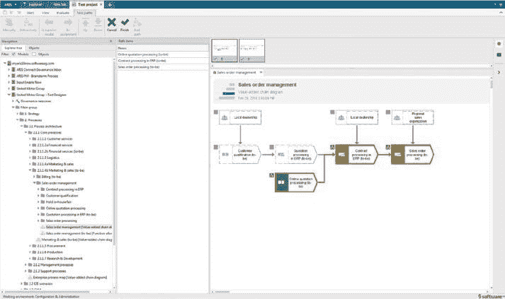
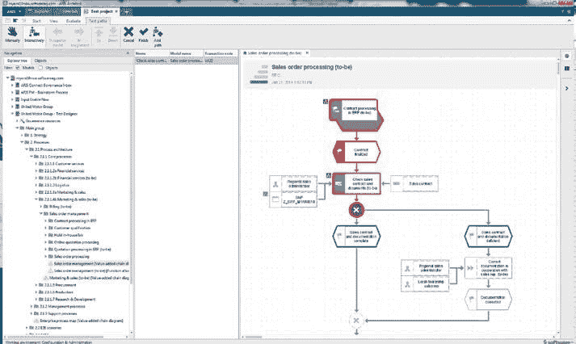
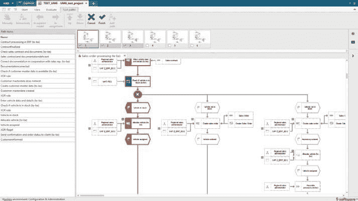
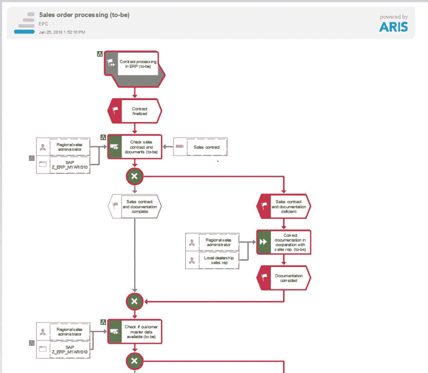

# 测试决定成败

> 原文：<https://dev.to/techcommunity/testing-makes-it-or-breaks-it-5bkg>

# 如何用 ARIS 测试设计器确保卓越

查看 IT 和转型失败的主要原因，我们发现测试是一个主要的棘手问题。不应该。由于过程驱动的测试，您已经掌握了推动成功的一切。

| 2018 年第二期 | [ 下载 PDFT4】](http://techcommunity.softwareag.com/ecosystem/download/techniques/2018-issue2/SAG_Testing_Makes_It_TECHniques_Apr18_WEB.pdf) |
| --- | --- |

## 我有 99 个问题，但测试不是其中之一——你确定吗？

大多数公司，或者更确切地说是项目经理，都关心与测试相关的风险。事实上，测试的复杂性及其在项目时间表中的“时间预算”经常被低估。此外，不良的测试覆盖会导致不完整的测试，对 VIP(非常重要的过程)产生不良影响。但是关心显然是不够的，因为我们仍然缺乏对测试的考虑。让我们快速了解一些领域:

*   **测试阶段**的规划——在所谓的重要活动的项目计划中，通常是不充分的和被推迟的。专门的测试计划很少，而且大多是许多其他项目活动中的一个点。
*   测试承诺&接受–项目团队和经理通常将测试视为一切顺利的证明，而不是发现问题的机会。甚至测试也需要管理层的承诺来支持工作并实现正确的期望。事实上，最终用户对测试和测试结果的接受度经常缺失。
*   **测试管理挑战**–从技术或组织的角度来看，经常缺少足够的测试资源。不明确的测试职责、缺乏专业知识、不充分的测试文档和沟通是常见的测试管理失败。
*   **业务需求测试问题**——如果需求和流程不清晰，测试不会让它变得更好，也不能显示出哪里出错了，需要改进什么。

因此，缺乏全面的测试以及糟糕的测试带来的风险是巨大的。这可能会导致转型失败、应用程序配置不合适、缺乏高质量的端到端流程、上线延迟甚至失败，最终导致最终用户效率低下、新流程难以接受以及客户不满。所有这些问题都将花费巨大:您将在项目中损失时间(金钱),而业务运行、操作和系统质量将受到影响，这将导致不满意的客户可能会背弃您的公司。

那是你想要的吗？

肯定不是！现在让我们从积极的一面来看。糟糕的测试对你的业务不利，但是好的测试收益比糟糕的测试成本要高得多——所以我们走吧；–)**解决方案是流程驱动测试**。不是开玩笑。过程驱动的测试确保您的 VIP 过程以它们应该的方式运行。这保证了高质量的流程和平稳运行的应用程序，从而带来了满意和忠诚的客户。其实是支持你成功转型的。您可能不相信，但是花时间进行端到端的流程测试将会节省您的时间。测试将帮助您考虑正确的流程，并尽早发现问题以解决它们。

## 面向过程的测试设计确保过程按照它们应该的方式工作

ARIS 测试设计器支持面向过程的测试，因此您可以依赖快速，简单和全面的测试设计。怎么会？ARIS 测试设计器让你的终端“高级”用户有机会自己设计测试，获取蓝图-过程-信息并重用它来创建不同的测试。

让我们详细看看它是如何工作的。ARIS 测试设计器支持:

*   简单、快速、灵活的端到端测试路径记录
*   直观捕捉多个测试变量
*   测试文档的自动创建
*   导出到标准测试应用程序，并与 SAP 解决方案管理器同步

## 简单、快速、灵活的端到端测试路径记录

测试团队，通常是权力或最终用户，将在 ARIS 创建一个测试项目。在这里，他们可以选择应该测试的流程，并通过拖放，将它们分配到测试项目中。这是设计测试范围的第一步。然后，他们可以选择一个过程，并基于“记录”模式浏览该过程并选择要测试的路径。

当一个过程简单明了时，它就简单了；但是对于更复杂的过程，需要业务知识。这种记录模式也适用于几个流程，因此也支持端到端测试场景的设计(您可以称之为集成测试)，比如订单到现金。哪些场景很重要，反复发生？

比方说，哪些流程异常不太重要，不需要马上测试？如果您让您的最终用户来做，所有这些知识都包含在测试路径设计中。此外，它将增加最终用户对新流程和系统的接受度，因为它们突然对业务产生了更大的影响。

 

*图 VAD 中的测试路径选择*

 

*图 EPC 中的测试路径选择*

## 自动捕获多个测试变量

当然，有时你需要创建全面的测试用例，并遍历所有可能的过程路径。由于在一个业务流程中有两个或三个决策已经增加了可能的测试路径的数量，您可以想象在一个完整的业务案例中会有多少种可能性。为了帮助你，ARIS 测试设计提供自动化或半自动测试设计。设计测试的用户可以在几个选项中进行选择:要么自动创建所有可能的测试路径，要么生成自动建议的测试路径的选择。

 

*图 3:自动化测试路径生成*

## 自动创建测试文档

测试人员需要的不仅仅是过程流信息。这就是 ARIS 测试设计器自动生成测试用例文档的原因。您只需运行一个报告，并选择您想要在您的测试用例文档中使用的信息。比如:要不要:包含流程图？添加测试数据以便直接重用还是不重用？是否插入模型描述？按下 report 按钮，测试用例就创建好了，可以使用了。

 

*图 4:测试文件中测试路径的显示*

## 导出到标准测试应用程序并与 SAP 解决方案管理器同步

过程驱动的测试很重要，来自 ARIS 的商业信息带来了巨大的价值。但是 ARIS 本身并不是一个测试管理工具。这就是为什么 ARIS 测试设计器支持将测试用例及描述导出到标准测试应用程序，如标准微软应用程序(适用于较小的应用程序和公司)以及领先的测试工具，如惠普应用程序生命周期管理(在补丁 12.55p02 中，导入作为技术预览功能提供)。从那里，基于过程的测试信息可以在测试应用程序中被重用和管理。

由于 ARIS 有一个与 SAP 解决方案管理器的专用接口，测试信息可以与 SAP 解决方案管理器同步，然后传输到 SAP 测试工作台进行测试。

## ARIS 的测试设计追求卓越——不多不少

总而言之，ARIS 测试设计器提供了一个全面的解决方案，以确保您的测试达到您的目标:

*   通过使用全面和高质量的测试来降低关键系统实施的风险
*   由于重复使用流程数据和快速测试概念，加快了发布周期
*   通过高质量的系统赢得最终用户的认可和积极体验
*   通过重复使用以前的测试项目来节省时间
*   甚至确保特定行业的法规遵从性，如制药业

更多详情[请观看 ARIS 测试设计器的网络研讨会](https://www.youtube.com/watch?v=WAbKeGcXhdU&feature=youtu.be)。

在我们的网站上阅读更多关于 ARIS 如何走向卓越的信息。