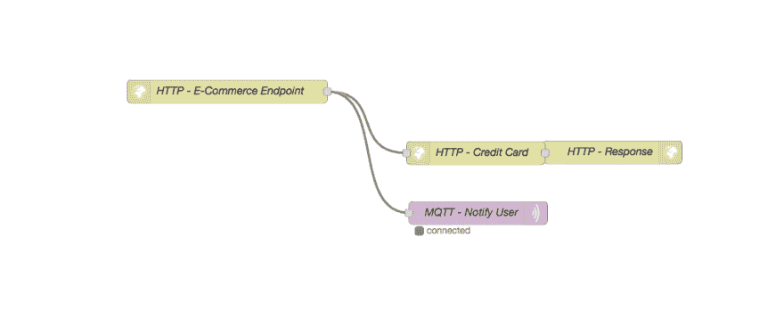
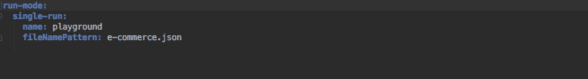
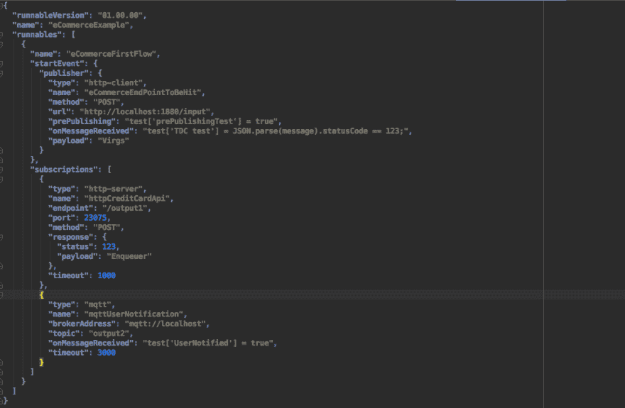
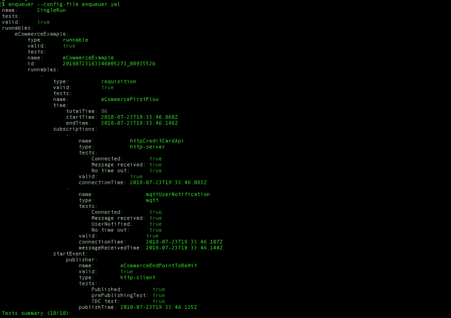

# 用排队器测试多语言流

> 原文：<https://dev.to/lopidio/testing-polyglot-flows-withenqueuer-3hi0>

说起来很伤人，但是反应并不是一个容易的世界，伙计们。

[T2】](https://res.cloudinary.com/practicaldev/image/fetch/s--ltnsGpxm--/c_limit%2Cf_auto%2Cfl_progressive%2Cq_auto%2Cw_880/https://cdn-images-1.medium.com/max/2000/1%2AL8J_bWwaDTGPOKaNNghhzA.jpeg)

即使这不是一个轻松的世界，反应式架构的好处也是值得的。太棒了，生活又变得美好了，但是放松点，年轻人。为了达到反应的圣杯，只有一条路，一个真理和一个队列。好吧，我在撒谎，它不一定是一个队列，也不一定是一个事实。但是没有其他方法，正如 reactive manifesto 所声称的，必须有异步消息:
消息驱动:reactive 系统依靠异步消息传递来建立组件之间的边界，以确保松散耦合、隔离和位置透明。
但是这种异步方法带来了额外的复杂性。检测、避免和处理像无限循环、死锁和竞争条件这样的事情并不容易。

## 多语流

[T2】](https://res.cloudinary.com/practicaldev/image/fetch/s--sLCcUvwG--/c_limit%2Cf_auto%2Cfl_progressive%2Cq_auto%2Cw_880/https://cdn-images-1.medium.com/max/1600/1%2AutkV7mP-4ouTWRDTQqvEkA.jpeg)

我在这里至少能看到 42 种语言。我谅你也不敢这样做。根据系统限制，IPC 协议可能比其他协议更适合。有时，有一些前提排除了一些可能性，并限制了选项，如网络延迟、硬件配置、同步性和涉及的参与者数量。因此，在具有一组不同系统和不同行为的同一个流中，有一个以上的 IPC 协议，甚至几个协议并不罕见。这个流程，一个涉及到几个 IPC 协议的流程，至少在我看来，也被称为多语言流程。综上所述，新的问题出现了:我们如何测试这些多语言流以及它们的几个 IPC 协议、异步属性和流动消息？我们如何跟踪所有这些？我的感觉是，我们总是在创造更难测试的东西。深呼吸，没必要那么难。你并不孤单。

## 嘲弄！嘲笑他们所有人！

[T2】](https://res.cloudinary.com/practicaldev/image/fetch/s--fpvBlLG9--/c_limit%2Cf_auto%2Cfl_progressive%2Cq_auto%2Cw_880/https://cdn-images-1.medium.com/max/1600/1%2AiJVlt84w9dQK1KqHqrJPJA.jpeg)

测试它的一个方法是嘲笑一切！假设你有一个反应系统。在它的项目中，你可以编写单元测试和组件测试，模仿它们，假装消息真的在它应该来/去的地方来回流动。但是，在某些时候，您已经使您的测试范围更大了。在某些时候，假装是不够的，你必须确保信息被正确传递。您必须检查配置是否设置正确，并且必须检查您的数据库、文件系统、代理或类似的东西中的结果。此外，要编写这种测试，你必须有一些编程技能，这可能会让非编码人员远离测试。如果我们想通了这一点，任何了解流程如何工作的人都应该能够测试它。

## 给我工具！

鉴于集成不同的系统、源/目的地和格式是必不可少的，我们可以得出结论，我们需要认真对待这一点，使用自动化工具来完成这项工作，并尽可能减少人为错误。有人说 SOA(面向服务的架构)没落的原因之一正是缺乏成熟的工具。但这是几年前的事了，很长时间过去了，社区已经从以前的错误中吸取了教训。有吗？
如今，我们可以在社区中找到一些很棒的工具，其中一些，也是最著名的，将会被提及:

### [邮递员](https://getpostman.com)

[T2】](https://res.cloudinary.com/practicaldev/image/fetch/s--C6k7saxz--/c_limit%2Cf_auto%2Cfl_progressive%2Cq_auto%2Cw_880/https://cdn-images-1.medium.com/max/1600/1%2AdQ_M8aWZ8vgJIcuwh9kI9A.jpeg)

Postman 真的是一个很好的应用。有一个很好的理由可以自豪地宣布，它被 500 万开发者和超过 100，000 家公司用于每月访问 1.3 亿个 API，并且在我们银河系的太阳系的每个地球上！太多了，你不觉得吗？不需要努力去思考为什么会有这么好的数字:它真的很容易使用，包括非编码人员，你所要做的就是点击两三个按钮，瞧，神奇的事情发生了！它可以很容易地添加到您的 CI 渠道中，并为您提供一些不错的功能，例如依次运行多个申请。
但是(总有但是)，尽管其深入 HTTP 宇宙探索，却仅限于此。尽管基于 HTTP 的 REST 是微服务世界中最广泛采用的 IPC，但反应式系统并不是关于同步通信的，正如在《忘记微服务中的 HTTP，REST 是更好的选择吗？，in 数据不再静止，REST 是新的 SOAP，in REST 把微服务变回了单片。我希望你现在已经被说服了。恰恰相反，这样的通信恶化了整个系统，因为它们让你的系统耦合度更高。所以，Postman 因为不能处理几个 IPC 协议而失分很多。我相信，这完全是个人观点，不强调它的测试功能也会使它失分。

### [江湖骗子](//www.mbtest.org)

[T2】](https://res.cloudinary.com/practicaldev/image/fetch/s--AdUT2khF--/c_limit%2Cf_auto%2Cfl_progressive%2Cq_auto%2Cw_880/https://cdn-images-1.medium.com/max/1600/0%2A5kLIMwmvCm2lhSdC)

这一个能够处理除 HTTP 之外的更多 IPC 协议。确切地说，它可以与:SMTP，TCP 和 HTTP/HTTPS。当然，最后一个受到了特别的关注。假设它能够理解 TCP 流，你可以与所有其他基于 TCP 的协议一起工作，但是你必须在它上面建立一些层来使它正常工作。Mountebank 真正强大的地方在于它能够公开 HTTP API，并为测试执行提供存根和代理。通过冒名顶替，可以模拟 HTTP 响应，解析消息并使用谓词和断言来确保消息是正确的。但是(我说过总是有但是的)，能够处理原始的 TCP 消息是不够的，你仍然需要理解预期的协议是如何工作的，并在 TCP 上构建它。拜托，严重吗？对于非编码者来说没有诱惑力。由于它仅在需要时才起作用，因此必须与其他测试工具一起使用，即能够触发消息并开始测试的工具。

### [阿帕奇骆驼](http://camel.apache.org/)

[T2】](https://res.cloudinary.com/practicaldev/image/fetch/s--8e8NZ_JV--/c_limit%2Cf_auto%2Cfl_progressive%2Cq_auto%2Cw_880/https://cdn-images-1.medium.com/max/1600/0%2AUkh0jz86znRtsHL6)

它处理几个 IPC 协议。啊哈！太神奇了！最后。更多:它触发信息，你不必，必要地，使用它与其他测试工具。既然你通过编码来控制它，你就可以做任何你想做的事情:嵌套测试，组合执行，一次测试几个系统…
然而(你知道，这只是一个花哨的但是)，这对于非编码人员来说并不具有诱惑力。其实对编码员来说也没什么诱惑力。鉴于您必须对您的测试场景进行编码，这需要深厚的编程知识。正如我之前所说的，每个了解流动是如何流动的人都应该能够测试它。这些测试不应该(也不能)是编码人员的专属职责。除此之外，正如在《折断骆驼的脊梁:
中提到的，大多数 Apache Camel 的连接器都是以同步和/或阻塞的方式实现的，由于对共享资源的高度争用，导致了资源的低效使用和有限的可伸缩性。
此外，扇入/扇出模式要么缺乏支持，需要在创建时知道所有的输入/输出；或者，最小公分母——将吞吐量限制在最慢的生产者/消费者。

## 我们需要更好的工具！

显然需要更好的工具。给定已知的反应式架构:异步、响应性、弹性和伸缩性，我们能做些什么？各位，让我向你们介绍一件事。

### [入队](https://github.com/lopidio/enqueuer)救援！

[T2】](https://res.cloudinary.com/practicaldev/image/fetch/s--8-z20QQt--/c_limit%2Cf_auto%2Cfl_progressive%2Cq_auto%2Cw_880/https://cdn-images-1.medium.com/max/2000/1%2AW0Z10Qbef-dSeJ2zwxIS5w.png)

虽然听起来不可思议，但没有测试工具能够:
断言无论何时一件事情发生，其他事情都会以合适的时间和形式发生。这就是反应性所在；
供非编码人员使用；
一次性测试孤立的应用程序和整个系统；
自行触发事件；
以嘲弄回应；
对事件进行连锁和嵌套；
原生支持几种众所周知的 IPC 协议。举几个例子:amqp，mqtt，http，sqs，0mq，Kafka，TCP 等等；和
易于添加到 CI 管道中。

伙计们，这个问题已经不存在了。Enqueuer \nqr\是一个 CLI 框架，为满足我们的需求而开源！它模拟一个申请，并通过分析其输出消息来检查系统的反应。它是前面提到的工具的混合。

* * *

### 告诉我怎么做

为了说明 enqueuer 如何工作以及如何使用它，我将使用一个虚构的多语言流示例:
当您的电子商务 http 端点被命中时，您必须向信用卡处理 RESTful API 发送信息，并通过 MQTT 事件通知用户。

 
现在，你有三个选项来测试这个多语流:
恬不知耻地根本不写测试；(这种事情发生的频率比我们愿意承认的要高。你知道)
在代码库中为这些情况中的每一个单独编写一个组件测试，模拟它们，处理新的依赖关系，找出细节并在它们失败时处理调试；或者
使用 enqueuer，开箱即可测试。

根据一致意见，你必须选择 3 号。假设我们要测试东西，我们必须隔离测试目标，无论是单个组件还是一组系统，通过这样做，我们可以确保无论何时出现错误，我们都可以确定目标是罪魁祸首。在隔离它之后，我们将在暴露的端点触发事件，并评估是否每个预期的输出都实现了。好消息是这就是 Enqueuer 所做的。因此，首先安装它:
$npm install -g enqueuer
创建一个配置和一个文件来描述测试场景文件，如下所示:

 
 
这里有几件事值得特别注意。查看测试描述文件，我们可以看到入队者将在[http://e-commerce.com:8080/endpoint](http://e-commerce.com:8080/endpoint)中点击 a (POST)。e-commerce.com:8080 是被测系统应该运行的地方。有两个预期的订阅。第一个是 http 服务器。因此 enqueuer 将运行一个 HTTP 服务器并侦听/output1 调用。一旦这个端点被命中，enqueuer 就断言它被命中，并返回一个响应。正如您在响应中看到的:{status: 123…
第二个订阅声明必须有一个消息发送到 output2 MQTT topic。尽管我们不能保证这一点，而且不能保证这一点是件好事，但这条消息很可能是被测系统发出的。在 onMessageReceived 字段中，我们传递 javascript 代码值来断言一些东西。在这个例子中，我们创建了一个用户通知测试，并为它分配了一个 true 值。当然，我们可以在那里进行更深入的分析。假设它是一个 javascript 代码片段，您可以做任何您想做的事情——因为这个流是关于 HTTP 和 MQTT IPC 协议的，这些是描述文件所担心的，但是 enqueuer 也能够处理其他协议。目前所有以下的支持:Amqp，文件，Http，Kafka，Mqtt，Sqs，ZeroMq，Stomp，Uds，Tcp，Udp 等。
现在我们能够运行它并查看它的报告:
$ enqueuer-config-file enqueuer . yml

通过报告我们看到运行了 10 个测试。有些是 enqueuer 自动创建的，比如 ecommerce example . start event . publisher . tests . published 有些是我们创建的，比如 ecommerce example . subscriptions[1]. tests . user Notified。都是过去式。还有其他有趣的事情:执行时间，开始时间，结束时间等等。我相信你明白了。
结论
最知名的工具可能不足以测试多语言流量。Enqueuer 就是用来弥补这种责任缺失的。正如我们所看到的，不需要深入的编程技巧就可以正确地测试整个流程和几个 IPC 协议。
在不久的将来，将会发布其他示例以及如何使用 enqueuer 测试它们。