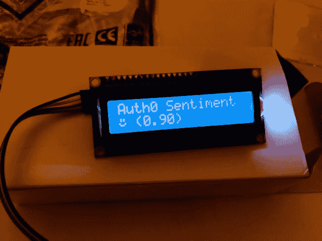
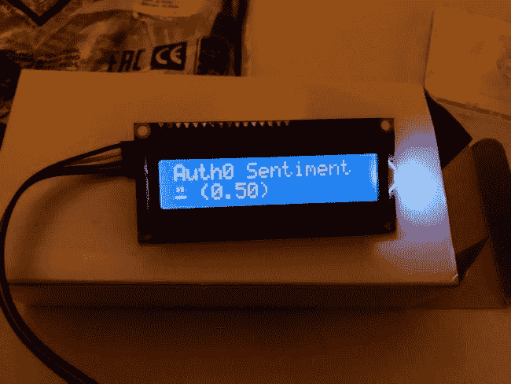
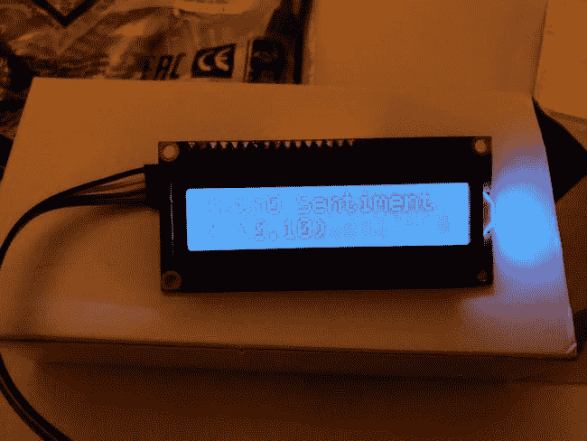

# 文本情感分析物联网演示

> 原文：<https://dev.to/raymondcamden/text-sentiment-analysis-iot-demo-2b2o>

我在巴拿马的一家公司度过了最后一周(那里很漂亮，尽管我大部分时间都呆在酒店里)。那段时间，我参加了一个使用多种物联网设备的黑客马拉松。其中一个是这个漂亮的小液晶面板:

[T2】](https://res.cloudinary.com/practicaldev/image/fetch/s--9pKcJeHk--/c_limit%2Cf_auto%2Cfl_progressive%2Cq_auto%2Cw_880/https://static.raymondcamden.cimg/2018/05/lcd1.jpg)

我不知道这个硬件实际上叫什么(我的意思是什么品牌)，我在设置它方面完全没有用，但在我的合作伙伴安装并运行它并在其上启动一个节点服务器后，我编写了将数据发送到它的代码。就我而言，我决定使用微软的[文本分析 API](https://azure.microsoft.com/en-us/services/cognitive-services/text-analytics/) 和[网络任务](https://webtask.io/)。这个想法是建立一个关于关键词(在这个例子中是 Auth0)的 tweets 的“情感分析”,并提供一个平均报告。你可以想象这个显示器给出了事情进展的实时状态。在上面的截图中，你可以看到事情进展顺利。厉害！我们还构建了对更中性的响应的支持:

[T2】](https://res.cloudinary.com/practicaldev/image/fetch/s--Ll_0shur--/c_limit%2Cf_auto%2Cfl_progressive%2Cq_auto%2Cw_880/https://static.raymondcamden.cimg/2018/05/lcd2a2.jpg)

和一个“哦，糟糕，我们一定做了什么很糟糕的事情”的结果:

[T2】](https://res.cloudinary.com/practicaldev/image/fetch/s--y8tT3VDR--/c_limit%2Cf_auto%2Cfl_progressive%2Cq_auto%2Cw_880/https://static.raymondcamden.cimg/2018/05/lcd3a2.jpg)

再说一次，我没有做任何酷的硬件部分，我只是建立了“获取数据并发送它的部分”，但我认为分享这些代码可能会很酷。大约两周前，我写了一篇关于用 Slack 做类似事情的文章:[给 Slack](https://goextend.io/blog/adding-serverless-cognitive-analysis-to-slack) 添加无服务器认知分析。这意味着我的大部分工作已经完成了。让我们看看 webtask。

```
/**
* @param context {WebtaskContext}
*/

const Twit = require('twit');
let T = null; 
const Pusher = require('pusher');
const rp = require('request-promise');

module.exports = async function(context, cb) {

  let pusher = new Pusher({
    appId: context.secrets.pusher_appId,
    key: context.secrets.pusher_key,
    secret: context.secrets.pusher_secret,
    encrypted: true, // optional, defaults to false
    cluster: 'us2', // optional, if `host` is present, it will override the `cluster` option.
  });

    T = new Twit({
        consumer_key: context.secrets.consumer_key,
        consumer_secret: context.secrets.consumer_secret,
        access_token: context.secrets.access_token,
        access_token_secret: context.secrets.access_token_secret,
        timeout_ms: 60*1000, // optional HTTP request timeout to apply to all requests. 
    });

  let results = (await searchForAuth0()).map(t => {
    return t.text;
  });
  console.log('I have '+results.length+' results to process.');
  let analysis = await analyzeText(results, context.secrets.text_api);
  //go ahead and simplify it a bit...
  analysis = analysis.toFixed(2);
  let emotion = getEmotion(analysis);

  console.log(analysis,emotion);
  pusher.trigger('tinylcd', 'text', { text: ["Auth0 Sentiment",emotion+' ('+analysis+')'] } );

  cb(null, {result:analysis});

};

function getEmotion(x) {
  if(x < 0.3) return '{*}';
  if(x < 0.7) return '{-}';
  return '{+}';
}

async function searchForAuth0() {
    return new Promise((resolve, reject) => {

        let now = new Date();
        let datestr = now.getFullYear() + '-'+(now.getMonth()+1)+'-'+now.getDate();

        T.get('search/tweets', { q: 'auth0 since:'+datestr, count: 100 }, function(err, data, response) {
            resolve(data.statuses);
        })

    });
}

async function analyzeText(texts, key) {
  //return Promise.resolve(0.99);
  let documents = {'documents':[]};
  let counter = 1;
  texts.forEach(t => {
    documents.documents.push({id:counter, language:'en', text:t});
    counter++;
  });

  //todo: make url a secret
  const response = await rp({
    method:'post',
    url:'https://southcentralus.api.cognitive.microsoft.com/text/analytics/v2.0/sentiment',
    headers:{
      'Ocp-Apim-Subscription-Key':key
    },
    body:JSON.stringify(documents)
  });

  try {
    let result = JSON.parse(response);
    let total = 0;
    result.documents.forEach(d => {
      total += d.score;
    });
    let avg = total/result.documents.length;
    console.log(result.documents.length,'total is '+total,'avg is '+avg);
    return Promise.resolve(avg)
  } catch(e) {
    return Promise.reject(e);
  }

} 
```

Enter fullscreen mode Exit fullscreen mode

好吧，让我们一点一点地分解它。

我首先初始化一个 [Pusher](https://pusher.com/) 对象。这是我第一次使用它，起初我有点麻烦。我会责怪我自己，而不是推手，因为我正试图快速工作。Pusher 使得连接不同的客户端和来回发送消息变得很容易。我的代码发送消息，运行在设备上的节点应用程序会监听消息，然后显示消息。

然后我建立了我的 Twitter 库。我有我以前创建的应用程序的密钥，所以我只是重复使用它。Twitter 搜索在这个调用中得到了很好的聚合:

```
let results = (await searchForAuth0()).map(t => {
    return t.text;
  }); 
```

Enter fullscreen mode Exit fullscreen mode

我刚刚开始使用`async`和`await`，可能还不太懂，但我真的爱死它了。`searchForAuth0`只是为我的特定关键字`auth0`调用 Twitter 搜索 API。

然后——我要求对它进行分析:

```
let analysis = await analyzeText(results, context.secrets.text_api); 
```

Enter fullscreen mode Exit fullscreen mode

这只是调用文本分析 API。这里我需要指出我的实现中的一个主要问题。你会注意到，我将每条推文视为一个单独的文档。对我来说，这是有意义的，因为把所有的推文放在一个字符串中意味着一个特定的作者。然而，请记住，即使我批量调用 API，微软仍然会向您收取 100 次调用的费用。说清楚，那完全公平！但在每月 5000 次通话的免费等级中，我在大约 30 分钟的测试中完成了 3.5 千次通话。你会注意到我用来缩短 API 调用的注释行。这也是我如何测试不同的“笑脸”我的同事在面板上建立了支持，所以我用它来测试不同的面孔。

您可以在`getEmotion`中看到这一点，它将平均分转换为由字符串表示的三种状态之一。我的同事在结果中查找该字符串，并用 face 替换它。

最后，一切都归结为:

```
pusher.trigger('tinylcd', 'text', { text: ["Auth0 Sentiment",emotion+' ('+analysis+')'] } ); 
```

Enter fullscreen mode Exit fullscreen mode

仅此而已。我认为这很酷，我希望我能更多地了解硬件方面。我已经设置了自己的 RetroPie，但那大约是三个步骤，不涉及任何真正的布线。话虽如此，希望上面的代码对乡亲们有所帮助！