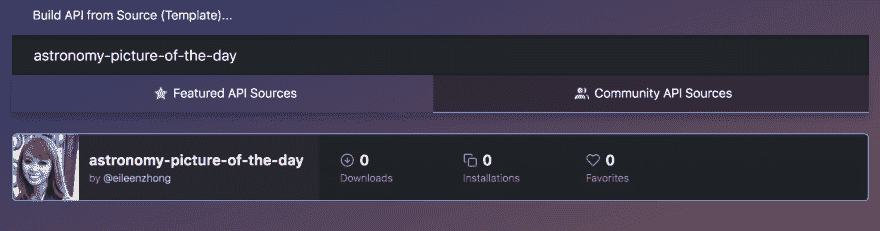
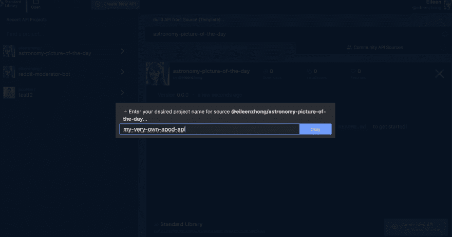
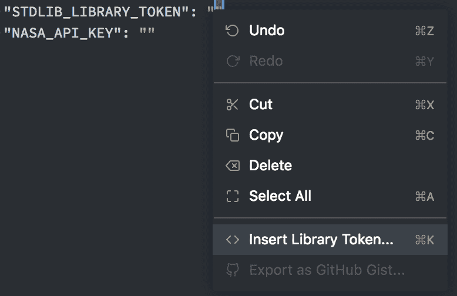
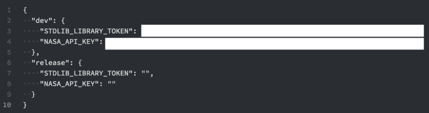
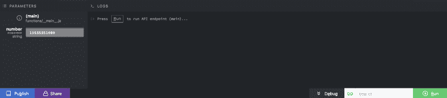
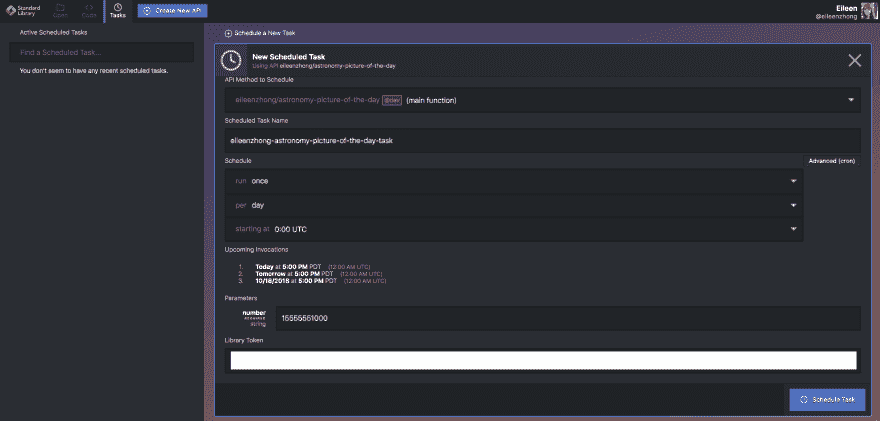
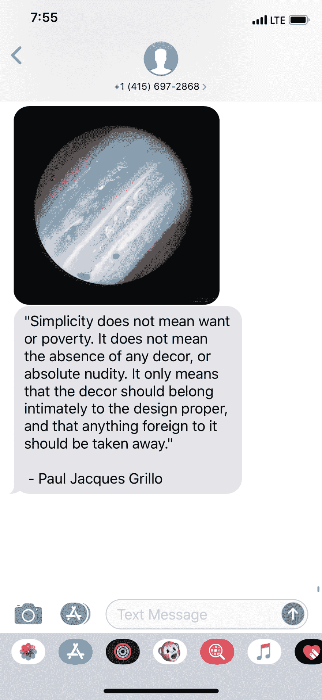

# 用标准库和 Node.js 给自己发一条 NASA 每日图片的短信

> 原文：<https://dev.to/eileenzhong/text-yourself-the-nasa-picture-of-the-day-with-standard-library-and-nodejs-5bnh>

[](https://res.cloudinary.com/practicaldev/image/fetch/s--fStdH3eI--/c_limit%2Cf_auto%2Cfl_progressive%2Cq_auto%2Cw_880/https://res.cloudinary.com/eileenstdlib/image/upload/v1539839937/APoD/0_aUCLxxSlMh5V_aGH.jpg)T3】

```
Me: The sky is not the limit ☁️
Stranger: Pics or I don't believe you 🙄 
```

[根据上面的对话，我将向你展示如何用](https://medium.com/@eileenzhong/text-yourself-the-nasa-picture-of-the-day-with-standard-library-and-node-js-226f6ca48adc)[标准库](https://www.stdlib.com)获得 NASA 的高度令人垂涎的**天文图片** (APoD)🌑 ⭐️

如果你不熟悉[标准库](https://www.stdlib.com)，我们是一个无服务器平台，让每个人(是的，每个人！致电所有项目经理、设计师、营销团队、销售人员、职业健康和工程师…🙋)在几秒钟内构建、发布和集成可伸缩的 API。在我们的在线文本编辑器 [Code.xyz](https://code.xyz) 的帮助下，你可以在浏览器上完成所有这些工作。

## **要求**

[标准库](https://www.stdlib.com)账号
[NASA](https://api.nasa.gov/) API 密匙(免费)

标准库提供了大量易于使用的 API 模板。为了检索 APoD API 模板，请访问 [Code.xyz](https://code.xyz) 并通过 [@eileenzhong](https://dev.to/eileenzhong) 搜索天文图片💁

[T2】](https://res.cloudinary.com/practicaldev/image/fetch/s--85ltJ18f--/c_limit%2Cf_auto%2Cfl_progressive%2Cq_auto%2Cw_880/https://res.cloudinary.com/eileenstdlib/image/upload/v1539839876/APoD/Screen_Shot_2018-10-16_at_1.47.39_PM.png)

命名你的 API:
[](https://res.cloudinary.com/practicaldev/image/fetch/s--Q_9SmyD7--/c_limit%2Cf_auto%2Cfl_progressive%2Cq_auto%2Cw_880/https://res.cloudinary.com/eileenstdlib/image/upload/v1539839876/APoD/Screen_Shot_2018-10-16_at_2.50.53_PM.png)

发送 APoD 到你的手机前的最后一步！

您需要正确配置`env.json`文件。你会注意到有两组变量。然而，我们将把代码部署到开发环境中，所以我们只需要提供开发变量。
首先，插入你的标准库库令牌(`STDLIB_LIBRARY_TOKEN`):

[T2】](https://res.cloudinary.com/practicaldev/image/fetch/s--Vm-hyQ5z--/c_limit%2Cf_auto%2Cfl_progressive%2Cq_auto%2Cw_880/https://res.cloudinary.com/eileenstdlib/image/upload/v1539839876/APoD/Screen_Shot_2018-10-16_at_2.53.21_PM.png)

然后，插入你的 [NASA API 密匙](https://api.nasa.gov/)。完成后，您的`env.json`文件应该如下所示:

[T2】](https://res.cloudinary.com/practicaldev/image/fetch/s--4WS1i8v6--/c_limit%2Cf_auto%2Cfl_progressive%2Cq_auto%2Cw_880/https://res.cloudinary.com/eileenstdlib/image/upload/v1539839876/APoD/Screen_Shot_2018-10-16_at_2.52.33_PM.png)

这就是你要做的所有设置！

要运行该程序，请单击“调试”以显示参数输入区。输入您的电话号码，包括国家代码:

[T2】](https://res.cloudinary.com/practicaldev/image/fetch/s--T8IiWXm_--/c_limit%2Cf_auto%2Cfl_progressive%2Cq_auto%2Cw_880/https://res.cloudinary.com/eileenstdlib/image/upload/v1539839876/APoD/Screen_Shot_2018-10-16_at_3.01.34_PM.png)

当你点击“运行”时，你会收到美国宇航局的当天天文图片！🚀

这还不是最酷的部分。

我们不想每天都点击“运行”来把这条短信发送到我们的手机上。幸运的是，[标准库](https://www.stdlib.com)有一个任务调度器，你可以定制一个调度来自动调用你新创建的 API。
在 [Code.xyz](https://code.xyz) 中，点击“任务”选项卡。然后，您可以输入电话号码，并根据自己的喜好定制日程安排:

[T2】](https://res.cloudinary.com/practicaldev/image/fetch/s--ZqItj9D4--/c_limit%2Cf_auto%2Cfl_progressive%2Cq_auto%2Cw_880/https://res.cloudinary.com/eileenstdlib/image/upload/v1539839877/APoD/Screen_Shot_2018-10-16_at_3.19.34_PM.png)

建议:将任务安排为每天执行一次，因为 APoD 是每日天文图片的缩写，因此，图片不会在一天中发生变化。

当您对设置满意时，单击蓝色的“调度任务”按钮来调度您的 API。
就是这样！如果你认识一个☝️、两个✌️或五个🖐人，他们会喜欢每天的天文照片，你可以为他们安排不同的任务(每个电话号码一个)。

* * *

## **奖金部分**

如果你已经走了这么远，你应该得到奖励🌈现在，不要太激动(实际上——一定要激动🙃).只需 2 行代码，您就可以向您的朋友发送随机报价和 APoD！

[T2】](https://res.cloudinary.com/practicaldev/image/fetch/s--bsNlOnFR--/c_limit%2Cf_auto%2Cfl_progressive%2Cq_auto%2Cw_880/https://res.cloudinary.com/eileenstdlib/image/upload/v1539839918/APoD/Image_from_iOS.png)

我们将使用 WordPress 的 API 来抽取一个随机引用:`http://quotesondesign.com/wp-json/posts?filter[orderby]=rand&filter[posts_per_page]=1`。