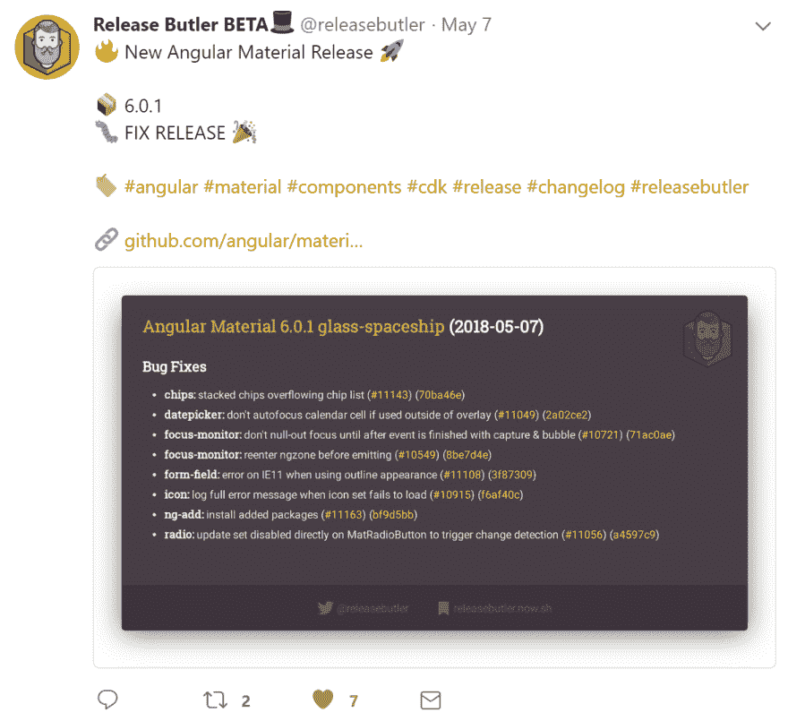

# 我从创建推特机器人中学到的 7 个最大的教训🐤🤖

> 原文：<https://dev.to/tomastrajan/the-7-biggest-lessons-ive-learned-by-building-a-twitter-bot--2nlk>

> 今天，我将与大家分享我在构建 Release Butler 时学到的最重要的经验。Release Butler 是一个 Twitter 机器人，它发布流行前端框架和库(如 Angular、React、Vue 或 Webpack)的漂亮风格的变更日志…

[T2】](https://res.cloudinary.com/practicaldev/image/fetch/s--ENLL7TIc--/c_limit%2Cf_auto%2Cfl_progressive%2Cq_auto%2Cw_880/https://thepracticaldev.s3.amazonaws.com/i/zwd2juw251owlh990ewi.png)

[阅读更多...](https://medium.com/tomastrajan/the-7-biggest-lessons-ive-learned-by-building-a-twitter-bot-59fee84a9ed9)