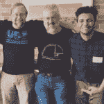

# 过去一周最受欢迎的 7 篇开发人员帖子

> 原文：<https://dev.to/devteam/the-7-most-popular-dev-posts-from-the-past-week-4j6k>

# 1。只是一个大泥球

阅读反模式是学习如何避免它们的好方法。Levi 分享了他最喜欢的 5 个反模式。

 [## 我“喜欢”反模式

### Levi Albuquerque 6 月 9 日 184 分钟阅读

#designpatterns #development #codesmells](/levimoreira/i-love-anti-patterns-1bj1)

# 2。关键差异&相似之处

版本控制上周接管了科技新闻。在这篇文章中，我们了解了两个最流行的版本控制库管理系统之间的主要区别和相似之处。

 [## GitHub VS GitLab

### khondoker Yasin ah NaF Prio 6 月 5 日 181 分钟阅读

#github #gitlab #microsoft #acquisition](/ahnafy/github-vs-gitlab-1eo7)

# 3。调和算法，有人吗？

萨梅尔深入分析了他们认为 React 是前端开发如此受欢迎的工具的原因。在这篇文章中，他们讨论了虚拟 DOM、设计概念、facebook 的影响等等。

 [## 是的，React 正在接管前端开发。问题是为什么。

### 萨梅尔布纳 6 月 6 日 1814 分钟阅读

#javascript #webdev #react #programming](/samerbuna/yes-react-is-taking-over-front-end-development-the-question-is-why-4mad)

# 4。一个爱情故事

Sarah 分享了她如何将与 CSS 的不愉快关系转变为健康关系。这篇文章分享了如何学习 CSS 以及为什么应该放弃库的技巧。

 [## 与 CSS 保持良好的关系

### 莎拉奇马 6 月 4 日 185 分钟阅读

#css #dev](/sarah_chima/having-a-good-relationship-with-css-f1e)

# 5。很简单！

...*不是*。

投资购买新显示器时，有许多因素需要考虑，尤其是在开发软件时。Nick 分享了他最终决定购买 Dell UltraSharp U2515H 25 英寸屏幕 LED 显示器的原因。考虑的因素包括:PPI、分辨率、色彩准确度、刷新率等等。

 [## 如何为软件开发挑选一款好的显示器

### nick Janetakis 6 月 5 日 18 时 16 分阅读

#productivity #webdev #beginners](/nickjj/how-to-pick-a-good-monitor-for-software-development-4oln)

# 6。感觉很好。它像预期的那样工作。很快。

对于那些有兴趣学习强大而简单的 Javascript 框架 Vue.js 的人来说，这是一个很好的教程。

 [## 用 Vue.js 和 Node 构建一个基本的 CRUD App

### 奥克塔的巴黎白兰地

#javascript #vue #webdev #node](/oktadev/build-a-basic-crud-app-with-vuejs-and-node-4cl8)

# 7。给我 15 分钟！

为了编写一个高效的程序，理解时间复杂性的基本概念是很重要的。在这篇文章中，Vicky 向我们介绍了大量使用的食物隐喻👌

## 文章不再可用

我们的每周总结到此结束！请关注 dev.to 本周的每日内容和讨论...如果您遗漏了任何内容，我们将在下周一进行回顾！