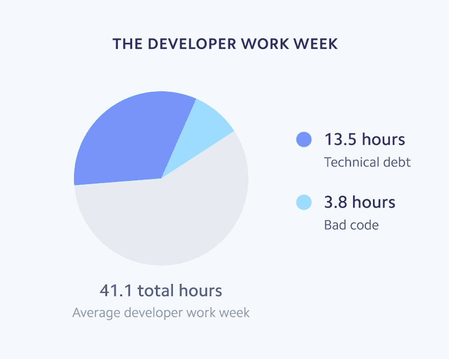
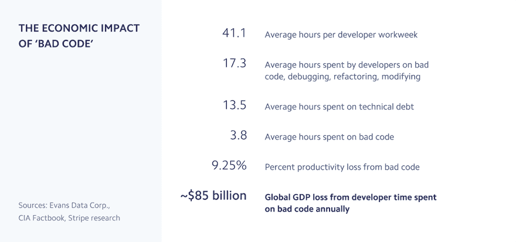

# 糟糕代码的 850 亿美元成本

> 原文：<https://dev.to/pullrequest/the-85-billion-cost-of-bad-code-3dmc>

Stripe 和 Harris Poll 最近的一项研究发现，开发人员平均花费 42%的时间处理技术债务和维护问题，其中 3.8 个小时花在调试“坏代码”，或者难以维护的低质量代码上。坏代码的机会成本每年高达 850 亿美元——这些资源本可以用来开发更好的软件。

[T2】](https://res.cloudinary.com/practicaldev/image/fetch/s--9spNHffl--/c_limit%2Cf_auto%2Cfl_progressive%2Cq_auto%2Cw_880/https://thepracticaldev.s3.amazonaws.com/i/sfhi912efybhwxfktek4.png)

建立一个健康的代码评审过程可以通过强调编写可读、可维护的代码的需求来帮助解决这些问题。我们已经在我们的博客上讨论了代码审查的一些好处，但是 Stripe 的研究关注了糟糕代码的经济影响。

[T2】](https://res.cloudinary.com/practicaldev/image/fetch/s--BRynbe75--/c_limit%2Cf_auto%2Cfl_progressive%2Cq_auto%2Cw_880/https://thepracticaldev.s3.amazonaws.com/i/n5526yygznbh8vlk81sn.png)

公司可以通过考虑以下几点来帮助他们的开发团队:

1.  **了解你的总成本**。59%的开发人员强烈同意他们的公司花费了过多的时间与糟糕的代码作斗争。技术债务需要解决，你可以利用[代码审查即服务](https://www.pullrequest.com/?utm_medium=referral&utm_source=dev.to)或外包支持来补充你的开发团队。在评估增加支持的成本和收益时，记住要考虑技术债务和维护问题的机会成本，以及对团队和个人士气的负面影响。

2.  **雇佣额外的开发支持人员**。Stripe 研究不是问你是否有能力雇佣更多的开发人员，而是问你是否认为你能负担得起*而不是*的费用。编写高质量的代码需要时间，在即将到来的截止日期和相互竞争的优先级下，79%的开发人员认为他们没有足够的时间来修复质量差的代码。负责任地扩展您的开发资源的一个方法是使用我们的按需审查员网络。

3.  **优先考虑开发人员的时间**。最后，并不是所有的开发人员都喜欢或擅长维护任务。专业化可以帮助团队变得更有效率，也可以带来更快乐、更有生产力的开发人员。与您的开发团队一起工作，确定花在编写新代码和维护代码上的时间的正确组合。

*这篇文章最初发布在 [PullRequest 的博客](https://www.pullrequest.com/blog/?utm_medium=referral&utm_source=dev.to)上。让您的代码接受专业评审员的评审:[今天就报名](https://www.pullrequest.com/?utm_medium=referral&utm_source=dev.to)参加 PullRequest*