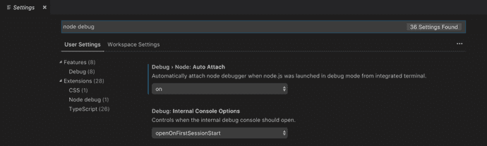
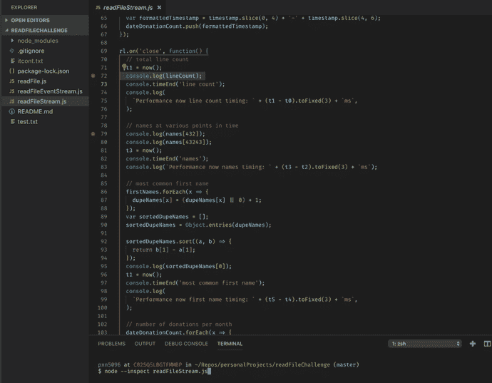
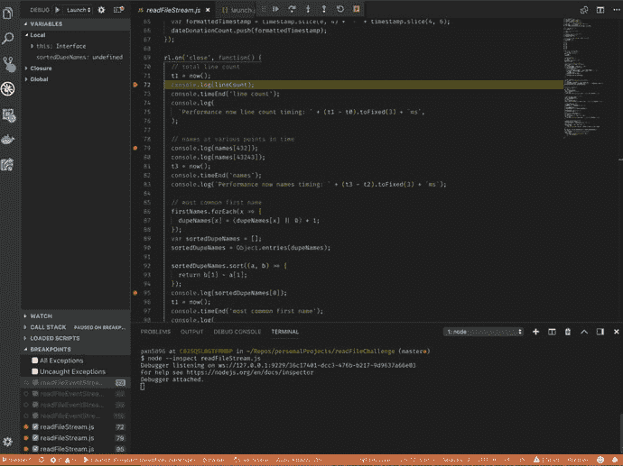
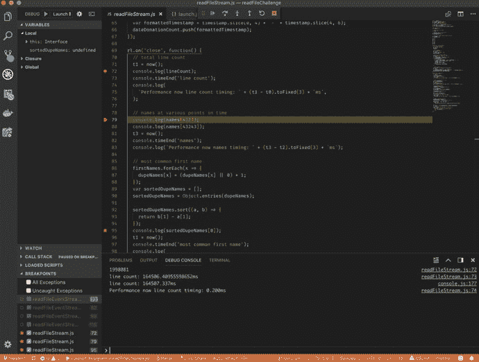
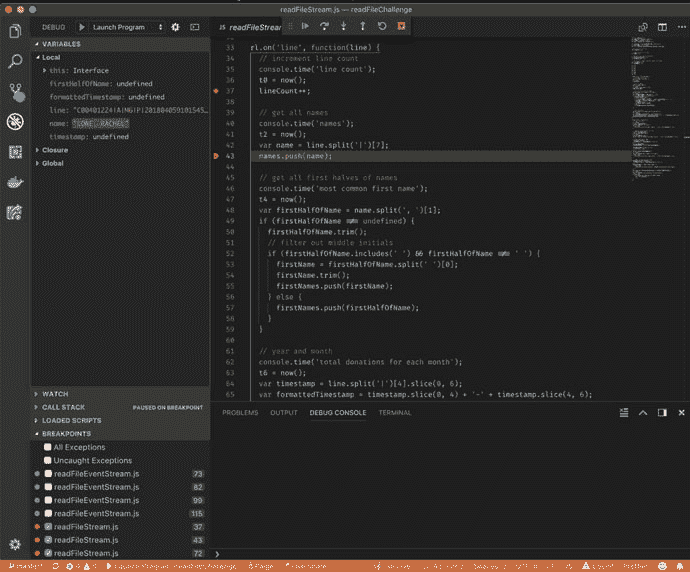

# 调试 Node.js 最简单的方法——用 VS 代码

> 原文：<https://dev.to/paigen11/the-absolute-easiest-way-to-debug-nodejs-with-vs-code-n4h>

[T2】](///static/2b3d6f647f82975bb41ff9d832f237bd/41099/most-interesting-man.jpg)

## 进入 Node.js 中调试的痛苦

如果您曾经有幸为 Node.js 项目编写代码，那么当我说调试它以找出问题所在并不是一件容易的事情时，您应该知道我在说什么。

与浏览器中的 JavaScript 或具有 IntelliJ 等强大 IDE 的 Java 不同，您不能只是在任何地方设置断点，刷新页面或重启编译器，并缓慢地遍历代码检查对象，评估函数并找到突变或缺失的变量等。你就是不能，而且很臭。

但是节点*是可以调试的，只需要多花点力气。*

让我们回顾一下调试选项，然后我将向您展示我在自己的开发中遇到的调试 Node.js 的最简单方法。

* * *

## node . js 中调试的选项

有很多方法可以调试你行为不端的 Node.js 程序，我在下面列出了它们，如果你愿意的话，可以通过链接了解更多。

*   **`console.log()`**——屡试不爽的待机，如果你曾经写过一行 JavaScript，这个真的不需要进一步解释。它内置于 Node.js 并在终端中打印，就像内置于 JavaScript 并在浏览器控制台中打印一样。

在 Java 中，它是`System.out.println()`，在 Python 中是`print()`——你明白了。这是最容易实现的方法，也是在干净的代码中添加额外信息的最快方法——但它也可以(有时)帮助您找到并修复错误。

*   **Node.js 文档`—-inspect`**——node . js 文档本身明白调试并不容易，所以他们制作了一个[方便的参考资料](https://nodejs.org/en/docs/guides/debugging-getting-started/)来帮助人们入门。

这很有用，但是说实话，除非你已经编程一段时间了，否则这并不是最容易理解的东西。它们很快就掉进了 UUIDs、WebSockets 和安全隐患的兔子洞，我开始感到力不从心。我对自己说:一定有一种不那么复杂的方法来做这件事。

*   **Chrome DevTools**——[保罗·爱尔兰](https://medium.com/@paul_irish)早在 2016 年就写了一篇关于使用 Chrome dev tools 调试 Node.js 的很棒的[博文](https://medium.com/@paul_irish/debugging-node-js-nightlies-with-chrome-devtools-7c4a1b95ae27)(2018 年更新)，从表面上看，这听起来很简单，并且像是调试的一大进步。

快进了半个小时，我仍然没有成功地将 DevTools 窗口连接到我的简单节点程序，我不再那么确定了。也许我只是不能遵循指示，但 Chrome DevTools 似乎使调试变得比它应该的更复杂。

*   JetBrains 是我最喜欢的软件开发公司之一，也是 IntelliJ 和 WebStorm(仅举几个例子)的开发者之一，JetBrains 很棒。他们的工具有一个奇妙的插件生态系统，直到最近，他们毫无疑问是我的首选 IDE。

有了这样一个专门的用户群，就出现了许多有用的文章，如 [this](https://www.jetbrains.com/help/webstorm/running-and-debugging-node-js.html) ，它们遍历调试节点，但类似于节点文档和 Chrome DevTools 选项，这并不容易。在 WebStorm 准备就绪之前，您必须创建一个调试配置，附加正在运行的进程，并在首选项中做好一些配置。

*   **Visual Studio 代码** —这是我的节点调试新黄金标准。我从没想过我会这么说，但我完全相信 [VS 代码](https://code.visualstudio.com/download)，团队发布的每一个新功能都让我更喜欢这个 IDE。

VS 代码做了所有其他调试 Node.js 的选项都做不到的事情，让它变得简单而愚蠢。如果你想对你的调试更感兴趣，你完全可以，但是他们把它分解成足够简单，任何人都可以很快上手并运行，不管你对 ide、Node、编程等有多熟悉。太棒了。

### 在 Node.js 中设置 VS 代码进行调试

[T2】](///static/199d8fdb67eb993e64ede4914b3de748/cb69c/caveman-could-do-it.jpg)

抱歉，我无法抗拒这个迷因——它实在是太合适了。

好了，让我们来看看如何设置 VS 代码来调试节点。我假设你已经从我上面发布的[链接](https://code.visualstudio.com/download)下载了 VS 代码，所以我们准备开始设置它。

在 VS 代码中，打开**首选项>设置**，在搜索框中输入“节点调试”。在**扩展**选项卡下，应该有一个名为“节点调试”的扩展。从这里，点击第一个框:**调试>节点:自动连接**并设置下拉框为“开”。你现在差不多可以走了。是的，真的很简单。

[T2】](///static/1a398051fda9add9c6716bcc57ec6bac/2cefc/debug-settings.png)

*这里是你应该在设置标签下看到的。将第一个下拉“调试>节点:自动连接”设置为“开”。*

现在，转到 Node.js 项目文件，通过单击文件左侧您希望看到代码停止的地方来设置一些断点，并在终端中键入`node --inspect <FILE NAME>`。现在看着奇迹发生…

[T2】](///static/db0ccfb3589f6534cc33d7292976344d/2cefc/debug-breakpoints.png)

看到文件左侧的红色断点了吗？看到终端里的`node — inspect readFileStream.js`了吗？就是这样。

### VS 代码调试在行动

如果你需要一个 Node.js 项目来测试这个，你可以在这里下载我的 repo。它是用来测试 Node 的不同形式的大量数据流的，但是对于这个演示来说，它工作得非常好。如果你想了解更多关于节点和性能优化的流数据，你可以在这里看到我的帖子和。

一旦您按下 Enter，您的 VS 代码终端应该在底部变成橙色，表示您处于调试模式，并且您的控制台将打印一些类似于`"Debugger Attached"`的消息。

[T2】](///static/0bfea42b784b3e3ee4d6b3d8d675c448/2cefc/debugger-attached.png)

橙色工具栏和“附加调试器”消息会告诉你 VS 代码在调试模式下运行正常。

一旦您看到这种情况，恭喜您，您正在 Node.js 中以调试模式运行！

现在，您可以在屏幕的左下角看到您的断点(并且可以通过复选框打开和关闭它们)，并且您可以像在浏览器中一样通过小的 play、step over、step in、restart 等来单步执行代码。IDE 顶部中间的按钮。VS 代码甚至用黄色突出显示了断点和您已经停止的那一行，这样更容易理解。

[T2】](///static/7f1c681df553f4b755b52648ac6ae1dd/2cefc/debugger-step-through.png)

点击顶部的播放按钮，从代码中的一个断点跳到下一个断点。

当您从一个断点跳到另一个断点时，您可以看到程序在 VS 代码 IDE 底部的调试控制台中打印出了`console.log`,黄色突出显示也将跟随您。

[T2】](///static/50f23904e7f0fbd1e41f2f9b5933bdca/2cefc/debugger-step-through-2.png)

如你所见，当我们停在断点上时，我们可以在 VS 代码的左上角看到所有我们可以在控制台中浏览的本地范围信息。

正如您所看到的，随着程序的进展，我越深入断点，越多的输出到调试控制台，并且在这个过程中，我可以使用 VS 代码左上角的工具探索本地范围内的对象和函数，就像我可以在浏览器中探索范围和对象一样。不错！

一点都不痛苦，是吧？

* * *

## 结论

Node.js 调试不必像过去那样令人头疼，也不需要涉及代码库中的 500 个 console.log()来找出 bug 在哪里。

Visual Studio 代码的 Debug > Node: Auto Attach 设置使它成为了过去，我个人非常感激。

过几周再来看看，我会写关于使用 Puppeteer 和 headless Chrome 进行端到端测试，或者使用 Nodemailer 在 MERN 应用程序中重置密码的文章，所以请关注我，以免错过。

如果你想确保你不会错过我写的一篇文章，在这里注册我的时事通讯:[https://paigeniedringhaus.substack.com](https://paigeniedringhaus.substack.com)。

感谢您的阅读，我希望这能让您了解如何在 VS 代码的一点帮助下更容易、更有效地调试 Node.js 程序。

* * *

## 参考文献&进一步资源

*   [Github，节点读取文件报告](https://github.com/paigen11/file-read-challenge)
*   Node.js 文档，[检查员](https://nodejs.org/en/docs/guides/debugging-getting-started/)
*   Paul Irish 关于使用 Chrome DevTools 调试 Node.js 的博客
*   JetBrains 文档，[运行和调试 Node.js](https://www.jetbrains.com/help/webstorm/running-and-debugging-node-js.html)
*   [Visual Studio 代码下载](https://code.visualstudio.com/download)
*   VS 代码[调试 Node.js 文档](https://code.visualstudio.com/docs/nodejs/nodejs-debugging#_attaching-to-nodejs)