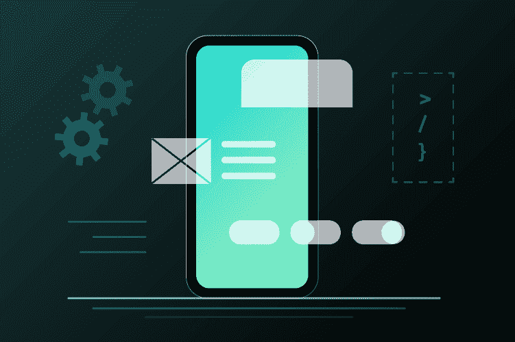
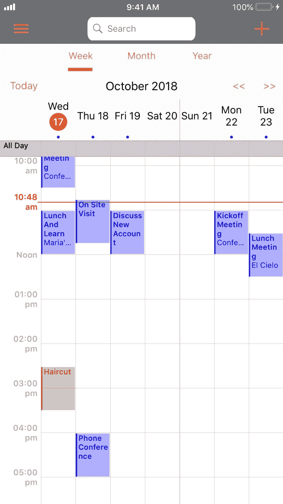
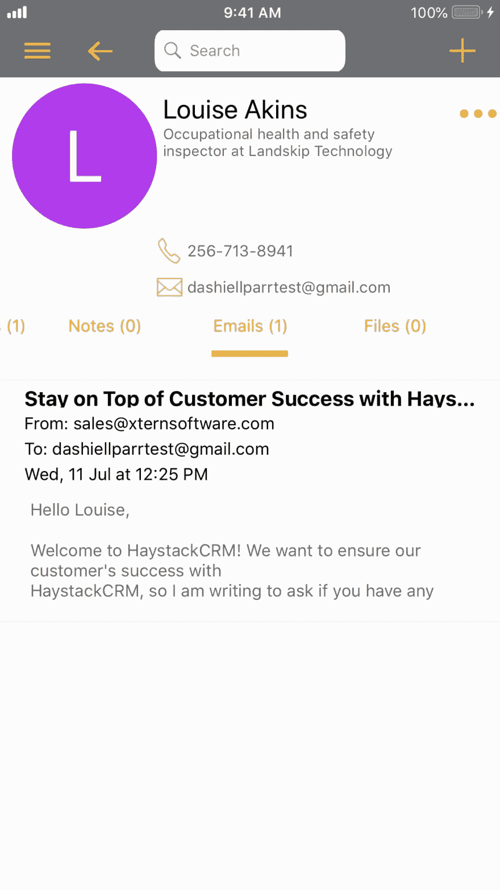
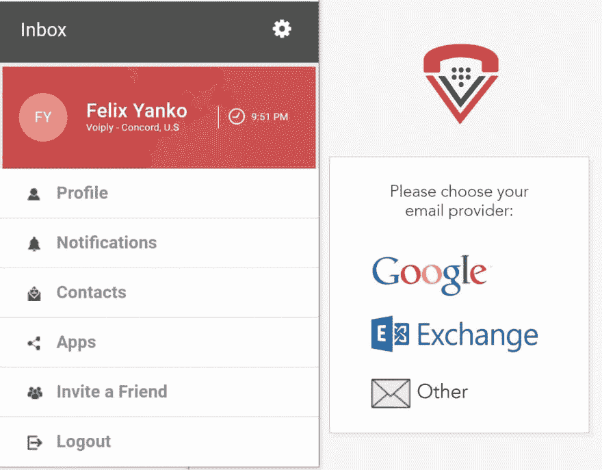

# Android 和 iOS 应用程序开发人员的 API 优势

> 原文：<https://dev.to/nylas/the-api-advantage-for-android-and-ios-application-developers-3knn>

[T2】](https://www.nylas.com/blog/building-android-and-ios-applications-with-the-nylas-api)

在移动应用领域，将用户需要的核心功能快速推向市场至关重要。这就是为什么我们创建了 Nylas API，来帮助开发人员构建他们梦想中的移动应用程序，而不必担心通信层。

开发移动应用程序的开发者使用 Stripe API 进行支付，Twilio API 用于短信，Nylas API 用于电子邮件、日历和联系人。 Nylas 的 [电子邮件](https://www.nylas.com/email-api) API、 [联系人](https://www.nylas.com/sync-contacts) API，以及 [日历](https://www.nylas.com/calendar-sync) API 为 Voiply(基于云的电话系统)和 Haystack CRM 等公司的 Android 和 iOS 应用提供支持。

那么你能用 Nylas API 构建什么呢？让我们开始吧。

**调度【Android 和 iOS 应用的日历同步**

通过为您的应用提供日历同步功能，确保您的移动应用的最终用户永远不会错过会议。Nylas Calendar API 连接到 100%的日历提供商，支持您的移动应用程序和用户的特定日历提供商(谷歌日历、Exchange 日历、Outlook.com 日历等)之间的日程安排和日历同步功能。

[HaystackCRM](https://www.haystackcrm.com/) ，一个用于联系和销售渠道管理的移动第一 CRM，使用 Nylas API 将日程安排&日历同步内置到他们的应用程序中。

现在，用户可以选择连接他们的日历帐户，以便在 HaystackCRM 中查看和安排活动。

[T2】](https://res.cloudinary.com/practicaldev/image/fetch/s--DvXhvqHG--/c_limit%2Cf_auto%2Cfl_progressive%2Cq_auto%2Cw_880/https://cdn2.hubspot.net/hubfs/3314308/HaystackCRM%2520calendar%2520iPhone%2520screenshot%2520Oct%252018.jpg)

(干草堆日历同步)

**以周为单位建立日历同步，而不是以月为单位**

*   仅仅在一次内部黑客马拉松中，一名工程师仅仅使用 Nylas Calendar API 作为他们的框架，就花了一天时间来构建他们强大的调度工具。其结果是一个强大的日程安排工具，统一所有用户的日历同步，不管平台。

**功能丰富的日历功能**

*   他们还构建了功能丰富的功能，提供了用户安排会议所需的一切。用户可以完全实时地创建、阅读、更新和删除日历事件。因此，所有用户都能够快速预订和取消约会，设置约会提醒，甚至查看跨平台的生产力分析—所有这些都在 iOS 应用程序中完成。

**要点:** 借助强大的日历 API，您的团队可以在减少开发时间的同时，率先构建其他核心功能。

**iOS 设备安卓系统上的邮件同步**

HaystackCRM 还使用 Nylas API 来消除 CRM 到电子邮件集成中的摩擦。他们需要找到一种方法，将他们的 CRM 集成到 Office365、Outlook.com、Exchange 和 IMAP 电子邮件提供商中，并根据他们的业务进行扩展。使用 Nylas API 让 HaystackCRM 在最初的产品之外有了更多的电子邮件管理选择。由 Nylas API 支持的特性允许 HaystackCRM 用户在使用 HaystackCRM 时保持使用以前的电子邮件地址、电子邮件客户端和日历的舒适度。

T4】

(草堆邮件同步)

**双向电子邮件同步**

*   Nylas 电子邮件 API 在单个用户的收件箱和客户的 CRM 之间提供无缝的双向电子邮件、日历和联系人同步。从那里，用户可以在应用程序内编写和发送电子邮件，通过最大限度地减少上下文切换的需要，并消除 CRM 和应用程序之间的任何手动数据输入的需要，节省了大量时间。

**群组电子邮件帐户**

*   该客户的应用程序也能够更好地创建更复杂的电子邮件到 CRM 的同步功能。例如，在 Nylas 电子邮件 API 的帮助下，CRM 用户可以对电子邮件帐户进行分组，从而在整个团队中实现更快、更有效的协作。例如，如果一名团队成员正在休假或生病，任何团队成员都可以简单地登录应用程序，并在应用程序中查看最近的客户互动。

**关键要点**:虽然在开发跨平台 CRM 集成功能时通常会非常复杂，但一个直观的 API 允许开发人员动态构建强大的新 CRM 功能。

**Android 和 iOS 应用的联系人同步**

VoIPLy 提供简单可靠的电话解决方案，帮助企业更好地为客户服务。他们基于云的统一通信系统包含 60 多种强大的电话功能，使用户能够随时随地开展业务。

当客户点击联系人时，该应用程序与 Nylas 集成，以同步他们所有的联系人。VoIPLy 还为他们的电话系统创建了一个日历应用程序，使系统能够向呼叫者读出日历上的事件。

[T2】](https://res.cloudinary.com/practicaldev/image/fetch/s--khassl6E--/c_limit%2Cf_auto%2Cfl_progressive%2Cq_auto%2Cw_880/https://cdn2.hubspot.net/hubfs/3314308/image003.jpg)

(用户通过 Nylas API 认证联系人同步)

**与联系人同步的最新联系人档案**

*   Nylas Contacts API 将用户通讯录中的个人资料信息同步到移动应用程序，然后再同步回来。如果用户地址簿中的个人照片、电子邮件地址、物理地址、电话号码或任何其他重要信息更新，您的移动应用程序也会立即更新。

**快速无摩擦集成**

*   使用 Nylas docs，集成 API 几乎是即时的。一周之内，开发团队就能够完成概念验证，并将 API 部署到他们的生产环境中。

**要点:** 合适的联系人 API 可显著缩短您的功能开发时间，确保您快速构建最动态的联系人同步功能。

这些只是我们的客户在其应用程序中发展电子邮件和日历功能的众多用例中的一部分。你准备好用 Nylas 改造你的 Android 或 iOS 应用了吗？ [从这里开始。](https://dashboard.nylas.com/register?hsCtaTracking=c8077637-e759-48f2-9ce5-66ab017d65bb%7Cfc079ea6-d244-49a9-8521-93a5870c6bee)