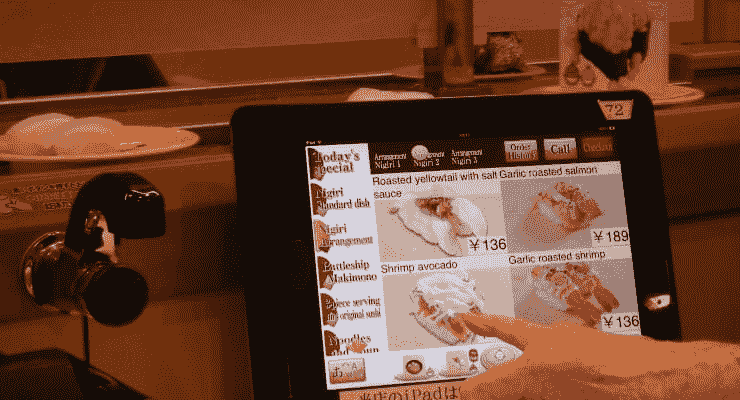
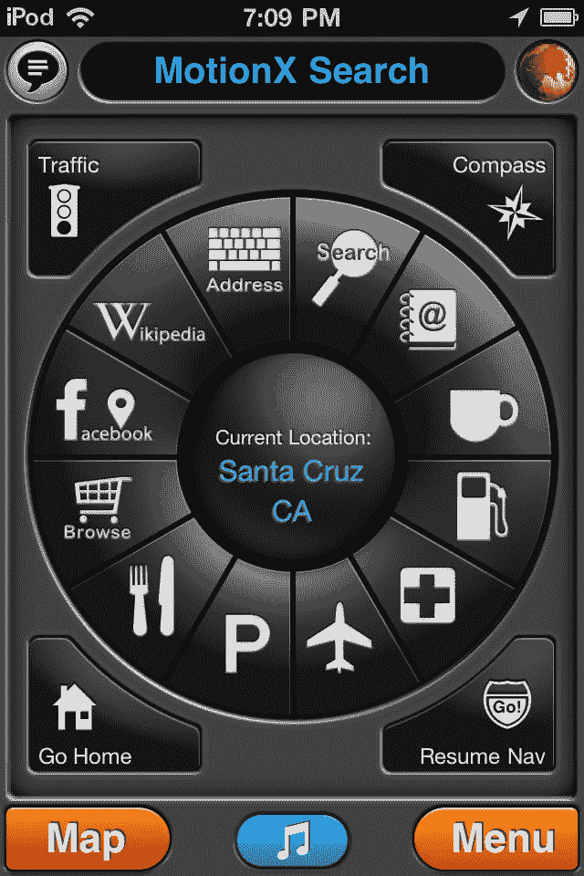
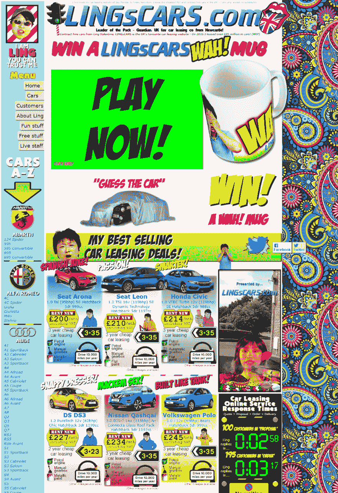
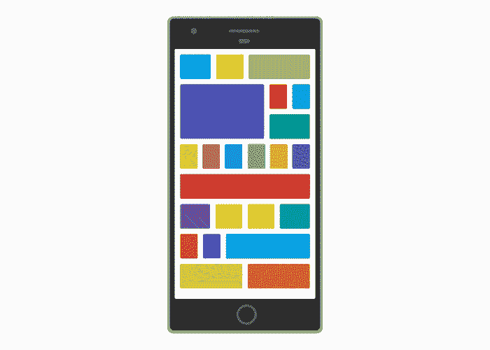
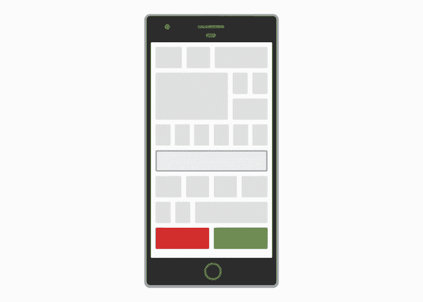
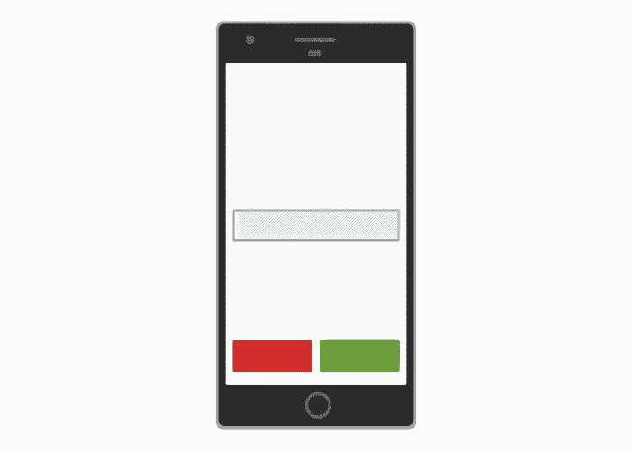

# UX 的极简艺术

> 原文：<https://dev.to/oninross/the-art-of-minimalism-with-ux-4ppd>

极简主义正在兴起——但它是什么？是建筑、绘画、雕塑和设计中的艺术风格消除了所有非必要的形式或特征吗？或者这是一种生活方式，让你的生活摆脱所有不必要的事情。

不管什么是极简主义，它都有一个共同点——“消除不需要的东西，排除一切干扰。”我发现极简主义是如何帮助改善用户体验的。

## 极简主义之旅

在我完全理解它的核心概念之前，我就迷上了极简主义。我的[在线作品集](https://www.infiniteimaginations.co/#/hello/)是时候重新设计了，我希望它有一个简单的外观和永恒的设计。我尝试应用它，结果被网页设计师仓库评为[最佳新作品集网站之一，2017 年 1 月](https://www.webdesignerdepot.com/2017/01/the-best-new-portfolio-sites-january-2017/)。它收到了以下评论:

*“无限想象”结合了一点“科技”风格与**极简主义**、低调的动画和元素周期表。我不是在开玩笑。虽然这个设计确实有其(微小的)缺陷，但其**保留下来的风格感既吸引人又让人放松**- Ezequiel Bruni(网页设计师仓库)*

在我的一个个人项目中，我再次尝试了极简主义。这个项目本该是一个信标实验，结果会有所不同。这是一个渐进式网络应用程序(PWA ),它告诉用户下一辆公交车将于何时到达。我让项目运行了一段时间，收到了以下评论:

*“很棒的 app。真的真的很喜欢它，特别是在每次上 nxtbus 网站后，我都必须检查我是否已经错过了我的公交车，并且也是一个常规的公交车用户。也很**美观**。干得好，伙计们👍”*

最后，我在网飞看了一部名为《极简主义:关于重要事物的纪录片》的纪录片我没有读整个标题，我读的都是极简主义，我看它的前提是我将学习艺术和设计中的极简主义。在视频播放的五分钟里，我体验了一次不同的旅程。这部纪录片通过展示各行各业的极简主义者努力用更少的资源过上有意义的生活来吸引观众。我发现极简主义也可以应用在一个人的生活方式中。

这让我进一步思考。也许极简主义可以应用于任何地方——在一个人的生活方式中，在设计和开发中。这些基本原则有一个共同的因素，简单有助于改善人们的福祉。如果极简主义可以帮助改善一个人的福祉，也许它也可以帮助改善用户体验。

## 今日用户体验

人们已经被每天不同类型的干扰所困扰。想想我们的智能设备。我们可以收到来自社交媒体、媒体和应用程序的数百条通知，告诉我们问候我们的朋友生日快乐，你一直关注的这个人买了一件新衬衫，或者一个应用程序只是告诉你从座位上站起来四处走走。有一个高速连接的互联网，人们可以打开多个标签，无休止地滚动页面和点击诱饵页面。不管这是哪一种干扰，它都将用户的注意力从手头的主要任务上转移开了。

### 餐厅亭

我有过的最糟糕的用户体验之一是在餐馆用 iPads 点菜。一些餐馆认为用 iPad 代替服务器会更有效率。在某些情况下，这可能是真的。但也不总是这样，比如下面这样的界面...

[T2】](https://res.cloudinary.com/practicaldev/image/fetch/s--9vye2omr--/c_limit%2Cf_auto%2Cfl_progressive%2Cq_auto%2Cw_880/http://adelphi.digital/articles/the-art-of-minimalism-with-ux/iPad-menu.jpg)

这个形象对我的经历来说绝对是太善良了。上面的图片已经很不错了(我找不到一张界面混乱的 iPad 图片)。我们看到的那家有很多“广告”,推销餐馆的东西，很难找到我们想要的食物。仅仅因为在餐馆里有一台 iPad 并不意味着它就是高科技或潮流。管理层还需要考虑用户将如何使用它。

### 应用和网站

无数次，我看到了令人痛苦的应用程序和网站，以至于我希望我能看到所有的它们。整个网站或应用程序的页面过于混乱，分散了用户执行主要任务的注意力。

曾经有一段时间，构建应用程序是解决一切问题的方法。尝试在一个 4 英寸的显示器上安装每一个功能是必须的，为用户提供一切。比如下面的例子。它有太多的功能轰炸用户压倒他们什么或如何使用应用程序。

[T2】](https://res.cloudinary.com/practicaldev/image/fetch/s--AUgah3Jw--/c_limit%2Cf_auto%2Cfl_progressive%2Cq_auto%2Cw_880/http://adelphi.digital/articles/the-art-of-minimalism-with-ux/motionx.jpg)

另一个最臭名昭著的网站是每个设计师的噩梦，凌的汽车。它打破了设计中的几乎所有规则，特别是试图关注用户的需求。这不是最漂亮的网站(双关语)。它只是混淆了这个网站实际上在做什么的所有用户。

[T2】](https://res.cloudinary.com/practicaldev/image/fetch/s--4UXqJqgH--/c_limit%2Cf_auto%2Cfl_progressive%2Cq_auto%2Cw_880/http://adelphi.digital/articles/the-art-of-minimalism-with-ux/lingscars.jpg)

## UX 法律

设计者和开发者在设计和开发用户界面时可以考虑一系列原则，这些原则被称为 UX 定律。我亲手挑选了一些与极简主义相关的作品。

[T2】](https://res.cloudinary.com/practicaldev/image/fetch/s--R_j3z3cq--/c_limit%2Cf_auto%2Cfl_progressive%2Cq_66%2Cw_880/http://adelphi.digital/articles/the-art-of-minimalism-with-ux/cover.gif)

### 费茨定律

获取目标的时间是目标的距离和大小的函数

[T2】](https://res.cloudinary.com/practicaldev/image/fetch/s--pELhtTmi--/c_limit%2Cf_auto%2Cfl_progressive%2Cq_66%2Cw_880/http://adelphi.digital/articles/the-art-of-minimalism-with-ux/Fitts%27s-Law.gif)

行动号召是我们希望用户点击的元素，通常是有对比色的按钮，上面有简短清晰的文字说明如果用户点击会发生什么。我们只需要通过设计一个简洁易懂的界面来帮助我们的用户容易地找到和选择这些元素，因为极简主义的特点之一就是清晰。

### 希克斯定律

做决定所需的时间随着选择的数量和复杂程度而增加

[T2】](https://res.cloudinary.com/practicaldev/image/fetch/s--FqLI48kB--/c_limit%2Cf_auto%2Cfl_progressive%2Cq_66%2Cw_880/http://adelphi.digital/articles/the-art-of-minimalism-with-ux/Hick%27s-Law.gif)

复杂的界面只会让用户不知所措，阻碍甚至出错。我们只需要让它对我们的用户简单。确定最终目标是什么，并帮助用户以最简单的方式达到目标。极简主义的另一个特点是去除所有的杂物或去除非功能性的装饰元素。这样，界面可以立即让用户关注下一个动作是什么。这里的经验法则是“如果它不能让用户达到他们的最终目标，那就扔掉它。”

### 雅各布定律

用户把大部分时间花在其他网站上。这意味着用户更喜欢你的网站像他们已经知道的所有其他网站一样工作。”

[T2】](https://res.cloudinary.com/practicaldev/image/fetch/s--1_ryuvH7--/c_limit%2Cf_auto%2Cfl_progressive%2Cq_66%2Cw_880/http://adelphi.digital/articles/the-art-of-minimalism-with-ux/Jakob%27s-Law.gif)

对任何用户来说，学习新东西可能是有趣或痛苦的经历。极简主义关注每一个元素的功能性，确保元素不费力地被理解。通过向用户展示在其他网站或日常界面中可以找到的熟悉元素或常见设计模式，它简化了用户的学习过程。

### 米勒定律

“一般人只能在工作记忆中保留七个(正负两个)项目。”

对于一个人的记忆来说，复杂性可能是一项令人疲惫的工作，尤其是在今天每天都有干扰的情况下。极简主义经常与简单联系在一起。通过简化界面和/或过程，它帮助用户有一个简单有效的方法来实现他们的目标。限制用户为了完成一项任务而必须记住的行为或事情。

## 接吻原理

超载、杂乱和混乱不是信息的属性，而是设计的失败——[爱德华·塔夫特](http://adage.com/article/adagestat/edward-tufte-adagestat-q-a/230884/)T3】

人们总是会被鲜艳的颜色和华丽的设计所吸引。他们总是说“越大越好”。他们已经被自己的干扰淹没了，所以让他们更容易完成他们的主要任务。我们可能不知道，但潜意识里，我们倾向于寻找简单的解决方案。极简主义是一种哲学，一种运动，一种生活方式。不管你想怎么称呼它，或者你想怎么使用它，极简主义提倡去除不必要的元素，保持一切简单而不失去意义和清晰。永远后退一步记住，*“保持简单，笨蛋”*。

## 交互设计基础

IDF 是一个独立的非营利组织，其目标是“将全球设计教育提升到常春藤联盟的水平，同时尽可能降低成本。”

IDF 让我成为了教育合作伙伴。[通过我的链接](https://www.interaction-design.org/invite?ep=nino-ross-rodriguez)注册，获得 3 个月的免费会员资格，并开始学习伟大的 UX 设计。

你对 UX 设计感兴趣或不熟悉吗？获得交互设计基金会的免费电子书！

访问交互设计基金会获取更多 [UX 设计文章](https://www.interaction-design.org/literature/topics/ux-design)。

订阅[交互设计基金会简讯](https://www.interaction-design.org/newsletter?ep=nino-ross-rodriguez)获得每周高质量的教育资料。