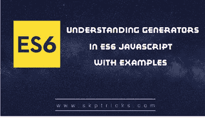

# ES6 生成器的基础——Javascript

> 原文：<https://dev.to/skptricks/the-basics-of-es6-generators---javascript-23l7>

帖子链接:[ES6 生成器基础- Javascript](https://www.skptricks.com/2018/10/the-basics-of-es6-generators-javascript.html)

对于 ES6 生成器，我们有一种不同的功能，可以在中间暂停一次或多次，稍后恢复，允许其他代码在这些暂停期间运行。

function*声明(function 关键字后跟一个星号)定义了一个生成器函数，该函数返回一个生成器对象。

语法:
一、新声明语法:
function *addnumber() {
//...
}
[ES6 生成器基础知识- Javascript](https://www.skptricks.com/2018/10/the-basics-of-es6-generators-javascript.html)

[T2】](https://res.cloudinary.com/practicaldev/image/fetch/s--Z6UevYsg--/c_limit%2Cf_auto%2Cfl_progressive%2Cq_auto%2Cw_880/https://3.bp.blogspot.com/-XhR2CaeJE3M/W8oKAFPha_I/AAAAAAAACCs/MnKDQ_jtCjg8kgF9lirPAfa0CupLcsWhQCLcBGAs/s400/gene.png)

[阅读更多...](https://www.skptricks.com/2018/10/the-basics-of-es6-generators-javascript.html)