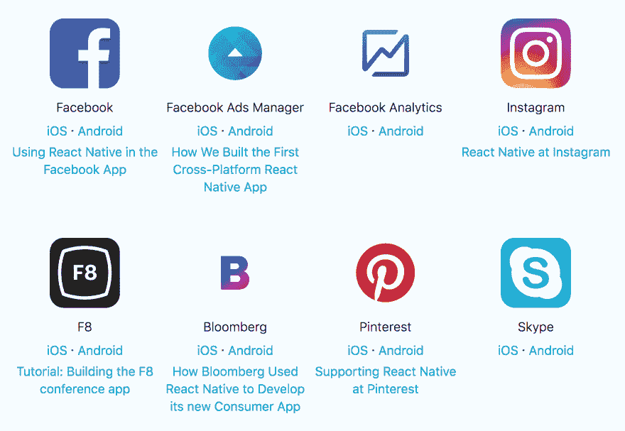

# 使用 React Native 构建应用的优势

> 原文：<https://dev.to/lollipop_media/the-benefits-of-building-your-app-with-react-native-596e>

在[棒棒糖媒体，](http://lollipop.media/)我们爱 React Native。我们最近
用 React Native 为 [AccaApp](http://accaapp.co/) 开发了一个移动应用，一种新的社交
赌博方式。

像现在的大多数应用程序一样，AccaApp 的家伙们想为 iOS 和 Android 开发,
,并同时发布。
我们已经使用
React Native 很多年了，所以我们觉得这对他们来说是完美的。

我们可以只开发一次应用，然后在 iOS 和 Android 上共享代码库。

[T2】](https://res.cloudinary.com/practicaldev/image/fetch/s--zCPSu4Mb--/c_limit%2Cf_auto%2Cfl_progressive%2Cq_auto%2Cw_880/https://cdn-images-1.medium.com/max/1600/1%2A-to6Auxie_DHEBDnOQDzgg.jpeg)

### 那么，什么是 React-Native 呢？

[React Native](https://facebook.github.io/react-native/) 是一种编程
语言，允许开发者使用
JavaScript 构建跨平台的移动应用。有了 React Native，你只需开发一个应用，就可以在 iOS
*和安卓*(也许还有 Windows Phone)上部署。虽然这些应用程序是用 JavaScript 编写的，但是它们使用了你的设备的原生功能，真正感觉到了原生的。这是通过将这些特性与 JavaScript 联系起来实现的。

 
庞大的公司纷纷做出反应背后的本土

React Native 由脸书开发，由[大型企业
公司](https://facebook.github.io/react-native/showcase.html)使用，如
Instagram、彭博、Wix、Airbnb、特斯拉和优步。React Native 背后有一个庞大的社区，这个平台每天都在发展。

### 对我有什么好处？

使用 React Native 有很多好处，但这里是我们最喜欢的。

#### 1。同时释放

在一个应用程序的“正常”开发中，你需要有两个独立的代码库。你开发一个 iOS 应用程序(Swift)和一个单独的 Android 应用程序(Java)。

React-Native 使开发人员能够从一个代码库开始工作，同时为 iOS 和 Android 平台开发
,因此每个应用程序之间没有追赶
。

#### 2。它很快

因为 React Native 在两个应用程序之间共享一个公共代码库，所以您可以
快速开发。
我们的一些内部应用程序仅用 7 个小时就完成了。
一个应用从设计到发布只需要 7 个小时，所以你节省了大量的时间(和金钱)。

#### 3。你只需要 Javascript 开发者

无论你是在内部建设还是与代理公司合作(比如美国 T2)，你只需要找到一种类型的开发商。
大多数前端 web 开发人员精通 JavaScript，因此能够
使用 React Native 开发应用程序，此外他们还能
维护你的网站。
这对您的企业来说非常划算。

#### 4。实时更新

如果你和我们一样，你会讨厌那些告诉你需要下载多少更新的通知。有了 React Native，无需通过 App Store 就可以对您的
应用进行实时更新。

由于该应用的大部分是 JavaScript，你可以只使用一个
网络连接来推送更新。已经有类似于
[AppHub](https://apphub.io/) 或微软
T5】code push 的服务来帮助解决这个问题。只要你的应用知道运行的是什么版本，并且知道如何检查服务器是否有更新的版本，你就可以随时发布应用的更新。

* * *

#### 想打造自己的应用？

在[棒棒糖媒体](http://lollipop.media/)我们已经建立了数百个 React 本地
应用。在我们的网站上查看一些最新的应用程序:www.lollipop.media/work
。

#### 关于棒棒糖传媒

棒棒糖媒体是一家数字机构，总部设在伦敦。

我们利用与
大公司和初创公司合作的丰富经验，将您的想法付诸实践。我们为您的目标受众设计完美的用户体验，并在任何平台上将您的产品推向市场。