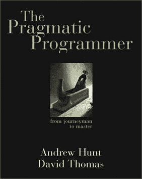

# 务实程序员的最佳之处📚

> 原文：<https://dev.to/aleccool213/the-best-parts-of-the-pragmatic-programmer---1om5>

> 想要更多这样的精彩内容？注册订阅我的时事通讯，请访问:[Alec . coffee/注册](//alec.coffee/newsletter)

|  |

自从 1999 年发布以来,《实用程序员》仍然具有相关性，尽管软件领域正以类似 Nascar 的速度发展。作为多年来软件开发人员的权威指南，我很兴奋也很高兴能与你分享这一点。

很久以前出版，当我在书单上看到《实用程序员》时，我最初感到惊讶，因为它是有抱负的软件开发人员的必读书目。我相信这本书将经得起时间的考验，不像我之前读过的许多其他书。

当我刚从初级开发阶段出来时，我觉得我与开发相关的软技能还有待提高。这本书提供了大量的好建议，从非常规的软技能到经典的硬技能。这里有很多很好的建议，我认为对任何认真对待自己职业的开发人员或测试人员来说都是基本的。

因此，没有进一步的告别，这里是我读这本书时的一些亮点。读完这篇文章后，我希望它能鼓励你自己去读一读这本书。

### 沟通

> ...如果 bug 是某人错误假设的结果，与整个团队讨论这个问题:如果一个人误解了，那么可能很多人都会误解。

我喜欢这一个，它确实反复强调了这样一个事实，紧密的沟通减少了你的团队产生的错误。

### 深呼吸

> 不要做历史的奴隶。不要让现有的代码支配未来的代码。如果不再合适，所有代码都可以被替换。即使在一个程序中，也不要让你已经做的事情限制你接下来要做的事情——做好重构的准备。这个决定可能会影响项目进度。假设是影响将小于不做改变的成本。

早期程序员的一个常见误解是将自己归入项目/基于代码的约定，无论是在风格上还是架构上。我成功的一个策略是不要害怕和你的团队一起处理代码味道。这表明你愿意在维护代码库方面做更多的工作。它显示了你每天使用的产品的所有权。鼓励人们挑战旧代码，无论是你自己的还是你的同行。

### 在杂草中

> 与其说软件是建筑，不如说它更像园艺——它比混凝土更有机。

这类似于最后一句话，永远不要害怕找出更好的方法去做事情，即使是在做事情的过程中。项目的一半是可读的，并被单元测试所覆盖，总比什么都没有好。

### 重建

> 从本质上讲，重构就是重新设计。您或您团队中的其他人设计的任何东西都可以根据新的事实、更深入的理解、不断变化的需求等等进行重新设计。但是如果你继续疯狂地撕掉大量的代码，你可能会发现自己的处境比开始时更糟糕。

似乎是基本的权利？我会说，没有单元测试的重构就像晚上开车没有前灯一样，你看不到任何东西。你怎么知道你的重构是否有害呢？从我的经验来看，当涉及到大型的、不断增长的系统时，企业通常不愿意投资回归测试。为现有系统编写优秀的单元测试给了开发人员一张白纸，你可以撕掉任何东西，并且知道你的模块仍然在做它们应该做的事情。

### 测试放置

> 通过使测试代码易于访问，您为可能使用您的代码的开发人员提供了两种宝贵的资源:如何使用您的模块的所有功能的示例，以及构建回归测试来验证代码的任何未来更改的方法。

我曾经做过在一个单独的根文件夹中有测试的项目，我也见过它们嵌套在组件文件夹旁边。将它们放在您的组件旁边，可以使它们随时可用且易于访问。我认为这种好处是值得的。现在，开发人员可以在实际代码本身旁边获得组件使用示例。

### 直人神功

> 但是如果你使用一个向导(框架)，并且你不理解它产生的所有代码，你将不能控制你自己的应用程序。你将无法维护它，到了调试的时候，你将会很吃力。

在我看来，如果你对某项技术没有太多的经验，就不要使用向导(框架)。根据我的经验，如果你花时间对这门语言有一个中级的理解，那会好得多。你的第一次迭代开发起来会很慢，但从长远来看是值得的。对于框架来说尤其如此，不要开始一个大规模的 Rails 项目
并认为你可以随时学习 ruby 的基础知识。接受同事对项目特定风格的反馈，并询问防止语言失误的最佳实践。这节省了每个人的时间。

当你需要更深入地研究你正在使用的框架时，调试也是一团糟。不懂得这门语言，你就不会明白你正在使用的零件是如何组装起来的，因此你也不会知道如何将它们拆开再装回去。研究一个框架的代码常常是新手和专家之间的区别。

### 思维表情符号

> 不管它有多好，也不管它包括哪些“最佳实践”，没有任何方法可以代替思考。

我在初学者中见过很多这样的情况，产品会要求一个特性，他们会用“Rails”或“React”的方式来构建它。利用最佳实践通常会帮助您高效地编写好的代码，然而，框架并不是为做所有事情而设计的。尽情发挥创意，找到适合您项目的解决方案。

### 文档？

> 如果它在网上，程序员甚至可能会阅读它。

文档必须发布在网上，并链接到 README.md，就是这样，没有意见或争论，只是这样做。

### 团队

> 也有一种倾向，退回到设计者对抗编码者的“我们对抗他们”的心态。我们更喜欢了解我们正在工作的整个系统。

与设计师有一个开放的交流渠道(无论是风格还是建筑方面)是非常被低估的。这些人可能是宝贵的资源，他们拥有关于整个系统的丰富知识。他们对为什么系统 A 和系统 z 对话做了很多研究。

> 许多团队为他们的项目开发详细的测试计划。有时他们甚至会使用它们。

(+_+)

### 参考文献

亨特安德鲁。务实的程序员:从熟练工到大师。皮尔森教育。Kindle 版。

> 也发布在[我的博客](https://blog.alec.coffee/pragmatic-programmer-book-highlights/)上。
> 
> 喜欢这个帖子？考虑给我买一杯咖啡来支持我写更多的东西。
> 
> 想收到有新帖子的季度邮件吗？[注册我的简讯](https://mailchi.mp/f91826b80eb3/alecbrunelleemailsignup)