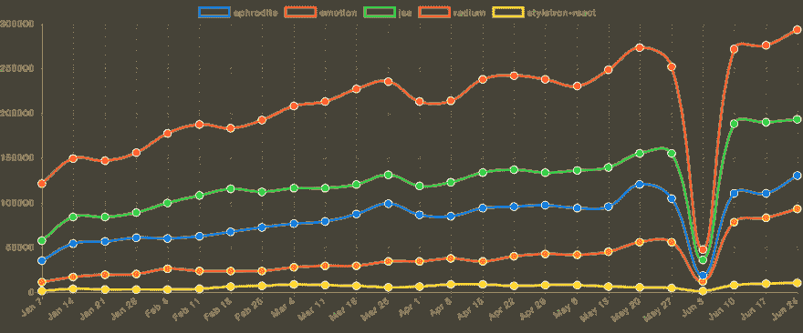
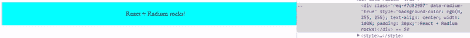
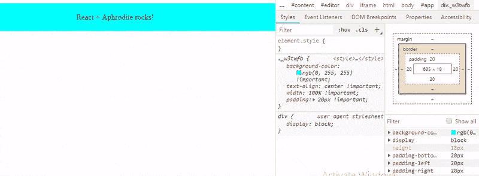
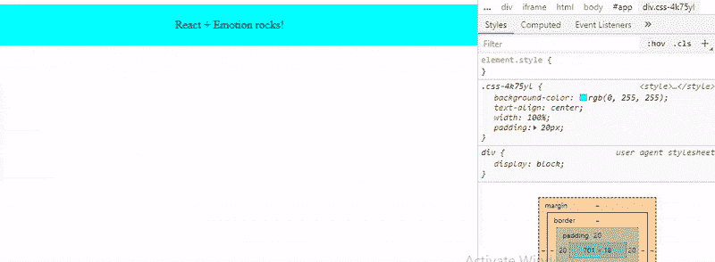
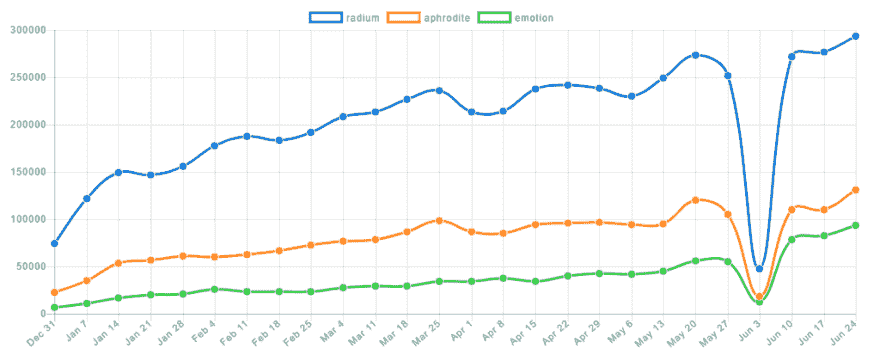

# 最好的反应内联风格库-比较镭，阿芙罗狄蒂和情感

> 原文：<https://dev.to/bnevilleoneill/the-best-react-inline-style-libraries-comparing-radium-aphrodite--emotion-2enp>

### 最好的反应直列风格库——比较镭、阿芙罗狄蒂、&的情感

[T2】](https://res.cloudinary.com/practicaldev/image/fetch/s--KVZ9wJKI--/c_limit%2Cf_auto%2Cfl_progressive%2Cq_auto%2Cw_880/https://cdn-images-1.medium.com/max/1024/1%2AiKxT-mnVq8Itd5RvsA9_-Q.png)

在任何重要的 React 应用程序中，如果管理不当，CSS 样式会成为一个问题。

全局样式定义！到处都是重要的规则，重用组件时的低灵活性就是这些问题的例子。

这导致了使用 CSS 文件的传统方法的替代方法。例如，这里有一个关于[三种造型方法](https://dev.to/bnevilleoneill/the-best-styling-in-react-tutorial-youve-ever-seen-3pc3-temp-slug-8777429)的好帖子。

这篇文章是关于内联样式的。然而，我不会谈论[它们是什么](https://zhenyong.github.io/react/tips/inline-styles.html)或[你是否应该使用它们](https://www.engineyard.com/blog/inline-styles-yes-or-no)。

我将讨论将帮助您在 React 应用程序中使用内联样式的库——这些库允许您使用不直接支持的功能(如媒体查询)。

我来比较一下:

*   镭
*   [阿芙罗狄蒂](https://github.com/Khan/aphrodite)
*   [情感](https://github.com/emotion-js/emotion)

此列表是不考虑以下库的结果:

*   似乎不再被维护了。
*   似乎不受欢迎。
*   不要像对象或字符串那样使用内联样式。

然而，和大多数这类文章一样，你可能不同意这个列表，所以请随意发表你最喜欢的库和它的特别之处的评论。

使用其中的每一个库，我将使用以下 CSS 规则来设计 div 元素的样式:

[https://medium . com/media/d 80 f 9 c 88 b 8 DC 7 b 2d 4 e 6188 E8 ba 07 c 5/href](https://medium.com/media/d80f9c88b8dc7b2d4d2e6188e8ba07c5/href)

这将是结果:

[T2】](https://res.cloudinary.com/practicaldev/image/fetch/s--qhW-Xr3I--/c_limit%2Cf_auto%2Cfl_progressive%2Cq_auto%2Cw_880/https://cdn-images-1.medium.com/max/747/0%2Av1FfEhUCaYQ3XPy3)

在本文的最后，您会发现一个总结了这些库的特性的表格。

让我们从镭开始。

[T2】](https://logrocket.com/?cid=banner_a)

### 镭

在这里介绍的三个库中，[镭](https://github.com/FormidableLabs/radium)是最受欢迎的一个，涉及 [GitHub stars](https://github.com/FormidableLabs/radium) 、 [issues](https://github.com/FormidableLabs/radium/issues) 和 [StackOverflow questions](https://stackoverflow.com/search?q=radium) 。

如果你已经有一些内联样式作为对象文字，你不需要修改它们来使用 Radium。

例如，下面是对应于前面显示的 CSS 规则的样式对象:

[https://medium . com/media/a5ea 948d 859 FD 8538 b 9898d 7 b 16 a 2 a 42/href](https://medium.com/media/a5ea948d859fd8538b9898d7b16a2a42/href)

除了悬停和媒体规则之外，它看起来像一个常规的内联样式，普通的内联样式不支持这些规则。

如果将此样式应用于组件:

[https://medium . com/media/da 75 da 0d 4279 f 93 b 5137 e 54688 bf9 b 53/href](https://medium.com/media/da75da0d4279f93b5137e54688bf9b53/href)

并运行应用程序，div 元素将改变其样式，但它将忽略悬停和媒体规则。实际上，这个警告会显示在控制台:

```
Warning: Unsupported style property @media (max-width: 700px). Did you mean @media (maxWidth: 700px)? 
```

要使用镭，你首先要安装它:

```
npm install --save radium 
```

然后导入或要求:

```
import Radium from 'radium';

// Or const Radium = require('radium'); 
```

镭是一种[高阶成分(HOC)](https://reactjs.org/docs/higher-order-components.html) 。

它处理 render 方法中指定的组件的样式属性，添加处理程序来更新交互样式(如 hover)的状态，应用供应商前缀，合并样式等。

可以这样用:

```
class App extends Component {

// ...

}

export default Radium(App);

// Or App = Radium(App); 
```

或者用 [ES7 装饰师](https://medium.com/@jihdeh/es7-decorators-in-reactjs-22f701a678cd) :

```
@Radium

class App extends Component {

// ...

} 
```

通常这就足够了，但是如果你使用媒体查询、[关键帧](https://github.com/FormidableLabs/radium/tree/master/docs/api#keyframes)或者一些镭插件，你还需要使用 [StyleRoot](https://github.com/FormidableLabs/radium/tree/master/docs/api#styleroot-component) 组件来包装你的应用程序的顶层组件:

```
ReactDOM.render(
    <StyleRoot><App /></StyleRoot>,
    document.getElementById('root')
); 
```

现在，如果您运行应用程序，并检查 div 元素，您将看到以下内容:

[https://medium . com/media/6f 332 ff 8d 77d 409 e 82 c 9406427755680/href](https://medium.com/media/6f332ff8d77d409e82c9406427755680/href)

注意，对于媒体查询，它在 style 元素中创建了一个新的 CSS 类，并使用了一个随机名称。[根据文档](https://github.com/FormidableLabs/radium/tree/master/docs/guides#media-queries)，它这样做是为了让媒体查询与[服务器端渲染](https://github.com/FormidableLabs/radium/tree/master/docs/api#configmatchmedia)一起正确工作。

悬停效应呢？

当鼠标悬停在元素上时，其样式属性会更新以添加指定的悬停样式:

[T2】](https://res.cloudinary.com/practicaldev/image/fetch/s--tTA1drBy--/c_limit%2Cf_auto%2Cfl_progressive%2Cq_auto%2Cw_880/https://cdn-images-1.medium.com/max/800/0%2Ad_QKsP2FHAOZqFuK)

您还可以在 style 属性中指定一组样式。当您需要根据属性值覆盖某些样式时，这很方便，例如:

[https://medium . com/media/7903 FD 83695d 8 aa 03 B1 f 0 cc 6b 61440 FB/href](https://medium.com/media/7903fd83695d8aa03b1f0cc6b61440fb/href)

还有一个呈现样式元素的[样式组件](https://github.com/FormidableLabs/radium/tree/master/docs/api#style-component)，例如，它帮助您将 CSS 规则添加到 body 元素或应用于其他元素的 scope 类。

例如，这个:

[https://medium . com/media/31654 aebfca 9 EB 622 E1 d 01388 c6fb 710/href](https://medium.com/media/31654aebfca9eb622e1d01388c6fb710/href)

将呈现:

[https://medium . com/media/6e 633 b 9 fbdf 5 BC 90 e 31 b 8 f 699 b 10171/href](https://medium.com/media/6e633b9ffbdf5bc90e31b8f699b10171/href)

另一方面，Radium 的一个缺点是只支持三种状态::hover、:foucs 和:active，如果您的组件中有多个元素使用其中一种状态，[您需要提供一个惟一的键属性](https://github.com/FormidableLabs/radium/tree/master/docs/faq#why-does-the-browser-state-of-a-child-element-not-reset-after-unmounting-and-remounting)。

甚至有一个函数允许你查询这些状态， [getState](https://github.com/FormidableLabs/radium/tree/master/docs/api#getstate) :

```
<div style={styles.panel}>

  React + Radium rocks!

  { Radium.getState(this.state, null, ':hover') ? (

      <span>Yeah!</span>
    )
    : null
  }

</div> 
```

然而，这意味着[你必须手动实现伪选择器](https://github.com/FormidableLabs/radium/tree/master/docs/faq#how-do-i-use-pseudo-selectors-like-checked-last-before-or-after)，比如:checked，:last，:before，或者:after。

另一个缺失的功能是对@font-face 的[支持。然而，Radium 以一个](https://github.com/FormidableLabs/radium/issues/716)[插件](https://github.com/FormidableLabs/radium/tree/master/docs/api#plugins)的形式实现了几乎所有的功能，你也可以使用插件 API 来实现定制的功能，比如@font-faces。

Radium 插件是一个接受 PluginConfig 对象并返回 PluginResult 对象的函数，它为每个具有 style 属性的渲染元素调用一次。

[这里](https://github.com/FormidableLabs/radium/tree/master/src/plugins)你可以看看镭包含的插件的源代码。在[的这个库](https://github.com/ianobermiller/radium-plugin-friendly-pseudos)中，你可以找到另一个插件的例子。

下面是用镭实现的基本例子:

[https://medium . com/media/32d 4 CAD 9 cf 12 f1 c 7 a3 fc 4532d 90 e 8890/href](https://medium.com/media/32d4cad9cf12f1c7a3fc4532d90e8890/href)

### 阿佛洛狄忒

Aphrodite 是另一个流行的用 JavaScript 编写 CSS 的库，但它采用的方法与 Radium 略有不同。

首先，用
安装它

```
npm install --save aphrodite 
```

同样，您有一个带有应用程序样式的对象:

[https://medium . com/media/21ee 0 C1 D3 ff 6440 ac8f 2235594 df 8 be 3/href](https://medium.com/media/21ee0c1d3ff6440ac8f2235594df8be3/href)

但是这一次，您必须将这个对象传递给函数 StyleSheet.create:

[https://medium . com/media/90613 a 64993571109 E4 Fe 5d 993 b 42654/href](https://medium.com/media/90613a64993571109e4fe5d993b42654/href)

反过来，来自该对象的样式被传递给 css 函数，结果在组件的 className 属性中使用:

[https://medium . com/media/BAE 8422263145 d0e 8576476 f 74750 b 70/href](https://medium.com/media/bae8422263145d0e8576476f74750b70/href)

请注意，Aphrodite 使用 className 属性，而不是 style 属性。

为了理解这一点，如果你打印 css(styles.panel)的结果，你将得到一个类名。在我的例子中，我得到了 panel_w3twfb。

如果您看一下 StyleSheet.create 返回的对象，您会看到类似这样的内容:

[https://medium . com/media/20 FB 34 c 76 b 909463 F3 e 828 de 93925 baa/href](https://medium.com/media/20fb34c76b909463f3e828de93925baa/href)

该函数返回一个对象，该对象包装了 css 规则并添加了一个 _name 属性，其值与 CSS 函数返回的值相同。

使用浏览器的检查工具，您会看到这个 panel_w3twfb 类的定义:

```
.panel\_w3twfb {

  background-color: rgb(0, 255, 255) !important;

  text-align: center !important;

  width: 100% !important;

  padding: 20px !important;

} 
```

默认情况下，阿芙罗狄蒂追加！对所有 CSS 规则都很重要。如果你不想要这个，你唯一需要做的就是导入 aphroitte/no-important 而不是 aphrodite:

```
import { StyleSheet, css } from 'aphrodite/no-important'; 
```

此外，当 NODE_ENV 标志被设置为 production 或者在 StyleSheet.create 之前调用 minify(true)时:

```
import { StyleSheet, css, minify } from 'aphrodite';

minify(true);

const styles = StyleSheet.create({

  //...

}); 
```

Aphrodite 将只保留 CSS 类名称中的哈希。在这种情况下，w3twfb。

但是这个班在哪里？它没有在 div 元素旁边或文档体中的任何地方定义。

Aphrodite 在文档的

element to put its generated styles:

```
<html lang="en">

  <head>

    ...

    <style type="text/css" data-aphrodite=""></style>

  </head>

  <body>

    ...

  </body>

</html> 
```

但是，您可以用 data-aphrodite 属性创建一个 style 元素，aphrodite 将使用它而不是创建一个。

Aphrodite 将缓冲对样式的写入，以避免许多 DOM 修改。如果在 componentDidMount 或 componentDidUpdate 中计算元素的维度，[文档建议使用 setTimeout 或 flushToStyleTag 来确保所有样式都被正确注入。](https://github.com/Khan/aphrodite#style-injection-and-buffering)

那悬停风格和媒体询问呢？

他们还补充:

```
.panel\_w3twfb:hover {

  color: rgb(255, 255, 255) !important;

  cursor: pointer !important;

}

@media (max-width: 700px) {

  .panel\_w3twfb {

    background-color: rgb(255, 0, 0) !important;

  }

} 
```

[T2】](https://res.cloudinary.com/practicaldev/image/fetch/s--0t2Sx2ek--/c_limit%2Cf_auto%2Cfl_progressive%2Cq_auto%2Cw_880/https://cdn-images-1.medium.com/max/800/0%2A3dhxHi-zwifc_Y6d)

与镭类似，您可以组合多种风格:

[https://medium . com/media/AFC 271 D3 ea 25 b 83 F3 a 01 C2 be 507 DD 564/href](https://medium.com/media/afc271d3ea25b83f3a01c2be507dd564/href)

也和镭一样，对嵌套的支持有限。例如，[本期](https://github.com/Khan/aphrodite/issues/319)展示了一个元素的类 Saas 类的例子，这个元素有两个类，jump-btn 和 disabled:

```
.jump-btn {

  width: 32px;

  height: 32px;

  background: url('jump\_btn.png') no-repeat 0 0;

  &.disabled {

    background-position: -32px 0;

  }

  ...

} 
```

因为只能嵌套伪选择器和媒体查询，所以必须用 Aphrodite 以如下方式编写:

[https://medium . com/media/9b 65 f 4812 E0 bed 767 FBA 2837 ebca 1c 82/href](https://medium.com/media/9b65f4812e0bed767fba2837ebca1c82/href)

然而，与镭不同的是，阿佛洛狄忒支持[字型面孔](https://github.com/Khan/aphrodite#font-faces):

[https://medium . com/media/2298 e 96070 ba 6 ba 1d 874d 52d 548 e 256 b/href](https://medium.com/media/2298e96070ba6ba1d874d52d548e256b/href)

本机伪元素前后(注意，内容属性要求字符串值内有双引号或单引号):

[https://medium . com/media/d 47 ad 4 e 03 e 91 f 45352 a 8454396 fe7d 01/href](https://medium.com/media/d47ad4e03e91f45352a8454396fe7d01/href)

另一方面，阿芙罗狄蒂不像镭那样提供 API。诚然，它以不同的方式工作，但它可能对某些情况有所帮助(例如，见[这里](https://github.com/Khan/aphrodite/issues/239)和[这里](https://github.com/Khan/aphrodite/issues/306))。

它提供了一个[扩展机制](https://github.com/Khan/aphrodite#advanced-extensions)，但是目前，它只允许你基于指定的样式生成新的选择器(它是库用来处理媒体查询和伪元素/类的[)。](https://github.com/Khan/aphrodite/blob/master/src/generate.js)

这里你可以看到用阿芙罗狄蒂实现的基本例子:

[https://medium . com/media/005517 b 833 a 551d 122141 cc 72 c 563 e 87/href](https://medium.com/media/005517b833a551d122141cc72c563e87/href)

### 情感

最近， [Kent C. Dodds](https://medium.com/@kentcdodds) 弃用了[魅力](https://github.com/paypal/glamorous)(一个图书馆，否则会进入这个名单)而支持[情感](https://github.com/emotion-js/emotion)。他的理由:

1.  情感可以做光鲜亮丽能做的一切。
2.  情感比魅力能做的更多。
3.  感情比光鲜来得快。
4.  情感小于光鲜。

告诉我们这个图书馆的一些情况，对吗？

首先，用
安装它

```
npm install --save emotion 
```

再来一次，从包含应用程序样式的对象开始:

[https://medium . com/media/897 BC 45 ba 86039 BD 54 e6e 456932d 1809/href](https://medium.com/media/897bc45ba86039bd54e6e456932d1809/href)

您只需要修改:hover 伪类的格式。来自:

```
':hover': {

  ...

} 
```

致:

```
'&:hover': {

  ...

} 
```

情感类似于阿芙罗狄蒂。两者都使用 className 属性和一个名为 css 的函数:

[https://medium . com/media/9 ee6b 2954541 c 30 f1 ab 5d 1 DD 6b 33426 a/href](https://medium.com/media/9ee6b2954541c30f1ab5d1dd6b33426a/href)

css 函数返回自动生成的 CSS 类的名称。在我的例子中，它返回 css-4k75yl。

渲染后的 HTML 是这样的:

```
<div class="css-4k75yl">

  React + Emotion rocks!

</div> 
```

您可以在文档的

element: [https://medium.com/media/f36d723051f89d64a606a21a7a21d193/href](https://medium.com/media/f36d723051f89d64a606a21a7a21d193/href)

或者，您还可以向 style 对象添加一个[标签属性](https://emotion.sh/docs/labels)，以便向生成的 CSS 类追加一个自定义名称。

例如，下面的定义:

[https://medium.com/media/86434a0c07324e75e7787acebe36f14b/href](https://medium.com/media/86434a0c07324e75e7787acebe36f14b/href)

将导致类名 css-4k75yl-my-name。

所以这样看来，情感与阿芙罗狄蒂并没有什么不同:

[T2】](https://res.cloudinary.com/practicaldev/image/fetch/s--vWwqtBTo--/c_limit%2Cf_auto%2Cfl_progressive%2Cq_auto%2Cw_880/https://cdn-images-1.medium.com/max/800/0%2AS7di8686qhxmZIPu)

但是关于这个图书馆，它有比镭和阿佛洛狄忒更多的特征。

例如，有了情感，你还有两种方式来设计组件。

代替对象文字，您将样式指定为一个[标记的模板](https://wesbos.com/tagged-template-literals/):

[https://medium.com/media/175dd1ae66a8067db304c152b1880f08/href](https://medium.com/media/175dd1ae66a8067db304c152b1880f08/href)

请注意，语法完全不同。这更像是 CSS:

*   规则的名称不是大小写混合的。
*   不使用引号。
*   规则用分号分隔

另一方面，您也可以使用[样式函数](https://emotion.sh/docs/styled)来样式化元素或组件。

为此，首先，您需要安装 react-emotion(或者 preact-emotion，如果您使用 preact 的话):

```
npm install --save react-emotion 
```

然后，调用该函数，首先传递 HTML 标记或 React/Preact 组件，然后传递带有以下样式的对象文字:

[https://medium . com/media/4 bcfc 02095807 c 15 da 3c f 981 AE 3 bccd 0/href](https://medium.com/media/4bcfc02095807c15da3cf981ae3bccd0/href)

或者模板文字:

[https://medium . com/media/b54b 8908028 a 87046233 f 01 fc 2 b 7 a 0 de/href](https://medium.com/media/b54b8908028a87046233f01fc2b7a0de/href)

并像使用其他组件一样使用新样式组件:

[https://medium . com/media/D1 a 141 ab 604984128 e 217 ebb 11 f 1927 e/href](https://medium.com/media/d1a141ab604984128e217ebb11f1927e/href)

当然，道具可以传递给这个组件，你可以根据道具改变它的样式:

[https://medium . com/media/aa 9 C3 dfbd 4789 CD 8 b 66 c 6 fc 0 FBD 6b 384/href](https://medium.com/media/aa9c3dfbd4789cd8b66c6fc0fbd6b384/href)

在样式化组件的[文档页面中，您可以查看更多配置选项。](https://emotion.sh/docs/styled)

您也可以组合样式:

[https://medium . com/media/3d 0 afbddb 35 b5 c 874590d 21 c 76d 86320/href](https://medium.com/media/3d0afbddb35b5c874590d21c76d86320/href)

Emotion 将按照它们出现的顺序合并它们(注意类名的变化):

```
.css-17nr31q {

  background-color: #00ffff;

  text-align: center;

  width: 100%;

  padding: 20px;

  background-color: red;

} 
```

然而，与阿佛洛狄忒不同的是，当组合多个类名时，情感提供了一些[高级选项](https://emotion.sh/docs/cx)。

也不同于阿芙罗狄蒂(但类似于镭)，情感让你可以轻松指定全球风格:

[https://medium . com/media/58b 2168 f 67 e 5 D1 c 799 b 64 EFA 41 c 17738/href](https://medium.com/media/58b2168f67e5d1c799b64efa41c17738/href)

Emotion 像其他库一样支持[服务器端渲染](https://emotion.sh/docs/ssr)和[关键帧](https://emotion.sh/docs/keyframes)，但它对[嵌套选择器](https://emotion.sh/docs/nested)有更好的支持，并且一些独特的东西是对[主题](https://emotion.sh/docs/theming)的支持，由库 [emotion-theming](https://github.com/emotion-js/emotion/tree/master/packages/emotion-theming) 提供。

例如，在安装了 emotion-theming with:

```
npm install --save emotion-theming 
```

您可以将背景颜色样式放在主题中，以便在其他组件之间共享:

[https://medium . com/media/b 14d 33 bb 9 AAA 4 AC 63 f 67057 b 15864167/href](https://medium.com/media/b14d33bb9aaa4ac63f67057b15864167/href)

在这里，您可以看到使用一个对象实现情感的基本示例:

[https://medium . com/media/e 55 CBF 11 a 06 e 609 ecaf de 1967049 f 060/href](https://medium.com/media/e55cbf11a06e609ecafde1967049f060/href)

在这里，您可以看到它是使用标记模板实现的:

[https://medium . com/media/98 bdaf 5979650 e 08 ba 3d 0992 b 640 b 72 b/href](https://medium.com/media/98bdaf5979650e08ba3d0992b640b72b/href)

### 包装完毕

了解这些图书馆有多受欢迎的一个很好的页面是 [npm 趋势](http://www.npmtrends.com/)。这里是我写这篇文章时的统计数据的快照([这里](http://www.npmtrends.com/radium-vs-aphrodite-vs-emotion)你可以找到最新的):

[T2】](https://res.cloudinary.com/practicaldev/image/fetch/s--Gixxb3IX--/c_limit%2Cf_auto%2Cfl_progressive%2Cq_auto%2Cw_880/https://cdn-images-1.medium.com/max/1024/1%2AZDM_bZKCS_Z6jqdM1YaLAA.png)

下面是这些库的功能总结:

[https://medium . com/media/b 88 f 8 dfdadd 91 AE 9 fc 1 CD 930774 e81a 3/href](https://medium.com/media/b88f8dfdadd91ae9fc1cd930774e81a3/href)

如果你问我，如果一切都一样，我会说我最喜欢的图书馆是阿芙罗狄蒂。

我觉得这个图书馆的平衡性最好。Radium 缺少一些功能，尽管它很灵活并且有很好的文档，但它有太多的功能，有时使用起来有点复杂。

但是当决定在您的项目中使用什么库时，最重要的事情是考虑与您的项目相关的方面。不要选择表中最有特性或通过的库。

最后，也来看看这个[库](https://github.com/MicheleBertoli/css-in-js)，在这里[米歇尔·贝托丽](https://github.com/MicheleBertoli)比较了 React 的更多库，并为每个库实现了一个例子。

### Plug: [LogRocket](http://logrocket.com) ，一款适用于网络应用的 DVR

[T2】](http://logrocket.com)

LogRocket 是一个前端日志工具，可以让你回放问题，就像它们发生在你自己的浏览器中一样。LogRocket 不需要猜测错误发生的原因，也不需要向用户询问截图和日志转储，而是让您重放会话以快速了解哪里出错了。它可以与任何应用程序完美配合，不管是什么框架，并且有插件可以记录来自 Redux、Vuex 和@ngrx/store 的额外上下文。

除了记录 Redux 操作和状态，LogRocket 还记录控制台日志、JavaScript 错误、堆栈跟踪、带有头+正文的网络请求/响应、浏览器元数据和自定义日志。它还使用 DOM 来记录页面上的 HTML 和 CSS，甚至为最复杂的单页面应用程序重新创建像素级完美视频。

免费试用。

* * *