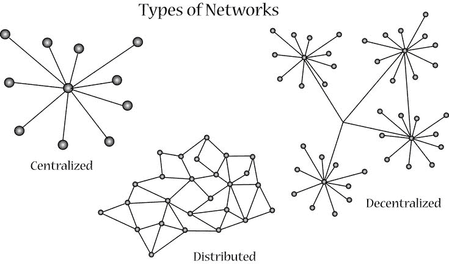
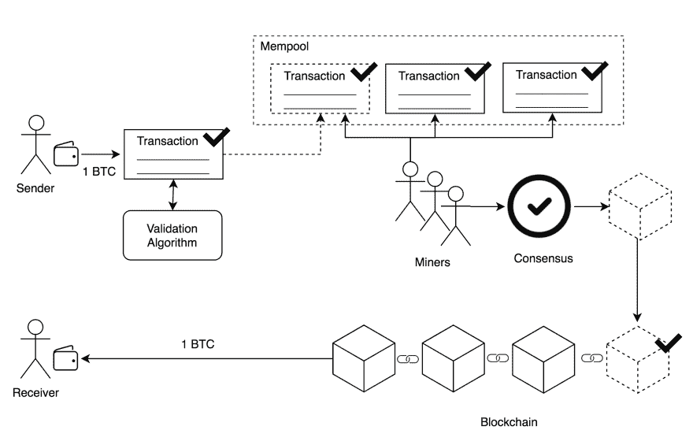

# 比特币的生命周期概述

> 原文：<https://dev.to/gmfcastro/the-bitcoins-lifecycle-overview-1fld>

区块链是一个颠覆性的学科，与传统系统有很大不同。这就是为什么我认为理解和学习它的最好方法是研究它的第一次成功实现。比特币！

随着比特币成为热门话题，随着其价格的稳定，许多技术和金融人士开始关注比特币背后的技术，是什么让它如此安全，比我们今天关心金钱的传统方式更好？

今天我想和大家分享的第一点是比特币网络是如何运作的。比特币使用的网络是一个非常古老的网络，我们今天用它来下载种子。比特币和区块链的其他实现使用 P2P 网络！

然后你会问自己，这是怎么回事？我知道这一开始看起来很疯狂，但是当你为区块链敞开心扉时，你会发现这是有意义的，并且当你的目标是去中心化和不变性时，这非常有效！

# 分布式网络

首先，我们必须了解集中式、分散式和分布式网络之间的区别。

[T2】](https://res.cloudinary.com/practicaldev/image/fetch/s--ukKGXJ84--/c_limit%2Cf_auto%2Cfl_progressive%2Cq_auto%2Cw_880/https://thepracticaldev.s3.amazonaws.com/i/3j5566preu197bkqrpd9.jpg)

如您所见，在集中式网络中，我们只有一个中心点，所有对等点都将数据发送到该中心点。这就是传统的客户机-服务器今天的工作方式，其中的中心点是服务器，它拥有所有的数据权限。

另一方面，我们有一个分散的网络，这就是今天互联网的工作方式，我们有一些主干网相互通信，但对等网仍然向一个主干网发送数据。在这种情况下，我们仍然有一些具有数据权威的中心点。这就是为什么我们有分布式网络，其中不存在数据的中心点，网络中的每个节点都作为服务器工作。这就是点对点，也叫 P2P 网络！现在我可以问你:

*   在这三者之间，哪一个是管理你的资金的最佳网络？
*   你认为只有一些同行管理你的钱是公平的还是可信的？
*   这个中央同行是坏人/公司怎么办？

这是比特币试图解决的问题之一，但这是如何实现的呢？

# 比特币的生命周期

假设发送方想要向接收方发送 1 个比特币。这是将要发生的事情:

[T2】](https://res.cloudinary.com/practicaldev/image/fetch/s--abzsCVrI--/c_limit%2Cf_auto%2Cfl_progressive%2Cq_auto%2Cw_880/https://thepracticaldev.s3.amazonaws.com/i/ja33jqi5qtc3z2i76370.png)

1.  发送方创建交易。
2.  发送者的比特币钱包验证交易。
3.  事务被发送到 Mempool。
4.  挖掘器从 Mempool 获取事务，并使用一致算法开始挖掘块。
5.  在区块被完全开采后，它被添加到网络中。
6.  该链验证新块，并且网络中的每个对等体将获得添加了新块的区块链。
7.  最后，接收者得到你的 BTCs

以下是您可能会有的一些问题:

*   什么是内存池？
*   共识算法到底是什么？
*   交易完成后，发送方的 BTC 会发生什么情况？

希望我也想到了你同样的问题:)。

# Mempool

Mempool(内存池的快捷方式)是事务在 miner 准备好获取它们之前所停留的地方。在比特币的区块链中，矿工优先考虑最大的交易，而不是最小的交易。发生这种情况是因为这里是矿工赚钱的地方。等待..什么？是的，在区块链的每一笔交易都有费用，矿工得到这笔费用加上开采区块的奖励。

好吧，但是矿工如何“开采”这个区块呢？这是通过共识算法完成的。

# 共识算法

共识算法可能是任何区块链实现中最重要的部分。这里是你实现网络民主化的地方！

比特币使用一种被称为工作证明的共识算法，你也会发现它被写成 PoW。在区块链网络中达成共识还有其他一些策略，我稍后会详细介绍，但现在让我们把重点放在 PoW 的基础上。

这基本上做的是:通过检查为块创建的散列来尝试获得正确的随机数，直到结果散列在其前缀中具有与块链中的当前难度集相同数量的零。这种困难的存在是为了控制在网络中开采区块的速度。比特币使用一个数字来尝试挖掘接近 10 分钟的时间。如果挖掘比它快，网络会增加难度，如果挖掘比它慢，网络会降低难度。

听起来很熟悉？比特币就是这样控制通胀的！

这种试图获得正确随机数的执行需要大量的能量消耗和计算工作，这就是为什么矿工从交易中获得费用。矿工也因开采区块而获得奖励，但这种奖励会随着时间的推移而减少，直到有一天矿工将只获得交易费。

# 钱包扣款

希望你能理解这里的一切，正如你在上面的图片中看到的，发送者发送了 1 BTC，接收者得到了 1 BTC，但正如我在这篇文章中所说的，这里应该扣除交易费。

让我们假设发送者发送 1 BTC 给接收者，他在你的钱包里有 1.50 BTC。还让我们假设交易费是 0.20 BTC。下面是毯子下面发生的事情:

1.  发送者说他想发送 1 BTC 给接收者。
2.  交易将有 1.50 BTC 作为输入，但交易的一个输出将是接收者应该接收的 1 BTC。
3.  另一个输出将是发送方从该交易中得到的变化:1.50BTC - 1 BTC - 0.20 BTC = 0.30 BTC 是该交易的另一个输出。这些输出被称为 UTXO(未用事务输出)
4.  然后发送者得到你的零钱，你的余额现在是 0.30，接收者得到你的 1 BTC。

UTXO 在比特币的网络里面有很重要的一部分，但那是受制于其他帖子的:)

我知道这里有很多信息，但我认为在深入了解区块链网络的每个组成部分之前，这些概念非常重要。

干杯！下一篇文章再见。