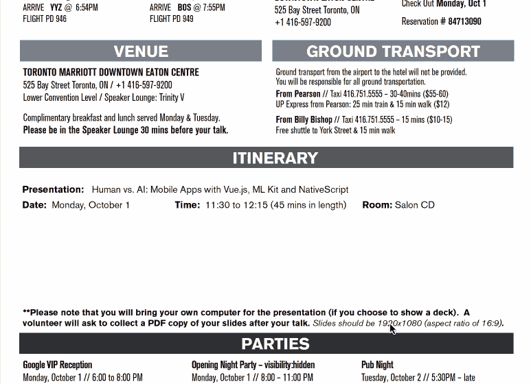

# 对会议发言人的照顾和喂养

> 原文：<https://dev.to/jenlooper/the-care-and-feeding-of-your-conference-speakers-mfh>

这篇文章旨在成为一位经验丰富的会议演讲者和职业旅行者的“核心宣言”，作为一名开发者倡导者(现在的行话是“开发者鳄梨”)，他穿梭于世界各地，在一个又一个会议上进行技术演讲和主持研讨会。你是否在组织活动或会议，让演讲者聚集在一起，准备向你热切的听众传递信息？也许这篇文章会给你一些启发。

| 旅行非常有趣 |
| --- |
|  |

> 在开始之前，我意识到我是在一个拥有巨大特权的地方写作。我在 DevRel 有一份很好的工作，我很荣幸被邀请或被接受在世界各地的活动中发言，对于一个自称为“多语言多元文化主义者”的人来说，当我踏进一个新的地方时，我仍然会感到兴奋。但是我已经看到了会议组织中好的、坏的和丑陋的方面，我想分享一些关于会议如何对待演讲者的想法，以便发挥我们最好的一面。毕竟，这就是我们所有人想要的——与会者、赞助商、演讲者和组织者——让与会者能够展示最好的自己，代表我们的公司，以最好的方式造福于您的观众和社区。

假设我们都有一致的目标——组织者希望伟大的会议能够让演讲者满足观众的需求，演讲者希望与观众互动以有效地传递内容——我列出了一些我注意到特别有效的“帮助”。这可能读起来像是一种“奥斯卡奖”类型的演讲，我在演讲中呼吁真正好的组织，但这真的不是我的意图。如果我没有列出一个特定的会议，这并不是因为它很糟糕！我只是在想那些给我带来巨大改变的很棒的触摸例子。

**帮助安排旅行**

大声喊到 [Web Unleashed](https://fitc.ca/event/webu18/) ，它的组织者坚持不懈的组织使得我甚至不可能搞砸我的会议旅行计划。由于他们主动为你支付旅行费用并为你安排行程，他们在设计行程时就能确保你的旅行不会与他们的演讲时间表发生冲突。一些演讲者不喜欢让会议为他们预订旅行，但在预订之前，他们就拟议的时间表和路线进行了良好的沟通，并达成了协议。诚然，从波士顿到多伦多对波特来说是轻而易举的事情，但是如果组织者能够在旅行的这方面提供帮助，许多安排上的混乱是可以避免的。

| 网络释放扬声器套件 PDF |
| --- |
|  |

**会议挂绳**

Node+JS Interactive 最近做了一件很棒的工作，向所有与会者和发言者赠送了彩色编码的会议挂绳，并清楚地张贴了它们的含义:绿色表示“跟我说话”，黑色表示“不，谢谢”等等。这个细节对打破僵局很有帮助，这样“绿色”的人觉得有权力与陌生人聚集在一起并打招呼。[那次会议](https://www.thatconference.com/)更进了一步，提供各种各样的丝带徽章贴在名字徽章上，导致更有趣的对话成为破冰。演讲者正在寻找好的对话，这种类型的事情使它变得稍微容易一些。

液体错误:内部

**姓名徽章**

说到名牌，这是信息传播最重要的领域之一，它的设计可以极大地改变演讲者和与会者之间的互动方式。像 [ng-Conf](https://www.ng-conf.org/) 这样的大型会议一样，在徽章中嵌入二维码或 RFID 可以让赞助商和在展台工作的发言人快速扫描徽章，收集线索，然后结束对话。

但是你能看到的姓名牌上的内容与其潜在的潜在商机一样重要。一个好的名字徽章应该有一个大而显眼的名字，如果可能的话，还有一个 Twitter 的句柄。一些人通过他们的 Twitter 账号更出名，这是一种更有帮助的方式来识别说话者可能通过社交媒体互动过的人。你应该能够通过快速扫视徽章来收集所有这些信息，所以设计是至关重要的。有些徽章背面印有完整的会议日程或地图，这就更好了。就当是会议通行证吧。

**演讲者晚宴**

演讲者晚宴很贵，尤其是在昂贵地点举行的大型会议。不是每个人都能像阿姆斯特丹体验那样真正与众不同，在阿姆斯特丹体验中，演讲者享受了一次可爱的晚餐巡游。这甚至不是一个公平的比较:)-但演讲晚宴非常重要。它们让我们能够在会议的真正工作开始之前，建立联系，交换意见，评估观众，讨论技术，并与志同道合的专业人士进行互动。对于预算较少的会议，一个平静的葡萄酒和奶酪招待会可能会很好，关键词是“平静”。在技术报告的前一天晚上，疯狂的，劳克斯晚餐对一个演讲者的声音来说是谋杀。不吃饭就喝太多酒(或者只是喝太多酒，无论如何)是宿醉未醒的人的良方。适度是关键，但事件本身才是关键。

> 注意，会议演讲，即使对于那些喜欢旅行的人来说，也不是一个长系列的假期。正如萨拉·维埃拉指出的那样，这会造成损失。所以我想提一下，演讲礼物和活动结束后的短途旅行都是奢侈的，值得赞赏的，尽管肯定不是强制性的。当地礼物，如 Node+JS Interactive 网站上来自温哥华的盐或 Connect 网站上提供的可包装瓷砖。当然，高科技是非常受欢迎的，但不是必须的。

| 来自 Vue Amsterdam 的奶酪、薯条和鞋子 |
| --- |
|  |

**演讲者/赞助商与与会者的优质时间**

qCon 是赞助商关怀和支持的典范，它有一个很好的方法来确保赞助商(他们通常也是演讲者)能够与与会者共度美好时光，而不仅仅是一次又一次地进行电梯推介，以换取徽章扫描和转轮游戏。在一个开放时间的赞助商联谊会上，他们只是在所有赞助商的摊位上放上几碟小吃，这样如果参加者想吃东西，他们就有义务和赞助商交谈。它工作得相当好。

**在舞台上帮助技术人员**

走进一个空荡荡的会议室，桌子上摆着一堆杂乱的线缆，没有 AV/tech 来帮助连接笔记本电脑和投影仪，这是一场噩梦，尤其是对新发言者来说。即使在小型的本地聚会上，有人能在技术方面提供帮助，尤其是在我们这些 MAC 电脑用户不断失去端口的时候，这真的很重要。专业演讲者通常在包里带一捆加密狗，以备不时之需，但意外和混乱时有发生。我曾经像一个鸡尾酒女招待一样，手里拿着笔记本电脑做了一次演讲，由于投影仪和麦克风都出了故障，没有人能弄清楚 AV 上的任何内容，所以我一直在大喊大叫。像 Vue London 和 ng-Conf 这样的大型会议为演讲者提供了出色的技术支持，但像纽约和纽黑文的 GDG 发展节这样的小型活动也是如此。

**将扬声器连接到本地活动**

通过在会议开始的前一天晚上在当地的聚会上帮助组织演讲，来帮助演讲者最大限度地扩大他们的影响是一个聪明的想法，特别是如果他们有国际旅行的话。因为亚特兰大的女性程序员是如此令人惊讶的一群人，她们在联系之前会组织很好的会前聚会。技术。 [Vue London](https://vuejs.london/) 也是如此，将扬声器连接到备受关注的 Vue。伦敦聚会。与当地社区互动是扩大会议对演讲者影响的一个很好的方式。

**营造良好的后台环境**

想象一下，一个乐器演奏者笨拙地挂在台下，在观众的众目睽睽之下，因为没有后台区域来调音和准备演奏。我喜欢在演讲前做一些有力量的姿势，有时不得不在会议室旁边的浴室里做这些。对于拥有大量观众和令人印象深刻的舞台的大型会议来说，很少有后台区域可以让演讲者拿起话筒，这很可能是因为会议很少在音乐厅举行。因此，在 Vue Amsterdam，有一个后台区域，在任何人看到演讲者出现在舞台上之前，所有的 AV 工作都在这里完成，这创造了一个很好的氛围。实际上，这是一个非常可怕的阶段，一个不知名的人带来了几瓶成人饮料，在演讲前或演讲后用纸杯拍照。整场演出对 Vue 社区来说是一次很好的联系体验，这也增加了它的价值。

**扬声器室**

有一个演讲室或安静的房间是很正常的，在这里演讲者可以播放幻灯片并准备演讲。流利的会议可能是最好的会议之一，为发言者提供了一系列精美的小吃、饮料和健康食品。储备充足且安静的扬声器休息室是一大优势。

这些是我给你的会议演讲者的建议！相信我，沿着这些路线采取的任何步骤都是非常值得赞赏的！许多组织者非常努力地做着不可能的事情:在几天的时间里，取悦大量不同的与会者，将演讲者和赞助商聚集在一个地方，分享知识。