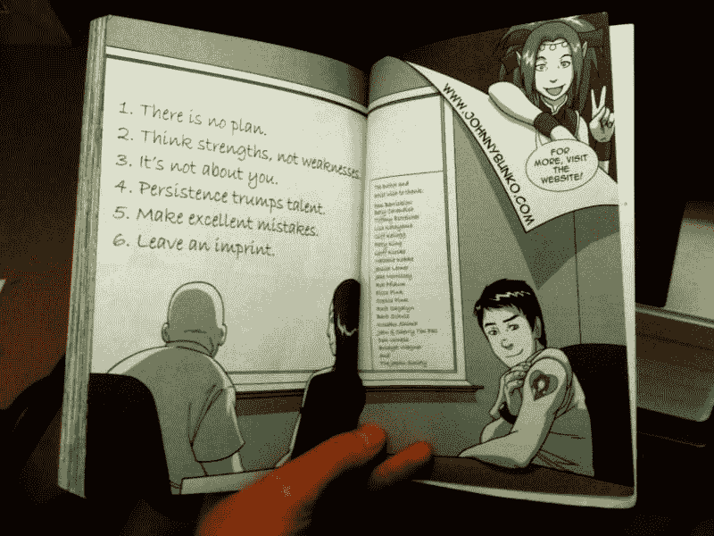

# 约翰尼 JavaScript 的职业冒险

> 原文：<https://dev.to/maxwell_dev/the-career-adventures-of-johnny-javascript-1cc3>

在我不断寻找既有漫画又有非小说的好书的过程中，我网络中的一个程序员推荐了丹尼尔·H·平克的《约翰尼·邦科历险记》。它通过一个工作无望的男人用神奇的筷子召唤仙女般的职业顾问，分享了六个重要的职业经验。

和我呆在一起，因为我发现这本书很有价值。尤其是因为我的职业生涯才刚刚开始，需要一些建议。令我惊讶的是，到目前为止，每个技巧都非常适合我的编码生涯。以至于我想和大家分享这些见解。

所以我问自己，如果他不是《约翰尼·邦科历险记》，而是一个名叫约翰尼 JavaScript 的程序员，会怎么样？六大职业要素会有怎样的变化？

原来它们真的经得起时间的考验。

## 1。没有计划

这本书的第一条，也是我认为最重要的一条建议是，你永远无法计划你的职业生涯会经历什么样的曲折。谁知道五年后，甚至一年后你会在哪里。行业可能改变，也可能消亡。你可以搬到一个新的国家。试图做长期规划实际上是不可能的。

作为一个写 JavaScript 的人，我完全同意长期计划很少奏效。

框架、语言、库、模式，对编码人员来说都变化很快。你不可能学会几个工具，并在这些工具上坚持几年以上(最多)。如果你几年前学过 Angular，现在 React 的需求量更大。如果你学过 CSS 浮动网格框架，现在 CSS 网格已经到来。即使您的工具保持不变，您也需要对它们进行更新，以适应任何相关的更改和废弃。

相反，成功的编程生涯建立在以下基础之上:

*   学会学习
*   理解和编写文档
*   流行的编程方法，如 MVC 模型或面向对象编程
*   所有语言通用的基本语法和规则，如数据类型和函数
*   与他人沟通良好，尤其是设计师
*   为不同的工作选择合适的工具。

这些是我们出于基本原因而学习的技能，因为它们在面对变化时具有内在的价值。无论你工作的工具、框架或公司是什么，这些都会有帮助。

我最初的计划是新闻业，但现在我在从事目前的工作，利用业余时间使用模式库 Ember、React，并涉足 Rails 和 UX 设计。这一切都发生在一个我从未想过要搬到的城市，和一家我在当地聚会上发现的公司。谁知道再过五年我会在哪里？

无论我在哪里，我的基本技能都会有所帮助。这是唯一真正的计划。

## 2。思考优点，而不是缺点

不久前，我开始学习 Ruby 和 Rails，因为它是我们的应用框架之一。这也是因为虽然我在前端很强，但我的后端编码很欠缺。我认为改善我的薄弱环节对长期成功很重要。

在努力接近我的同事之后，我意识到这本书分享的下一个教训:**关注你的优势而不是你的劣势。**我被两种认识所推动:

1.  我没有前端那么享受后端——它没有给我一种*流的感觉。我可以在 CSS 和 JavaScript 中迷失几个小时而不感到疲惫。改进和使用它比 Ruby 更有利于工作。它让我的工作感觉不太像工作。*
2.  把我的精力分散在太多的事情上削弱了我的努力，损害了我的进步。如果前端是我擅长并喜欢做的事情，我需要愿意全力以赴。这将使我成为专业人士，而不仅仅是业余爱好者。

所以不要纠结于向你周围的专业人士展示你的弱点。在你需要的任何领域，学得足够危险，但要知道哪些最适合你。前端？后端？信息架构？UI 和 UX？数据和分析？在编程世界中，有很多选项值得关注。

**“全栈开发者”迷因是[一个虚拟的神话](https://frontendmasters.gitbooks.io/front-end-developer-handbook-2018/content/practice/myth.html)。找到让你心流澎湃的东西，倾注你的激情。**

## 3。这不是关于你的

像大多数年轻的程序员一样，我倾向于关注个人项目:他们有多酷，他们展示了什么技能，我通过他们学到了什么新工具。我花了几个小时把它们放到网上，希望人们会喜欢它们。

不出所料，这从未发生过。

然后我做了一个关于 markdown 文件的[报告，里面全是关于编程](https://github.com/maxx1128/Webdev-Study-Notes)的笔记——语法、提示、提醒等等。我甚至加入了一些非小说类的笔记来记录有价值的见解。我做它是为了更好地保留知识，是的，但我也认为其他人会发现它有用。

```
// An example of my notes:
// a small snippet from my notes on Ember Models

##### Loading Multiple Models

If you need to load multiple models as a single promise object, the `RSVP.hash` tool lets you do this. It accepts a hash, where each value is a promise. This way you can have a promise activate once all the promises are resolved, such as a loading screen being toggled off.

model(params) {
  return Ember.RSVP.hash({
    character: this.store.findRecord('character', params.character),
    teams: this.store.findAll('team')
  });
} 
```

Enter fullscreen mode Exit fullscreen mode

这是我第一次真正的回购，不仅仅是围绕我的工作。这也是我迄今为止最受欢迎的回购，有超过 40 颗星和几个分叉。

我从未注意到这一切意味着什么，直到我从书中读到这一课:

> 你是来服务的，不是来实现自我的。

我见过的最受欢迎的回复之所以受欢迎，原因很明显——其他人觉得它们很有用。这就是为什么像 Bootstrap、Foundations、Rails 和 Ember 这样的框架被广泛使用的原因。他们把他们的技能向外集中，而不是向内集中在虚荣的项目上。

这也是为什么，当我几年前问一位招聘人员人们最想从程序员那里得到什么技能时，她说良好的沟通。她发现大多数程序员都能很好地与计算机交流，但几乎不能与人交流。这限制了他们与他人分享知识所带来的价值。

作为一个年轻的程序员，这是一个艰难的教训，但我正在努力。我慢慢有了信心，可以捡起并解决还没有人解决的问题，我的经理对此表示赞同。我的一个更大的目标是为开源项目做贡献，即使只是一点点，但我认为我还没有做到。但我想做更多这样的事情，因为我知道这有助于每个人的职业生涯，最终也会帮助我。

但是除了这个实用主义的理由，我试着记住一个原则:在你编码之前，在门口检查你的自我。

即使是个人项目，我也会努力记住这一点。这就是为什么当我练习 Vue 时，我做了一个通勤计算器，这样人们就可以看到他们开车上班是多么浪费。

这不是帮助别人的最好方法，但要循序渐进。

## 4。坚持胜过天赋

很多次我试图运行一个应用程序，但它崩溃了。开始的几次是一个漫长而令人沮丧的过程，尝试每一个我认为正确的想法。我总是认为一旦我变得更好，我可以更快地直觉找到问题。

快进几年，我发现这些构建错误的速度更快了。但只是因为它们和我以前见过的虫子一样。每当有新的问题，我都会全力以赴去解决它。总是一种挣扎，就像代码在考验我坚持下去的意志。我只能通过固执己见和尝试新老技巧来解决这个问题。不管我学到了多少，变得更好依赖于我坚持解决这些问题。

这本书证实了我每次都在学习的一个教训:**世界上到处都是有才华的人，但是如果他们不能坚持学习和工作，那些有才华的人就会与他们擦肩而过。**

我可能是世界上最有才华的程序员，能够写出雄辩的函数、完整的文档，以及不会让天使哭泣的绝对枯燥的 CSS。但是如果我不坚持学习和提高，这些都不重要。坚持是我和我共事过的更有经验的开发人员能够:

*   调试复杂的错误
*   构建可扩展的大型应用程序
*   管理遗留代码的问题
*   跟上行业变化
*   赶上艰难的最后期限

天赋固然重要，但这些比天赋更需要坚持。否则，所有这些重要任务都将半途而废，公司也会陷入困境。

这就是为什么坚持在编程中如此重要。坚持不只是打败天赋，坚持是最重要的天赋之一。因为每一项技能都只取决于你对提高它的坚持。

## 5。犯严重的错误

编程有时候都是关于错误的，不是吗？一两年后，大多数程序员会发现:

*   他们写的代码几天后就过时了
*   测试旨在防止错误，而不是捕捉新的回归
*   选择了错误的框架和方法(通常是因为它们是新的和闪亮的！)
*   CSS 写得太匆忙了，以至于编码人员多年来都在绞尽脑汁
*   在一个星期五的下午，服务器意外崩溃

所有这些都是大多数应用程序或软件的典型特征。谢天谢地，所有这些错误都给了我们一次学习的经历。我们知道还应该包括哪些测试，哪些框架适合不同的需求，以及哪些 CSS 不会招致上帝的愤怒。编码建立在学习和提高的基础上。

需要注意的是，只有当我们接受错误并从中吸取教训时，这种方法才会奏效。当事情出错时，深呼吸，大声说，“我做错了。我下次会通过做 x 来避免同样的错误。”

“极好的错误”是指我们从中成长的益处超过了最初的后果。从这一点来看，这不再是一次失败，而是一次成功。

编码的伟大之处在于它总是会犯错误，我们可以将这些错误转化为优秀的错误。

## 6。留下印记

这可能不是书中最重要的提示，但它是最后一个，因为它是最重要的。你必须问自己一个问题:

> 我的工作重要吗？

我们的生命是有限的。我们应该利用我们的时间做出积极的改变。在我们身后留下美好的印记。但是人们经常回避这个沉重的问题，直到他们长大了。到那时可能就太晚了。即使你不喜欢这个答案。

[T2】](https://res.cloudinary.com/practicaldev/image/fetch/s--mZjeLlYC--/c_limit%2Cf_auto%2Cfl_progressive%2Cq_auto%2Cw_880/https://thepracticaldev.s3.amazonaws.com/i/6fto6h1g1nstoz3exqec.jpg)

考虑到我们的程序如何日益影响他人的生活，这对我们来说是一个特别重要的问题。Ethan Marcotte 写了一篇关于设计从来都不是中立的文章，我相信这也适用于编码。我们编写的代码有许多深远的目的和影响:

*   信息是如何组织的，或者对需要它的人是如何隐藏的
*   个人数据是如何被收集、分析甚至出售的
*   用户如何与界面互动，这可以增强他们的体验或操纵他们的注意力
*   我们的应用程序的可访问性，例如对于残疾人或互联网接入较差的贫困地区。
*   算法如何增强或恶化[员工](https://www.technologyreview.com/s/543946/when-your-boss-is-an-uber-algorithm/)和[用户](https://www.inc.com/erik-sherman/new-study-shows-uber-drivers-trick-algorithm-to-ma.html)的体验。

我的观点与 Marcotte 的文章相同——尽管我们可能相信我们的代码是中立的，但它从来都不是。尤其是当项目越来越多地定义社会、关系、工作和生计的时候。

这个建议是关于知道你会留下什么样的印记。你的工作总会在某个地方留下印记——带有伦理、道德或政治影响。它可能很小或很大，但它会在那里。知道自己想要留下什么样的印记。不仅仅是你的事业，而是你的整个人生。

现在，在你回首往事，希望自己当初没有这么做之前，问问自己这些问题。真相可能不会让你自由，但它至少能把你推向一条更好的道路。

### 结论

《约翰尼·邦科历险记》让我对自己的职业生涯有了一些了解，并将其具体化为实际的建议。尽管是十年前写的，它仍然有现实意义。有人甚至会说，随着编码行业的发展，它只会变得更加重要。

[T2】](https://res.cloudinary.com/practicaldev/image/fetch/s--zJSEE0Po--/c_limit%2Cf_auto%2Cfl_progressive%2Cq_auto%2Cw_880/https://thepracticaldev.s3.amazonaws.com/i/7jhaxpu6soeja1s9bo82.jpg)

像我这样的博客帖子永远无法取代这本书本身，所以我强烈建议买一本，既是为了建议，也是为了古怪的展示。至少，从我作为一个程序员的角度来看，我希望这些技巧能够展示这本书有多么有用。

因为尽管我热爱编码，但这种热爱不能伴随我的整个职业生涯。我得学会如何玩工作游戏。这六条建议帮助我认识到，学习游戏工作不仅仅是可能的——编程让它值得学习。

意识到这一点可能比我听过的任何职业建议都重要。