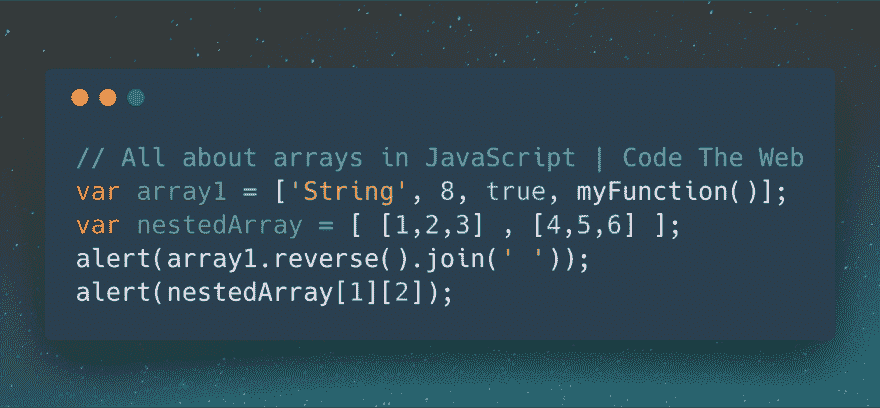
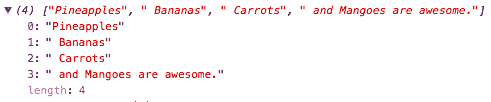

# JavaScript 数组完全指南

> 原文：<https://dev.to/booligoosh/the-complete-guide-to-javascript-arrays-5dhc>

[T2】](https://codetheweb.blog/2018/04/28/javascript-arrays/)

数组是 JavaScript 中非常有用的一部分，对于从文本操作到图像处理都很方便！

无论您是一个完全的初学者，还是想要一些更高级的数组函数，这篇文章都是为您准备的！

## 本文内容:

首先，为另一个 clickbait-y 标题道歉。但是，我保证这是一本完整的指南！事实上，如此完整，它需要一个目录！我从没想过我会这么做，但是我们开始了...

*   什么是数组？
*   如何引用数组中的值
*   数组函数
    *   string.split()
    *   array.join()
    *   数组. reverse()
    *   array.indexOf()
    *   array.lastIndexOf()
    *   array.includes()
    *   array.find()
    *   array.findIndex()
    *   array.map()
    *   array.filter()
    *   array.reduce()
    *   数组.排序()
    *   array.splice()
*   嵌套数组

我知道你们中的一些人可能已经知道了数组的基础知识，在这种情况下，请随意阅读那些你还不知道的部分。否则，从头开始，享受乘坐的乐趣！

请注意，如果您完全是数组初学者，那么现在您可能只想阅读本文的一部分。或者，根据你的学习风格，你可能想读完整本书！如果您打算只阅读其中的一部分，我建议您在“如何引用数组中的值”或“array.includes()”之后停下来。但是不要忘记向下滚动查看结论！

让我们开始吧！

> ## 💡跟着走！
> 
> 首先，我鼓励你跟随这篇文章。这将有助于你更好地学习，也有助于你记住你做了什么。让我们首先创建一个新的 HTML 文件，其中包含一个`<script>`标签:
> 
> ```
> <!DOCTYPE html>
> <html>
>     <head>
>         JavaScript arrays
>     </head>
>     <body>
>         <h1>JavaScript :)</h1>
>         <script>
>             // Our script will go here!
>         </script>
>     </body>
> </html> 
> ```
> 
> 一旦完成，在你的网络浏览器中打开它，你就可以开始了！(不要忘记在每次更改时保存并重新加载页面)

## 什么是数组？

数组只是一个值的列表。JavaScript 中的数组是这样的:

```
var myArray = ['String', 8, true, myFunction()]; 
```

Enter fullscreen mode Exit fullscreen mode

如你所见，数组是一个通常赋给变量的值。在本例中，我们将它赋给了`myArray`变量。所以我们从说`var myArray =`开始。之后，我们有一组方括号。方括号内有四项，用逗号分隔。这些项可以是任何类型的值——字符串、数字、布尔值、[函数](https://codetheweb.blog/2018/04/05/javascript-functions/)、[对象](https://codetheweb.blog/2018/06/09/javascript-objects/)，甚至是另一个数组！(我将在后面进一步讨论)

## 如何引用数组中的值

通常，我们可能会这样写:

```
alert(1234); 
```

Enter fullscreen mode Exit fullscreen mode

然而，如果我们想警告上面数组中的`8`呢？你可以这样做:

```
alert( myArray[1] ); 
```

Enter fullscreen mode Exit fullscreen mode

什么！？但是`8`是数组中的第二项！这是因为...

> **数组从 0 开始！**

我这么说的意思是，如果你想引用一个数组的第一项，你就说`array[0]`，而不是`array[1]`。原因并不重要，但关键是数组从`0`开始。事实上，几乎每种编程语言都有。因为数组从`0`开始，这意味着所有其他的数字都比你期望的少一个。所以以上，第二项变成了`myArray[1]`。类似地，第四个项目将变成`myArray[3]`。方括号内的数字(如上面的`1`)是数组中特定项目的*索引*。

> 💥💥💥💥💥💥
> **数组从 0 开始！**T3】💥💥💥💥💥💥

抱歉强调了这些(😂)，但这是很重要的一点。你会想要记住它，否则你以后会非常困惑。

试试你的技术！这里有一个数组:

```
var array = [4, 5, 3, 7, 'Hello', 2, 1, true, false, 0]; 
```

Enter fullscreen mode Exit fullscreen mode

尝试提醒:

1.  `5`
2.  `'Hello'`
3.  `false`

试一试！把它放进你的`<script>`标签里！答案见下文...

```
var array = [4, 5, 3, 7, 'Hello', 2, 1, true, false, 0];
alert(array[1]);
alert(array[4]);
alert(array[8]); 
```

Enter fullscreen mode Exit fullscreen mode

## 数组函数

现在我们已经完成了基本的工作，让我们看看一些可以用来创建、转换和操作数组的函数。让我们开始吧！(要激动😉)

对于这一节，我将使用`console.log`而不是`alert`，这样我们就可以正确地看到什么是数组，什么不是。要在浏览器中打开控制台，右键单击，然后单击“检查元素”(或类似的东西)。然后点击顶部的“控制台”标签。大概是这样的:
[](https://res.cloudinary.com/practicaldev/image/fetch/s---aNJ4uHh--/c_limit%2Cf_auto%2Cfl_progressive%2Cq_auto%2Cw_880/https://codetheweb.blog/assets/img/posts/javascript-arrays/console.png)

### string.split()

我们可以用`.split()`把一个字符串变成一个数组。下面是一个例子:

```
var myString = 'Pineapples, Bananas, Carrots, and Mangoes are awesome.';
console.log( myString.split(',') );
// => ["Pineapples", " Bananas", " Carrots", " and Mangoes are awesome."] 
```

Enter fullscreen mode Exit fullscreen mode

(当输出到 JavaScript 控制台时，看起来是这样的:)
[](https://res.cloudinary.com/practicaldev/image/fetch/s--EnQZ-M7j--/c_limit%2Cf_auto%2Cfl_progressive%2Cq_auto%2Cw_880/https://codetheweb.blog/assets/img/posts/javascript-arrays/array.split.png)

但是**这里到底发生了什么？**嗯，看我们怎么说`.split(',')`？这是告诉浏览器将字符串分割成数组项，在`,`字符处分隔它们。这里还有一个例子:

```
var myString = 'Code+The+Web+Is+Awesome';
console.log( myString.split('+') );
// => ["Code", "The", "Web", "Is", "Awesome"] 
```

Enter fullscreen mode Exit fullscreen mode

正如你在这里看到的，我们只是简单地根据`+`符号的位置将字符串分割成块。这些块以数组格式存储。

`.split()`的参数不必只有一个字符！看看下面的例子:

```
var myString = 'I^$^Like^$^Money^$^!';
console.log( myString.split('^$^') );
// => ["I", "Like", "Money", "!"] 
```

Enter fullscreen mode Exit fullscreen mode

`.split()`的一个很棒的用途是将字符串分割成单个字符。但是我们该怎么做呢？用空字符串分割！我的意思是:

```
var myString = 'Hello how are you today?';
console.log( myString.split('') );
// => ["H", "e", "l", "l", "o", " ", "h", "o", "w", " ", "a", "r", "e", " ", "y", "o", "u", " ", "t", "o", "d", "a", "y", "?"] 
```

Enter fullscreen mode Exit fullscreen mode

正如你所看到的，我们被一个空字符串(`''`)分开，并以一个漂亮整洁的数组结束了每个字符的分离！当您想以某种方式操作文本时，这很方便。

继续前进。

### array.join()

这和`.split()`正好相反。我们不是把字符串变成数组，而是把数组变成字符串！参数是字符串中用来分隔各项的内容。比如:

```
var myArray = ['Dashes', 'are', 'awesome','!'];
console.log( myArray.join('-') );
// => "Dashes-are-awesome-!" 
```

Enter fullscreen mode Exit fullscreen mode

如你所见，与`.split()`正好相反。其实试试这个:

```
var myArray = ['Dashes', 'are', 'awesome','!'];
console.log( myArray.join('-').split('-') );
// => ['Dashes', 'are', 'awesome','!'] 
```

Enter fullscreen mode Exit fullscreen mode

如你所见，我们只是用破折号把它连接起来，然后再把它分开，使它返回原来的数组！

接下来...

### array.reverse()

这正是你所期望的——它反转一个数组！这里有一个例子:

```
var myArray = [4,5,6,7,8];
console.log( myArray.reverse() );
// => [8, 7, 6, 5, 4] 
```

Enter fullscreen mode Exit fullscreen mode

你自己试试😉

### 挑战！

使用到目前为止你已经学过的所有三个函数，尝试`console.log`下面的字符串，但是颠倒过来:

```
'Why does text always look so weird when reversed?' 
```

Enter fullscreen mode Exit fullscreen mode

下面是您的代码应该记录的内容:

```
'?desrever nehw driew os kool syawla txet seod yhW' 
```

Enter fullscreen mode Exit fullscreen mode

试一试！看看你是否能算出来...

```
var myString = 'Why does text always look so weird when reversed?';
console.log( myString.split('').reverse().join('') ); 
```

Enter fullscreen mode Exit fullscreen mode

正如你在这里看到的，首先我们把它转换成一个字符数组:

```
["W", "h", "y", "  ", "d", "o", "e", "s", "  ", "t", "e", "x", "t", "  ", "a", "l", "w", "a", "y", "s", "  ", "l", "o", "o", "k", "  ", "s", "o", "  ", "w", "e", "i", "r", "d", "  ", "w", "h", "e", "n", "  ", "r", "e", "v", "e", "r", "s", "e", "d", "?"] 
```

Enter fullscreen mode Exit fullscreen mode

接下来，我们反转这个数组:

```
["?", "d", "e", "s", "r", "e", "v", "e", "r", "  ", "n", "e", "h", "w", "  ", "d", "r", "i", "e", "w", "  ", "o", "s", "  ", "k", "o", "o", "l", "  ", "s", "y", "a", "w", "l", "a", "  ", "t", "x", "e", "t", "  ", "s", "e", "o", "d", "  ", "y", "h", "W"] 
```

Enter fullscreen mode Exit fullscreen mode

最后，我们把它缝合在一起！我们不希望每个字符之间有任何内容，所以我们将参数保留为空字符串。然后我们得到我们的最终输出！

```
'?desrever nehw driew os kool syawla txet seod yhW' 
```

Enter fullscreen mode Exit fullscreen mode

现在继续吧！

### array.indexOf()

还记得上面我说的一个数组物品的*指数*吗？只是你引用的时候用的数字。例如，在下面的数组中，`true`的索引将是`7` ( **数组从 0** 开始):

```
var array = [4, 5, 3, 7, 'Hello', 2, 1, true, false, 0]; 
```

Enter fullscreen mode Exit fullscreen mode

但是如果我们想检查数组项的索引呢？我们可以使用`.indexOf()`函数。它是这样工作的:

```
var array = [4, 5, 3, 7, 'Hello', 2, 1, true, false, 0];
console.log( array.indexOf(true) );
// => 7 
```

Enter fullscreen mode Exit fullscreen mode

自己试试——找到`7`的索引！

```
var array = [4, 5, 3, 7, 'Hello', 2, 1, true, false, 0];
console.log( array.indexOf(7) );
// => 3 
```

Enter fullscreen mode Exit fullscreen mode

但是如果我们在一个数组中有一个特定值的倍数，会发生什么呢？

```
var array = ['a', 'b', 'a', 'a', 'b', 'a' ,'b', 'b', 'a']; 
```

Enter fullscreen mode Exit fullscreen mode

让我们试着找到`'a'` :
的索引

```
var array = ['a', 'b', 'a', 'a', 'b', 'a' ,'b', 'b', 'a'];
console.log( array.indexOf('a') );
// => 0 
```

Enter fullscreen mode Exit fullscreen mode

如您所见，`.indexOf()`只是返回该值的第一个索引！例如对于`'b'`，返回数组中第一个`'b'`的索引:

```
var array = ['a', 'b', 'a', 'a', 'b', 'a' ,'b', 'b', 'a'];
console.log( array.indexOf('b') );
// => 1 
```

Enter fullscreen mode Exit fullscreen mode

### array.lastIndexOf()

所以，`.indexOf()`真的应该叫`.firstIndexOf()`。但事实并非如此，因为 JavaScript 很奇怪。但是如果我们想找到一个值的最后一个索引，我们可以使用`.lastIndexOf()`！它就像`.indexOf()`一样工作，除了它找到一个值的最后一个，而不是第一个。让我们从上面的数组中试试:

```
var array = ['a', 'b', 'a', 'a', 'b', 'a' ,'b', 'b', 'a'];
console.log( array.lastIndexOf('a') );
// => 8 
```

Enter fullscreen mode Exit fullscreen mode

与`'b'` :

```
var array = ['a', 'b', 'a', 'a', 'b', 'a' ,'b', 'b', 'a'];
console.log( array.lastIndexOf('b') );
// => 7 
```

Enter fullscreen mode Exit fullscreen mode

在这些情况下，`.lastIndexOf()`只是寻找数组中最后一个`'a'`和`'b'`的索引。

### array.includes()

这是一个简单的函数，用于检查数组是否包含特定的值。例如:

```
var array = [4, 5, 3, 7, 'Hello', 2, 1, true, false, 0];
console.log( array.includes(3) );
// => true
console.log( array.includes(9) );
// => false 
```

Enter fullscreen mode Exit fullscreen mode

你自己试试！上面的数组包含字符串`'Hello'`吗？

```
var array = [4, 5, 3, 7, 'Hello', 2, 1, true, false, 0];
console.log( array.includes('Hello') );
// => true 
```

Enter fullscreen mode Exit fullscreen mode

### array.find()

`.find()`查找数组中通过特定测试的第一个项目。输入参数是返回`true`或`false`的函数。如果返回`true`，则表示该物品通过了测试。如果它返回`false`，就意味着这个项目没有通过测试。下面是一个例子，它通过`10` :
找到第一个项目

```
var myArray = [4,6,2,5,8,9,2,3,2,5,3,7,10,4,16,32,44,3,1,6];
console.log( myArray.find(isOver10) );
// => 16

function isOver10(num) {
    return(num > 10);
} 
```

Enter fullscreen mode Exit fullscreen mode

如你所见，函数`isOver10`将返回`false`，直到`num`大于`10`。所以，`.find()`会一直循环遍历数组，直到`isOver10`最终返回`true`(意味着数字大于`10`)。

**是时候尝试一下了！看看能不能找到`stronger`这个词的第一个元音(`a`、`e`、`i`、`o`或者`u`...**

> 提示:
> 
> *   你需要使用`.split()`
> *   你需要创建一个`isVowel(letter)`函数
> *   您需要在函数中使用[或(`||`)布尔运算符](https://codetheweb.blog/2018/02/28/if-statements-boolean-operators/#multiple-truefalse-statements)

```
var wordArray = 'stronger'.split('');
console.log( wordArray.find(isVowel) );
// => 'o'

function isVowel(letter) {
    var lowerCase = letter.toLowerCase();
    return(lowerCase == 'a' || lowerCase == 'e' || lowerCase == 'i' || lowerCase == 'o' || lowerCase == 'u');
} 
```

Enter fullscreen mode Exit fullscreen mode

你的程序应该结束记录`'o'`。注意`letter.toLowerCase()`——即使元音是大写字母，我们也希望它能算数！如您所见，数组有许多很酷的用途！

### array.findIndex()

`array.findIndex()`简单地返回如果你做了`.find()`会得到什么的索引。例如，在上面的谜题中，不是输出`'o'`，而是输出`3`(因为数组中`'o'`的索引是`3`)。

### array.map()

`array.map()`返回一个新的数组，其输出是对数组中的每个元素调用一个函数。例如，假设您想将数组中的每个元素增加`2`——您可以写:

```
var myArray = [3, 6, 2, 5, 1, -5];
console.log( myArray.map(addTwo) );
// => [5, 8, 4, 7, 3, -3]

function addTwo(num) {
    return(num + 2);
} 
```

Enter fullscreen mode Exit fullscreen mode

如您所见，原始数组中的每个元素都增加了`2`！

是时候自己试试了！下面是一个数组:

```
[0, 4, 2.5, -47, 8] 
```

Enter fullscreen mode Exit fullscreen mode

您需要记录一个新数组，该数组包含该数组中的所有元素，但都是平方的(与自身相乘)。它应该返回以下结果:

```
[0, 16, 6.25, 2209, 64] 
```

Enter fullscreen mode Exit fullscreen mode

当你认为你有一个解决方案的时候，揭示代码！

```
var myArray = [0, 4, 2.5, -47, 8];
console.log( myArray.map(square) );
// => [0, 16, 6.25, 2209, 64]

function square(num) {
    return(num * num);
} 
```

Enter fullscreen mode Exit fullscreen mode

厉害！

顺便说一句，干得好你坚持住了。我知道一下子要处理的事情很多，所以如果需要的话慢慢来。以后你可以随时回到这篇文章上来参考。

### array.filter()

`array.filter()`返回一个新数组，其中包含现有数组中通过测试的所有元素。像`array.find()`一样，测试是一个函数，如果元素通过，返回`true`，如果没有通过，返回`false`。例如，假设您想要过滤一个数组，使它只包含低于`5` :
的数字

```
var myArray = [3, 14, -21, 0, 662];
console.log( myArray.filter(isBelowFive) );
// => [3, -21, 0]

function isBelowFive(num) {
    return(num < 5);
} 
```

Enter fullscreen mode Exit fullscreen mode

如你所见，`14`和`662`已经被移除，因为它们大于`5`！

让我们做一个有趣的程序，去掉一个句子中的所有元音，只留下辅音、空格和标点符号。作为奖励，试着在最后把它全部读出来！

您可以使用之前的`isVowel(letter)`函数，并将其转换为`isNotVowel(letter)`函数。这意味着我们想要相反的输出！要做到这一点，你可以在括号前面加上一个`!`，就像这样:

```
return !(letter == 'a' || letter == 'e' || letter == 'i' || letter == 'o' || letter == 'u'); 
```

Enter fullscreen mode Exit fullscreen mode

`return`后面的空格很重要！

好了，是时候创建你的程序了。从下面这句话开始:

```
'I am having a fun time learning about arrays in JavaScript from Code The Web!' 
```

Enter fullscreen mode Exit fullscreen mode

使用`.join('')`在末端将其缝回一条线。

```
var sentenceArray = 'I am having a fun time learning about arrays in JavaScript from Code The Web!'.split('');
console.log( sentenceArray.filter(isNotVowel).join('') );
// => ' m hvng  fn tm lrnng bt rrys n JvScrpt frm Cd Th Wb!'

function isNotVowel(letter) {
    var lowerCase = letter.toLowerCase();
    return !(lowerCase == 'a' || lowerCase == 'e' || lowerCase == 'i' || lowerCase == 'o' || lowerCase == 'u');
} 
```

Enter fullscreen mode Exit fullscreen mode

试着发音！

```
' m hvng  fn tm lrnng bt rrys n JvScrpt frm Cd Th Wb!' 
```

Enter fullscreen mode Exit fullscreen mode

我不会给你发录音的...

### array.reduce()

将整个数组转换成一个值。什么？！别担心。这意味着它遍历数组中的每个元素，对它们做一些事情，然后返回一个最终值。这方面的一个例子是将数字数组中的所有元素相加。我们取一个数组，最后只有一个值(和)。为此，`.reduce()`从左到右遍历每个元素。

接受一个函数作为输入，就像我们之前看到的几个数组函数一样。但是，函数不是只有一个参数(对于元素)，而是有两个参数:一个用于元素，一个用于数组中所有先前项的现有值。

让我们尝试将一个数组中的所有元素相加:

```
[2, 3, 5, 110] 
```

Enter fullscreen mode Exit fullscreen mode

为此，我们的函数应该是这样的:

```
function addTogether(total, num) {
    return(total + num);
} 
```

Enter fullscreen mode Exit fullscreen mode

让我们看看这里会发生什么。

程序将从数组中的第一个元素`2`开始。目前的总数是`0`，号码是`2`。所以我们把这些加在一起，得到`2`的*新的*总数。接下来是`3`。总数现在是`2`，这意味着我们将`3`加到`2`上。这给了我们一个新的总数`5`。现在，我们的总数是`5`，我们的新号码也是`5`。我们将这些加在一起，得到新的总数`10`。总数现在是`10`，新的数字是`110`。我们将这些加在一起，得到我们的最终输出`120`。

这就是`.reduce()`的工作方式！完整的代码应该是这样的:

```
var myArray = [2, 3, 5, 110];
console.log( myArray.reduce(addTogether) );
// => 120

function addTogether(total, num) {
    return(total + num);
} 
```

Enter fullscreen mode Exit fullscreen mode

尝试使用相同的数组，只是将值相乘而不是相加...

```
var myArray = [2, 3, 5, 110];
console.log( myArray.reduce(multiply) );
// => 3300

function multiply(total, num) {
    return(total * num);
} 
```

Enter fullscreen mode Exit fullscreen mode

我们走吧！Reduce 是最难的数组概念之一，但是您最终会掌握它的窍门的！实践永远是关键。

### array.sort()

对一个数组的元素进行排序(哇，谁能想到呢？😂).这方面的一个例子是将元素按字母或数字顺序放入数组中。

当在没有任何参数的数组上调用时，默认情况下它按字母顺序排序:

```
var languages = ['HTML', 'CSS', 'JavaScript'];
console.log( languages.sort() );
// => ['CSS', 'HTML', 'JavaScript'] 
```

Enter fullscreen mode Exit fullscreen mode

不幸的是，它也试图按字母顺序排列数字！这意味着`5`将在`30`之后，因为`5`在`3`之后。让我们看看 JavaScript 如何按字母顺序排列这个数字数组:

```
var numbers = [1, 2, 3, 12, 22, 32, 199, 299, 399];
console.log( numbers.sort() );
// => [1, 12, 199, 2, 22, 299, 3, 32, 399] 
```

Enter fullscreen mode Exit fullscreen mode

不不。计数不是这样进行的！让我们看看能不能用数字排序。

`array.sort()`函数可以有一个可选参数。这是一个函数，比较数组中的两个元素。该函数接受两个输入—要比较的两个元素。如果它输出一个负数，第一个输入元素在第二个输入元素之前*。如果函数返回正数，第一个输入元素出现在第二个输入元素的*之后*。当我们创建数字排序函数时，你会明白我的意思...*

首先，让我们实际的功能。

```
function compare(num1, num2) {

} 
```

Enter fullscreen mode Exit fullscreen mode

在我们的排序数组中，我们希望一个较小的数字出现在一个较大的数字之前，比如说我们的函数被要求比较 T0 和 T1。我们想要输出一个负数，这样在数组中`3`在和`5`之前*出现。如果我们有类似于`6`和`1`的东西，我们会想要输出一个正值，这样`6`在* `1`之后*。*

一个很酷的方法是减法！如果我们从第一个数字中减去第二个数字，这两种情况都成立。`3 - 5`是负数，这就是我们想要的。`6 - 1`为正，这也是我们想要的！所以我们的排序函数应该是这样的:

```
function compare(num1, num2) {
    return(num1 - num2);
} 
```

Enter fullscreen mode Exit fullscreen mode

让我们在我们的阵列上试试吧！

```
var numbers = [1, 2, 3, 12, 22, 32, 199, 299, 399];
console.log( numbers.sort(compare) );
// => [1, 2, 3, 12, 22, 32, 199, 299, 399]

function compare(num1, num2) {
    return(num1 - num2);
} 
```

Enter fullscreen mode Exit fullscreen mode

是的。现在看起来好多了！😍

看看能不能把数组按逆数字顺序排序(不要作弊用`.reverse()`！)

```
var numbers = [1, 2, 3, 12, 22, 32, 199, 299, 399];
console.log( numbers.sort(compare) );
// => [399, 299, 199, 32, 22, 12, 3, 2, 1]

function compare(num1, num2) {
    return(num2 - num1);
} 
```

Enter fullscreen mode Exit fullscreen mode

如你所见，我们只需要从`num2`中减去`num1`，而不是从`num1`中减去`num2`！这将反转所有的正输出和负输出，意味着我们以逆序结束数组。

### array.splice()

`array.splice()`是一种从数组中添加或删除项目的方法。下面是语法的样子:

```
array.splice(index, amount, anItem, anotherItem, infinitelyManyItems); 
```

Enter fullscreen mode Exit fullscreen mode

第一个参数是数组中要开始的索引。接下来是数组中要从中移除的元素数量。如果你只是添加元素，这可能是`0`！之后，您可以列出您想要在该位置添加的任何元素作为参数。注意， *`.splice()`将项目**插入到具有该索引***的元素之前。

我们来做一个例子。我们将使用下面的数组:

```
[1, 2, 3, 4, 5] 
```

Enter fullscreen mode Exit fullscreen mode

是时候尝试拼接东西了！(抱歉说了双关语😭)

让我们把`3`去掉，换上一个`8`和一个`9`。首先，我们需要提供索引—在本例中是`2`。我们还需要提供我们将要移除的项目的数量，在本例中就是`1`—`3`！接下来，我们需要指定我们想要添加的所有项目。最终的函数应该是这样的:

```
array.splice(2, 1, 8, 9); 
```

Enter fullscreen mode Exit fullscreen mode

我们来试试吧！

```
var myArray = [1, 2, 3, 4, 5];
myArray.splice(2, 1, 8, 9)
console.log(myArray);
// => [1, 2, 8, 9, 4, 5] 
```

Enter fullscreen mode Exit fullscreen mode

注意我们没有说`console.log( myArray.splice(2, 1, 8, 9) );`。这是因为这个函数并没有创建一个新的数组——它只是修改了现有的数组！但是，`.splice()`确实有输出。它输出所有被删除元素的数组！尝试一下...

```
var myArray = [1, 2, 3, 4, 5];
console.log( myArray.splice(2, 1, 8, 9) );
// => [3] 
```

Enter fullscreen mode Exit fullscreen mode

是时候自己写一些代码了！从下面的数组开始:

```
['I', 'like', 'writing', 'very', 'much.'] 
```

Enter fullscreen mode Exit fullscreen mode

去掉单词`'writing'`，用几个你的(其他)爱好来代替它。别忘了加上`'and'`这个词！

```
var myArray = ['I', 'like', 'writing', 'very', 'much.'];
myArray.splice(2, 1, 'coding', 'and', 'camping');
console.log(myArray);
// => ['I', 'like', 'coding', 'and', 'camping', 'very', 'much.'] 
```

Enter fullscreen mode Exit fullscreen mode

我们走吧！这就是今天所有的数组函数，并且可能是您在相当长一段时间内需要的全部内容！很高兴你能坚持到现在👏

我们已经接近这篇文章的结尾了。然而，还有一件事要讲...

## 嵌套数组

我在本文开头说过数组只是值的列表——这些值可以是任何值！但是如果其中一些值是数组呢？是的，没错。介绍.....数组的数组！(*慢拍*)

```
var nestedArray = [ [1, 2, 3], [4, 5, 6], [7, 8, 9] ]; 
```

Enter fullscreen mode Exit fullscreen mode

取决于你个人的品味，你可能更喜欢这样表达:

```
var nestedArray = [
    [1, 2, 3],
    [4, 5, 6],
    [7, 8, 9]
]; 
```

Enter fullscreen mode Exit fullscreen mode

你决定做什么完全取决于你自己！(耶押韵)

但是如何访问这个嵌套数组中的元素呢？让我们试着得到`6`。

首先，考虑如何获得包含`6`的数组。它是`nestedArray`数组中的第二项，意思是我们可以这样引用它:

```
nestedArray[1] 
```

Enter fullscreen mode Exit fullscreen mode

现在，假设`nestedArray[1]`实际上只是一个名为`a`的数组。你如何进入`6`？你可以简单地说:

```
a[2] 
```

Enter fullscreen mode Exit fullscreen mode

所以，我们只需要把`a`换成`nestedArray[1]`！这给了我们....

```
nestedArray[1][2] 
```

Enter fullscreen mode Exit fullscreen mode

Tada！这就是在嵌套数组中获取元素的方法！试着得到`8`...

```
nestedArray[2][1] 
```

Enter fullscreen mode Exit fullscreen mode

顺便说一下，没有理由不能在数组中的数组中有数组。在我给你看这个之前，只是一个警告:不要惊慌！这是一个巨大的令人困惑的数组，但你真的不需要担心它，除非你很好奇。它在这里...

```
var nestedArray = [
    [
        [1, 2, 3],
        [4, 5, 6],
        [7, 8, 9]
    ],
    [
        [10, 11, 12],
        [13, 14, 15],
        [16, 17, 18]
    ],
    [
        [19, 20, 21],
        [22, 23, 24],
        [25, 26, 27]
    ]
]; 
```

Enter fullscreen mode Exit fullscreen mode

在这个数组中，你可以将`22`称为:

```
nestedArray[2][1][0] 
```

Enter fullscreen mode Exit fullscreen mode

记住，如果这让你困惑，不要担心！你不必为此大惊小怪。

但是嵌套数组的实际用途是什么呢？嗯，`nestedArray[2][1]`看起来非常像坐标。它有两个位置值，可以用作坐标来跟踪物体的位置！而`nestedArray[2][1][0]`可以作为 3D 坐标！因此，嵌套数组在游戏编程时非常方便。开发人员通常会使用嵌套数组作为游戏的“网格”,并存储每个位置的信息。嵌套数组也经常用于图像处理，其中坐标是图像中像素的坐标。

嵌套数组是非常高级的东西，所以您可能只会在以后使用它们。然而，为了完整起见，我还是把它们加到了这里。

## 结论

这篇文章是对 JavaScript 数组的一个完整的介绍，但是您现在可能不需要了解全部内容。只要从我在顶部讨论的基础开始，然后当你有信心和准备好的时候再进一步。

总之哇！这是我写过的关于编写 Web 代码的最长的文章，接近 5000 字！写这篇文章花了我将近 5 个小时，手指、眼睛、大脑都在痛！我想我肯定需要一杯咖啡。因此，如果你从这篇文章中有所收获，我真的很感激你能在我的[给我买一杯咖啡页面](https://buymeacoff.ee/CodeTheWeb)上给我买一杯或两三杯咖啡。谢谢！😅

如果你知道有人会从这篇文章中受益，请与他们分享！他们会为此感谢你的...我会把这个漂亮有趣的链接贴在这里，让你更容易理解...

我知道这是一篇具有挑战性的文章，所以如果你需要帮助，请不要犹豫[留下评论](https://codetheweb.blog/2018/04/28/javascript-arrays/#disqus_thread)，[通过电子邮件](https://codetheweb.blog/contact)联系我，或者使用应该在你屏幕角落里的奇特聊天工具！

玩得开心点，下次再见，我会讲到类似于数组但不同的东西——对象！到时候见...

* * *

> 附言[我已经开始了第一页](https://www.patreon.com/CodeTheWebBlog)！如果你能持续捐款支持我，我将不胜感激——即使每月只有 1 美元！奖励包括与其他优秀的人一起出现在一个特殊的感谢页面上，并从 Code The Web 获得大量折扣(我目前没有出售任何东西，但我的第一本书将在几周内完成！)
> 
> 如果你觉得作为一个顾客你应该得到什么，请随时联系我:)
> 
> 点击此处查看！😍

* * *

> ### 想要更多这样的帖子？[注册我的简讯](https://codetheweb.blog/newsletter/)。
> 
> 我一直在努力学习这些教程，但是到目前为止还没有赚到任何钱，所以如果你注册的话，我会非常感激；)

这篇文章最初发表在 [Code The Web](https://codetheweb.blog) 上，这是一个有趣且易于理解的博客，帮助你学习 Web 开发🚀
学:[HTML](https://codetheweb.blog/learn/html/)|[CSS](https://codetheweb.blog/learn/css/)|[JavaScript](https://codetheweb.blog/learn/javascript/)